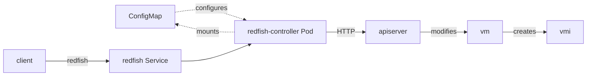

# VEP #0176: Redfish support for managing virtual machines

## Release Signoff Checklist

Items marked with (R) are required *prior to targeting to a milestone / release*.

- [ ] (R) Enhancement issue created, which links to VEP dir in [kubevirt/enhancements] (not the initial VEP PR)
- [ ] (R) Target version is explicitly mentioned and approved
- [ ] (R) Graduation criteria filled

## Overview

<!--
Provide a brief overview of the topic)
-->

Please accept the inclusion of the [kubevirt-redfish](https://github.com/v1k0d3n/kubevirt-redfish/) project under the kubevirt umbrella. This project provides
the functionality of the [Redfish protocol](https://www.dmtf.org/standards/redfish) that can be used to integrate kubevirt VMs into higher level
baremetal management systems.

## Motivation

<!--
Why this enhancement is important
-->

Both developers and system administrators require the ability to deploy applications or systems in local virtual environments like bare-metal ones.
Orchestration systems like Spacewalk or OpenShift installers commonly use Redfish and Boot ISO approaches to deploy the operating system or application the user requested in the high level UI.

## Goals

<!--
The desired outcome
-->

- Provide essential BMC functionality such as rebooting, changing boot devices, and mounting virtual media via the Redfish protocol against VMs backed by KubeVirt
- Enable deployment tools like Metal3 and installers (OpenShift ABI or IPI) to treat the virtual machines in the same way they treat bare metal nodes

## Non Goals

<!--
Why this enhancement is important Limitations to the scope of the design
-->

## Definition of Users

<!--
Who is this feature set intended for
-->

- A cluster administrator - The administrator of the hypervisor cluster where the VMs are running
- A VM owner - The owner of the specific VMs on the hypervisor cluster. Most likely also a the administrator of a newly deployed cluster that uses the VMs.

## User Stories

<!--
List of user stories this design aims to solve
-->

- As a cluster administrator I want to be able to enable redfish protocol support for VM running on the cluster.
- As a cluster administrator I want to control who (credentials) can access the redfish endpoints per namespace.
- As a VM owner I want to be able to control which VMs will be exposed to the redfish protocol.
- As a VM owner (virtual cluster administrator), I want to deploy a cluster using Metal3 or bare-metal installers on KubeVirt VMs.

## Repos

<!--
List of repose this design impacts
-->

A new repository should be created. I am proposing the name `kubevirt/redfish-controller`.

## Design

<!--
This should be brief and concise. We want just enough to get the point across
-->

The redfish protocol implementation runs as a single service providing endpoints to manage all eligible VirtualMachines.
Namespaces are represented as Chassis and VirtualMachines are the machines under their respective Chassis.
Each namespace can specify separate redfish authentication credentials allowing separation of machine administrator privileges for multi tenant deployments.

## API Examples

<!--
Tangible API examples used for discussion
-->

## Alternatives

<!--
Outline any alternative designs that have been considered)
-->

An older request was approved in https://github.com/kubevirt/community/blob/main/design-proposals/kubevirtbmc.md but never materialized.

This alternative implementation known as kubevirt-redfish provides only the Redfish implementation that is becoming the industry standard and was only planned as Stage 3
in the original design proposal. However thanks to this, only one service and pod are needed, because the namespace and VM separation is handled via HTTP url nesting.

## Scalability

<!--
Overview of how the design scales)
-->

The current design only uses one pod, service and endpoint for all eligible VMs. Control of multiple VMs is handled by changing the HTTP request URL. This is cheap and should scale well.

## Update/Rollback Compatibility

<!--
Does this impact update compatibility and how?)
-->

## Functional Testing Approach

<!--
An overview on the approaches used to functional test this design)
-->

As part of the KubeVirt umbrella, the KubeVirt CI can be used to perform comprehensive functional tests. The functional tests should live in the newly created repository.

## Implementation History

<!--
For example:
01-02-1921: Implemented mechanism for doing great stuff. PR: <LINK>.
03-04-1922: Added support for doing even greater stuff. PR: <LINK>.
-->

2025-08: Initial kubevirt-redfish implementation by Brandon Jozsa
2026-02: VEP 0171 for RebootPolicy enables proper reboot tracking
2026-04: kubevirt-redfish proposed for inclusion under KubeVirt

As of 2026-04:

Currently all redfish functionality needed to support installation flows on top of VMs is supported. This includes virtual boot media import (both Filesystem and Block devices) and boot order management.

The configuration can also express VM groups (chassis) with separate access control credentials for various users.

The state is tracked via etcd and does not depend on pod memory survival. A restart of the service will reconcile and continue all necessary flows.

## Graduation Requirements

<!--
The requirements for graduating to each stage.
Example:
### Alpha
- [ ] Feature gate guards all code changes
- [ ] Initial implementation supporting only X and Y use-cases

### Beta
- [ ] Implementation supports all X use-cases

It is not necessary to have all the requirements for all stages in the initial VEP.
They can be added later as the feature progresses, and there is more clarity towards its future.

Refer to https://github.com/kubevirt/community/blob/main/design-proposals/feature-lifecycle.md#releases for more details
-->

### Alpha

- Kubevirt/redfish-controller repository created under the kubevirt organization.
- CI systems connected and e2e tests written.
- Code managed via peer review, clean and maintainable.

### Beta

- Support for high availability in form of leader election or distributed request processing.
- Documentation and best practices.

### GA

- Optional integration with HCO and documented kubevirt deployment flows.
