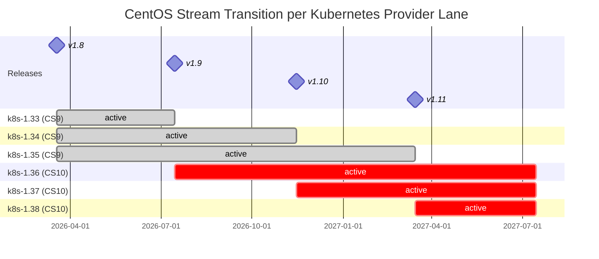

# VEP #210: CentOS Stream 10 Support

## VEP Status Metadata

### Target releases

- This VEP targets alpha for version: v1.9
- This VEP targets beta for version: v1.10
- This VEP targets GA for version: v1.11

### Release Signoff Checklist

Items marked with (R) are required *prior to targeting to a milestone / release*.

- [x] (R) Enhancement issue created, which links to VEP dir in [kubevirt/enhancements](https://github.com/kubevirt/enhancements/issues/210)
- [x] (R) Alpha target version is explicitly mentioned and approved
- [ ] (R) Beta target version is explicitly mentioned and approved
- [ ] (R) GA target version is explicitly mentioned and approved

## Overview

This VEP proposes transitioning KubeVirt from CentOS Stream 9 to CentOS Stream 10. The transition covers two distinct areas:

1. **Userspace**: The container images (virt-handler, virt-launcher, virt-operator, virt-controller, virt-api, etc.) and the builder image used to compile KubeVirt binaries.
2. **Host OS**: The kubevirtci cluster providers used for development and CI testing.

Rather than a big-bang switchover, the transition follows a per-lane model: from v1.9, new Kubernetes version lanes are introduced on CentOS Stream 10 for both userspace and host OS, while existing older lanes remain on CentOS Stream 9 until those Kubernetes versions naturally reach end of life and are dropped from CI. CentOS Stream 9 is supported during v1.8, v1.9, and v1.10, with support removed in v1.11 once all remaining CS9 lanes have aged out. This avoids doubling CI capacity and provides a gradual, low-risk migration path.

CentOS Stream 9 reaches end of life on 2027-05-31, requiring a planned migration well before that date.

## Motivation

CentOS Stream 9 is the current base for all KubeVirt container images and the builder image used to compile binaries. CentOS Stream 9 reaches end of life on 2027-05-31, after which it will no longer receive security updates or package refreshes. KubeVirt must migrate to CentOS Stream 10 to:

- Continue receiving security patches and updated system libraries
- Pick up newer versions of core dependencies (libvirt, QEMU, glibc, etc.)
- Align with the RHEL ecosystem and downstream consumers
- Avoid a disruptive last-minute migration under time pressure

CentOS Stream 10 is already generally available and provides a stable foundation for this transition.

## Goals

- Enable building all KubeVirt container images on CentOS Stream 10
- Run a full CI signal against CentOS Stream 10 userspace builds before switching the default
- Deprecate CentOS Stream 9 userspace with clear communication to the community
- Complete the userspace switchover to CentOS Stream 10 as the sole base OS
- Transition kubevirtci providers to CentOS Stream 10 alongside the userspace transition on a per-lane basis

## Non Goals

- Changing the Go toolchain or Bazel build system as part of this effort
- Supporting simultaneous production use of both CentOS Stream 9 and CentOS Stream 10 images within a single cluster
- Migrating away from bazeldnf for RPM dependency management
- Addressing CentOS Stream 10 specific package changes beyond what is required to build and run KubeVirt (e.g. new libvirt/QEMU features enabled by CS10)
- Maintaining CentOS Stream 9 lanes for Kubernetes versions that have already been dropped from CI

## Definition of Users

- **KubeVirt developers**: need to build and test against CentOS Stream 10 during development
- **KubeVirt CI/release engineers**: need to maintain build and test infrastructure for both OS versions during the transition
- **Downstream consumers**: need advance notice of the base OS change to plan their own transitions
- **Cluster administrators**: need to be aware of the changing base OS for security scanning, compliance, and compatibility purposes

## User Stories

1. As a KubeVirt developer, I want to build KubeVirt container images based on CentOS Stream 10 so that I can validate my changes against the new base OS before it becomes the default.

2. As a CI engineer, I want CentOS Stream 10 based CI jobs so that we can establish a full userspace test signal before switching the default.

3. As a downstream consumer, I want a deprecation notice for CentOS Stream 9 at least one release before removal so that I can plan my transition.

4. As a cluster administrator, I want to know which base OS my KubeVirt images use so that I can maintain accurate vulnerability scanning and compliance records.

## Repos

- `kubevirt/kubevirt` - build system, RPM dependencies, container images
- `kubevirt/kubevirtci` - CentOS Stream 10 based cluster providers
- `kubevirt/project-infra` - CI job definitions, builder images, mirror uploader

## Design

### Userspace vs Host OS

This VEP distinguishes between two layers of CentOS Stream usage:

- **Userspace**: The base OS for KubeVirt's container images and the builder image. This determines the system libraries (libvirt, QEMU, glibc, etc.) shipped inside the containers that run on the cluster. The userspace transition is the primary deliverable of this VEP.

- **Host OS**: The operating system running on the cluster nodes, provided by kubevirtci for development and CI. Changing the host OS introduces a separate set of variables (kernel version, kernel modules, host system libraries, etc.) that could mask or conflate userspace regressions.

CentOS Stream 10 kubevirtci providers are required to run CentOS Stream 10 userspace e2e tests, since CS10 userspace cannot run on CS9 hosts. The transition follows a per-lane model: when a Kubernetes version lane switches to CS10 userspace, it also switches to a CS10 kubevirtci provider. This keeps userspace and host OS aligned within each lane.

### Build System

KubeVirt uses Bazel with bazeldnf to manage RPM dependencies. The build system already supports a `KUBEVIRT_CENTOS_STREAM_VERSION` environment variable that controls which CentOS Stream version is targeted. When set to `10`, the build system:

- Uses CentOS Stream 10 RPM repositories for dependency resolution
- Pulls the CentOS Stream 10 builder image (`kubevirt-builder-cs10`)
- Produces container images based on CentOS Stream 10 base images

The RPM dependency management (`make rpm-deps` and `make verify-rpm-deps`) works identically for both versions, with the target version controlled by the environment variable.

### Builder Image

A separate builder image (`kubevirt-builder-cs10`) is maintained alongside the existing CentOS Stream 9 builder. This image contains the CentOS Stream 10 toolchain and is used by CI jobs and developers to compile KubeVirt binaries targeting CentOS Stream 10. The builder image is built and published via dedicated CI jobs (`build-kubevirt-builder-cs10`, `publish-kubevirt-builder-cs10`).

### RPM Dependency Caching

All RPMs referenced in the WORKSPACE file are mirrored to a GCS bucket (`storage.googleapis.com/builddeps/`) by the `periodic-kubevirt-mirror-uploader` job. This ensures build reproducibility and avoids reliance on upstream mirrors during builds. CentOS Stream 10 RPMs follow the same caching mechanism.

Dedicated periodic jobs bump RPM dependencies for CentOS Stream 10 (`bump-kubevirt-rpms-cs10-weekly`) and verify them in presubmit (`pull-kubevirt-verify-rpms-cs10`).

### kubevirtci Providers

New kubevirtci providers based on CentOS Stream 10 will be introduced starting in v1.9. The k8s-1.36 provider introduced in v1.9 will be the first CS10-based provider. Older Kubernetes version lanes (k8s-1.34, k8s-1.35) continue to use CS9 providers until those Kubernetes versions are dropped from CI. Each new Kubernetes version lane introduced from v1.9 onwards will use a CS10 provider from the start. CentOS Stream 9 providers will be fully retired once no remaining CI lanes reference them.

### CI Strategy

The CI strategy follows a per-lane transition model where new Kubernetes version lanes are introduced on CentOS Stream 10, and older lanes remain on CentOS Stream 9 until they naturally age out:

1. **v1.9 (Alpha)**: The new k8s-1.36 provider lane is introduced on CentOS Stream 10 with CentOS Stream 10 userspace. This becomes the latest `always_run` lane. Older lanes (k8s-1.34, k8s-1.35) remain on CentOS Stream 9. CentOS Stream 9 userspace is formally deprecated.

2. **v1.10 (Beta)**: The new k8s-1.37 lane is introduced on CentOS Stream 10. k8s-1.36 (CS10) and k8s-1.35 (CS9) remain as `run_before_merge` lanes. k8s-1.34 (CS9) is dropped. The majority of `always_run` lanes now run on CentOS Stream 10.

3. **v1.11 (GA)**: The new k8s-1.38 lane is introduced on CentOS Stream 10. k8s-1.35 (the last CS9 lane) is dropped. All remaining lanes run on CentOS Stream 10. CentOS Stream 9 build support is removed. `KUBEVIRT_CENTOS_STREAM_VERSION` defaults to `10`, CentOS Stream 9 option removed.

This per-lane approach avoids doubling CI capacity: rather than running parallel CS9 and CS10 jobs for the same Kubernetes version, each lane runs on exactly one base OS. The transition happens naturally as older Kubernetes versions are dropped and new versions are added on CentOS Stream 10.

### Migration Phases

#### Phase 1: First CS10 Lane (v1.9)

- CentOS Stream 10 builder image (`kubevirt-builder-cs10`)
- CentOS Stream 10 RPM dependency sync and verification jobs
- RPM mirror uploader support for CentOS Stream 10 dependencies
- k8s-1.36 kubevirtci provider introduced on CentOS Stream 10
- k8s-1.36 `always_run` lanes use CentOS Stream 10 userspace
- Older lanes (k8s-1.34, k8s-1.35) remain on CentOS Stream 9
- CentOS Stream 9 userspace formally deprecated in release notes

#### Phase 2: CS10 Lanes Expand (v1.10)

- k8s-1.37 lane introduced on CentOS Stream 10
- k8s-1.36 (CS10) becomes a `run_before_merge` lane
- k8s-1.35 (CS9) remains as a `run_before_merge` lane
- k8s-1.34 (CS9) dropped from CI

#### Phase 3: Full Switchover (v1.11)

- k8s-1.38 lane introduced on CentOS Stream 10
- k8s-1.35 (last CS9 lane) dropped from CI
- All remaining lanes run on CentOS Stream 10
- CentOS Stream 9 build support removed
- `KUBEVIRT_CENTOS_STREAM_VERSION` defaults to `10`, CentOS Stream 9 option removed

### CI Capacity Constraints

The kubevirt/kubevirt project currently runs 20 required e2e presubmit jobs before merge:

- 8 `always_run` e2e jobs on the latest Kubernetes version (k8s-1.35 sig-compute, sig-network, sig-storage, sig-operator, sig-compute-serial, sig-compute-migrations, sig-compute-arm64, and kind-1.34-sev)
- 12 `run_before_merge` e2e jobs covering older Kubernetes versions and hardware-specific lanes (k8s-1.33 and k8s-1.34 sig-compute, sig-network, sig-storage, sig-operator, plus ipv6-sig-network, windows2016, vgpu, and sriov)

In addition there are approximately 10 optional e2e presubmit jobs and 34 e2e periodic jobs.

The per-lane transition model avoids the capacity problem entirely. Rather than doubling jobs by running parallel CS9 and CS10 lanes for the same Kubernetes version, each lane runs on exactly one base OS. New lanes are introduced on CS10 while existing CS9 lanes remain until their Kubernetes version is dropped. The total number of required e2e jobs stays roughly constant throughout the transition.

Hardware-specific lanes (vgpu, sriov, sev) use KinD (Kubernetes-in-Docker) clusters on bare-metal hosts and are therefore tied to the host kernel rather than the kubevirtci-provided guest kernel used by the core SIG lanes. The windows lane is an exception, using kubevirtci providers with nested VMs. The transition of these lanes to CentOS Stream 10 depends on the host OS of the bare-metal nodes being updated, which is managed independently of this VEP. The exact timing for each specialized lane can be adjusted based on readiness.

Other specialized lanes (ipv6, arm64, migrations) that currently run on the latest Kubernetes version will switch to CentOS Stream 10 in Phase 1 alongside the k8s-1.36 core SIG lanes.

The **vgpu lane** has an additional constraint and will remain on CentOS Stream 9 until the mdev compatibility issue described below is resolved.

### vGPU / mdev Compatibility

CentOS Stream 10 ships kernel 6.12, which includes a change introduced in kernel 6.8 where NVIDIA moved from the traditional mdev (mediated device) framework to a vendor-specific VFIO framework for vGPU. The T4 cards used by upstream CI are Turing-architecture GPUs that do not support SR-IOV and still rely on the legacy mdev path. On kernel 6.8+, the mdev sysfs interfaces (`/sys/class/mdev_bus/`, `/sys/bus/mdev/devices/`) are no longer populated for these devices, which breaks KubeVirt's built-in mdev management as it hardcodes these paths. Since the vgpu lane uses KinD on bare metal, it runs directly on the host kernel — there is no kubevirtci guest kernel to insulate it from this change.

The vgpu CI lane must therefore remain on CentOS Stream 9 until one of the following is in place:

- **SR-IOV capable GPU hardware**: Ampere+ GPUs (e.g. A16, A30) support SR-IOV and work natively with the new vendor-specific VFIO framework. SR-IOV based vGPU support has already been merged in [kubevirt/kubevirt#16890](https://github.com/kubevirt/kubevirt/pull/16890). Replacing the T4 cards with SR-IOV capable hardware would unblock the vgpu lane transition.
- **DRA (Dynamic Resource Allocation)**: [VEP #10](https://github.com/kubevirt/enhancements/blob/main/veps/sig-compute/10-dra-devices/vep.md) adds DRA device support to KubeVirt, which can handle GPU allocation through DRA drivers rather than KubeVirt's built-in mdev management, bypassing the mdev sysfs dependency entirely.

This does not block the overall CentOS Stream 10 transition, as the vgpu lane can remain on CS9 independently of the core SIG lanes.

## API Examples

N/A - This VEP does not introduce or modify any user-facing APIs. The base OS change is transparent to end users interacting with KubeVirt's API.

## Alternatives

### Big-bang switchover

Switch from CentOS Stream 9 to CentOS Stream 10 in a single release without a phased transition. This was rejected because:

- It does not allow time to build CI confidence in the new base OS
- It creates a high-risk release with many simultaneous changes
- It does not give downstream consumers time to prepare

### Parallel CS9 and CS10 lanes for all Kubernetes versions

Run both CentOS Stream 9 and CentOS Stream 10 CI jobs for every Kubernetes version lane simultaneously during the transition. This was rejected because:

- It would roughly double the number of required e2e presubmit jobs, overwhelming CI capacity
- The base OS difference is unlikely to manifest differently across Kubernetes versions, so testing CS10 on the latest version provides sufficient signal
- The per-lane approach achieves the same coverage with no additional CI capacity cost

### Phased transition with optional jobs first

Introduce CentOS Stream 10 as optional CI jobs in v1.9, promote them to required on the latest lanes in v1.10 (switching existing CS9 lanes to CS10), and complete the switchover in v1.11. This was considered but rejected in favour of the per-lane approach because:

- It delays real CS10 CI signal to optional jobs that may not receive sufficient attention
- Switching existing lanes from CS9 to CS10 mid-lifecycle is more disruptive than introducing new lanes on CS10 from the start
- The per-lane approach provides required CS10 signal one release earlier (v1.9 vs v1.10)

### Fedora as base OS

Use Fedora instead of CentOS Stream 10. This was rejected because:

- Fedora's rapid release cycle (every ~6 months) would require frequent base OS updates
- CentOS Stream aligns with the RHEL ecosystem that many downstream consumers depend on
- CentOS Stream provides longer support windows suitable for KubeVirt's release cadence

## Scalability

N/A - The base OS change does not affect KubeVirt's scalability characteristics. Container image sizes may change slightly but this has no meaningful impact on deployment or runtime scalability.

## Update/Rollback Compatibility

The base OS change is contained within KubeVirt's container images. Updates and rollbacks follow the same mechanisms as any other KubeVirt release:

- Upgrading from a CentOS Stream 9 based release to a CentOS Stream 10 based release follows the standard KubeVirt upgrade path
- Rolling back to a CentOS Stream 9 based release is supported through the standard rollback mechanism
- No special migration steps are required for the base OS transition

Cluster administrators should verify that any security scanning or compliance tooling is updated to recognize CentOS Stream 10 base images.

## Functional Testing Approach

- All existing KubeVirt e2e tests will run against CentOS Stream 10 userspace builds as lanes are switched over
- CentOS Stream 10 lanes run on CentOS Stream 10 kubevirtci hosts, while CentOS Stream 9 lanes continue to run on CentOS Stream 9 kubevirtci hosts
- No new test cases are required specifically for the base OS change; the existing test suite validates functionality regardless of the underlying OS
- The k8s-1.36 CS10 lane introduced in Phase 1 provides immediate signal; any test failures unique to CentOS Stream 10 will be triaged and resolved promptly

## Implementation History

- 2025-02: Initial CentOS Stream 10 build support merged ([kubevirt/kubevirt#16582](https://github.com/kubevirt/kubevirt/pull/16582))
- 2025-02: CS10 builder image publish support ([kubevirt/kubevirt#16934](https://github.com/kubevirt/kubevirt/pull/16934))
- 2025-02: CS10 build presubmit jobs ([kubevirt/project-infra#4745](https://github.com/kubevirt/project-infra/pull/4745), [kubevirt/project-infra#4746](https://github.com/kubevirt/project-infra/pull/4746))
- 2025-02: Fix arm64 and s390x CS10 builds ([kubevirt/kubevirt#16938](https://github.com/kubevirt/kubevirt/pull/16938))
- 2026-03: CS10 RPM dependency jobs ([kubevirt/project-infra#4854](https://github.com/kubevirt/project-infra/pull/4854))

## Graduation Requirements

### Alpha (v1.9)

- [ ] CentOS Stream 10 builder image available
- [ ] CentOS Stream 10 RPM dependency sync and verification jobs
- [ ] RPM mirror uploader caches CentOS Stream 10 dependencies
- [ ] k8s-1.36 kubevirtci provider on CentOS Stream 10
- [ ] k8s-1.36 `always_run` lanes using CentOS Stream 10 userspace
- [ ] No CentOS Stream 10 specific test failures on k8s-1.36 lanes
- [ ] CentOS Stream 9 userspace deprecated in release notes

### Beta (v1.10)

- [ ] k8s-1.37 lane introduced on CentOS Stream 10
- [ ] Majority of `always_run` lanes running on CentOS Stream 10
- [ ] No CentOS Stream 10 specific test failures

### GA (v1.11)

- [ ] All remaining CS9 lanes dropped
- [ ] All lanes running on CentOS Stream 10
- [ ] CentOS Stream 9 build support removed
- [ ] All container images based on CentOS Stream 10
- [ ] `KUBEVIRT_CENTOS_STREAM_VERSION` defaults to `10`, CentOS Stream 9 option removed
