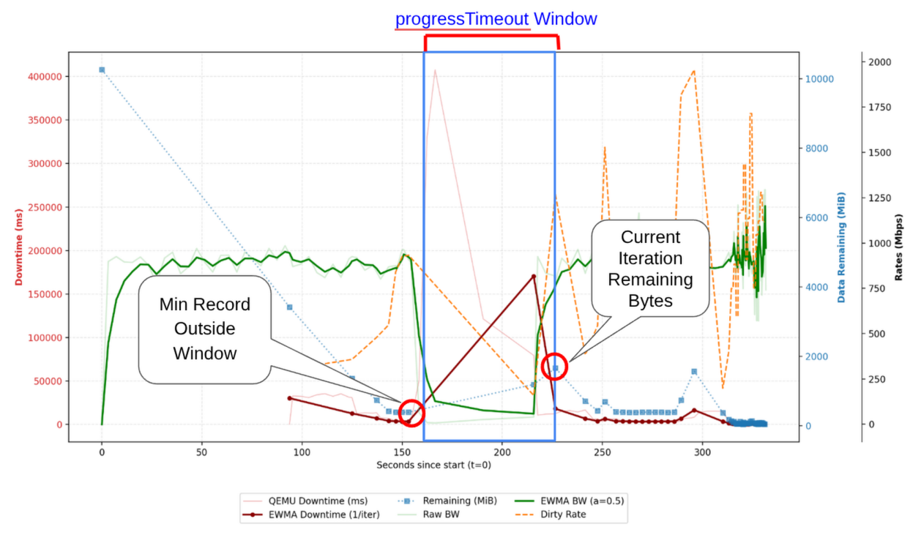
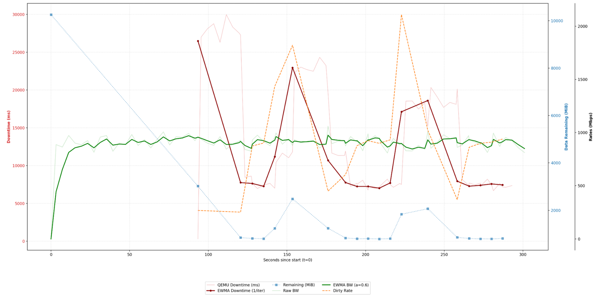
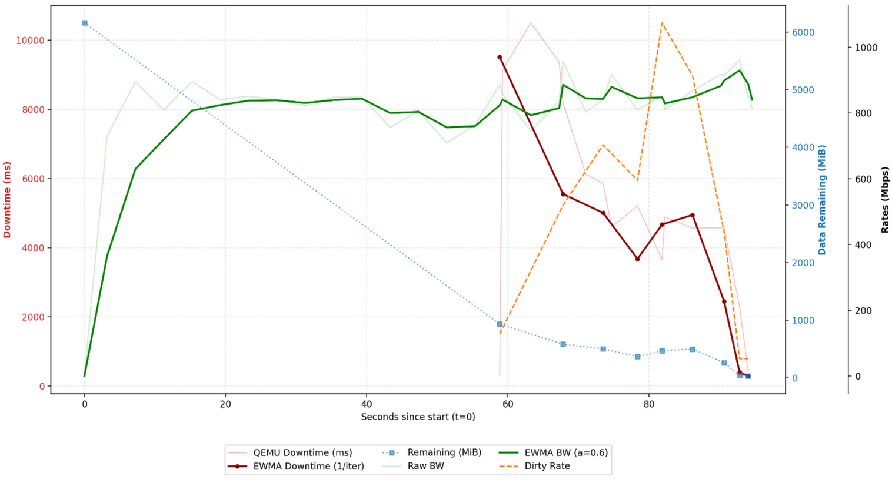
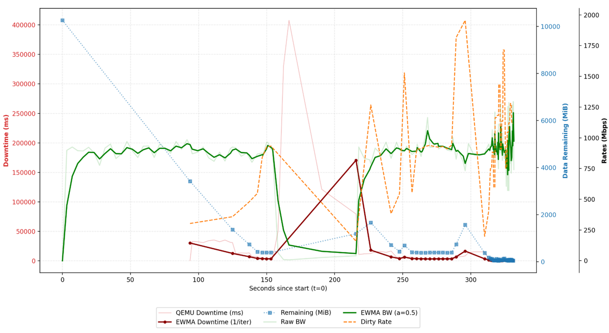
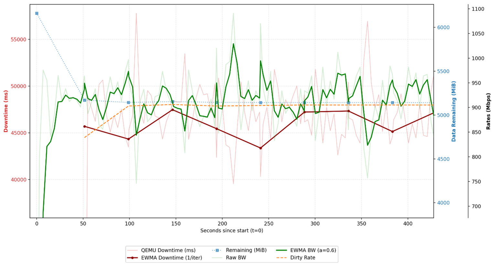
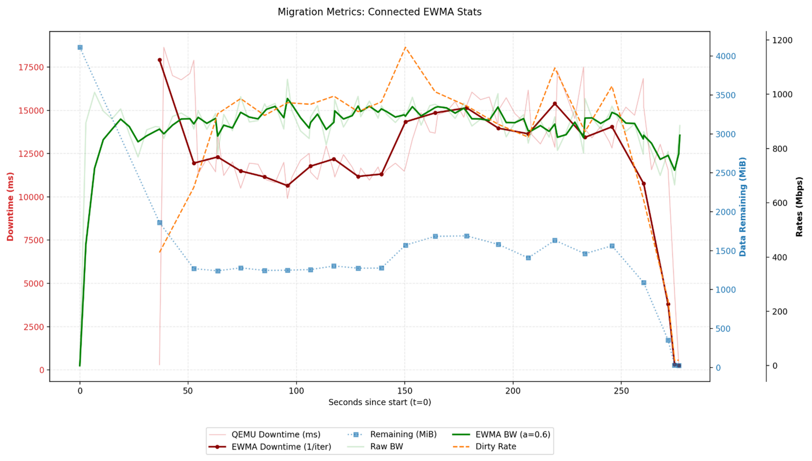
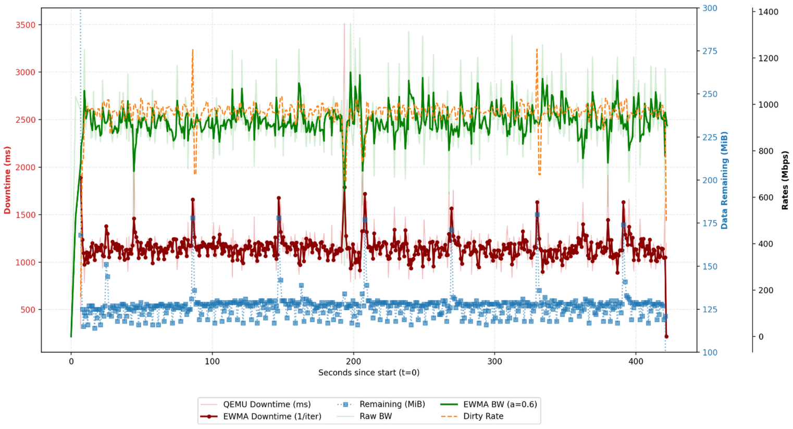

# VEP 248: Live Migration Stability & Convergence Improvements 

## VEP Status Metadata

### Target releases

<!--
A PR must update this section during the planning phase of a given release in order to track it.
PRs that will not update the VEP during the planning phase will not be able to graduate the
VEP by creating a code PR to kubevirt/kubevirt to bump the phase in-code.

Please avoid targeting future releases in this section. Only capture the upcoming release.
For example, during the planning phase for version v1.123, do **not** target beta for v.124 in advance.
-->

- This VEP targets alpha for version: 1.9.0
- This VEP targets beta for version: TBD
- This VEP targets GA for version: TBD

### Release Signoff Checklist

Items marked with (R) are required *prior to targeting to a milestone / release*.

- [X] (R) Enhancement issue created, which links to VEP dir in [kubevirt/enhancements] (not the initial VEP PR)
- [ ] (R) Alpha target version is explicitly mentioned and approved
- [ ] (R) Beta target version is explicitly mentioned and approved
- [ ] (R) GA target version is explicitly mentioned and approved

## Overview

<!--
Provide a brief overview of the topic
-->

This proposal adds **iteration-aligned stall detection** that works by monitoring **remaining bytes** as reported by QEMU to detect stall and trigger switch-over (to post-copy or stop-and-copy) at a **local minimum**, minimizing downtime and/or the duration spent in post-copy. The aim of this proposal is to achieve both lower migration times and lower downtimes all with less wasted bandwidth/compute once pre-copy plateaus.

## Motivation

<!--
Why this enhancement is important
-->

When a VM's writable working set (WWS) is large compared to bandwidth, downtimes cannot be brought down low enough to trigger switchover automatically. Today, such cases are addressed by a static timeout derived from the VM size. However, this wastefully burns energy, compute, and bandwidth waiting for a conservative timeout:
    (a) **`completionTimeoutPerGiB`** defaults to **150s per GiB** (e.g. a 16 GiB VM can run **40+ minutes** before aborting). However, in most cases, a VM often stops making progress on the "remaining bytes" to transfer well before that.
    (b) existing stall detection using `progressTimeout` doesn't work as it fails to consider that remaining bytes **oscillate** up and down with workload phases or bandwidth fluctuations and consequently resets progress timers anytime "remaining bytes" decreases.

> __Workload Phase__
Many applications experience different "workload phases" throughout their lifecycle. For example, a database application might occasionally have a "flush phase" where it stops everything it is doing and flushes all data to disk. The key feature of a "phase" is that the underlying workload characteristics change, exhibiting different dirty rates, CPU usage, memory etc. Attempting to take advantage of short-term phase changes to lower downtime (or time spent in post-copy) is a key objective of this proposal.

> __Writable Working Set (WWS)__
WWS refers to the set of pages that are actively being written to. In the context of live migration, it is the portion of memory which the VM is writing to faster than can be transferred over.


## Goals

<!--
The desired outcome
-->

- Decrease total migration time, downtime, and/or the time spent in post-copy for VMs with high dirty rates.
- Trigger post-copy or pause-and-copy when pre-copy has meaningfully stalled, rather than only after long generic timeouts, so migrations do not spin indefinitely once they have converged as far as they can.
- Minimize user-side API changes and avoid exposing implementation details to end-users.
- Ensure robustness against network fluctuations and failures.
    * Since migrations can last minutes, a temporary network drop should not trigger a switch-over as this is harmful especially in post-copy mode leading to data loss or significant performance degradation.

## Non Goals

<!--
Limitations on the scope of the design
-->

- Guarantee that `MaxCompletionTime` will never be exceeded. Only a best-effort attempt.
- Optimize bandwidth in multi-VM scenarios.

## Definition of Users

<!--
Who is this feature set intended for
-->

Cluster Admins: Admins managing multi-node clusters.
VM Admin: A VM owner/manager running their VM in a multi-node cluster.

## User Stories

<!--
List of user stories this design aims to solve
-->

- As a cluster admin, I want migrations to not waste bandwidth. For on-premise nodes, bandwidth consumption has been shown to be proportional to energy consumed during a migration (Performance and energy modeling for live migration of virtual machines, Liu et al.). For nodes hosted on the cloud, in many cases, bandwidth consumption is charged to me on a per-use basis. Either way, wasteful bandwidth usage costs me money.
- As a cluster admin, I want migrations to complete faster.
- As a VM Admin, I want to minimize the outage (downtime) for the applications running on my VMs.

## Repos

<!--
List of repositories this design impacts
-->
- kubevirt/kubevirt

## Design

<!--
This should be brief and concise. We want just enough to get the point across
-->

### Pre-requisite
This design discussion assumes the reader is familiar with the following concepts:
- Live migration
- Pre-copy, Post-copy, hybrid migration, and stop-and-copy
- Downtime
- Relationship between dirty rates, bandwidth, remaining data, and downtime
- Relevant parts of KubeVirt source code


### Stall Detection

The key idea behind our proposed stall detection algorithm is as follows: Near "convergence", dirty rate, bandwidth, and remaining bytes vary by iteration: remaining data flattens and oscillates instead of trending down. We switch at a **local minimum** of remaining bytes (relative to post-stall samples), not at an arbitrary iteration, in hopes of optimizing downtime duration.

> __Convergence__:
Pre-copy **convergence** here means no net progress on remaining bytes iteration-to-iteration: remaining bytes fluctuate around the same level rather than continuing to fall monotonically.

In order to achieve this, once we detect that we have "stalled" (as defined later), we look at some number of iterations since the start of the stall and record the smallest remaining bytes seen over those sample iterations as `bestRemainingBytes`. Afterwards, when **remaining bytes** is within **x%** of `bestRemainingBytes` (i.e. we are roughly as good as the best sample), we trigger a switch-over. We refer to this "x%" value as the "Stall Margin".

A future section also discusses a relaxation to the "the smallest remaining bytes seen" requirements if that smallest historic sample is not seen again for too many iterations.

> __Sample Iterations__:
From here, we will refer to the "some number of iterations since the start of the stall" as the sample iterations.

> __Best Remaining Bytes (`bestRemainingBytes`)__:
After the sample iterations that bracket stall detection, the smallest remaining bytes observed over that window is the initial switch-over target. Relaxation (below) may **raise** that target if the guest or network shifts and the old level is no longer reachable.


### Defining Stall

**Stall:** at the end of an iteration, remaining bytes for that iteration is greater than OR within an x% "stall margin" of the smallest remaining bytes among iterations whose iteration timestamp is at least **`progressTimeout`** seconds in the past. More concretely, at the end of any given iteration, we are stalled if the following holds:
* `currIterationRemainingBytes` $\geq$ `minRecordOutsideWindowRemainingBytes` * (1 - `stallMargin`)
* Where `minRecordOutsideWindowRemainingBytes` = min({$\forall$ `record` $\mid$ `record.timestamp` $\leq$ `currentTime` - `progressTimeout`})



> __Progress Timeout__:
**`progressTimeout`** is an existing field defined as “seconds without progress.” Today in KubeVirt, "progress" is defined as the time `remainingBytes` does not go down. We repurpose this field without semantic violations by creating a more robust definition of "progress".

> __Stall Start Time__:
A previous iteration with the smallest bytes remaining whose corresponding iteration timestamp was also older than the "progress timeout".

Our proposed stall definition is reasonable and robust because it allows remaining bytes to rise temporarily—whether from a dirty-rate spike that pushes remaining bytes up or a temporary bandwidth drop—as long as the overall trend is still downward within the `progressTimeout` window.

We define **Sample iterations** as the iterations that occurred since the "stall start time" through the iteration that **detects** stall; the definition implies **≥2** samples before detection:
1. Stall-start iteration.
2. A later iteration with remaining bytes **≥** stall-start level (triggers detection).
3. Zero or more iterations between them, depending on `progressTimeout` and per-iteration duration.

The fact we are guaranteed **≥2** sample iterations at least reduces the chances of a switch-over at a local maximum. Nevertheless, fewer samples when iterations are **long** is acceptable: long iterations already **average** workload phase variation, so extra samples rarely help local-minimum choice (see **Alternatives** §4). Similarly, shorter iterations tend to have higher variations, so collecting more samples gives a better idea of what a "good" iteration looks like. Finally, iteration duration during stall is also related to the expected downtime. So if a migration is stalled with 30-second long iterations, the downtime will also be around 30 seconds. At these scales, we don't care as much about optimizing the downtime as shaving a few extra seconds at this scale is unlikely to make a real difference.


### Pre-copy Improvements with Dynamic Downtimes

We further propose taking advantage of how this stall detection algorithm optimizes downtime even in pre-copy only migrations. After stall, we can raise QEMU’s target downtime up to a "max downtime" so pre-copy-only migrations still complete when the default **300 ms** target is unreachable but a higher downtime is still acceptable (even if not ideal).

> __Target Downtime:__
The "target downtime" refers to the downtime configured in QEMU. This is the threshold that when met, QEMU triggers its internal switch-over to stop-and-copy.

We achieve this by proposing a new API field called `maxDowntimeMs` which specifies the maximum acceptable downtime before we consider additional downtimes as a "workload disruption". Today migrations use QEMU’s fixed **300 ms** target and fail migration if pause would exceed it unless post-copy is permitted or workload disruptions are allowed (e.g. `allowWorkloadDisruption`).

In **pre-copy only mode with no workload disruptions allowed**, after stalling, at the iteration where we trigger the switch-over decision (which is at a local-minimum), we compare `maxDowntimeMs` to an **implied downtime** derived from the switch-over target: `impliedDowntimeMs ≈ remainingBytes / bandwidthBpms` (bytes per ms).

When a switch-over is triggered, we evaluate whether to converge or abort based on the implied downtime:
- **If** `impliedDowntimeMs <= maxDowntimeMs`: We set QEMU's target downtime to `maxDowntimeMs`. Note that even though we set target downtime to `maxDowntimeMs`, typically we expect the actual downtime to be better due to switching at a local minimum. Nevertheless, since this does not guarantee an immediate switch-over, we further cap the migration's completion timeout to `elapsedTime + progressTimeout` to ensure it resolves quickly. If it still does not complete within this shortened window, it aborts.
- **Else if** `maxDowntimeMs * preCopyPossibleFactor <= impliedDowntimeMs`: The required downtime is hopelessly far from the acceptable `maxDowntimeMs`, so we immediately abort the migration. Here, `preCopyPossibleFactor` is a hyperparameter.
- **Else**: We wait up to `maxCompletionTime` and allow the migration to continue, hoping a future iteration improves the downtime.

> __Bandwidth Note (`bandwidthBpms`)__
Libvirt’s `bandwidth` in `DomainJobInfo` is effectively a **~100ms** snapshot, so raw values jitter. We smooth with EWMA: `ewmaEstimate ← ewmaAlpha·sample + (1−ewmaAlpha)·ewmaEstimate` (seeded with the first sample).  Here `ewmaAlpha` is the regularization factor that controls how strongly we "smooth" bandwidth samples. See [Wikipedia](https://en.wikipedia.org/wiki/Moving_average) for further details.

`maxDowntimeMs` has no effect when either `allowWorkloadDisruption = true` or when `allowPostCopy = true`.


### Iterative Switch-over Relaxation

If bandwidth drops or the workload shifts after stall, the level that set `bestRemainingBytes` may never recur; then `remainingBytes ≤ bestRemainingBytes` never holds and the job runs until completion timeout.

To handle this case, we keep a sorted, distinct `remainingBytesHistory` since **after** stall and **relax** by raising `bestRemainingBytes` to the **next smallest** if, after a patience window, the desirable value is not reached. The "since after stall" makes sense because if this failure to find a good point is due to a workload shift, we want to look at the more recent points for the next best value.

Concretely, at iteration boundary we:
1. Let `patience` = `progressTimeout` seconds.
2. Wait up to `patience` seconds for `remainingBytes ≤ bestRemainingBytes × (1+stallMargin)`.
3. If still not converged, pop the smallest value in `remainingBytesHistory` and set that as the new `bestRemainingBytes`.
4. Set `patience = patience * patienceWindowDecayFactor`.
5. Repeat steps 2–4 until switch-over or timeout.

### Post-copy Network Risk Mitigation

Post-copy migration carries a higher risk than pre-copy because prematurely aborting it can result in data loss. Therefore, we must avoid initiating a post-copy switch-over if the migration is likely to fail, particularly due to network instability.

To mitigate this, we enforce a safety constraint before switching to post-copy: 
`impliedDowntime <= (maxCompletionTime * 2) - elapsedTime`

We continue to attempt to satisfy this constraint without aborting the migration as long as `elapsedTime <= maxCompletionTime`. However, if after that point this constraint is still not satisfied, the migration is aborted.

Notice that this also elegantly handles temporary network drops. If bandwidth drops significantly, `impliedDowntime` skyrockets, immediately preventing a dangerous switch-over to post-copy. If the network recovers quickly, `impliedDowntime` drops back down and the migration can proceed safely.

This design is motivated by an existing behavior where KubeVirt triggers migration switchover at `elapsedTime >= maxCompletionTime` and if migration still has not completed by the time `elapsedTime >= maxCompletionTime * 2`, the migration is aborted. In that same spirit, since post-copy cannot be cancelled without data loss, we apply this constraint to post-copy migrations pre-emptively by refusing to start migrations that are expected to exceed this limit (i.e. if we project that the migration will exceed this limit, we do not start post-copy.)


### Interactions with Auto Converge

**Auto-converge** (when enabled via existing migration policy) is a QEMU-side mechanism that throttles the guest so dirtying slows and pre-copy is more likely to reach QEMU’s target downtimes. In a typical migration, this feature should not conflict with the stall detection functionality.

Auto-converge checks only trigger after the first pre-copy pass. In a typical migration, every iteration (after the first) triggers a check. If the dirty rates over the time period is more than half as high as the total bytes transferred on the wire for two or more checks, QEMU throttles the guest by 20%. In consecutive iterations, if the dirty rates to bytes transferred ratio is still more than 1:2 for at least another two checks, guest is throttled by another 10%.

> __Note:__
The throttle thresholds, amounts and steps are all configurable in QEMU but KubeVirt does not touch the default. So this description is assuming these defaults.

If an iteration lasts longer than 5 seconds, an additional fallback timer triggers auto-converge checks anyway. Therefore, as long as "progress timeout" is greater than 10 seconds, the stall detection should not prematurely declare the migration stalled given that throttling the CPU is reducing the dirtying.

### Hyper-Parameters

During the design discussion, we have made mention of several hyper-parameters that go into this algorithm:

* `maxDowntimeMs`
* `progressTimeout`
* `completionTimeoutPerGiB`
* `patienceWindowDecayFactor`
* `stallMargin`
* `ewmaAlpha`
* `precopyPossibleFactor`

We present an argument for reasonable defaults that we can start with for these hyper-parameters in [migration-hyperparameters.md](./migration-hyperparameters.md), at least for the alpha phase of this proposal.

We hope to fine-tune these values throughout the alpha and beta phase using real-world data from live clusters to deduce optimal values for these hyper-parameters, or perhaps to even re-evaluate parts of this proposal entirely. In order to facilitate this, proper logging and visibility of the proposed stall detector will be required.

###  Logging & Visibility

In order to fine-tune hyper-parameters, ideally we require following:
* Total Migration Times
* High-Frequency Bandwidth Samples
* Bytes Remaining (at iteration boundaries)
* Actual Downtime/Post-copy Duration

Today, we already expose:
* DataRemaining (Bytes Remaining)*
* MemDirtyRate (Dirty Rate)
* MemoryBps (Bandwidth)*
* DataProcessed (Total Bytes Pushed)
* DataTotal (Total Bytes Pushed + Bytes Remaining)
* Migration Start Time*
* Migration End Time*

Currently, this information is not very useful because it is collected at a fixed interval of 5s, whereas our requirements for when this data should be collected are different. Therefore, we propose:
* Emit `DataRemaining` and `MemDirtyRate` only at pre-copy boundaries.
* `DataTotal` should only be pushed once at the start of a migration (as it does not change mid-migration).
* `MemoryBps` should be pushed at the same frequency that we update our EWMA metrics (every 400ms, once per polling loop).
* At the end of each migration, push actual downtime / post-copy duration.
We also attach application generated timestamps to each event. This is because Prometheus itself uses timestamps based on when it scrapes these metrics resulting in lost precision.

But, since this changes existing logging behavior and may drastically increase logging frequency to Prometheus, we intend for these logging changes to be temporary and removed before GA.

To allow collecting information from clusters that do not want to fully enable stall detection in alpha, we expose an `observeOnly` flag through an experimental API section described later. When `observeOnly=true`, the stall detection system runs in "shadow mode" with the aforementioned changes to logging and observability allowing metrics from a wider audience to be used for hyper-parameter tuning. For instance, cluster admins that want to see how improved stall detection can help them without fully relying on an "alpha" feature, they may choose to enable stall detection but set `observeOnly=true`.

Additionally, we also log stall detector decisions to Prometheus. When running in "shadow mode" (i.e. stall detection not enabled), the stall detector exports what it *would have done* (and when not running in shadow mode, what it did). The goal of this additional decision logging is two-fold: (a) validating correctness, and (b) quantifying improvements.

Such an "event" logger/counter may look like this:
```
kubevirt_vmi_migration_stall_decision_total
    Counter
    Labels:
      - mode: "shadow" | "active"
      - decision: "detect_stall" | "relax_downtime" | "switchover" | "abort_low_bandwidth" | "abort_timeout"
      - vmi, namespace, etc.
```

Finally, since it is not entirely clear what performance impact elevated logging to Prometheus may have, for the case where a cluster admin might want to take advantage of this enhancement without paying the overhead of the additional logging added during the initial phases of this VEP, we also expose a temporary `elevatedLogging` flag under an experimental API section as described under "API Changes".


### API Changes

We propose adding a `maxDowntimeMs` field to `MigrationConfiguration`. This specifies the maximum acceptable guest pause duration (in milliseconds) during the final stop-and-copy phase. This does not modify the default target downtime of 300ms. Indeed, this field only becomes relevant once stall is detected, and convergence at the default target downtime no longer seems feasible.

A default `maxDowntimeMs` of 900 ms is reasonable: it is a good upper bound below which a migration can still reasonably be called "live".

> __Note 1:__ CR validation rejects values larger than 2,000,000ms (the QEMU hard limit on downtimes) or less than or equal to 0.

Next, "Experimental Migration Options" as described in [VEP 293](https://github.com/kubevirt/enhancements/pull/295) propose the addition of a `experimental.stallDetection` in the KubeVirt CR and migration policy resource. The purpose of this VEP is to provide easy experimentation of certain "advanced" and "experimental" tunables which it does not make sense to expose at the top level API. Subject to the approval of this VEP, we propose exposing the following fields as additional tunables:
- `stallMargin`: The percentage (e.g., `0.04` for 4%) by which remaining bytes can exceed the best historical sample and still be considered "stalled" or ready for switch-over.
- `ewmaAlpha`: The smoothing factor for the Exponentially Weighted Moving Average (EWMA) used to calculate bandwidth.
- `precopyPossibleFactor`: A multiplier for `maxDowntimeMs`. If the implied downtime exceeds `maxDowntimeMs * precopyPossibleFactor` in a pre-copy only migration, it is immediately aborted as hopeless.
- `patienceWindowDecayFactor`: The factor by which the relaxation patience window shrinks each time the migration fails to reach the target remaining bytes.
- `searchLocalMinima`: A boolean flag (default `true`). When set to `false`, the migration will switch-over immediately upon detecting a stall, rather than waiting to find a local minimum.
- `observeOnly`: A boolean flag (default `false`). When set to `true`, will run stall detector in "shadow mode" where stall related decisions are only logged and not acted on.
- `elevatedLogging`: A boolean flag (default `true`). When set to `true`, stall detector will leave an enhanced "trail" in both pod logs and Prometheus.

[migration-hyperparameters.md](./migration-hyperparameters.md) also provides further details and context.


### Exploring Real World Workloads

The mechanisms and definitions included in this VEP were inspired by real workloads. We looked at real data to see how different migrations behave when running varying workloads with different configurations. Included below are *some* of the workloads we looked at and their corresponding graphs. These graphs are intended to show the variations in behaviors like iteration times, remaining bytes, and dirty rates across different workloads.


 
 
 
 
 

We go through each of these examples including the workload setup and how the presented stall detection algorithm might react to each of these scenarios in the below presentation:
**Video Walkthrough**: https://youtu.be/T5_W7X7o70k
**Presentation Slides**: https://docs.google.com/presentation/d/e/2PACX-1vQj2xFyHHLCKvjXjyFjH3DpIaLKsAGexadrPm1nmoLbtiidU-XJhSbDJzpvMdyAWISXYFAHfN6JMFhT/pub?start=false&loop=false&delayms=10000


### Limitations & Risks

In this section we acknowledge certain limitations of this approach and list scenerios where the current timeout approach wins:
1. Network drops can cause the stall detection algorithm to trigger (due to remaining bytes increasing). While we won't trigger switchover until we get remaining bytes to be at least as low as the best previous iteration, nevertheless, it is possible for the switchover decision to trigger while pre-copy is still making improvements after network recovers. Perhaps future work can better address this edge case.
2. A benefit of the current timeout approach in KubeVirt today can allow migration to continue for a long time. In some cases, this can be good because you can get lucky and a phase changes in underlying application can allow VM to convergence at the target downtime. Nevertheless, if we increase the duration of the `progressTimeout` window, we can still trade-off migration time in hopes of getting lucky and switching-over without help.
3. Since a large part of this design is to exploit fluctuations in dirty rates to trigger switchover at a local minimum, a significant risk factor with this design is that any delays in triggering the iteration boundary logic could trigger switchover too late to exploit that window. However, this is a quality risk. Not a correctness risk. The exact impact and severity of this risk is difficult to evaluate until after implementation.
4. Remaining bytes estimate as reported via QMP in QEMU currently do not include remaining data from VFIO devices. This is a limitation actively being worked on.
5. For massive VMs (e.g. order of 1000GB RAM) or VMs with VFIO devices it's possible that dirty bitmap sync at the end of pre-copy takes several hundred milliseconds to a few seconds to complete. In such a case, we can expect bandwidth to drop (because we ran out of known dirty pages we can push) skewing `impliedDowntime` results. Using an exponentially weighted moving average helps partially mitigate some risks caused by "bad samples". The use of a kernel feature called "KVM Dirty Ring" could also help mitigate some risks but use of this feature has other trade-offs. See **Alternatives** §8 for more info.


## Implementation

Putting this all together, here is a technical description of how the stall detection algorithm works, including how it wires into the existing KubeVirt codebase.


### Feature Gate

A new **Alpha** feature gate `MigrationStallDetection` is introduced and registered in `pkg/virt-config/featuregate/active.go` with `State: Alpha`. When disabled, all behavior remains identical to the current implementation.


### Plumbing: Event-Based Iteration Loop

The migration monitor loop needs to react to iteration boundaries fired by QEMU. QEMU emits a `MIGRATION_PASS` QMP event each time it completes a dirty bitmap sync at the start of a new pre-copy iteration (i.e., the previous iteration's page transfer is complete and the dirty bitmap has been re-scanned). Libvirt translates this into a `VIR_DOMAIN_EVENT_ID_MIGRATION_ITERATION` domain event. In the Go API, hooking into this domain event only requires us to expose a `DomainEventMigrationIterationRegister(callback) (int, error)` method in the `Connection` interface in `pkg/virt-launcher/virtwrap/cli/libvirt.go`.


### Migration Monitor State Extensions

The `migrationMonitor` struct is extended with the following fields:

```go
type iterationRecord struct {
    timestamp           time.Time
    remainingBytes      uint64
    iterationIndex      uint32
}

// New fields on migrationMonitor:
iterationChan           chan int          // synchronizing the polling loop with the event-based loop to avoid races
stallDetectionEnabled   bool              // from feature gate via MigrationOptions
maxDowntimeMs             int64             // from MigrationOptions (milliseconds), 0 if unset
searchLocalMinima       bool              // from MigrationOptions

minCandidates           []iterationRecord // iteration records within the progressTimeout window that could become the next minRecordOutsideWindow when they age out
minRecordOutsideWindow  *iterationRecord  // record with the smallest remainingBytes among iterations older than progressTimeout (nil until first record ages out)
stallDetected           bool
remainingBytesHistory   []uint64          // sorted ascending: distinct remaining bytes since stall (for relaxation)
bestRemainingBytes      uint64            // switch-over target: aim for remainingBytes <= this (initialized at stall from samples; may relax upward)
relaxationDeadline      time.Time         // wall-clock deadline for the current relaxation patience window
relaxationPatience      time.Duration     // current patience duration (starts at progressTimeout, decays down to 1s; see Design §Iterative Switch-over Relaxation)

// Existing fields to be removed after feature gate graduation (used for an existing, rudimentary stall detector):
- remainingData           uint64
- lastProgressUpdate      int64
- progressWatermark       uint64
```


### Monitor Loop & Algorithm

Extend `startMonitor()` with **`iterationChan`** beside `migrationErr` and `time.After`. **Events** fire only between pre-copy iterations; the **polling** arm still runs at its existing **400ms** cadence so a single long iteration (e.g. network stall) gets logging, timeout checks, and fresh bandwidth samples for the EWMA estimate. With **`stallDetectionEnabled`**, the iteration case runs stall logic; polling does logging + timeouts only. Thread safety is ensured using channels. All state stays in and is managed by the `startMonitor` goroutine.

> __Note:__ Pseudocode omits gate checks and implementation details related to logging; production code follows **Feature Gate** (`iterationChan` falls through to `processInflightMigration`; polling unchanged).

```go
const QEMU_MAX_ALLOWABLE_DOWNTIME = 2_000_000
const EWMA_ALPHA = 0.4
const STALL_MARGIN = 0.04
const PRE_COPY_POSSIBLE_FACTOR = 1.5
const PATIENCE_WINDOW_DECAY_FACTOR = 0.5

var ewmaBandwidth int64
var awaitingConvergence bool = false

for {
    select {
    case err = <-m.migrationErr:
        // (unchanged) propagate migration errors

    case iterCnt = <-m.iterationChan:
        // fired at pre-copy iteration boundaries

        jobStats = getJobStats(dom)
        remainingBytes = jobStats.remainingBytes
        bandwidthBpms = toBytesPerMilliseconds(ewmaBandwidth)  // uses latest EWMA from polling loop

        // --- bookkeeping ---
        record = {currentTime, remainingBytes, iterCnt}
        age out minCandidates[0] if it is older than progressTimeout into minRecordOutsideWindow
        if minRecordOutsideWindow == nil || record.remainingBytes < minRecordOutsideWindow.remainingBytes:
            append record to minCandidates       // only keep records that could become the new min

        logMigrationInfo(...)
        checkCompletionTimeout(...)

        if postCopy || paused || awaitingConvergence:
            continue

        // --- stall detection (see Design §Defining Stall) ---
        if !stallDetected:
            if minRecordOutsideWindow != nil
               && remainingBytes >= minRecordOutsideWindow.remainingBytes * (1 - STALL_MARGIN):
                stallDetected = true

                if !searchLocalMinima:
                    impliedDowntimeMs = remainingBytes / bandwidthBpms
                    tryTriggerSwitchover(...)
                    continue

                bestRemainingBytes = min(minRecordOutsideWindow.remainingBytes,
                                     min over minCandidates of remainingBytes)
                /*
                    Only start tracking the remaining bytes history AFTER we have already detected stall and are trying to find a good time to make the switch-over. The idea is if after progressTimeout we can't find a value at or below the previous minima, we start to relax the target using the more recent data.
                */
                remainingBytesHistory = init list
                relaxationPatience = progressTimeout
                relaxationDeadline = currentTime + relaxationPatience

                remainingBytesLargest = max(minRecordOutsideWindow.remainingBytes,
                                            max over minCandidates of remainingBytes)
                if remainingBytesLargest > 0
                   && 1 - (float64(bestRemainingBytes) / float64(remainingBytesLargest)) < STALL_MARGIN:
                    impliedDowntimeMs = bestRemainingBytes / bandwidthBpms
                    tryTriggerSwitchover(...)   // defined below

        // --- when stalled and no local minima search
        else if !searchLocalMinima:
            impliedDowntimeMs = remainingBytes / bandwidthBpms
            tryTriggerSwitchover(...)
        // --- when stalled with local minima search
        else:
            insert remainingBytes into remainingBytesHistory (sorted ascending, deduplicated)
            impliedDowntimeMs = bestRemainingBytes / bandwidthBpms

            // --- switch-over when within 4% of target remaining bytes ---
            if remainingBytes <= uint64(float64(bestRemainingBytes) * (1 + STALL_MARGIN)):
                tryTriggerSwitchover(...)       // defined below
                    
            else:
            // --- (see Design §Iterative Switch-over Relaxation)
                if currentTime >= relaxationDeadline:
                    bestRemainingBytes = next largest distinct value in remainingBytesHistory after current bestRemainingBytes
                    relaxationPatience = relaxationPatience * PATIENCE_WINDOW_DECAY_FACTOR
                    relaxationDeadline = currentTime + relaxationPatience

                if remainingBytes <= uint64(float64(bestRemainingBytes) * (1 + STALL_MARGIN)):
                    tryTriggerSwitchover(...)       // defined below

    case <-time.After(monitorSleepPeriodMS):
        jobStats = getJobStats(dom)
        // ewmaEstimate ← α·sample + (1−α)·ewmaEstimate
        ewmaBandwidth = calcEWMABandwidthWithAlpha(jobStats.bandwidth, EWMA_ALPHA)
        logMigrationInfo(...)
        checkCompletionTimeout(...)
    }
}

func tryTriggerSwitchover(...) {
    // tryTriggerSwitchover only is called at a local minimum of remaining bytes

    if AllowPostCopy && impliedDowntimeMs <= (maxCompletionTime * 2) - elapsedTime:
        // When post-copy is allowed and we expect to finish post-copy in less than maxCompletionTime * 2 time,
        // switch-over. Otherwise, network is likely unhealthy so skip until timeout or network recovery.
        dom.MigrateStartPostCopy(0)
    else if AllowWorkloadDisruption && !AllowPostCopy && impliedDowntimeMs <= (maxCompletionTime * 2) - elapsedTime:
        // In pre-copy only migrations, since we know we are at a local minima, as long as we can finish this
        // migration in a reasonable time, switchover. Otherwise, downtime would be excessive (even if workload
        // disruptions are allowed).
        dom.MigrateSetMaxDowntime(QEMU_MAX_ALLOWABLE_DOWNTIME)
        awaitingConvergence = true
    else if !AllowWorkloadDisruption && !AllowPostCopy && maxDowntimeMs * PRE_COPY_POSSIBLE_FACTOR >= impliedDowntimeMs:
        // As long as implied downtimes are small enough that it is plausible a future iteration will trigger a switchover
        // we call MigrateSetMaxDowntime and give migration another "progressTimeout" seconds to converge else abort.
        dom.MigrateSetMaxDowntime(maxDowntimeMs)
        awaitingConvergence = true
        // only has another progressTimeout seconds before we abort migration
        maxCompletionTime = elapsedTime + progressTimeout
    else if !AllowWorkloadDisruption && !AllowPostCopy && maxDowntimeMs * PRE_COPY_POSSIBLE_FACTOR <= impliedDowntimeMs:
        // pre-copy only + no disruptions + wayy off
        dom.AbortJob()                               // don't bother
    else:
        // try again in another iteration
}

func checkCompletionTimeout(...) {
    if elapsedTime >= maxCompletionTime:
        // If post-copy is allowed, only switch if the network is healthy
        // (impliedDowntimeMs <= maxCompletionTime*2 - elapsedTime simplifies to impliedDowntimeMs <= maxCompletionTime)
        if AllowPostCopy && impliedDowntimeMs <= maxCompletionTime:
            dom.MigrateStartPostCopy(0)
        else if AllowWorkloadDisruption && impliedDowntimeMs <= maxCompletionTime:
            dom.MigrateSetMaxDowntime(QEMU_MAX_ALLOWABLE_DOWNTIME)
        else:
            dom.AbortJob()
}
```


## API Examples

<!--
Tangible API examples used for discussion
-->

Cluster-wide default via KubeVirt CR:

```yaml
apiVersion: kubevirt.io/v1
kind: KubeVirt
metadata:
  name: kubevirt
spec:
  configuration:
    developerConfiguration:
      featureGates:
        - MigrationStallDetection
    migrationConfiguration:
      maxDowntimeMs: 900             # accept up to 900ms downtime rather than fail
      progressTimeout: 60          # stall detection window (seconds; existing repurposed API)
```

Pre-copy-only migration with dynamic downtime — the VM can tolerate up to 5s of pause. If the migration stalls and the **implied** pause from remaining bytes and bandwidth is within 5s, QEMU’s target downtime is adjusted dynamically to allow convergence rather than failing:

```yaml
apiVersion: kubevirt.io/v1
kind: KubeVirt
spec:
  configuration:
    migrationConfiguration:
      maxDowntimeMs: 5000
      allowPostCopy: false
      allowWorkloadDisruption: false
```

Post-copy with `maxDowntimeMs` — if implied pause at the switch-over decision is within `maxDowntimeMs`, the migration can complete via stop-and-copy without entering post-copy. Post-copy is more likely when implied pause exceeds `maxDowntimeMs`:

```yaml
apiVersion: kubevirt.io/v1
kind: KubeVirt
spec:
  configuration:
    migrationConfiguration:
      allowPostCopy: true
      maxDowntimeMs: 2000            # prefers stop-and-copy if downtime fits within 2s
```

Workload disruption allowed (guest may be paused indefinitely) — `maxDowntimeMs` has no functional effect here since the guest is simply paused to allow stop-and-copy to complete regardless of how long it takes:

```yaml
apiVersion: kubevirt.io/v1
kind: KubeVirt
spec:
  configuration:
    migrationConfiguration:
      allowWorkloadDisruption: true
```


## Alternatives

<!--
Outline any alternative designs that have been considered
-->

1. **Iteration-count-based stall detection** (e.g. "no progress in N iterations") was considered but rejected. The primary concern is uncontrolled duration: since an iteration-count window has no sense of wall-clock time, long iterations could consume a large fraction of the completion time budget for marginal benefit. Longer iterations already amortize dirty-rate fluctuations, so there is little variation to exploit, and when downtime is already in the tens of seconds the marginal benefit of shaving off a few seconds is low. A wall-clock window (`progressTimeout`) bounds the real time spent in stall detection regardless of iteration length.

2. **Dirty rate > bandwidth as a stall metric** was considered but rejected. Even when dirty rate exceeds bandwidth, remaining data can still decrease because page dirtying often involves the same working-set pages. The working set tends to be small, so migration can still make meaningful progress. Tracking **remaining bytes** (and bandwidth for derived pause hints) captures this nuance without relying on QEMU’s noisy per-iteration downtime estimate.

3. **Geometric-series completion-time model** ([alternate proposal](https://docs.google.com/document/d/15P45MB9LtXTBKMfFkC2CLvEj-Hf9B6lY-W4DIEAq_5w/edit?tab=t.0#heading=h.sj3tv6yulsis)) was considered. It modeled pre-copy as a geometric series to project completion time and defined "stall" as when projected completion time exceeded the budget or dirty rate > bandwidth. The current design was favored because it also optimizes **switch-over timing** using remaining bytes and better handles dirty-rate and bandwidth variability. Moreover, this proposal also had the same concerns described in (2).

4. **Iteration-count-based sampling and relaxation** (e.g. collect 5 samples, relax on a 5→4→3→2→1 iteration cadence) was dropped for **`progressTimeout`-derived wall-clock windows:** a fixed iteration count ignores iteration length. Time-based sampling **self-adjusts:** short iterations yield many samples when remaining-byte **swings are large**, where a **fine-grained** local minimum matters most; long iterations yield fewer samples—acceptable because **(a)** they average-out phase-scale dirty-rate variation (often seconds per phase based on Automatically Characterizing Large Scale Program Behavior, Sherwood et al. 2002), smoothing the trace, and **(b)** when remaining data and implied pause are already large, small **relative** swings matter less than near convergence.

5. **Iteration-based downtime ramp-up** was proposed in https://github.com/kubevirt/enhancements/pull/249. The main idea of this proposal was to ramp-up the max allowable downtime by some amount after x iterations. See discussions on the PR for further details.

6. **Defining stall and switch-over purely from QEMU’s estimated downtime** was rejected: the per-iteration estimate fluctuates too much in empirical data to drive stall boundaries or local-minimum selection reliably. That is likely because the estimate leans on recent bandwidth data, which itself can fluctuate.

7. **Proactive time budgeting** is not strictly an alternate *stall* design, but it was another considered enhancement in this VEP to improve convergence relative to `MaxCompletionTime`: act earlier when implied pause from remaining bytes and bandwidth suggests the migration cannot finish inside the budget (e.g. `estimatedDowntime > maxCompletionTime - elapsedTime`). However, this approach is sensitive to temporary (or longer) drops in the network; meaning a drop in the network can inflate implied pause and fire the logic wrongly; this is especially dangerous for post-copy. Handling that robustly would add **significant complexity** for marginal benefit compared to the core stall work, so **proactive time budgeting is out of scope for now** and may be revisited in a follow-up if needed.

8. **KVM Dirty Ring** was considered as a way to mitigate long phases at iteration boundaries where guest-RAM transfer appears to stall while QEMU synchronizes dirty tracking with KVM. Dirty ring uses per-vCPU ring buffers so dirty pages can be harvested incrementally instead of a single long bitmap sync. This *could* shorten the time QEMU spends idle (i.e. not pushing bytes) and smoothen bandwidth fluctuations in some configurations involving massive VMs (i.e. 1000GB RAM). However, we were advised against this by QEMU engineers since dirty ring has historically been more experimental, and enabling it has other trade-offs such as a perpetual per-vCPU memory overhead and kernel version limitations. It also does not solve sync-delays caused by VFIO devices. Nevertheless, we intend to look further into enabling this feature for massive VMs only in beta.


## Scalability

<!--
Overview of how the design scales
-->

In the worst case, this design scales linearly as "progress timeout" is increased. Since progress timeout is a fixed constant defined in the CR and most users won't change it, it can be argued that the proposed design has O(1) [i.e. constant] scaling. The structs/lists involved in the design are small so in theory, even with linear scaling, progress timeouts can be very large before memory or compute costs starts to become a concern.

### Justification
Let *k* be the number of iterations that occur inside the progress timeout window. Then, the scalability for each monitor loop is as follows:
__Compute__: 
- **O(k)** during the iteration stall is detected - calculating min over `minCandidates` of remainingBytes
- **O(log(k))** for all iterations after stall is detected - sorted insert into `remainingBytesHistory` (due to the "relaxation" functionality, the size of this list is bounded)
- **O(1)** for all iterations before stall is detected

__Memory__:
- **O(k)** because the sizes of both `minCandidates` and `remainingBytesHistory` lists is bounded by the progress timeout window size.

Moreover, since the shortest an iteration can last in theory is 300ms (otherwise switchover would have been triggered), we can have up to 3.3 records per second. With the default progress timeout of 60 seconds, the largest k can get is 198 records. While most iterations would last much longer than this, this is a valid upperbound.


## Update/Rollback Compatibility

<!--
Does this impact update compatibility, and how?
-->

This VEP primarily introduces migration policy improvements. No compatibility issues are expected during updates.


## Functional Testing Approach

<!--
An overview of the approaches used to functionally test this design
-->

<!--
## Implementation History
Not Applicable

For example:
01-02-1921: Implemented mechanism for doing great stuff. PR: <LINK>.
03-04-1922: Added support for doing even greater stuff. PR: <LINK>.
-->

Functional testing for this VEP requires stalling a migration. The most reliable way to achieve this is to limit a migration's bandwidth. However, currently QEMU does not correctly limit migration bandwidth with multifd (see https://gitlab.com/qemu-project/qemu/-/work_items/3364). Ideally, we would want QEMU to resolve this issue before functional tests are implemented. Still, there are two ways around this bug:
1. Disable multifd, and manually limit migrations with a moderately dirtying workload.
2. Configure bandwidth limits inside virt-launcher using tc.
3. Use a tool like stressng to stress memory in hopes we can saturate memory bandwidth so that it cannot be transferred fast enough (hence stalling migrations)
Currently, in the absence of a fix from QEMU, we prefer either the first approach or the second (TBD). The third approach is completely dependent on the bandwidth the test cluster supports and should be avoided.

Functional tests should ensure correctness for the following behaviors:
1. Migration stall is detected when a migration stops making progress.
    - Method: Run a workload like `stressng` with the `write64` workload to ensure dirty rates > bandwidth, and ensure migration completes before the max completion time fallback can trigger.
2. Migration stall does not produce false positives as long as the overall trend of "remaining bytes" is down.
    - Method: Since workload dirty rates are hard to predict, the best way to achieve this is by temporarily reducing migration bandwidth to force "remaining bytes" up.
3. Killing the network with post-copy (i.e. setting migration bandwidth to zero) enabled should cause migration to abort.
    - Method: Limit the migration's bandwidth to 0 mbps. This should cause the `impliedDowntime <= (maxCompletionTime * 2) - elapsedTime` condition to fail and the migration should eventually abort via the completion timeout.


## Graduation Requirements

<!--
The requirements for graduating to each stage.
Example:
### Alpha
- [ ] Feature gate guards all code changes
- [ ] Initial implementation supporting only X and Y use-cases

### Beta
- [ ] Implementation supports all X use-cases

It is not necessary to have all the requirements for all stages in the initial VEP.
They can be added later as the feature progresses, and there is more clarity towards its future.

Refer to https://github.com/kubevirt/community/blob/main/design-proposals/feature-lifecycle.md#releases for more details
-->


### Alpha
* Initial implementation.
* Unit tests & E2E Tests.

Alpha implementation is split into four components spanning two to four PRs:
- Core Implementation
- Exposing Experimental API
- Logging/Visibility
- End-to-End Tests
The rationale behind this split are that: (a) the "Experimental API" changes depend on a seperate PR in this same section and we prefer to allow some time for changes related to it to merge first, (b) since we do intend to at least partially revert some changes related to visibility and experimental API before GA, it likely makes sense to split the PRs, and (c) just to make everything easier to review.

### Beta
* Revisit hyper-parameter fine-tuning and how trade-offs should be exposed to users (since users should not be expected to manually configure knobs like "stallMargin").
* Investigate how feature works with high memory VMs (~1000GB) and VFIO VMs especially in the context of "Limitation" #5.

### GA
* Old migration code purged; feature gate removed.
* Experimental API removed.
* Extra logging to Prometheus reduced.
* Documentation.