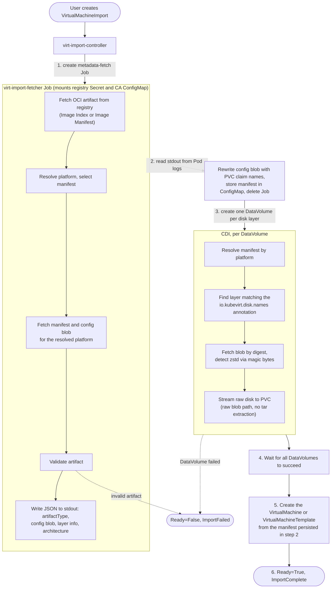

# VEP #395: OCI Artifact Import for VirtualMachines and VirtualMachineTemplates

## VEP Status Metadata

### Target releases

- This VEP targets alpha for version: v1.10
- This VEP targets beta for version:
- This VEP targets GA for version:

### Release Signoff Checklist

Items marked with (R) are required *prior to targeting to a milestone / release*.

- [ ] (R) Enhancement issue created, which links to VEP dir in [kubevirt/enhancements] (not the initial VEP PR)
- [ ] (R) Alpha target version is explicitly mentioned and approved
- [ ] (R) Beta target version is explicitly mentioned and approved
- [ ] (R) GA target version is explicitly mentioned and approved

## Overview

[VEP #256](../256-oci-export-proposal/oci-export-proposal.md) introduced
OCI artifact export for `VirtualMachines` and
`VirtualMachineTemplates`, but explicitly deferred import as a follow-up
design. Its graduation criteria for Beta/GA include "Import mechanism
implemented" and "Round-trip export/import tested."

This proposal introduces a `VirtualMachineImport` CRD (API group
`import.kubevirt.io`) and controller that imports `VirtualMachines` and
`VirtualMachineTemplates` from OCI artifacts stored in container registries.
The target kind is auto-detected from the OCI manifest's `artifactType`
field. The controller lives in a new `kubevirt/virt-import` repository and
ships two images, `virt-import-controller` and `virt-import-fetcher`. It is
installed from the manifest bundle the repository publishes with each
release, and will also be available through the
hyperconverged-cluster-operator (HCO).

Importing disk data is delegated to CDI via `DataVolumes`. This requires
extending CDI's `DataVolumeSourceRegistry` with a `Layer` field to
support selecting OCI artifact layers by annotation, and handling raw
(non-tar) layer blobs.

A proof-of-concept shell script exists at `kubevirt/kubevirt/hack/oci-import.sh`
that validates the overall approach.

### Implementation Phases

The work is split into three sequential phases:

1. **Phase 1 - CDI** (`kubevirt/containerized-data-importer`): Extend CDI's
   `DataVolumeSourceRegistry` with a `Layer` field, add raw blob handling
   for OCI artifact layers, and validate incompatibility with node pull
   mode.
2. **Phase 2 - virt-import** (`kubevirt/virt-import`): Implement the
   `VirtualMachineImport` CRD, the controller, the metadata-fetch binary and
   the `virtimportctl` CLI in a new repository, together with the manifest
   bundle that installs them.
3. **Phase 3 - HCO** (`kubevirt/hyperconverged-cluster-operator`): Make the
   component deployable through HCO.

Each phase depends on the previous one. All three target alpha in v1.10.
`kubevirt/kubevirt` is not modified.

## Motivation

By completing the import side of the OCI artifact workflow, we get:

* **Full round-trip** - export a VM or template from one cluster, push to a
  registry, import on another cluster
* **Declarative API** - `VirtualMachineImport` CR with status tracking,
  conditions, and garbage collection of intermediate resources
* **Registry-native distribution** - pull VMs and templates from existing
  registry infrastructure
* **Portable imports** - storage-specific details are not stored in the
  artifact; CDI applies cluster-appropriate defaults via StorageProfiles,
  making imports work across clusters with different storage backends

## Goals

* Import `VirtualMachines` from OCI artifacts in registries
* Import `VirtualMachineTemplates` from OCI artifacts in registries
* Auto-detect target kind from OCI `artifactType`
* Support multi-architecture OCI artifacts via optional
  `platform.architecture` selection
* Extend CDI's `DataVolumeSourceRegistry` with a `Layer` field for
  annotation-based layer selection and raw blob handling
* Publish a manifest bundle that installs the controller standalone, and
  make the component deployable through HCO
* Provide a `virtimportctl` CLI

## Non Goals

* Node pull mode for OCI artifacts (future enhancement - see
  [Node Pull Mode](#node-pull-mode---future-enhancement))
* Multi-VM appliance import (single VM or template per artifact)
* Guest-level operations (sysprep, network reconfiguration) during import
* Import of non-KubeVirt OCI artifacts (only artifacts matching the VEP #256
  format); non-compliant artifacts are rejected
* Periodic or scheduled imports (could be built on top of
  `VirtualMachineImport` as a future enhancement)
* `virtctl` integration; the CLI commands move into `virtctl` at beta

## Definition of Users

* **VM owner**: imports VMs from registries for cross-cluster migration or
  disaster recovery
* **Template owner**: imports templates from registries for sharing reusable
  VM blueprints across clusters
* **Cluster admin**: manages RBAC to control who can create imports;
  configures storage classes and StorageProfiles

## User Stories

* As a VM owner, I want to import a `VirtualMachine` from a registry so I can 
  recreate it on another cluster.
* As a template owner, I want to import a `VirtualMachineTemplate` from a
  registry so I can share reusable templates across clusters.
* As a VM owner, I want to round-trip my VM: export to OCI, push to a
  registry, import on another cluster - and get an equivalent VM.
* As a cluster admin, I want imports to use cluster-appropriate storage
  defaults so I do not need to manually specify volume modes and access
  modes for each disk.

## Repos

* (Phase 1) [kubevirt/containerized-data-importer](https://github.com/kubevirt/containerized-data-importer) -
  `Layer` on `DataVolumeSourceRegistry` with annotation-based selection,
  raw blob handling in importer
* (Phase 2) [kubevirt/virt-import](https://github.com/kubevirt/virt-import)
  (new) - import API, controller, metadata-fetch binary, CLI and manifest
  bundle
* (Phase 3) [kubevirt/hyperconverged-cluster-operator](https://github.com/kubevirt/hyperconverged-cluster-operator) -
  deployment of the import controller

`kubevirt/virt-import` is created through the KubeVirt org's repository
process, with @0xFelix and @akalenyu as maintainers.

## Design

### OCI Artifact Format (reference to VEP #256)

The import mechanism consumes artifacts in the format defined by
[VEP #256](../256-oci-export-proposal/oci-export-proposal.md). See its
[OCI Artifact Format Specification](../256-oci-export-proposal/oci-export-proposal.md#oci-artifact-format-specification)
for the full definition of artifact types, media types, layer annotations,
and config blob structure.

The import controller uses the `artifactType` field on the OCI manifest to
auto-detect the target kind (`VirtualMachine` or `VirtualMachineTemplate`).
It reads `io.kubevirt.disk.names` and `io.kubevirt.disk.size` from layer
annotations to correlate layers to volumes and to size DataVolumes. The
plural `io.kubevirt.disk.names` is corrected in VEP #256 by
[#446](https://github.com/kubevirt/enhancements/pull/446).

**Not in the artifact:** `volumeMode` and `accessModes` are not stored in
the OCI artifact. CDI applies cluster-appropriate defaults via
StorageProfiles on the target cluster. This makes imports portable across
clusters with different storage backends.

### Phase 1: CDI - OCI Artifact Layer Support

This phase extends CDI's `DataVolumeSourceRegistry` to support selecting
individual layers from OCI artifacts by annotation and importing raw
(non-tar) blobs. All changes are in
[kubevirt/containerized-data-importer](https://github.com/kubevirt/containerized-data-importer).

#### DataVolumeSourceRegistry Layer

A new `Layer` field is added to `DataVolumeSourceRegistry`:

```go
// DataVolumeSourceRegistry provides the parameters to create a Data Volume from an registry source
type DataVolumeSourceRegistry struct {
    //URL is the url of the registry source (starting with the scheme: docker, oci-archive)
    // +optional
    URL *string `json:"url,omitempty"`
    //ImageStream is the name of image stream for import
    // +optional
    ImageStream *string `json:"imageStream,omitempty"`
    //PullMethod can be either "pod" (default import), or "node" (node docker cache based import)
    // +optional
    PullMethod *RegistryPullMethod `json:"pullMethod,omitempty"`
    //SecretRef provides the secret reference needed to access the Registry source
    // +optional
    SecretRef *string `json:"secretRef,omitempty"`
    //CertConfigMap provides a reference to the Registry certs
    // +optional
    CertConfigMap *string `json:"certConfigMap,omitempty"`
    //Platform describes the minimum runtime requirements of the image
    // +optional
    Platform *PlatformOptions `json:"platform,omitempty"`
    // Layer selects a specific layer from an OCI artifact manifest
    // by matching an annotation on the manifest's layer descriptors.
    // The importer resolves the manifest (using Platform to select
    // from an image index or verify a plain manifest), finds the
    // matching layer, and treats its blob as raw data.
    // Incompatible with pullMethod: node.
    // +optional
    Layer *LayerDescriptor `json:"layer,omitempty"`
}

type LayerDescriptor struct {
    // Annotation selects a layer by matching an annotation on the
    // OCI manifest's layer descriptors.
    Annotation LayerAnnotationSelector `json:"annotation"`
}

type LayerAnnotationSelector struct {
    // Key is the annotation key to match on the layer descriptor
    // (e.g. "io.kubevirt.disk.names").
    Key string `json:"key"`
    // Value is the expected annotation value, matched exactly
    // (e.g. "rootdisk", or "datadisk,shareddisk" for a layer backing
    // more than one volume).
    Value string `json:"value"`
}
```

This follows a similar convention to podman's
[artifact extract](https://docs.podman.io/en/latest/markdown/podman-artifact-extract.1.html)
annotation-based layer selection. A `Digest` field for direct
content-addressable selection could be added to `LayerDescriptor` in
the future if needed. CDI could also infer the storage size from the
layer's `io.kubevirt.disk.size` annotation when resolving the manifest,
removing the need for the controller to set it on the DataVolume.

When `Layer` is set, `pullMethod` must be `pod` (or unset, defaulting
to `pod`). Node pull is incompatible with `Layer` because the container
runtime cannot handle OCI artifacts with custom media types. CDI's
webhook rejects DataVolumes that combine `Layer` with
`pullMethod: node`.

CDI's registry import behavior changes as follows:

| Step | Normal (container image) | With Layer (OCI artifact) |
|------|--------------------------|---------------------------|
| Manifest parsing | `image.FromSource()` | Fetch manifest; if image index, select by `Platform`; if plain manifest, verify `Platform` matches (fail on mismatch) |
| Layer selection | All layers, match by tar path | Match layer by annotation key-value |
| Blob fetch | Via layer iteration | `GetBlob()` by matched layer's digest |
| Layer processing | `tar.NewReader()`, extract `disk/` files | Raw blob path: stream decompressed blob directly |
| Post-import inspection | `Inspect()` for labels | Skipped |

#### Node Pull Mode - Future Enhancement

Node pull mode cannot work for OCI artifacts because:

1. The container runtime (containerd/CRI-O) expects standard container
   image layers and would fail to pull an artifact with
   `application/vnd.kubevirt.disk.raw+zstd` layers
2. The sidecar container pattern used by CDI's node pull requires a valid
   container image as the sidecar's image reference
3. Even if the runtime could pull the artifact, it would try to unpack
   layers as filesystem overlays, which fails for raw disk blobs

Node pull would require one of:

* CRI-level OCI artifact support (upstream Kubernetes work)
* A different credential-sharing mechanism (e.g., projected service account
  tokens with registry auth)
* A proxy that uses node credentials to pull blobs and serves them to the
  importer pod

This can be a follow-up enhancement in the future.

### Phase 2: virt-import Controller

All changes are in
[kubevirt/virt-import](https://github.com/kubevirt/virt-import).

#### Repository Structure

The repository follows the same pattern as `kubevirt/virt-template`:

* Kubebuilder v4 scaffolding
* A separate `kubevirt.io/virt-import-api` module and a client generated
  from `staging/src/kubevirt.io/virt-import-client-go`
* A controller-runtime manager with leader election
* A single Kustomize `default` overlay, from which `make build-installer`
  renders the released manifest bundle

Two images are built: `virt-import-controller` runs the reconciler, and
`virt-import-fetcher` runs in the metadata-fetch Job, whose image the
controller receives as a command line flag.

The OCI media types and layer annotations the importer reads are constants in
`kubevirt.io/virt-import-api`, matching VEP #256. The artifact format is shared
with the exporter, the constants are a copy: `kubevirt/virt-import` does not
depend on the `kubevirt.io/kubevirt` module. Promoting them to a shared
package is a GA item.

The controller does not access container registries directly. It spawns a
metadata-fetch Job whose Pod runs `virt-import-fetcher` and mounts the
referenced Secret and ConfigMap for registry authentication. The fetcher
holds no API access, so the only Pod that mounts registry credentials
contains an OCI client and nothing else, and the controller needs no
cluster-wide Secret or ConfigMap read permissions.

#### Required and Optional API Groups

`cdi.kubevirt.io` is required; every import creates DataVolumes. An
availability controller polls discovery and starts the import reconciler once
the group appears. While it waits it patches pending `VirtualMachineImports`
with `Ready=False` and `Progressing=True`, reason `Waiting`, naming the
missing group.

`template.kubevirt.io` is optional. It is only needed when an artifact's
`artifactType` names a `VirtualMachineTemplate`, and its absence fails that
one import rather than blocking the controller. `VirtualMachineTemplates` are
served from the manager's cache when the group is present at startup, and
read uncached otherwise, so a group installed later needs no restart.

#### CRD Definition

```go
// VirtualMachineImportSpec defines the desired import.
type VirtualMachineImportSpec struct {
    // Source specifies where to import from.
    Source VirtualMachineImportSource `json:"source"`
    // TargetName is the name for the created VM or VMTemplate.
    // Defaults to the VirtualMachineImport CR name.
    // +optional
    TargetName *string `json:"targetName,omitempty"`
    // StorageClassName overrides the default storage class for all
    // DataVolumes created during import.
    // +optional
    StorageClassName *string `json:"storageClassName,omitempty"`
}
```

`VirtualMachineImportSpec` is immutable after creation, enforced by a CEL
validation rule (`self == oldSelf`) on the `spec` field of the CRD schema. To
change import parameters, delete the CR and create a new one.

```go
type VirtualMachineImportSource struct {
    // Registry specifies an OCI artifact in a container registry.
    // +optional
    Registry *VirtualMachineImportRegistrySource `json:"registry,omitempty"`
}

type VirtualMachineImportRegistrySource struct {
    // URL is the registry URL
    // (e.g. docker://registry.example.com/vms/fedora:v1).
    URL string `json:"url"`
    // SecretRef is the name of a Secret containing registry credentials.
    // +optional
    SecretRef *string `json:"secretRef,omitempty"`
    // CertConfigMap is the name of a ConfigMap containing registry CA
    // certificates.
    // +optional
    CertConfigMap *string `json:"certConfigMap,omitempty"`
    // Platform selects the architecture variant from a multi-arch
    // artifact.
    // +optional
    Platform *PlatformOptions `json:"platform,omitempty"`
}

type PlatformOptions struct {
    // Architecture selects the platform variant (e.g. amd64, arm64).
    Architecture *string `json:"architecture,omitempty"`
}
```

```go
// VirtualMachineImportStatus reports observed import state.
type VirtualMachineImportStatus struct {
    // Conditions represent the latest observations of the import.
    Conditions []metav1.Condition `json:"conditions,omitempty"`
    // ArtifactInfo contains metadata read from the OCI artifact.
    // +optional
    ArtifactInfo *ArtifactInfo `json:"artifactInfo,omitempty"`
    // DiskImports tracks the status of each disk being imported.
    DiskImports []DiskImportStatus `json:"diskImports,omitempty"`
    // TargetRef references the created VM or VMTemplate.
    // +optional
    TargetRef *corev1.ObjectReference `json:"targetRef,omitempty"`
}

type ArtifactInfo struct {
    // ArtifactType is the OCI artifactType from the manifest.
    ArtifactType string `json:"artifactType"`
    // Architecture is the resolved platform architecture.
    Architecture string `json:"architecture"`
    // DiskCount is the number of disk layers in the artifact.
    DiskCount int `json:"diskCount"`
}

type DiskImportStatus struct {
    // Names are the volume names backed by this layer, from the
    // io.kubevirt.disk.names annotation.
    Names []string `json:"names"`
    // DataVolumeName is the name of the created DataVolume.
    DataVolumeName string `json:"dataVolumeName"`
    // Phase mirrors cdiv1.DataVolumePhase values (e.g. "Succeeded",
    // "ImportInProgress", "Failed").
    Phase string `json:"phase"`
}
```

**Condition types and reasons:**

| Condition | Status | Reason           | Meaning |
|-----------|--------|------------------|---------|
| `Progressing` | `True` | `FetchingMetadata` | Metadata-fetch Job running |
| `Progressing` | `True` | `ImportingDisks` | DataVolumes created, CDI importing |
| `Progressing` | `True` | `CreatingTarget` | Disks done, creating VM/VMTemplate |
| `Progressing` | `False` | `ImportComplete` | Import finished successfully |
| `Progressing` | `False` | `ImportFailed`   | Import failed |
| `Progressing` | `True` | `Waiting`        | The `cdi.kubevirt.io` API group is not available |
| `Ready` | `True` | `ImportComplete` | Target resource created |
| `Ready` | `False` | `ImportFailed`  | Import failed (see message) |
| `Ready` | `False` | `Waiting`       | The `cdi.kubevirt.io` API group is not available |

#### Import Flow



**Platform resolution (fetcher step 2):** If the artifact is a plain Image
Manifest, a set `platform.architecture` is verified against it and a mismatch
fails the import, while an unset one uses the manifest as-is. If the artifact
is an Image Index, a set `platform.architecture` selects the matching manifest
and fails on either no match or multiple matches (e.g. same architecture,
different variant); an unset one uses the only available manifest, or fails and
asks the user to specify when the index holds several. Manifests with unknown
or empty architecture or OS are skipped.

**Artifact validation (fetcher step 4):** Non-compliant artifacts fail the Job.
The fetcher requires that:

- `artifactType` is a known KubeVirt type
  (`application/vnd.kubevirt.virtualmachine.v1` or
  `application/vnd.kubevirt.virtualmachinetemplate.v1`)
- Each disk layer carries the `io.kubevirt.disk.names` and
  `io.kubevirt.disk.size` annotations
- Layer media types are supported
- No volume name appears in more than one layer
- `io.kubevirt.disk.size` is a valid Kubernetes resource quantity
- Every PVC volume in the config blob is named by exactly one disk layer's
  `io.kubevirt.disk.names`, and every disk layer names at least one PVC volume

All fetcher messages other than the stdout JSON are emitted to stderr.

**DataVolume fields (controller step 3):** One DataVolume per disk layer, with:

```yaml
source:
  registry:
    url: docker://<artifact-ref>
    platform:
      architecture: <resolved-arch>
    layer:
      annotation:
        key: io.kubevirt.disk.names
        value: <annotation value, passed through verbatim>
    secretRef: <from spec, if set>
    certConfigMap: <from spec, if set>
storage:
  resources:
    requests:
      storage: <disk-size>
  storageClassName: <from spec, if set>
```

**Metadata persistence:** The controller reads the fetcher's output from the
Job's Pod logs once, immediately after the Job succeeds. Target PVC names
derive from the `VirtualMachineImport` alone, so the config blob is rewritten
at that point and the ready-to-apply manifest stored in a `ConfigMap` owned
by the CR. Later reconciles resume from it, so an import survives a controller
restart and the wait for the DataVolumes, and it is garbage collected with
the CR.

**PVC naming convention:** `${RESOURCE_NAME}-${DISK_NAME}` (e.g.,
`fedora-vm-rootdisk`), where `RESOURCE_NAME` is the `targetName` if set,
otherwise the `VirtualMachineImport` CR name. `DISK_NAME` is the first name in
the layer's `io.kubevirt.disk.names` list, which is lexically sorted. A layer
backing several volumes yields one PVC, and the config blob rewrite points
every one of those volumes at it.

**Namespace scoping:** All resources created during import (metadata-fetch
Job, ConfigMap, DataVolumes, PVCs, target VM or VMTemplate) are created in
the same namespace as the `VirtualMachineImport` CR. Cross-namespace import
is not supported.

**Volume sources on imported VMs:** The export format (VEP #256) strips
`dataVolumeTemplates` and replaces DataVolume volume sources with PVC
references. Imported VMs therefore use `persistentVolumeClaim` volume
sources pointing to the PVCs created during import. Non-PVC volumes
(cloud-init, ConfigMap, containerDisk, etc.) are preserved as-is from
the config blob.

**Error semantics:** Import is all-or-nothing. If the metadata-fetch Job
or any DataVolume fails, the controller sets the `Ready` condition to
`False` with reason `ImportFailed` and does not create the target VM or
VMTemplate. Intermediate resources (Jobs, ConfigMaps, DataVolumes, PVCs)
are cleaned up when the user deletes the `VirtualMachineImport` CR (see
garbage collection below). A `VirtualMachineTemplate` artifact on a cluster
without `template.kubevirt.io` fails the same way, with a message naming the
missing API group.

**Naming collisions:** If any resource (DataVolume, PVC, VirtualMachine,
or VirtualMachineTemplate) that the controller needs to create already
exists in the namespace, the import fails. The controller does not
overwrite or adopt existing resources.

**Garbage collection:** The controller uses a finalizer on the
`VirtualMachineImport` CR. Behavior depends on the `Ready` condition:

* **During import** (`Ready` is not `True`): deleting the CR triggers the
  finalizer, which deletes all intermediate resources (metadata-fetch Job,
  DataVolumes, and their PVCs). No VM or VMTemplate has been created yet.
* **After successful import** (`Ready` is `True`): the controller removes
  ownerReferences from PVCs (so they are no longer owned by their
  DataVolumes), deletes the DataVolumes, and removes its finalizer. The
  created VM or VMTemplate and its PVCs persist independently. Deleting
  the `VirtualMachineImport` CR at this point only deletes the CR
  itself.

#### RBAC

**Controller RBAC:** The import controller requires permissions to:

* Manage `VirtualMachineImport` CRs and their status (get, list, watch,
  update, patch)
* Create and manage Jobs and read Pod logs (for the metadata-fetch Job)
* Create, read and delete `ConfigMaps` (for the persisted metadata)
* Create `VirtualMachines` and `VirtualMachineTemplates`
* Create CDI `DataVolumes` for disk import

The controller does not need access to the `Secrets` and `ConfigMaps`
referenced in the CR. The metadata-fetch Job's Pod mounts them by name,
which requires no additional RBAC for the controller (same pattern as
CDI's importer Pods).

**User RBAC:** A `ValidatingAdmissionPolicy` with CEL expressions guards
creation of `VirtualMachineImport` resources, ensuring the requesting
user has permissions to create `VirtualMachines`, `VirtualMachineTemplates`,
and `DataVolumes` in the target namespace. This prevents privilege
escalation where a user without those permissions could otherwise
leverage the controller to create resources on their behalf.

Users do not need `get` access to the referenced `secretRef` Secret.
The metadata-fetch Job's Pod mounts the Secret by name without exposing
its contents to the user. This follows the same pattern as CDI, where
users reference a Secret in a `DataVolume` without needing read access
to it.

Aggregated `admin`, `edit` and `view` cluster roles are provided, as they are
for the other KubeVirt resources.

#### CLI: virtimportctl

```shell
# Import a VM from a registry
$ virtimportctl create my-import \
    --url=docker://registry.example.com/vms/fedora:v1 \
    --secret=registry-credentials

# Import with a custom target name for the created VM
$ virtimportctl create my-import \
    --url=docker://registry.example.com/vms/fedora:v1 \
    --target-name=fedora-vm

# Import a VMTemplate (auto-detected from artifact type)
$ virtimportctl create tpl-import \
    --url=docker://registry.example.com/templates/fedora:v1

# Check status
$ virtimportctl status my-import

# Delete import (keeps created VM/VMTemplate, cleans up DataVolumes)
$ virtimportctl delete my-import
```

**Flags on `virtimportctl create`:**

| Flag               | Default | Description                                                          |
|--------------------|---------|----------------------------------------------------------------------|
| `--url`            | -       | Registry URL (required, e.g. `docker://registry.example.com/vm:v1`) |
| `--target-name`    | -       | Name for the created VM or VMTemplate (defaults to CR name)          |
| `--secret`         | -       | Name of a Secret containing registry credentials                     |
| `--cert-configmap` | -       | Name of a ConfigMap containing registry CA certificates              |
| `--storage-class`  | -       | StorageClass override for all DataVolumes                            |
| `--arch`           | -       | Architecture variant for multi-arch artifacts (e.g. `amd64`). Optional; when unset, single-manifest artifacts are used as-is, multi-manifest artifacts fail with a request to specify |

`virtimportctl` follows the same internal structure as `virtctl`, so at beta
its commands can be moved into `virtctl` and `virtimportctl` dropped.

### Phase 3: Deployment

#### Standalone Installation

`make build-installer` renders the `default` overlay into a single
`virt-import.yaml` published with each release. Applying it installs the
`VirtualMachineImport` CRD, the controller `Deployment`, its RBAC, the
metrics `Service`, the `NetworkPolicy` and the `ValidatingAdmissionPolicy`.
cert-manager issues the metrics serving certificate.

#### HCO Integration

`kubevirt/virt-import` provides a `csv-generator` in its controller image,
as the other components HCO deploys do. HCO's manifest build calls it with
the digest-pinned controller and fetcher images, so the controller and the
`VirtualMachineImport` CRD become part of what HCO installs. There the
metrics serving certificate is issued by the OpenShift service CA.

The `HyperConverged` API is unchanged. The controller is idle until a
`VirtualMachineImport` exists, and access to the feature is governed by RBAC
on `import.kubevirt.io/virtualmachineimports`.

## API Examples

### Import a VirtualMachine

```yaml
apiVersion: import.kubevirt.io/v1alpha1
kind: VirtualMachineImport
metadata:
  name: my-import
  namespace: default
spec:
  source:
    registry:
      url: docker://registry.example.com/vms/fedora:v1
      secretRef: registry-credentials
      certConfigMap: registry-ca
  targetName: fedora-vm
  storageClassName: ceph-block
```

### Import a VirtualMachineTemplate with architecture selection

```yaml
apiVersion: import.kubevirt.io/v1alpha1
kind: VirtualMachineImport
metadata:
  name: tpl-import
  namespace: templates
spec:
  source:
    registry:
      url: docker://registry.example.com/templates/fedora:v1
      platform:
        architecture: arm64
```

### DataVolume created by the import controller (CDI side)

```yaml
apiVersion: cdi.kubevirt.io/v1beta1
kind: DataVolume
metadata:
  name: fedora-vm-rootdisk
  namespace: default
  ownerReferences:
    - apiVersion: import.kubevirt.io/v1alpha1
      kind: VirtualMachineImport
      name: my-import
spec:
  source:
    registry:
      url: docker://registry.example.com/vms/fedora:v1
      secretRef: registry-credentials
      certConfigMap: registry-ca
      platform:
        architecture: amd64
      layer:
        annotation:
          key: io.kubevirt.disk.names
          value: rootdisk
  storage:
    storageClassName: ceph-block
    resources:
      requests:
        storage: 10Gi
```

### Import status when ready

```yaml
status:
  conditions:
    - type: Ready
      status: "True"
      reason: ImportComplete
      message: VirtualMachine fedora-vm created with 2 disk(s)
    - type: Progressing
      status: "False"
      reason: ImportComplete
  artifactInfo:
    artifactType: application/vnd.kubevirt.virtualmachine.v1
    architecture: amd64
    diskCount: 2
  diskImports:
    - names: [rootdisk]
      dataVolumeName: fedora-vm-rootdisk
      phase: Succeeded
    - names: [datadisk]
      dataVolumeName: fedora-vm-datadisk
      phase: Succeeded
  targetRef:
    apiVersion: kubevirt.io/v1
    kind: VirtualMachine
    name: fedora-vm
    namespace: default
```

### Full round-trip example

```shell
# Cluster A: export
$ virtctl vmexport create my-export --vm=fedora-vm
$ virtctl vmexport download my-export --format=oci --output=fedora.oci.tar

# Push to registry
$ skopeo copy oci-archive:fedora.oci.tar \
    docker://registry.example.com/vms/fedora:v1

# Cluster B: import
$ virtimportctl create fedora-import \
    --url=docker://registry.example.com/vms/fedora:v1 \
    --secret=registry-credentials
```

## Alternatives

### Use Kubernetes ImageVolume for disk data

Kubernetes ImageVolume (KEP-4639) merges layers as filesystem overlays,
expecting standard OCI/Docker layer media types. The KubeVirt OCI export
format uses `application/vnd.kubevirt.disk.raw+zstd` - raw zstd-compressed
blobs, not tar archives. The kubelet and container runtime would reject
these. Disk data must be pulled via CDI's pod-pull path.

### Implement the controller in kubevirt/kubevirt

The API and controller could be in-tree, at
`staging/src/kubevirt.io/api/vmimport/v1alpha1` and
`cmd/virt-import-controller/`, sharing the OCI artifact format constants in
`pkg/storage/oci` with the export writer. This was rejected because import
does not need to be a core component. A separate repository keeps it out of
the core release cycle while the API settles, and it can move in-tree later.

### Run the import controller inside virt-controller

The reconciler could run in the `virt-controller` process under its existing
leader election lease, needing no new binary, image or `Deployment`. This was
rejected for the same reason, and because a controller-runtime manager there
would maintain a second informer cache alongside `virt-controller`'s shared
informer factory.

### Deploy the controller from virt-operator

`virt-operator` could deploy the controller from a manifest bundle vendored
into `kubevirt/kubevirt` and gated by a feature gate, as it does for
`kubevirt/virt-template`. This was rejected because it makes an optional
component part of the core deployment, costing a feature gate and a
deployment toggle in the `KubeVirt` CR and a job to vendor the bundle on each
release. It stays available if import becomes a core component later.

### Add a new CDI source type (DataVolumeSourceOCIArtifact)

A dedicated `DataVolumeSourceOCIArtifact` could encapsulate all OCI
artifact-specific logic. This was rejected because extending
`DataVolumeSourceRegistry` with `Layer` is less invasive - it reuses
the existing registry pull infrastructure (auth, certs, TLS, transport,
platform resolution) and requires fewer changes to CDI's controller and
webhook logic.

### Client-side only import (no CRD)

The CLI could pull the OCI artifact, extract the config blob and disks, and
create resources directly. This was rejected because there would be no
declarative API, no status tracking, no automation, and large disk data
would need to transfer through the client machine.

## Scalability

Minimal impact. Each import creates one `VirtualMachineImport` CR, one
metadata-fetch Job, one `ConfigMap`, and one `DataVolume` per disk. The
import controller is a single-replica deployment with leader election and
standard watch/reconcile mechanics. DataVolume imports use CDI's existing
scheduling and rate limiting. Intermediate resources (Jobs, ConfigMaps,
DataVolumes, PVCs) are owned by the import CR and garbage collected on
deletion.

## Update/Rollback Compatibility

The feature is a self-contained component: a CRD, a controller deployment
and their RBAC. It versions independently of `kubevirt/kubevirt`, and
installing or removing it affects neither KubeVirt nor CDI. In either
deployment, uninstalling while `VirtualMachineImport` CRs exist leaves them
unable to complete or clean up, because their finalizers need the controller.
Created VMs, templates and PVCs are unaffected.

**Standalone:** the cluster admin controls the lifecycle. Upgrade and
rollback mean applying a different release of the manifest bundle, and the
CRs can be deleted before uninstalling.

**HCO:** the component follows the HCO release, so a rollback to a release
predating this feature takes the controller with it, stranding any imports in
progress until it is reinstalled.

The CDI `Layer` field is additive. On rollback to a CDI version without it,
the API server prunes `layer` while decoding, so CDI imports the whole
artifact as a container image and fails on its custom media types. With
all-or-nothing semantics the whole import fails.

### Version Compatibility

`kubevirt/virt-import` releases on its own cadence, so each release names the
versions it works with:

* **CDI:** the `Layer` field is a hard dependency, and each release documents
  the minimum CDI version providing it.
* **KubeVirt:** the coupling is the OCI artifact format of VEP #256 and the
  API versions of the objects in the config blob, not a controller version.
  An artifact carrying an API version the cluster does not serve fails that
  one import.
* **HCO:** a single HCO release pins KubeVirt, CDI and the import controller
  together.

## Functional Testing Approach

### Phase 1: CDI

**Unit tests:**

* Annotation-based layer selection with Platform resolution when Layer is set
* Raw blob path (skip tar extraction when Layer is set)
* Webhook rejection of Layer + `pullMethod: node`

**Functional tests:**

* DataVolume with Layer + Platform imports a single layer blob selected
  by annotation from a multi-layer OCI artifact pushed to a test registry

### Phase 2: virt-import

**Unit tests:**

* OCI manifest and config blob parsing
* Platform resolution logic (single-arch auto-select, multi-arch selection,
  error on ambiguous)
* `artifactType` validation
* Data exchange between controller and metadata-fetch `Job`
* Resuming from the persisted `ConfigMap` when the Pod logs are gone
* Config blob rewriting (PVC claimName mapping for VMs and
  `dataVolumeTemplates` for VMTemplates)
* DataVolume generation from layer descriptors
* Controller reconciliation state machine
* Availability controller: waiting while `cdi.kubevirt.io` is absent, and
  failing a VMTemplate import when `template.kubevirt.io` is absent

**Functional tests:**

* **Round-trip (VM):** export VM -> push to registry -> import ->
  verify imported VM matches original (modulo PVC names)
* **Round-trip (VMTemplate):** export template -> push -> import ->
  verify template matches, including `dataVolumeTemplates`
* **Multi-disk:** import artifact with multiple disk layers -> verify all
  PVCs created and wired correctly
* **Multi-arch:** import artifact with multiple platform variants ->
  verify `platform.architecture` selection works
* **Error cases:** invalid artifact type, missing layer, unreachable
  registry, invalid credentials
* **Cleanup:** delete import CR -> verify metadata-fetch Job, ConfigMap,
  DataVolumes, and PVCs are garbage collected

### Phase 3: HCO

* `operator-sdk bundle validate` passes on the generated bundle
* A `csv-generator` test asserts the emitted CSV and the dumped CRD
* HCO's manifest build produces a bundle carrying the controller deployment
  and the `VirtualMachineImport` CRD

## Implementation History

* 2026-07-21: Initial proposal. PR: [#396](https://github.com/kubevirt/enhancements/pull/396).

## Graduation Requirements

### Alpha

#### Phase 1: CDI

- [ ] `Layer` field on `DataVolumeSourceRegistry` API
- [ ] Raw blob handling in importer (no tar extraction for OCI artifact
  layers)
- [ ] Webhook rejects `Layer` + `pullMethod: node`
- [ ] Unit and functional tests for CDI changes pass

#### Phase 2: virt-import

- [ ] `import.kubevirt.io/v1alpha1` API module and generated client published
- [ ] `VirtualMachineImport` CRD and controller in `kubevirt/virt-import`
- [ ] `virt-import-fetcher` image and metadata-fetch Job
- [ ] Import of `VirtualMachines` from OCI artifacts
- [ ] Import of `VirtualMachineTemplates` from OCI artifacts
- [ ] Auto-detection of target kind from `artifactType`
- [ ] Multi-architecture support with single-arch auto-default
- [ ] Config blob rewriting for PVC name mapping (VM and VMTemplate paths)
- [ ] Imports resume across controller restarts
- [ ] Availability controller for `cdi.kubevirt.io` and
  `template.kubevirt.io`
- [ ] Minimum supported CDI version documented with the release
- [ ] Released manifest bundle installs the component standalone
- [ ] `virtimportctl` CLI functional
- [ ] Unit and functional tests pass
- [ ] Round-trip export/import tested for both VMs and VMTemplates
- [ ] User-facing documentation for the CRD and `virtimportctl` published

#### Phase 3: HCO

- [ ] `csv-generator` in `kubevirt/virt-import`
- [ ] HCO deploys the import controller and the `VirtualMachineImport` CRD

### Beta

- [ ] API graduated to `v1beta1`
- [ ] `virtimportctl` commands moved into `virtctl` as `virtctl vmimport`,
  and `virtimportctl` dropped
- [ ] Any API changes based on Alpha feedback incorporated
- [ ] User-facing documentation polished

#### On-By-Default Readiness

There is no feature gate to enable: a cluster that installs the component can
use it, and HCO installs it in every distribution built on it. Graduating to
beta therefore means declaring the API and the controller stable rather than
flipping a default:

- [ ] No critical or high-severity bugs open against OCI import
- [ ] E2e tests stable and gating in CI
- [ ] Round-trip export/import passes reliably in CI for both VMs and VMTemplates

### GA

- [ ] OCI artifact format constants promoted to a package shared by the
  exporter and the importer, replacing the copy in `virt-import-api`
- [ ] Stable API with no breaking changes from beta
- [ ] Production usage feedback incorporated
- [ ] Node pull mode implemented or explicitly deferred with justification
