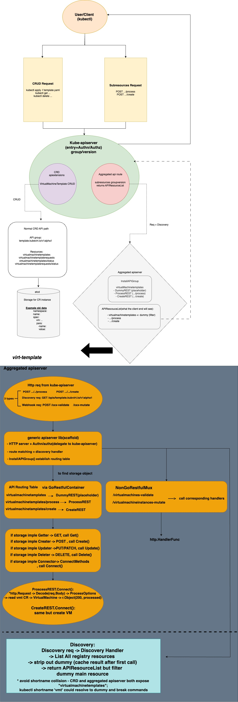

# VEP #462: Migrate virt-api to k8s.io/apiserver GenericAPIServer

## VEP Status Metadata

### Target releases

<!--
A PR must update this section during the planning phase of a given release in order to track it.
PRs that will not update the VEP during the planning phase will not be able to graduate the
VEP by creating a code PR to kubevirt/kubevirt to bump the phase in-code.

Please avoid targeting future releases in this section. Only capture the upcoming release.
For example, during the planning phase for version v1.123, do **not** target beta for v.124 in advance.
-->

- This VEP targets alpha for version: 
- This VEP targets beta for version:
- This VEP targets GA for version:

### Release Signoff Checklist

Items marked with (R) are required *prior to targeting to a milestone / release*.

- [x] (R) Enhancement issue created, which links to VEP dir in [kubevirt/enhancements] (not the initial VEP PR)
- [ ] (R) Alpha target version is explicitly mentioned and approved
- [ ] (R) Beta target version is explicitly mentioned and approved
- [ ] (R) GA target version is explicitly mentioned and approved

## Overview

<!--
Provide a brief overview of the topic
-->
`virt-api` is KubeVirt's aggregated API server for `subresources.kubevirt.io`
and the process that serves admission webhooks. Historically it used a custom
HTTP stack to implement TLS, authentication, authorization, discovery, and OpenAPI.

This VEP proposes replacing that custom server with Kubernetes
`k8s.io/apiserver` `GenericAPIServer` while **keeping the external
subresource and webhook API unchanged**.

Because this is a large architectural change, rollout is **incremental and
opt-in**:
1. **Alpha (current PoC direction):** legacy remains the **default**.
   GenericAPIServer is enabled only when the KubeVirt CR has
   `kubevirt.io/use-generic-apiserver: "true"`. virt-operator then passes
   `--use-generic-apiserver` to virt-api and switches probes to `/livez` and
   `/readyz`.
2. **Later:** after the new path is reviewed, tested, and accepted as default,
   `pkg/virt-api/rest` and the custom HTTP/TLS/auth stack are **removed**.
   The dual-path / annotation switch is temporary and is not the end state.
A proof-of-concept lives in [kubevirt/kubevirt#18607](https://github.com/kubevirt/kubevirt/pull/18607)

## Motivation

<!--
Why this enhancement is important
-->
Maintaining a customized aggregated API server has recurring cost:
- TLS, request-header authn, SAR authz, discovery, and OpenAPI
  are already implemented and maintained in `k8s.io/apiserver`.
- Security fixes must be ported by hand. Example: HTTP/2 Rapid Reset
  (CVE-2023-44487) required explicitly disabling HTTP/2 in virt-api.
- New Kubernetes API-server features (audit, stricter authz attribute parsing,
  probe conventions, OpenAPI v3) are expensive to reimplement.


## Goals

<!--
The desired outcome
-->
- Replace virt-api's custom HTTP server with GenericAPIServer for
  `subresources.kubevirt.io` and the webhook mux.
- Preserve existing client-facing URLs, request/response types, and webhook
  `AdmissionReview` paths.
- Serve subresources through `k8s.io/apiserver` storage (`rest.Connecter` /
  related interfaces), including WebSocket streaming (console, VNC, etc.).
- Mount existing admission webhook handlers on
  `GenericAPIServer.Handler.NonGoRestfulMux` without rewriting admitters.
- Ship **alpha as opt-in** so default clusters keep the legacy server.
- After graduation of the new path, **delete** the legacy
  implementation (`pkg/virt-api/rest` and the custom server in `api.go`).

## Non Goals

<!--
Why this enhancement is important Limitations to the scope of the design
-->
- Changing the external virt-api / virtctl / kubectl contract (paths, verbs,
  payload types).
- Changing virt-handler, virt-controller, or CRD storage. VM/VMI CRUD stays
  on kube-apiserver CRDs.
- Making GenericAPIServer the default in the first merge.
- Deleting `pkg/virt-api/rest` in the first implementation PR. Removal is a
  later milestone after the new path is the supported default.
- Introducing a second virt-api binary or a separate webhook Deployment.

## Definition of Users

<!--
Who is this feature set intended for
-->
- KubeVirt cluster admins and operators for more standard, maintainable virt-api
  with a safe rollback path during alpha.
- KubeVirt contributors for less custom TLS/authn/authz/discovery code to own.
- End users of VMs for no intended API or UX change.

## User Stories

<!--
List of user stories this design aims to solve
-->
- As a KubeVirt maintainer, I want virt-api to use upstream API-server
  infrastructure so security and Kubernetes upgrades are not one-off ports.
- As a cluster admin, I want the existing virt-api behavior by default and
  a documented opt-in to try GenericAPIServer before it becomes default.
- As a virtctl / kubectl user, I want start/stop/console/VNC/webhooks to keep
  working on the same URLs after the migration.

## Repos

<!--
List of repose this design impacts
-->
- https://github.com/kubevirt/kubevirt (implementation)
- https://github.com/kubevirt/enhancements (this VEP)
- Tracking issue: https://github.com/kubevirt/enhancements/issues/462

## Design

<!--
This should be brief and concise. We want just enough to get the point across
-->
### Current architecture (legacy, default)
virt-api is a single process, typically listening on container port `8443`.
TLS (custom cert manager + tls.Config) -> request logging / filters -> custom authorizer (URL split + SubjectAccessReview) -> go-restful: subresources.kubevirt.io (lifecycle, volumes, streaming, ...) -> net/http HandleFunc: validating/mutating webhooks -> readiness: /apis/subresources.kubevirt.io/<version>/healthz
Authorization today parses the request path and issues a SAR. Cluster-scoped
utility routes (`version`, `guestfs`, `healthz`, cluster profiler) are
exempted by exact-path allow lists in that custom authorizer.

### Proposed architecture (GenericAPIServer)

GenericAPIServer (RecommendedOptions) TLS / authn (delegating / request-header) / delegated authz discovery + OpenAPI from InstallAPIGroup -> rest.Storage / rest.Connecter: VM and VMI subresources -> NonGoRestfulMux: admission webhooks, /metrics, /livez, /readyz

Business logic stays KubeVirt-owned. The custom HTTP, discovery, and most
authn/authz plumbing is deleted once the new path is default.

Reference implementation patterns: Kubernetes `sample-apiserver` and
`kubevirt/virt-template` (dummy parent resources + `InstallAPIGroup` +
Connecter subresources + discovery filtering).

### Subresources
Parent VM/VMI types are registered as dummy storage so discovery lists
`virtualmachines/<subresource>` and `virtualmachineinstances/<subresource>`.
Dummy parent collection/item APIs are filtered out of discovery (same idea
as virt-template).
Imperative and streaming subresources are `rest.Connecter` (or equivalent)
storage under `pkg/virt-api/apiserver/storage/`, for example:
- VM: start, stop, restart, migrate, add/remove volume, memory dump,
  expand-spec, evacuate, object graph
- VMI: pause/unpause, freeze/unfreeze, console, VNC, portforward, vsock,
  usbredir, guest info, SEV, backup, and related endpoints
During alpha, storage handlers may still call shared helpers that today live
in `pkg/virt-api/rest`. That package is **not** deleted until the new path
is default and those helpers have been moved next to storage (or deleted as
dead code).

### Webhooks
virt-api still serves validating and mutating webhooks on the same process
and Service. kube-apiserver calls those paths directly (not via aggregation).
**Chosen approach:** mount existing handlers on
`GenericAPIServer.Handler.NonGoRestfulMux`. Admitter/mutator logic is
unchanged. `ValidatingWebhookConfiguration` /
`MutatingWebhookConfiguration` objects stay as they are.
Rejected alternatives: implementing webhooks as GenericAPIServer admission
plugins (they apply to this server's own requests, not CRD CRUD on
kube-apiserver); a separate webhook Deployment (extra certs and duplicated
informers).
Webhook paths that historically bypassed virt-api's custom authz must be
listed in AlwaysAllow (or equivalent) so kube-apiserver's webhook client
is not rejected by the delegating authorizer. That list must stay as
narrow as the legacy exemptions.

### Authentication and authorization (including RBAC)
GenericAPIServer uses `RecommendedOptions` delegating authenticator and
authorizer (request-header / client cert + SAR), instead of virt-api
splitting URLs by hand.
**Parity constraint:** legacy virt-api allowed a small set of cluster-level
routes without SAR (`version`, `guestfs`, `healthz`, cluster profiler).
Upstream `AlwaysAllowPaths` **does not** exempt resource requests under
`/apis/<group>/<version>/...` (the path authorizer returns `NoOpinion` for
those). The PoC therefore unions a narrow
`clusterLevelAlwaysAllowAuthorizer` **in front of** the delegated
authorizer. It may only **widen** (Allow or NoOpinion), never deny a path
the delegated authorizer would allow.
Named VM/VMI subresources (console, start, …) must **not** be AlwaysAllow;
they continue to require RBAC.
This is the class of issue already raised on the PoC (RBAC / allow-list
mismatch). The VEP requires: document every exemption, add tests that
forbidden users cannot hit subresources, and keep exemptions equivalent to
legacy. Broadening AlwaysAllow is a security regression and is out of
scope.

### Health probes
| Server | Readiness / liveness |
|--------|----------------------|
| Legacy | HTTPS `/apis/subresources.kubevirt.io/<version>/healthz` |
| GenericAPIServer | HTTPS `/livez` and `/readyz` |
virt-operator selects the probe paths when the annotation is set.


### OpenAPI and discovery
`InstallAPIGroup` owns group/version/resource discovery. OpenAPI is built
from the registered storage and KubeVirt type definitions. After Kubernetes
dependency bumps, definition names must follow upstream
`OpenAPIModelName()` conventions (for example
`io.k8s.apimachinery.pkg.version.Info`). Published definition keys for
KubeVirt types stay the existing `v1.Kind` style.

## API Examples

<!--
Tangible API examples used for discussion
-->
The external HTTP API is unchanged. Clients keep calling the same
`subresources.kubevirt.io` paths. What changes is registration:
`InstallAPIGroup` + `rest.Storage` instead of hand-built go-restful routes.
### Served subresources (current PoC storage map)
Registered in
`pkg/virt-api/apiserver/storage/virtualmachine/storage.go` and
`pkg/virt-api/apiserver/storage/virtualmachineinstance/storage.go`.
Both API versions (`v1` and `v1alpha3`) install the same map.
**VirtualMachine** (`PUT` unless noted):
- `.../virtualmachines/{name}/start|stop|restart|migrate`
- `.../virtualmachines/{name}/addvolume|removevolume`
- `.../virtualmachines/{name}/memorydump|removememorydump`
- `.../virtualmachines/{name}/expand-spec` (`GET`)
- `.../virtualmachines/{name}/objectgraph` (`GET`)
- `.../virtualmachines/{name}/evacuate` (cancel evacuation)
- `.../virtualmachines/{name}/portforward` (`GET` WebSocket)
**VirtualMachineInstance**:
- Streaming `GET` WebSocket: `console`, `vnc`, `usbredir`, `vsock`, `portforward`
- `PUT`: `addvolume`, `removevolume`, `freeze`, `unfreeze`, `pause`, `unpause`,
  `reset`, `softreboot`, `backup`, `redefine-checkpoint`, `evacuate`
- `GET`: `guestosinfo`, `userlist`, `filesystemlist`, `objectgraph`
- `sev` and nested SEV paths (`fetchcertchain`, `querylaunchmeasurement`,
  `setupsession`, `injectlaunchsecret`)
**Cluster-level** (`ClusterLevelRoutes`):
- `PUT .../namespaces/{ns}/expand-vm-spec` (RBAC)
- `GET .../version`, `.../guestfs`, `.../healthz` (legacy AlwaysAllow)
- Cluster profiler start/stop/dump (legacy AlwaysAllow)
Dummy parent resources `virtualmachines` and `virtualmachineinstances` exist
only so subresources can be installed; they are filtered out of discovery.
### Before (legacy)
Hand-built `APIResourceList` and path-splitting SAR (unchanged idea; still
what `runLegacyServer` + `pkg/virt-api/rest` do when the annotation is off).
### After (GenericAPIServer)
```go
// excerpt of NewStorageMap — not a new API
"virtualmachines/start": NewStartREST(lifecycleHandler),
"virtualmachineinstances/console": NewConsoleREST(consoleHandler),
```

Enabling the new server (alpha):
```yaml
apiVersion: kubevirt.io/v1
kind: KubeVirt
metadata:
  name: kubevirt
  namespace: kubevirt
  annotations:
    kubevirt.io/use-generic-apiserver: "true"
```

## Alternatives

<!--
Outline any alternative designs that have been considered)
-->
- Keep the custom HTTP server. Rejected: continues the CVE-port and discovery/authz         maintenance burden.
- Put kube-rbac-proxy (or similar) in front of virt-api. Rejected: does not give discovery/OpenAPI/rest.Connecter integration; still a custom app server.
- Generate scaffolding with apiserver-builder only. Rejected: we need KubeVirt-specific streaming, webhooks, and operator wiring; virt-template is the closer in-org reference.
- New virt-api binary. Rejected by mentors: keep cmd/virt-api, replace internals.
- Flip default in the first PR. Rejected: too large to review and too risky. Opt-in first, then remove legacy.

## Does it belong to core KubeVirt?

<!--
Explain why this feature belongs to the core KubeVirt repository and which other alternatives were considered.
Other alternatives can be:
- External controllers.
- Plugins (see VEP-190).
- Other existing repositories in the KubeVirt organization (e.g. HCO / CDI / etc.).
-->
Yes. virt-api is a core control-plane binary in kubevirt/kubevirt. The migration changes how that process serves APIs already in-tree. It is not a plugin, HCO/CDI feature, or external controller. Putting it in another repository would split the only aggregated API server users depend on.

## Scalability

<!--
Overview of how the design scales)
-->
Deployment shape is unchanged (virt-api Deployment, multiple replicas, Service on 443 → 8443). GenericAPIServer adds standard request timeouts and handler plumbing, no new per-VM control loop. Scale characteristics should match today's virt-api. Alpha must not regress virt-api CPU/memory in the default configuration because that path is unchanged.

## Update/Rollback Compatibility

<!--
Does this impact update compatibility and how?)
-->
- External API: no intended change. virtctl and kubectl keep working.
- Default upgrade: clusters without the annotation keep legacy virt-api (same probes, same go-restful server).
- Opt-in: set the CR annotation; operator rolls virt-api with the new flag and /livez / /readyz. Remove the annotation to roll back to legacy without changing the KubeVirt version.
- Image rollback: if a GenericAPIServer build fails to start, the Deployment rollout fails; revert the Deployment/image or clear the annotation. Certificate flags (--tls-cert-file, handler client certs) stay compatible.
- After legacy removal (later): rollback is a KubeVirt version revert; the annotation no longer exists. That is acceptable only after Beta/GA criteria below.

## Functional Testing Approach

<!--
An overview on the approaches used to functional test this design)
-->
- Unit tests for storage handlers and for authorizer exemptions (AlwaysAllow vs SAR on named subresources).
- Default CI e2e (no annotation) must stay green on the legacy path while both implementations exist.
- Targeted tests with the annotation enabled: discovery, start/stop, expand-spec, webhooks, and at least one streaming subresource (console or VNC).
- Existing pkg/virt-api/rest tests remain until that package is removed; new coverage lives under pkg/virt-api/apiserver/....
- OpenAPI dump (hack/generate / tools/openapispec) must stay consistent with published spec keys.

## Implementation History

<!--
For example:
01-02-1921: Implemented mechanism for doing great stuff. PR: <LINK>.
03-04-1922: Added support for doing even greater stuff. PR: <LINK>.
-->
2026: GSoC design draft reviewed by mentors (Felix Matouschek, Ľuboslav Pivarč). Not submitted to kubevirt/enhancements at that time.
2026: PoC dual-path implementation (opt-in GenericAPIServer, legacy default): https://github.com/kubevirt/kubevirt/pull/18607.
09-10-2026: Tracking issue opened: https://github.com/kubevirt/enhancements/issues/462

## Graduation Requirements

<!--
The requirements for graduating to each stage.
Example:
### Alpha
- [ ] Feature gate guards all code changes
- [ ] Initial implementation supporting only X and Y use-cases

### Beta
- [ ] Implementation supports all X use-cases

It is not necessary to have all the requirements for all stages in the initial VEP.
They can be added later as the feature progresses, and there is more clarity towards its future.

Refer to https://github.com/kubevirt/community/blob/main/design-proposals/feature-lifecycle.md#releases for more details
-->

### Alpha
- [ ] This VEP accepted with SIG compute as owner; other SIGs acknowledge.
- [ ] GenericAPIServer path exists behind kubevirt.io/use-generic-apiserver / --use-generic-apiserver (default off).
- [ ] Legacy go-restful path remains default; pkg/virt-api/rest still present.
- [ ] Authz exemptions documented and tested; no extra AlwaysAllow on named VM/VMI subresources.
- [ ] Implementation landed as a series of small PRs, not one vendor+code megapr.
- [ ] Unit tests for storage + authz; default e2e still exercises legacy.
- [ ] Docs: how to opt in, probe path change, how to opt out.

### Beta
- [ ] Feature complete: all current subresources and webhooks on GenericAPIServer.
- [ ] Behavioral parity with legacy.
- [ ] Annotation-enabled e2e (or equivalent) covers lifecycle, webhooks, and streaming.
- [ ] Authn/authz review signed off by maintainers (no RBAC regression).
- [ ] Decision recorded: replace the CR annotation with a FeatureGate, or keep the annotation until GA.

#### On-By-Default Readiness

<!--
Beta features are enabled by default.
In this section, please specify what needs to be done in order for the VEP to be ready to be enabled by default.
-->
Beta features in KubeVirt are enabled by default. Before GenericAPIServer is
the default virt-api server:
- [ ] Required CI e2e lanes pass with GenericAPIServer enabled.
- [ ] A rollback story exists (FeatureGate or one-release annotation override).
- [ ] A plan (or PR) exists to remove `pkg/virt-api/rest` and `runLegacyServer`.
- [ ] Vendor/dependency ownership is accepted for `k8s.io/apiserver` on Kubernetes bumps.


### GA
- [ ] GenericAPIServer is the only virt-api server.
- [ ] pkg/virt-api/rest and the custom HTTP/auth stack are removed.
- [ ] Opt-in annotation/flag removed or no-op.
- [ ] At least one release shipped with the new path as default (Beta) without a virt-api security/authz regression.
- [ ] Docs updated; tracking issue #462 lists the removal PRs.
