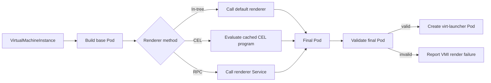

# VEP 82 Supplement: Pluggable virt-launcher Pod Rendering in virt-controller

## VEP Status Metadata

### Target releases

- This VEP targets alpha for version: `v1.11.0`
- This VEP targets beta for version: TBD
- This VEP targets GA for version: TBD

### Release Signoff Checklist

Items marked with (R) are required *prior to targeting to a milestone / release*.

- [ ] (R) Enhancement issue created, which links to this document
- [ ] (R) Alpha target version is explicitly mentioned and approved
- [ ] (R) Beta target version is explicitly mentioned and approved
- [ ] (R) GA target version is explicitly mentioned and approved

## Overview

This document is a focused companion to
[VEP 82: Plugin-based generalization of KubeVirt's virtualization stack](./vep.md).
It defines how `virt-controller` makes rendering of `virt-launcher` Pods
pluggable while retaining ownership of Kubernetes orchestration, rendering of virtualization-agnostic parts of `virt-launcher` pod spec and validation of final `virt-launcher` spec after plugin's customizations.

Today, `virt-controller` renders a `virt-launcher` pod spec that contains several values specific to the in-tree Libvirt/QEMU virtualization stack. Examples are the `compute` container's image itself, command-line arguments, runtime directories, hypervisor resources (KVM or MSHV), memory overhead, and stack-specific node-selectors. This prevents an out-of-tree virtualization stack from supplying its own `virt-launcher` without modifying KubeVirt core.

This VEP splits rendering into three stages:

1. `virt-controller` builds a virtualization-stack-neutral base
   Pod.
2. The renderer selected for the VMI completes that Pod using one of two supported methods:
   - an in-process CEL renderer; or
   - an RPC cluster-service-based renderer.
3. `virt-controller` validates the final Pod before creating it.

Both renderer methods implement the same logical transformation:

```text
VirtualMachineInstance + base Pod + render context -> final Pod
```

The final Pod is validated by `virt-controller` to check for proper construction. The plugin authors would be responsible for ensuring correct functionality of the final `virt-launcher` pod spec.

## Motivation

The current launcher Pod renderer combines two different categories of work:

- common KubeVirt orchestration that is independent of the selected virtualization stack; and
- details required by the in-tree Libvirt/QEMU/KVM stack.

Examples of stack-specific behavior include:

- selecting the `virt-launcher` image and pull policy;
- setting the launcher command, arguments, and environment;
- mounting `/var/run/libvirt` and other runtime directories;
- requesting `/dev/kvm`, `/dev/mshv`, or another hypervisor resource;
- calculating memory consumed by the VMM and management processes;
- selecting nodes by machine type, CPU model, firmware, or stack capability;

Letting cluster admins customize the virtualization-stack-specific portion of the `virt-launcher` pod spec (or even update virtualization-stack-agnostic parts for that matter) would allow them to run `virt-launcher` pods containing alternate virtualization components without modifying KubeVirt core.

Based on the Structured Plugins design, two methods for customizing the base `virt-launcher` pod are considered, based on the extent of customization needed:

- CEL provides a lightweight, declarative, side-effect-free option for stacks
  whose Pod changes can be expressed as bounded transformations.
- RPC provides an isolated, fully programmable option for stacks that need
  more complex calculations or independently deployed implementation code.

## Goals

- Separate stack-agnostic launcher Pod construction from stack-specific
  customization.
- Support both CEL and RPC as first-class renderer methods.
- Give both methods the same logical input, output, ownership rules, and final
  validation requirements.
- Keep Kubernetes clients, informer stores, controller caches, and resolved
  cluster state inside `virt-controller`.
- Preserve common KubeVirt behavior and security policy across all
  virtualization stacks.
- Isolate renderer failures to affected VMIs and avoid making
  `virt-controller` unavailable.
- Preserve current Libvirt/QEMU/KVM rendering behavior when the feature is
  disabled or the default in-tree renderer is selected.
- Define an interface that can be versioned and tested independently of a
  specific virtualization stack.

## Non Goals

- Making admission webhooks, `virt-handler`, node labeling, or
  `virt-launcher` lifecycle APIs pluggable. Those are covered by the parent VEP
  or separate follow-up VEPs.
- Defining how a VMI selects a virtualization stack.
- Removing Libvirt/QEMU semantics from the KubeVirt v1 API.
- Allowing a renderer to create Kubernetes resources or call back into
  `virt-controller`.
- Exposing controller-local clients, informer stores, or Go implementation
  types through the proposed plugin API. The plugin implementation does not have access to any data structures from core KubeVirt. 
- Providing arbitrary Pod mutation to unprivileged VMI users. Renderers are
  installed and selected according to cluster-administrator policy.
- Replacing the public offline Pod rendering API proposed by VEP 359. This
  design is an internal reconciliation extension point that uses live,
  controller-resolved state.

## Definition of Users

- **Virtualization stack developers** who provide a launcher implementation
  and need to complete its Pod without changing KubeVirt core.
- **Platform operators** who install and configure virtualization stack
  plugins.
- **KubeVirt maintainers** who own the base Pod contract and validation.
- **KubeVirt distributors** who may ship additional renderers while preserving
  the upstream control-plane contract.

## User Stories

- As a virtualization stack developer, I want to receive a base launcher Pod
  and return a completed Pod so that I can supply my launcher image, runtime,
  resources, and scheduling requirements out of tree.
- As a plugin author with simple declarative requirements, I want to use CEL
  without operating another control-plane service.
- As a plugin author with complex rendering logic, I want to use an RPC service
  so that I can implement and release that logic independently.
- As a platform operator, I want invalid or unavailable renderers to affect
  only VMIs that select them.
- As a KubeVirt maintainer, I want all rendered Pods to pass the same final
  validation regardless of the renderer method.
- As a KubeVirt maintainer, I want changes to common Pod behavior to remain
  controlled by KubeVirt rather than duplicated by every plugin.

## Repos

- [kubevirt/kubevirt](https://github.com/kubevirt/kubevirt)
- [kubevirt/enhancements](https://github.com/kubevirt/enhancements)
- Out-of-tree repositories that implement Pod-level RPC renderers

## Design

### Rendering Pipeline

The launcher manifest pipeline is:

1. Construct the stack-neutral base Pod.
2. Build a versioned render request.
3. Invoke the selected CEL or RPC renderer.
4. Receive the final Pod.
5. Validate the final Pod and its preservation of the base contract.
6. Create the Pod, or report a render failure on the VMI and retry according
   to controller policy.



Conceptually, core uses a single renderer interface:

```go
type LauncherManifestRenderer interface {
    Render(
        context.Context,
        *LauncherManifestRenderRequest,
    ) (*corev1.Pod, error)
}

type LauncherManifestRenderRequest struct {
    VMI           *virtv1.VirtualMachineInstance
    BasePod       *corev1.Pod
    Configuration *virtv1.KubeVirtConfiguration
    Mode          LauncherRenderMode
}
```

The in-tree default renderer, CEL adapter, and RPC adapter all implement this
interface. The caller does not use a separate rendering contract for the
default Libvirt/QEMU/KVM stack. Every implementation receives the same request,
returns a final Pod, and enters the same validation path. Implementations must
not mutate shared informer objects or the request's VMI.

### Relationship to VEP 359

This VEP and [VEP 359](../359-public-pod-render-api/vep.md) refactor the same
`TemplateService.RenderLaunchManifest` pipeline. The work must be sequenced as
follows:

1. Wire VEP 359's `RenderConfig` and `ManifestRenderer` interfaces into the
   real `virt-controller` rendering path.
2. Add a `kubevirt.io/render` subpackage function such as `BasePodFromVMI` and
   use it to split stack-neutral base-Pod construction from the in-tree
   Libvirt-specific renderer.
3. Add CEL and RPC dispatch on top of that split.

### Pre-render Resolution and Base Pod Construction

`virt-controller` resolves the parts of `virt-launcher` pod spec that are based on
top-level KubeVirt API features and virtualization-agnostic functionality. For example,
- User-specified VMI labels and annotations
- PVC and DataVolume resolution;
- container disk image IDs;
- namespace and service-account policy;
- image pull secrets;
- resource claims and DRA state;
- effective, defaulted `KubeVirtConfiguration`;
- network, storage, and migration state needed by common Pod construction.
- common security context, probes, ports, capabilities, mounts, volume
  devices, and environment such as `POD_NAME`;
- user-specified CPU, memory, storage, device, and DRA resources that do not
  depend on the virtualization stack;

The base `compute` container intentionally omits stack-owned fields:

- launcher image and image pull policy;
- stack-specific command and arguments;
- stack-specific environment variables;
- stack-specific volumes and mounts;
- hypervisor resources and stack-specific resource claims;
- stack-specific memory overhead;
- hypervisor capability selectors and affinity.

The base contract is versioned. Additive fields may be introduced within a
compatible version. Removing or changing the meaning of a field requires a new
contract version.

### Renderer Input

Both methods receive the same logical values:

| Field | Type | Description |
|---|---|---|
| `vmi` | `VirtualMachineInstance` | The VMI being reconciled. |
| `basePod` | `Pod` | The isolated stack-neutral Pod to complete. |
| `configuration` | `KubeVirtConfiguration` | Effective, defaulted, serializable cluster configuration. |
| `mode` | `LauncherRenderMode` | The lifecycle operation for which the Pod is rendered. |
| `apiVersion` | string | The negotiated renderer contract version. |

Supported render modes are:

- `launch`: a normal source `virt-launcher` Pod;
- `migration-target`: a migration target Pod;
- `provisioning`: a temporary Pod used for storage provisioning.

Renderers must reject unknown modes. Go's `context.Context` is passed to
in-process adapters and mapped to the RPC deadline and cancellation. It is not
serialized into the request.

Only serializable values needed to complete the Pod cross the renderer
boundary. Plugins never receive Kubernetes clients, informer handles,
`TemplateService`, `ClusterConfig`, or internal caches.

### Renderer Output

Both methods produce one logical result:

| Field | Type | Description |
|---|---|---|
| `pod` | `Pod` | The completed launcher Pod to pass to core validation. |

### Plugin Responsibilities

A renderer supplies the fields owned by its virtualization stack. It may:

- set the compute-container image and image pull policy;
- set the compute command and arguments;
- add stack-specific environment variables;
- add stack-specific volumes, mounts, and volume devices;
- request hypervisor resources and stack-specific resource claims;
- calculate and add stack-specific memory overhead;
- add stack capability node selectors;
- add CPU model, CPU feature, machine type, firmware, or
  confidential-computing scheduling constraints;
- add stack-specific affinity;
- add stack-specific annotations, including a memory-overhead annotation.

A renderer must:

- preserve core-owned fields in the base Pod;
- preserve VMI ownership and identity;
- produce deterministic output for the same request and plugin configuration;
- be safe when the same request is evaluated more than once;
- avoid creating resources or causing side effects during rendering;
- return errors explicitly;

### CEL Renderer

The CEL method is configured inline in the `VirtualizationStackPlugin`
resource. It does not require a Deployment or Service.

CEL executes in-process in `virt-controller` with a typed environment:

| Variable | Type | Contents |
|---|---|---|
| `vmi` | object | The request VMI. |
| `object` | object | The base Pod. |
| `configuration` | object | Effective KubeVirt configuration. |
| `mode` | string | The render mode. |
| `params` | `map(string, dyn)` | Renderer-specific administrator configuration. |

The environment is derived from the Kubernetes and KubeVirt OpenAPI types so
field access is typed. The environment version is independent of the
`VirtualizationStackPlugin` CRD version.

CEL expressions are side-effect-free and cannot access the network,
filesystem, Kubernetes clients, or controller caches. Programs are compiled
when a plugin resource is observed and cached by plugin resource generation
and CEL environment version.

The CEL adapter implements the same `base Pod -> final Pod` interface as the
RPC adapter. CEL's mutation artifact is a list of RFC 6902 JSONPatch
operations. The adapter applies those operations to its isolated copy of the
base Pod and returns the resulting final Pod to the common pipeline. JSONPatch
is an implementation detail of the CEL method; core validation always receives
a Pod, not a patch.

An empty patch returns an unchanged copy of the base Pod. Patch application
errors are render failures. The CEL environment provides
`jsonpatch.escapeKey()` and may provide bounded helper functions such as
`indexOfByName(list, name)` for safe edits to named Kubernetes list entries.

Example:

```cel
has(vmi.spec.domain.devices.gpus) &&
vmi.spec.domain.devices.gpus.size() > 0
  ? [{
      "op": "add",
      "path": "/metadata/labels/" +
              jsonpatch.escapeKey("stack.example.io/gpu-enabled"),
      "value": "true"
    }]
  : []
```

CEL safeguards include:

- compile-time type checking when the plugin resource is reconciled;
- static and runtime cost limits;
- bounded collection sizes;
- no unbounded loops or recursion;
- per-evaluation cancellation;
- panic containment at the CEL adapter boundary;
- program caching rather than per-VMI compilation.

A compile error or an expression that exceeds the configured static cost limit
prevents that plugin generation from becoming ready. A runtime evaluation or
patch error affects only the VMI currently being reconciled.

### Pod-level RPC Renderer

The RPC method is provided by a cluster Service referenced by the
`VirtualizationStackPlugin` resource. The plugin provider owns its Deployment,
Service, scaling, and lifecycle.

The logical API is:

```proto
service LauncherManifestRenderer {
  rpc GetPluginInfo(GetPluginInfoRequest)
      returns (GetPluginInfoResponse);

  rpc RenderLauncherManifest(RenderLauncherManifestRequest)
      returns (RenderLauncherManifestResponse);
}

message GetPluginInfoRequest {}

message GetPluginInfoResponse {
  string plugin_name = 1;
  repeated string supported_api_versions = 2;
}

message RenderLauncherManifestRequest {
  string api_version = 1;
  kubevirt.io.api.core.v1.VirtualMachineInstance vmi = 2;
  k8s.io.api.core.v1.Pod base_pod = 3;
  kubevirt.io.api.core.v1.KubeVirtConfiguration configuration = 4;
  LauncherRenderMode mode = 5;
}

message RenderLauncherManifestResponse {
  k8s.io.api.core.v1.Pod pod = 1;
}

enum LauncherRenderMode {
  LAUNCHER_RENDER_MODE_UNSPECIFIED = 0;
  LAUNCHER_RENDER_MODE_LAUNCH = 1;
  LAUNCHER_RENDER_MODE_MIGRATION_TARGET = 2;
  LAUNCHER_RENDER_MODE_PROVISIONING = 3;
}
```

`virt-controller` discovers the Service, calls `GetPluginInfo`, and selects the
highest mutually supported renderer API version. Negotiation is cached and
invalidated when the registration, Service endpoint set, or controller version
changes.

Automatic retries must not multiply calls within one reconcile without a
strict bound. Normal controller work-queue retry and backoff are the primary
recovery mechanism. Because rendering is side-effect-free and idempotent, a
request may be repeated after an ambiguous transport failure.

### Registration and API Examples

Exactly one renderer method is configured for each virtualization stack.

#### CEL renderer

```yaml
apiVersion: virstackplugin.kubevirt.io/v1alpha1
kind: VirtualizationStackPlugin
metadata:
  name: cloud-hypervisor-kvm
spec:
  controller:
    renderer:
      apiVersion: v1alpha1
      cel:
        expressions:
        - |
          [
            {
              "op": "replace",
              "path": "/spec/containers/0/image",
              "value": params.launcherImage
            },
            {
              "op": "replace",
              "path": "/spec/containers/0/command",
              "value": ["/usr/bin/cloud-hypervisor-launcher"]
            }
          ]
        params:
          launcherImage: quay.io/example/cloud-hypervisor-launcher:v1
  runtime:
    socketName: cloud-hypervisor-kvm.sock
```

#### RPC renderer

```yaml
apiVersion: virstackplugin.kubevirt.io/v1alpha1
kind: VirtualizationStackPlugin
metadata:
  name: openvmm-mshv
spec:
  controller:
    renderer:
      apiVersion: v1alpha1
      rpc:
        service:
          namespace: openvmm-system
          name: openvmm-controller-plugin
          port: 9443
        timeout: 5s
  runtime:
    socketName: openvmm-mshv.sock
```

### Renderer Selection

The mechanism by which the selected virtualization stack is recorded on a VMI
is defined by the parent architecture. Once a stack is selected,
`virt-controller` resolves exactly one `VirtualizationStackPlugin` and its
renderer.

The selection is stable for the lifetime of a launcher Pod. Reconciliation may
re-render before Pod creation, but it must not mutate an already-created
launcher Pod to a different stack or renderer. Migration targets use the same
stack as the source VMI.

The in-tree Libvirt/QEMU/KVM renderer implements the same coarse-grained
`LauncherManifestRenderer` interface as the CEL and RPC adapters. Its
implementation calls in-process functions to complete the base Pod rather than
evaluating CEL or invoking a cluster Service. This difference is internal to
the renderer implementation; its input, output, error handling, and final
validation path are identical to those of the other renderer methods.

### Validation

The final Pod is treated as untrusted regardless of renderer method.
Validation runs immediately after rendering and before Pod creation. Core does
not mutate or repair the renderer output before validating it.

Validation must verify:

- a non-nil Pod and structurally complete compute container;
- immutable VMI identity, owner references, namespace, and generated name;
- preservation of required common labels, annotations, containers, volumes,
  mounts, probes, ports, and environment;
- preservation of user-requested resources and scheduling requirements;
- no unauthorized service account, host namespace, host path, privilege,
  capability, device, or security-context escalation;
- permitted host devices against effective cluster policy;
- consistency of requests, limits, resource claims, mounts, and volumes;
- a launcher image, command, and runtime configuration appropriate to a
  completed Pod;
- no unsupported mutation of sidecars or common init containers;
- output object size and collection-count limits;
- consistency with the requested render mode.

Validation errors include the field path and a stable machine-readable reason,
but do not expose credentials or sensitive configuration in events. Both CEL and 
Cluster Service-based methods must satisfy the same final-Pod validation.

### Failure Handling and VMI Status

Renderer failure never makes `virt-controller` itself unready. It prevents Pod
creation only for the affected VMI.

Failures are classified as:

| Class | Examples | Handling |
|---|---|---|
| Registration | missing plugin, invalid method union | condition/event; no render call |
| Compatibility | no common API version, unsupported mode | condition/event; retry after plugin or VMI change |
| Availability | RPC unavailable, deadline exceeded | condition/event; work-queue retry with backoff |
| CEL definition | compile/type/static-cost error | plugin not ready; affected VMIs wait |
| Evaluation | CEL runtime/cost error, RPC application error | condition/event on affected VMI |
| Output | nil Pod, invalid patch, malformed or forbidden final Pod | condition/event; Pod is not created |

Stable reasons should distinguish at least:

- `VirtualizationStackPluginNotFound`;
- `VirtualizationStackPluginNotReady`;
- `RendererAPINotCompatible`;
- `RendererUnavailable`;
- `RendererFailed`;
- `RenderedPodInvalid`.

Repeated events are rate limited. Conditions include the selected stack,
renderer method, observed plugin generation, and a sanitized error summary.
They must not include the full VMI or Pod.

There is no automatic fallback from a selected external renderer to the
default Libvirt/QEMU stack. Such fallback could silently launch a VM with different
isolation, device, firmware, or compatibility properties.

### Security

Installing a renderer is a cluster-administrator operation. A renderer can
influence node selection, container images, resources, and security-sensitive
Pod fields, so registration must be protected by RBAC and admission policy.

For CEL:

- expressions are side-effect-free;
- compile and runtime costs are bounded;
- input and output sizes are bounded;
- programs cannot invoke network or filesystem operations;
- only approved native helper functions are registered.

For RPC:

- communication uses mutually authenticated TLS;
- `virt-controller` authenticates the endpoint against registration-specific
  trust material;
- the plugin authenticates requests as coming from KubeVirt;
- Service references cannot redirect to an arbitrary namespace unless allowed
  by cluster policy;
- deadlines, response size limits, and connection limits are enforced;
- no service-account token or Kubernetes client credential is sent.

For both methods, final validation is the security boundary. Core must not
assume that a registered renderer is correct or uncompromised.

## API Versioning

Three versions evolve independently:

1. the `VirtualizationStackPlugin` CRD version;
2. the common launcher-render contract version;
3. the CEL environment version or RPC protocol version implementing that
   contract.

The selected contract version determines:

- base Pod invariants;
- input field semantics;
- plugin-owned and core-owned fields;
- supported modes;
- final validation rules.

An RPC plugin advertises supported protocol versions. A CEL renderer declares
the CEL environment version against which it was compiled. Core must not run a
renderer when no compatible version exists.

Changes that only add optional input fields, CEL bindings, or response fields
may be compatible. Changes to ownership, required fields, or interpretation of
existing fields require a new version.

## Scalability

Rendering occurs in the VMI reconciliation hot path.

CEL programs are compiled once per plugin resource generation and reused.
Evaluation has fixed cost and object-size budgets. A bad expression cannot
consume unbounded CPU through loops or recursion.

RPC renderer Deployments may scale independently. `virt-controller` reuses
connections, caches successful version negotiation, and bounds concurrent
requests per endpoint. Render results are not cached across VMIs because
requests include VMI-specific data.

Controller work queues provide backpressure. When an RPC endpoint is
unavailable, retries use exponential backoff and jitter rather than a tight
loop. Circuit breaking may suppress repeated calls to a known-unavailable
endpoint for a short bounded interval, but must not turn failures into success
or hide status updates.

## Update/Rollback Compatibility

The `PluggableVirtualizationStack` feature gate guards plugin selection and
dispatch during alpha.

With the gate disabled, only the default in-tree virtualization stack is supported:

- CEL and external RPC registrations are not invoked;
- existing VM and VMI APIs require no changes.
- However, the in-tree default stack launcher pod rendering logic goes through
  the two stages of first building base pod and then the virt-stack-specific pieces. 
  Golden and end-to-end tests would enforce this invariant.

Already-running launcher Pods are not re-rendered during a
`virt-controller` upgrade. A renderer update affects only Pods rendered after
the new plugin generation is observed. Operators are responsible for ensuring
that plugin updates remain compatible with the corresponding runtime and
launcher images.

During a KubeVirt upgrade:

- an existing compatible contract version remains usable through the supported
  version-skew window;
- a new controller must negotiate an older RPC version or reject it explicitly;
- existing CEL programs are recompiled against their declared environment
  version;
- incompatible registrations become not ready rather than being interpreted
  using new semantics.

Rollback cannot preserve VMIs created with a renderer or stack unknown to the
rolled-back KubeVirt version. Before beta, the project must define and test the
supported rollback window.

## Alternatives

### Fine-grained RPCs

The parent VEP originally proposed RPCs such as `GetLauncherImage`,
`GetLauncherCommand`, `GetAdditionalVolumes`, `GetLauncherCapabilities`,
`GetRunAsUserGroup`, and `GetNodeSelectors`.

This design rejects that approach. It mirrors today's implementation details,
requires protocol growth for each new Pod concern, creates ordering and
conflict questions across calls, increases network round trips, and can combine
individually valid fragments into an invalid Pod. The Pod-level contract
replaces these RPCs.

### Sidecar RPC renderer

Running an RPC renderer beside each `virt-controller` avoids a cluster Service
call but couples plugin installation, scaling, upgrade, and failure domains to
the core Deployment.

Rejected in favor of the independently managed Service model selected by the
parent VEP.

### Plugin constructs the entire Pod

Allowing the plugin to render from only a VMI gives it maximum control, but
duplicates common KubeVirt behavior and requires access to controller-local
state. Common behavior would drift across plugins and become difficult to
secure or upgrade.

Rejected in favor of core-owned base Pod construction.

## Does it belong to core KubeVirt?

Yes. Base Pod construction, dispatch, validation, VMI status, and Pod creation
are part of `virt-controller`'s core reconciliation responsibility. They define
the security and compatibility boundary shared by every virtualization stack
and cannot be delegated to one external plugin.

Stack-specific rendering logic does not need to belong to core. It may be
delivered declaratively through CEL or implemented by an external RPC service.

This extension point is distinct from KubeVirt Structured Plugins. Structured
Plugins augment selected KubeVirt behavior, while this renderer supplies the
stack-specific completion required by the selected virtualization stack.

## Functional Testing Approach

### Unit tests

- Verify the base renderer excludes stack-specific Libvirt/QEMU fields while
  preserving common Pod behavior.
- Verify the in-tree default renderer produces semantically equivalent Pods to
  the pre-refactor path.
- Run the same contract test table against the in-tree default renderer, CEL
  adapter, and RPC adapter.
- Verify plugin updates are limited to plugin-owned fields of launcher pod spec and not core-owned parts.
- Verify nil, oversized, malformed, and incomplete output is rejected.
- Verify RPC negotiation, deadlines, cancellation, status mapping, and
  malformed responses.

### Fuzz tests

- Fuzz final-Pod validation with mutations to core-owned and security-sensitive
  fields.
- Fuzz CEL-produced JSONPatch operations and patch application.
- Fuzz protobuf decoding and unknown-field preservation.
- Assert that renderer input is not mutated and validation does not panic.

### Conformance tests

A standalone conformance suite exercises the logical renderer contract for
both methods. It verifies:

- deterministic and idempotent rendering;
- supported render modes;
- contract-version behavior;
- preservation of base Pod invariants;
- valid stack-owned completion;
- error handling;
- final-Pod validation compatibility.

RPC plugins run the suite against a service endpoint. CEL plugins run it
against the expressions and parameters from their registration manifest.

### Functional and end-to-end tests

- Start a VMI using the in-tree default renderer with the feature gate both
  disabled and enabled.
- Start equivalent VMIs using CEL and RPC renderers.
- Verify migration-target and provisioning modes for each method.
- Make the RPC service unavailable and verify only affected VMIs fail and
  recover after service restoration.
- Install an invalid CEL program and verify registration does not become ready.
- Trigger a CEL runtime failure and verify `virt-controller` remains healthy.
- Return a forbidden privileged Pod from both methods and verify Pod creation
  is blocked with the same reason.
- Upgrade `virt-controller` while VMIs rendered by both methods are running.
- Verify renderer updates affect new Pods without mutating running Pods.

## Implementation History

- 2026-10-02: Initial companion VEP drafted.

## Graduation Requirements

### Alpha

- [ ] Guard renderer selection and dispatch with the
  `PluggableVirtualizationStack` feature gate.
- [ ] Refactor current Pod rendering into stack-neutral base construction,
  in-tree default completion, and final validation.
- [ ] Demonstrate semantic equivalence of the in-tree default renderer with
  pre-refactor behavior.
- [ ] Implement the common versioned render request and final-Pod contract.
- [ ] Implement CEL compilation, caching, cost limits, JSONPatch application,
  and per-VMI error handling.
- [ ] Add `VirtualizationStackPlugin` union fields for exactly one CEL or RPC
  renderer method.
- [ ] Implement validation for final launcher pod spec returned by the plugin.
- [ ] Run common contract tests against the in-tree default renderer, CEL
  adapter, and RPC adapter.
- [ ] Demonstrate one non-default virtualization stack end to end.
- [ ] Verify that invalid output from the renderer plugin cannot create a Pod.
- [ ] Verify that a renderer failure affects only VMIs selecting that renderer.

### Beta

- [ ] Implement Pod-level RPC discovery, version negotiation, mTLS, deadlines,
  cancellation, and error mapping.
- [ ] Run contract tests against the RPC based renderer.
- [ ] At least two non-default stack implementations have exercised the
  contract, with at least one CEL and one RPC implementation.
- [ ] The renderer API and CEL environment have documented compatibility and
  deprecation policies.
- [ ] Upgrade, version skew, and rollback behavior are covered by CI.
- [ ] RPC load, failover, and backoff behavior is validated at supported
  control-plane scale.
- [ ] CEL cost and object-size limits are validated against production-scale
  VMIs.
- [ ] The conformance suite is published for out-of-tree plugin authors.
- [ ] Security review of registration, mTLS, CEL helpers, and final validation
  is complete.
- [ ] No unresolved high-severity renderer isolation or validation defects.

#### On-By-Default Readiness

- [ ] The default renderer has no known behavior regression.
- [ ] Operator status clearly identifies invalid and unavailable renderers.
- [ ] Metrics and alerts distinguish plugin failures from core reconciliation
  failures.
- [ ] Documentation covers installation, upgrades, troubleshooting, and
  removal for both methods.

### GA

- [ ] The render contract and compatibility policy are stable.
- [ ] The feature gate is removed.
- [ ] CEL and RPC implementations have sustained multi-release usage.
- [ ] All supported upgrade and rollback paths are continuously tested.
- [ ] Conformance is required for supported third-party renderers.

## Open Questions

- What exact Pod fields belong in the core-owned and plugin-owned sets for the alpha contract?
- Which bounded CEL helper functions are required in addition to
  `jsonpatch.escapeKey()` and `indexOfByName()`?
- What static and runtime CEL cost budgets cover realistic Pods without risking
  controller starvation?
- Which protobuf representation will preserve Kubernetes unknown fields while
  remaining consumable by out-of-tree plugins?
- What RPC timeout and concurrency defaults are appropriate at supported VMI
  creation rates?
- What authentication authority issues and rotates renderer server and client
  certificates?
- Which VMI condition should own render failures before the VMI has a launcher
  Pod?
