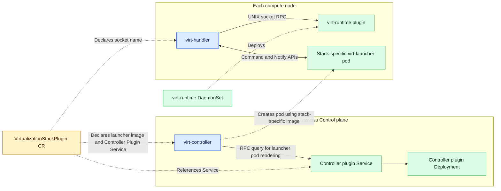
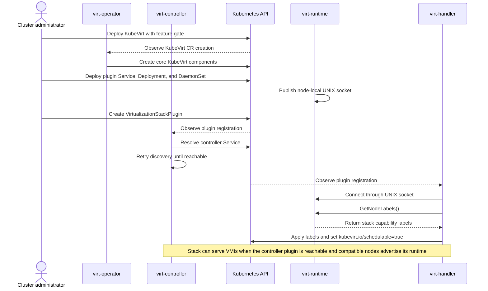

# VEP 82: Plugin-based generalization of KubeVirt's virtualization stack #82

## Release Signoff Checklist

Items marked with (R) are required *prior to targeting to a milestone / release*.

- [ ] (R) Enhancement issue created, which links to VEP dir in [kubevirt/enhancements] (not the initial VEP PR)
- [ ] (R) Target version is explicitly mentioned and approved
- [ ] (R) Graduation criteria filled

## Overview

At present KubeVirt can only be used to create and manage virtual machines (VMs) via Libvirt on the QEMU virtual-machine monitor (VMM), with only the hypervisor being configurable between KVM and MSHV. However, this design is limited and hard to maintain because in the wider industry, there are an increasing number of VMMs and hypervisors available - such as Cloud Hypervisor, OpenVMM (VMMs) and HyperV (hypervisor). Adding and maintaining support for so many backends in-tree in the core KubeVirt repository would make the code difficult to maintain. Furthermore, the dependence of KubeVirt on LibVirt forces any VMM that could be used to have a LibVirt driver, which is untenable.

Therefore, to maximize the adoption of alternative virtualization stacks within KubeVirt, the most preferable design is to decouple it entirely from the underlying virtualization stack components - and make the virt-stack pluggable. Core KubeVirt would provide the orchestration-related functionalities and offload virtualization-related functionalities to the plugin.

This VEP builds on the Hypervisor Generalization VEP ([#98](https://github.com/kubevirt/enhancements/pull/98)) and continues the discussion carried out in [VEP #83](https://github.com/kubevirt/enhancements/pull/83).

## Motivation

There are multiple reasons to decouple KubeVirt from the underlying virtualization stack components.

- Customer scenarios require different virtualization stack components: Given the increasing number of virtualization stack components available today, different customers of KubeVirt would require specific components to cater to their unique needs. Decoupling KubeVirt from Libvirt/QEMU would allow them to use their preferred virtualization stack components.

- Limitations and overhead imposed by Libvirt: Libvirt is a management wrapper which executes functions in its API by calling into the underlying VMM. Such functions can be directly invoked against the VMM by virt-launcher, thereby saving the overhead imposed by the Libvirt daemon. The use of Libvirt as the intermediate VM management layer restricts the virtualization stacks that can be used to only those that have a Libvirt driver. For example, OpenVMM does not have a Libvirt driver, and hence cannot be easily integrated into KubeVirt. Libvirt is implemented in C, and a programming language providing easier memory safety would reduce security risks. The plan for incorporating Rust into Libvirt has had relatively slow progress.
Furthermore, although libvirt provides a useful unified Domain definition across virtualization stacks, it is redundant in the presence of KubeVirt’s own VirtualMachineInstance definition.
Additionally, KubeVirt only utilizes around 20% (~57/292) of all the Libvirt APIs available –leaving Libvirt significantly underutilized while virt-launcher still incurs the overhead of running the Libvirt daemon.

- Maintaining multiple virtualization stacks in-tree is unmaintainable: Implementing support for different virtualization stacks directly in the core KubeVirt repository would significantly increase code complexity, testing burden, and maintenance overhead. A plugin-based architecture allows each virtualization stack implementation to be developed and maintained independently, reducing the maintenance burden on the core KubeVirt project.

### Areas of Tight Coupling Between KubeVirt and Libvirt/QEMU/KVM

- KubeVirt’s virt-launcher is built for Libvirt/QEMU: Although interaction with virt-launcher takes place through well-defined interfaces (CmdServer and NotifyServer), it is not possible to build a virt-launcher component wherein the implementation of those interfaces can be backed by an alternative virtualization stack.

- Libvirt domain XML’s mirror `api.Domain` data structure: KubeVirt thoroughly uses the api.Domain data structure to internally represent a virtual machine instance. This definition is meant to mirror Libvirt’s domain definition.

- Node Labeling involves invoking Libvirt’s QEMU driver: During the initialization of KubeVirt’s virt-handler component on a given node, it generates labels for that node based on the node’s virtualization capabilities. The virt-handler component queries node’s virtualization capabilities by running a virt-launcher container and invoking multiple Libvirt APIs, which in turn query the QEMU VMM. In addition to virtualization capabilities, the node topology is also queried from Libvirt, although that is not tied to the virtualization stack nor used for node labeling.

- Hardcoded Libvirt/QEMU/KVM-specific values in control-plane components: Code of components such as virt-controller and virt-handler contain hardcoded references to one of Libvirt, QEMU or KVM/MSHV. For instance, for computing the memory overhead of the virt-launcher's components, the `LauncherHypervisorResources` interface implementations for both KVM and MSHV assume the presence of a LibVirt daemon and QEMU process in the virt-launcher. Another example is when the virt-handler is called to update the `memlock` limit of a VM's VMM process, and it explicitly looks for a `virtqemud` or `qemu-system-x86` process.

- Libvirt/QEMU-specific guest agent status determination: Virt-Handler checks the state of the Libvirt channel "org.qemu.guest_agent.0” to determine if the guest agent is connected. It also assumes that the guest agent is QEMU Guest Agent and compares the list of supported commands with the set of required commands to determine if the agent is supported.

## Relationship to KubeVirt Structured Plugins

KubeVirt Structured Plugins provide extension points for adding out-of-tree functionality to specific parts of KubeVirt. They augment the behavior of the core implementation rather than replace its virtualization stack.

Virtualization stack plugins define a different boundary: they replace the Libvirt/QEMU-specific implementation across the relevant KubeVirt components with an implementation for another virtualization stack.

The mechanisms are therefore orthogonal. A virtualization stack plugin supplies the base VMM and runtime integration, while Structured Plugins may extend the functionality of whichever virtualization stack is selected.

## Goals

- It should be possible to have multiple VMs based on different virtualization stacks running on the same node. For example, a single node with the KVM hypervisor should be able to host a VM backed by traditional LibVirt/QEMU backend as well as a VM backed by Cloud-Hypervisor.

- Refactor KubeVirt to allow the development of alternative variants of the virt-launcher component for different virtualization stacks.

- Refactor KubeVirt to decouple it from Libvirt, QEMU and KVM.

- Introduce a dedicated `VirtualizationStackPlugin` CRD for selecting and configuring virtualization stack plugins.

- Streamline the process of building and deployment of KubeVirt for alternative virtualization stacks.

- Ensure backward compatibility with existing KubeVirt deployments. Cluster administrators must be able to upgrade to the latest version of KubeVirt incorporating the proposed changes, while retaining the ability to create virtual machines using the default Libvirt/QEMU/KVM-based architecture without requiring API modifications.

## Non Goals

- Implementation of the proposed plugin components (e.g., virt-launcher and admission webhooks) for alternative virtualization stacks.

## Definition of Users

The proposed plugin-based virtualization stack architecture is intended for advanced users and integrators of KubeVirt who require flexibility beyond the default Libvirt/QEMU-based stack. This includes:

- Platform engineers and infrastructure teams deploying KubeVirt in environments where alternative virtualization stacks (e.g., Cloud Hypervisor, Firecracker) are preferred due to performance, security, or hardware compatibility requirements.

- Distributors and downstream projects that package KubeVirt as part of a larger platform and need to support multiple hypervisor backends.

## User Stories

### The Platform Operator (Infrastructure Admin)

- User Story: "As a platform operator, I want to deploy lightweight microVMs (e.g., Cloud Hypervisor) alongside standard workloads to increase tenant density and reduce resource overhead on my nodes."

- Benefit: Flexibility to choose the virtualization stack that best fits the hardware and performance requirements of the organization without maintaining multiple orchestration platforms.

### The Virtualization Stack Developer (Backend Provider)

- User Story: "As a developer of a new virtualization backend, I want to integrate my VMM into KubeVirt without having to modify the KubeVirt core codebase or upstream my VMM-specific logic to the main repository."

- Benefit: Accelerated development cycles and independent release cadences for backend plugins.

### The Infrastructure Developer (KubeVirt Core Maintainer)

- User Story: "As a KubeVirt maintainer, I want to reduce the complexity of the core codebase by offloading VMM-specific implementation details to external plugins, allowing the core to focus on Kubernetes-native orchestration."

- Benefit: Reduced technical debt and a more stable, maintainable core API that is not tightly coupled to libvirt/QEMU lifecycle quirks.

## Repos

- Core KubeVirt repo: [kubevirt/kubevirt](https://github.com/kubevirt/kubevirt)

- Additional repositories containing implementation of plugin components (e.g., virt-launcher and admission webhooks) for alternative virtualization stacks.

## Proposed Design

This VEP defines the top-level design direction for introducing a plugin-based virtualization stack model in KubeVirt. Because this effort requires a broad refactoring of tightly coupled areas in the KubeVirt codebase, it is not practical to capture all detailed design changes in a single document.

Therefore, this VEP serves as a tracking VEP for a set of smaller, focused VEPs. Each of those VEPs will propose and document the detailed design for one specific area of tight coupling in KubeVirt (for example, virt-launcher pod rendering, privileged operations against the VM, discovering node capabilities for label generation.).

The intent is to keep this document focused on overall architecture and coordination, while delegating implementation-level design details to targeted follow-up VEPs.

This section will walk through each key component of KubeVirt that performs virtualization stack related functions - listing the areas of tight-coupling with the traditional stack and proposing plugin API for extension.

### Architecture Overview

Several KubeVirt components are tightly coupled to the default Libvirt/QEMU/KVM virtualization stack. This proposal moves stack-specific logic behind plugins used by `virt-controller` and `virt-handler`, and makes `virt-launcher` a stack-specific component. The controller plugin is exposed through a Kubernetes Service backed by a Deployment. The node-local `virt-runtime` plugin is deployed as a DaemonSet, providing an instance on each node for `virt-handler` to invoke.



| Style | Meaning |
| --- | --- |
| Blue | Core KubeVirt component |
| Green | Stack-specific component supplied by the plugin provider |
| Yellow | Virtualization stack registration |

### Virt-Controller

#### Current tight-coupling with LibVirt/QEMU

`virt-controller` invokes virtualization-stack-specific logic when rendering the `virt-launcher` pod. That includes the calculation of the memory overhead of virtualization components (e.g., `virtqemud` and `virtlogd`) and the specification of pod properties (e.g., command and arguments, volume mounts and run-as user). Below is a list of such examples:

- Launcher image, command-line and environment variables. The launcher command-line/env-vars would be used for selecting virtualization-stack-specific settings like firmware, timeouts, etc.

    ```yaml
    command:
    - /usr/bin/virt-launcher-monitor
    args:
    - --qemu-timeout
    - 345s
    - --ovmf-path
    - /usr/share/edk2/ovmf
    - --hypervisor
    - hyperv-direct
    image: quay.io/kubevirt/virt-launcher:v1.9.0
    ```

- Devices that should be requested by the pod. E.g., `/dev/kvm`

    ```yaml
    resources:
    limits:
        devices.kubevirt.io/mshv: "1"
    requests:
        devices.kubevirt.io/mshv: "1"
    ```

- Virt-stack-specific volumes and volume mounts (e.g., `libvirt-runtime`)

  ```yaml
  volumeMounts:
  - mountPath: /var/run/libvirt
    name: libvirt-runtime
  volumes:
  - emptyDir: {}
    name: libvirt-runtime
  ```

- Security Context and Container Capabilities.

    ```yaml
    securityContext:
        allowPrivilegeEscalation: false
        capabilities:
        add:
        - NET_BIND_SERVICE
        drop:
        - ALL
        runAsGroup: 107
        runAsNonRoot: true
        runAsUser: 107
    ```

- Node Selectors specific to the Virtualization Stack, e.g., CPU Model.

```yaml
machine-type.node.kubevirt.io/pc-q35-7.2: "true"
```

#### Virt-Controller Plugin API

We propose exposing a common plugin contract through which `virt-controller` consisting of the following RPC functions:

- GetLauncherOverhead
- GetLauncherImage
- GetLauncherCommand: returns command and args
- GetAdditionalVolumes: returns volumes to add and their corresponding mounts
- GetLauncherCapabilities: additional capabilities to add to virt-launcher container
- GetRunAsUserGroup
- GetNodeSelectors: additional node-selectors to be added

#### Virt-Controller Plugin Deployment Model

The plugin will be reached through the cluster Service declared by the `VirtualizationStackPlugin` CRD. The detailed VEP for virt-controller plugin will describe timeout and retry behavior, and caching results for a given plugin service.

### Virt-Handler

#### Current tight-coupling with LibVirt/QEMU

`virt-handler` owns Kubernetes-facing, node-local VMI orchestration, but several parts of its current runtime model assume that every launcher uses Libvirt and QEMU. The main areas of coupling are:

- **Migration endpoints and transport:** `virt-handler` performs the communication setup for LibVirt to carry out migration. It assumes that the source and target would communicate on ports 49152 and 49153 and that is aware of the UNIX socket in virt-launcher for controlling LibVirt. It also repairs passt sockets below a fixed Libvirt/QEMU runtime directory.
- **Process discovery and resource adjustment:** The KVM and MSHV `VirtRuntime` implementations search for `qemu-system-*` or `virtqemud` processes before applying limits such as `memlock`. The MSHV implementation therefore changes the hypervisor selection without removing the QEMU and Libvirt process model.
- **CPU housekeeping:** CPU tuning intent is read from `api.Domain`, but the implementation discovers QEMU vCPU, emulator, and PIT threads and applies affinity according to QEMU's thread model.
- **Guest-agent and status interpretation:** Guest-agent is assumed to be connected via the LibVirt channel.
- **LibVirt-oriented data structures** like `api.Domain` and `DomainStats` are used throughout the code for runtime representation of a running VM and the metrics reported by LibVirt.

The `VirtualMachineController` itself is not inherently tied to the current stack. Its core state machine observes a VMI and a domain, decides whether to synchronize, shut down, kill, migrate, or clean up the VMI. It either communicates with the corresponding `virt-launcher` via the `Command` API or reports results to Kubernetes. 

#### Virt-Runtime Plugin API

We propose the following RPC calls to be exposed by the `Virt Runtime` - which is what we call the plugin to `virt-handler`:

- `AdjustVMIResources`: resource adjustments for VMIs (e.g., memlock limit update)
- `HandleHousekeepingResources`: managing resource/cgroup allocation of housekeeping components
- `GetHypervisorDevice`: return the shared hypervisor device required by the stack on this node, if any
- `GetMigrationEndpoints`: return a list of UNIX sockets to which migration control and data will flow. The handler will then launch proxies listening on TCP ports for TLS connections and connected to the returned UNIX sockets.

#### Hypervisor Device Plugin Ownership

Kubernetes device-plugin registration for shared, non-exclusive hypervisor devices such as `/dev/kvm` and `/dev/mshv` remains owned by `virt-handler` core. A `virt-runtime` plugin probes local devices at startup and reports its required hypervisor device through `GetHypervisorDevice`; it never registers directly with kubelet.

The device-plugin broker in `virt-handler` aggregates reports from all runtimes on the node, deduplicates devices required by multiple stacks, and is the sole component that advertises them to kubelet. For example, two KVM-based stacks requiring `/dev/kvm` produce one device-plugin registration. This allows multiple stacks to share the same non-exclusive hypervisor device on a node.

Exclusive or per-instance devices, such as VFIO passthrough devices, are outside this mechanism. They continue to use the standard Kubernetes or SR-IOV device-plugin path and are requested through pod specifications generated by the `virt-controller` plugin.

Live migration should retain its existing high-level responsibility split. The source and target `virt-handler` instances will continue to prepare storage, networking, and devices, enforce migration policy, coordinate ownership transfer, and publish Kubernetes status. The `virt-runtime` plugin for the selected stack will replace the fixed Libvirt ports, Unix sockets, and passt paths by setting up the required TLS-protected endpoints to the VMM, coordinating the migration data channels, and reporting transport status to `virt-handler` through a well-defined API. 

Regarding data structures, we should continue using `api.Domain` and `DomainStats`. Although they originated to represent Libvirt's data structures, they are sufficiently general to represent information for other stacks. Each launcher plugin is responsible for translating between its native VMM's representations and these data structures.

#### Deployment Model for `Virt Runtime`

The Virt Runtime plugin will be deployed as a DaemonSet, with one instance running on each node. It will listen on a UNIX socket that will be advertised to KubeVirt via the VirtualizationStackPlugin custom resource. This deployment model is similar to that of the Node Hook structured plugin.


### Pluggable Node Labeler

We propose moving virtualization-stack-specific capability discovery and node label generation out of the `virt-handler` core and into the `Virt Runtime` plugin introduced above. Instead of `virt-handler` core knowing about the types of node labels to expect from the `virt-runtime` plugin, it would be oblivious and simply apply all the node labels that are returned by the `GetNodeLabels()` RPC call served by the plugin. This allows a plugin to expose capabilities that KubeVirt does not know about in advance, including stack versions and preview features, without extending an in-tree interface for each new label.

In the future, when multiple virtualization stacks on the same node could be considered, collision of node labels from different stacks is possible. To avoid this, the `virt-handler` core would use the name of the virtualization stack (e.g., `libvirt-qemu-kvm`) as the prefix of the node label.

It is important to node that the node labels generated by the `virt-runtime` plugin will need to be referenced by the Node Selectors assigned to `virt-launcher` pods by the `virt-controller` plugin. However, since both these plugins would be implemented by the same developer, they are expected to be consistent with each other in terms of the node labels they use for describing different virtualization capability.

#### Node Labeler Plugin API

There is no distinct node labeler plugin because that functionality would instead by offered by the `Virt Runtime` plugin. It would expose the function `GetNodeLabels()` which would return a 

### Refactoring Virt-Launcher to make it pluggable

We propose making the entire `virt-launcher` component pluggable. Each virtualization stack would provide its own `virt-launcher` implementation and container image, allowing stack-specific VM lifecycle and VMM integration code to be developed and released outside the core KubeVirt repository.

`virt-handler` would continue to interact with a plugin `virt-launcher` through the existing Command and Notify APIs. Within the plugin, the `CmdServer` implementation acts as a shim over that plugin's `DomainManager` implementation, translating Command API calls into stack-specific domain operations. Furthermore, the `virt-launcher` would contain a `NotifyClient` that would send `DomainEvents` and `K8sEvents` to the `virt-handler`.

The Command API and the Notify API are the communication boundary used by `virt-handler`, while `DomainManager` and `NotifyClient` implementations are provided by the plugin.

It is important to note that in this design proposal, we propose to continue using Libvirt-oriented data structure `api.Domain` for representing a running virtual machine.


#### Virt-Launcher Plugin API

The `virt-launcher` plugin will run the Command API server listening on a UNIX socket (also visible to the `virt-handler`). It will also run the Notify Client and connect to the Notify UNIX socket. Both these APIs will be part of the `virt-launcher` plugin SDK.

### Pluggable Admission Webhooks

Stack-specific mutating and validating webhooks will be deployed as independent Kubernetes Services and selected through the `VirtualizationStackPlugin` CRD. The `virt-operator` will register and reconcile their webhook configurations with the Kubernetes API server.

## VirtualizationStackPlugin CRD

This section will define the cluster-scoped `VirtualizationStackPlugin` CRD that registers each virtualization stack and provides KubeVirt core components with the information needed to select and invoke its plugins.

```yaml
apiVersion: virstackplugin.kubevirt.io/v1alpha1
kind: VirtualizationStackPlugin
metadata:
  # The resource name is the stable stack ID referenced by VMIs.
  name: cloud-hypervisor-mshv
spec:
  controller:
    service:
      namespace: cloud-hypervisor-system
      name: cloud-hypervisor-controller-plugin
      port: 9443
  runtime:
    # Resolved below a KubeVirt-owned runtime directory on each node.
    socketName: cloud-hypervisor-mshv.sock

  launcher:
    image: quay.io/company-x/virt-launcher:clh-mshv
```

A cluster administrator creates the `VirtualizationStackPlugin` resource after deploying the plugin components. The resource registers endpoints and launcher information with KubeVirt; it does not deploy or manage those components. In the initial design, consuming KubeVirt components (such as `virt-controller` and `virt-handler`) independently resolve the plugin endpoints and report invocation or availability failures through events and/or conditions on the affected resources (e.g., VMI).

### Deployment and Readiness Lifecycle

During the alpha stage, this architecture is enabled through the `PluggableVirtualizationStack` feature gate. The deployment proceeds as follows:

1. The cluster administrator deploys KubeVirt with the feature gate enabled. Core components start and remain ready while waiting for a virtualization stack to be registered.
2. The administrator deploys the stack-provided components: the controller plugin Deployment and Service, the `virt-runtime` DaemonSet, the launcher image, and any optional admission webhooks.
3. The administrator creates a `VirtualizationStackPlugin` resource containing the controller Service, node-local runtime socket name, and launcher image. Plugin workloads and the registration may be created in either order because discovery is retried.
4. `virt-controller` watches the registration, repeatedly resolves the referenced Service, and negotiates a compatible plugin API. If the plugin is unavailable, `virt-controller` remains ready, but launcher pod rendering for VMIs selecting that stack fails and is retried with an event or condition reported on the VMI.
5. Each `virt-handler` discovers the registered runtime through its published UNIX socket, negotiates a compatible API, calls `GetNodeLabels()`, and applies the returned labels to its node. A failure to discover the required runtime keeps the existing `kubevirt.io/schedulable` label set to `false`; successful discovery allows it to be set to `true`.



When multiple stacks can be independently available on the same node, stack-specific availability labels will supplement `kubevirt.io/schedulable`. Failure of one runtime will then prevent scheduling only VMIs that select that stack, rather than making the node unavailable to every stack.

## Alternate Design Choices Considered

### Virt-Controller Plugin Deployment Alternatives

Two deployment models were considered for the `virt-controller` plugin.

#### Design 1: Cluster Service

The plugin runs in an independent Deployment and is exposed through the Kubernetes Service referenced by the `VirtualizationStackPlugin` resource. This allows the plugin to be installed, scaled, and upgraded independently of `virt-controller`.

#### Design 2: Virt-Controller Sidecar

The plugin runs as a sidecar container in each `virt-controller` pod. This avoids network calls through a cluster Service, but couples the plugin's lifecycle, scaling, and failure domain to `virt-controller` and requires changing the `virt-controller` pod whenever a plugin is installed or upgraded.

#### Virt-Controller Deployment Decision

We choose Design 1. Cluster API (CAPI) demonstrates that external RPC servers can be used successfully as extension hooks. The Service-based model also preserves the independent lifecycle of stack plugins and avoids modifying the core `virt-controller` deployment for each installed stack.

### Virt-Launcher Virtualization Stack Boundary

Two designs were considered for introducing pluggable virtualization stacks into `virt-launcher`.

#### Design 1: Make the Entire Virt-Launcher Pluggable

In this design, each virtualization stack supplies a complete `virt-launcher` implementation. The plugin implements the existing command RPC API used by `virt-handler` and translates those operations directly into the interfaces of its virtualization stack. No particular intermediate management layer or VM representation is required inside the plugin.

For example, a QEMU-, Cloud Hypervisor-, or OpenVMM-based plugin could convert the VMI directly into the command line, configuration, or API representation expected by its VMM. A plugin may still choose to use Libvirt internally when that is beneficial, but Libvirt is an implementation choice rather than part of the KubeVirt plugin contract. The command RPC API remains the stable integration boundary between KubeVirt and the plugin.

#### Design 2: Retain Libvirt as the Common Management Layer

An alternative is to retain the existing Libvirt-based `virt-launcher` and make only the stack-dependent portions within it pluggable. The VMI converter, Libvirt domain representation, event notification pathway, and much of the current lifecycle implementation could remain shared. Stack-specific extensions would customize the generated Libvirt domain XML and related behavior for the selected Libvirt driver, for example the QEMU or Cloud Hypervisor driver.

This design follows Libvirt's original purpose: providing one management API and domain representation across multiple virtualization technologies. It would preserve a substantial amount of the current `virt-launcher` implementation and could reduce the initial work required for stacks already supported by Libvirt. Operations such as live migration could also be delegated to Libvirt instead of being implemented independently by each plugin.

However, the common interface would also make Libvirt, rather than the Command and Notify RPC APIs, the effective compatibility boundary for every virtualization stack. A stack could only participate if it had a sufficiently complete Libvirt driver, and KubeVirt features would depend on how quickly that LibVirt driver exposed new stack capabilities.

#### Decision

We choose Design 1, making the entire `virt-launcher` pluggable. The principal reasons are:

- **Support for stacks without Libvirt drivers:** OpenVMM and Firecracker do not have Libvirt drivers, and future virtualization stacks may make the same choice. Requiring Libvirt would exclude such stacks or require their maintainers to first build and maintain a Libvirt driver, significantly raising the cost of integrating with KubeVirt.

- **Independent feature delivery:** Even when a Libvirt driver exists, new VMM capabilities must first be represented in Libvirt's API and domain XML before a KubeVirt plugin can use them. Direct integration allows plugin maintainers to expose stack features and fixes on their own release cadence, without waiting for changes to propagate through an additional project and abstraction layer.

- **Mismatch with KubeVirt's process model:** Libvirt is designed to manage multiple domains on a host, whereas each KubeVirt `virt-launcher` pod runs a dedicated Libvirt instance that manages a single VMI. KubeVirt therefore pays for a general-purpose, multi-domain management daemon without using one of its primary architectural benefits.

- **Resource overhead:** A Libvirt daemon and its supporting processes consume memory in every `virt-launcher` pod. Removing this mandatory layer lets lightweight VMM plugins preserve their resource-density advantages and makes the per-VMI overhead proportional to the selected stack.

- **Reduced mandatory trusted code:** Libvirt is implemented primarily in C and adds a large, memory-unsafe codebase to every launcher pod. Design 1 does not guarantee that plugins are memory-safe, but it avoids requiring this particular component and allows a plugin to minimize its runtime dependencies and attack surface.

- **Stack-specific images are required in either design:** Launcher images must contain only the VMM binaries, libraries, configuration, and supporting tools required by their target stack. The build and release system must therefore learn to combine shared KubeVirt interfaces with stack-specific artifacts regardless of whether Libvirt is retained. Once that packaging and build refactoring is required, keeping Libvirt provides less of an implementation advantage than it initially appears to.

- **Clear ownership and abstraction boundary:** Making the command RPC API the contract allows core KubeVirt to own orchestration semantics while each plugin owns its complete VM lifecycle implementation. This avoids leaking Libvirt XML, driver capabilities, and version-specific behavior into a nominally stack-neutral interface.

The main cost of Design 1 is that functionality currently supplied by Libvirt, most notably lifecycle event handling and live migration execution, cannot automatically be reused by every stack. Each plugin must implement those semantics using the facilities of its VMM, and conformance tests will be needed to ensure consistent behavior at the command API boundary. This is considered an acceptable tradeoff: stacks differ in migration capabilities and operational models, so a common KubeVirt contract should define the required behavior while allowing each plugin to implement it natively. The existing Libvirt/QEMU launcher can continue to use Libvirt internally and reuse its current migration path, preserving backward compatibility without imposing Libvirt on other plugins.

## Testing Strategy

### Conformance Test Suite

A standalone conformance test suite will validate a plugin's gRPC surface directly without requiring a live KubeVirt cluster. It will verify schema compliance, error codes for invalid input, operation idempotency, and behavioral invariants. For example, calling `AdjustVMIResources` twice for the same VMI must be safe, and `GetNodeLabels()` must return key-value pairs in the expected format.

Following precedents such as CSI Sanity and CNI conformance testing, this suite will allow third-party plugin authors to self-certify implementations before integrating with a cluster, without requiring KubeVirt core team involvement or CI access.

### End-to-End and Functional CI

The main KubeVirt functional and end-to-end regression suite will continue to run against the default Libvirt/QEMU plugin. That is to say that KubeVirt will continue to treat LibVirt/QEMU/KVM as the primary virtualization stack and upstream releases will contain components that work with it. 

### Mock Plugin

Unit and controller-level tests will use a mock plugin only to verify that `virt-controller` and `virt-handler` invoke the expected RPC, such as `GetLauncherOverhead` or `AdjustVMIResources`, at the correct point and with the correct arguments. These tests verify dispatch, not realistic alternate behavior or behavioral divergence between stacks.

## Backward Compatibility

The design must preserve two invariants:

1. With the `PluggableVirtualizationStack` feature gate disabled, KubeVirt behavior must be identical to pre-VEP KubeVirt.
2. Upgrades must not disrupt already-running VMs.

`virt-operator` upgrades the `virt-handler` DaemonSet and `virt-controller` Deployment but does not recreate existing `virt-launcher` pods. A VM started before an upgrade may therefore continue running its original, pre-plugin-architecture `virt-launcher` until it stops, restarts, or migrates. A new `virt-handler` must continue to manage such launchers. This is an existing KubeVirt version-skew concern, but the plugin refactor must explicitly preserve it.

The Command and Notify APIs remain the stable, unchanged wire boundary between `virt-handler` and `virt-launcher`, whether the launcher is the pre-plugin implementation or a stack-specific image. Plugin dispatch in `virt-handler` is a control-plane decision and does not change communication with an already-running launcher.

This VEP introduces one additional rollout risk: a node may receive a new `virt-handler` before its `virt-runtime`, or a selected stack's plugin, is ready. During Alpha, if the feature gate is enabled but no plugin is registered or ready for a stack, `virt-handler` falls back to the internal default function. This provides graceful degradation during rollout windows.

Required compatibility coverage includes:

- A mixed-version test in which a new `virt-handler` manages a pre-plugin-refactor `virt-launcher`, verifying unchanged Command and Notify API behavior.
- A migration test in which a VM with a pre-plugin `virt-launcher` migrates to a node running the new `virt-handler`, verifying that the target uses the same stack and image as the source.
- A rolling-upgrade test that upgrades the `virt-handler` DaemonSet while live VMs run on old and new nodes, verifying that no VM is disrupted.

## Graduation Requirements

### Alpha

- [ ] Refactor the default Libvirt/QEMU/KVM logic in `virt-controller` and `virt-handler` into self-contained internal functions, one per capability that will become a plugin RPC, without changing behavior. Existing end-to-end tests must pass unmodified before introducing dispatch.
- [ ] Introduce the `PluggableVirtualizationStack` feature gate and guard all plugin-dispatch paths with it.
- [ ] Define and register the `VirtualizationStackPlugin` CRD.
- [ ] Implement conditional dispatch in `virt-controller` and `virt-handler`: invoke the internal default function when the feature gate is disabled or no matching plugin is registered, and otherwise route the call to the plugin.
- [ ] Verify through an explicit regression test that disabling the feature gate preserves pre-VEP behavior.
- [ ] Verify that enabling the feature gate without registering a plugin continues to resolve VMIs through the default-function fallback.
- [ ] Implement a second virtualization stack plugin, such as Cloud Hypervisor, including its controller plugin, `virt-runtime`, and stack-specific `virt-launcher`. Verify end-to-end functionality.
- [ ] Add mock-plugin call-verification tests for `virt-controller` and `virt-handler` as described in the Testing Strategy.
- [ ] Provide a conformance test suite and ensure the new plugin passes it.
- [ ] Continue running end-to-end CI against the default virtualization stack with the feature gate both enabled and disabled, with no regressions.

### Beta

To be defined in a follow-up revision.

### GA

To be defined in a follow-up revision.

## Open Questions

- How should registration be authenticated or restricted so that only plugins deployed by authorized cluster administrators can advertise labels for a virtualization-stack ID?

- Should we remove LibVirt/QEMU functionality from KubeVirt core and make it a default plugin built and released by KubeVirt upstream? Or should we keep that functionality in-tree, while refactoring KubeVirt to allow invoking an alternate virtualization stack?

- Should admission webhooks be defined separately for each virtualization stack, or should virtualization stacks reuse the existing Structured Plugins mechanism?

- What should happen if `virt-handler` is rolled back to a pre-plugin-architecture version after VMs have been created using a plugin-based virtualization stack? The rolled-back `virt-handler` has no knowledge of plugin dispatch and cannot manage those VMs.

- Should the VMI-level stack-selection field, such as `spec.virtualizationStack`, be introduced by this VEP or deferred to a follow-up VEP covering multiple virtualizations stacks in the same cluster or node?

- How should we deal with the possibility of increasing the number of RPC calls in the Plugin APIs - which is expected to happen with new features?

- Are `api.Domain` and `DomainStats` data structures really general enough to capture a VM's running state in many alternate virtualization stacks? This should be validated against multiple plugin implementations.

- Should `GetHypervisorDevice` return one device or a list of devices? Candidate stacks such as Cloud Hypervisor and OpenVMM should be checked for requirements involving multiple host devices, or no hypervisor device, before the RPC is finalized at Beta.

- How should plugin absence and unreachability affect a VMI? If no `VirtualizationStackPlugin` exists for the requested stack, the cause is a static configuration error that could be rejected at admission time. If a matching resource exists but its endpoint is temporarily unreachable, reconciliation should retry with backoff. These cases should have distinct condition reasons and may require different escalation-to-`Failed` policies.
