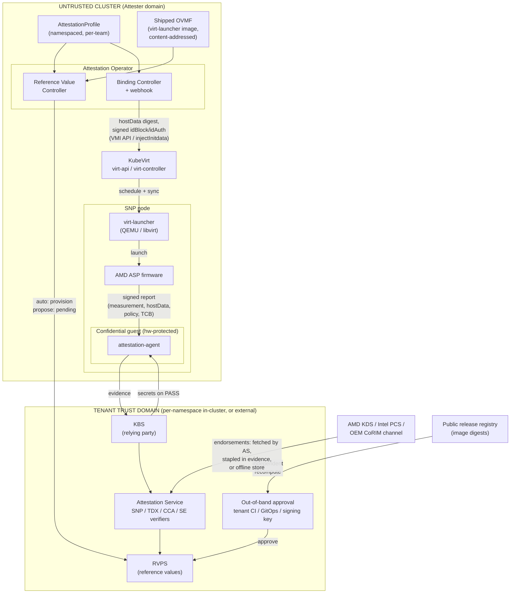
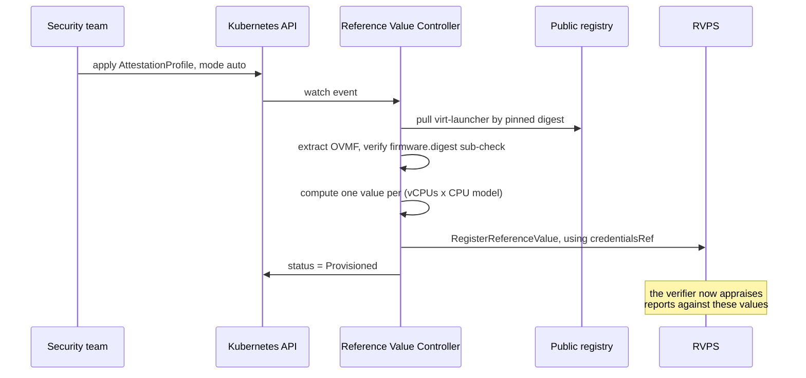
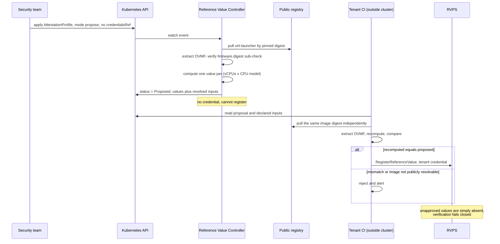

# VEP #NNNN: KubeVirt Attestation Operator

Author: Alan Caldelas (AMD)

Related: VEP #80 (TDX and SEV-SNP enablement), VEP #340 (initdata injection, kubevirt/enhancements#346)

## VEP Status Metadata

### Target releases

- This VEP targets alpha for version:
- This VEP targets beta for version:
- This VEP targets GA for version:

### Release Signoff Checklist

Items marked with (R) are required *prior to targeting to a milestone / release*.

- [ ] (R) Enhancement issue created, which links to VEP dir in [kubevirt/enhancements] (not the initial VEP PR)
- [ ] (R) Alpha target version is explicitly mentioned and approved
- [ ] (R) Beta target version is explicitly mentioned and approved
- [ ] (R) GA target version is explicitly mentioned and approved

## Overview

VEP #80 enables launching CVMs (Confidential VMs; AMD SEV-SNP today, Intel TDX in progress) but explicitly declares attestation infrastructure a non-goal. As a result, users can launch a CVM but have no supported path to verify that it is one. This proposal introduces an attestation operator, a separate project under the kubevirt org, that bridges KubeVirt and existing attestation services following the [IETF RATS](https://datatracker.ietf.org/doc/html/rfc9334) model. The operator is TEE (Trusted Execution Environment) class pluggable from day one: AMD SEV-SNP, Intel TDX, Arm CCA, and IBM Secure Execution.

The operator does not implement evidence verification and does not deploy a key broker. Verification is delegated to an attestation service (CoCo Trustee is the reference backend; it ships verifiers for SNP, TDX, CCA, and SE). The operator's job is the KubeVirt-specific glue that no existing project provides: generating reference values from KubeVirt's domain rendering, and binding VMIs to attestation profiles. Cluster-side configuration is declared in a namespaced **AttestationProfile** CRD, authored once per trust domain by a security or platform team and selected by reference by workload owners.

## Motivation

Remote attestation is what makes confidential computing meaningful. Without it, memory encryption is a claim the platform makes about itself. The verification-side ecosystem exists (Trustee, Veraison), but there is a gap between "a KBS (Key Broker Service) is running" and "this KubeVirt VM can be attested":

1. Reference values must be computed from artifacts only KubeVirt controls. An SNP launch digest depends on the exact OVMF binary shipped in virt-launcher, kernelHashes, vCPU count, and CPU model (VMSA pages are measured per vCPU). An Arm CCA Realm Initial Measurement additionally covers the entire VM configuration (vCPUs, memory, device layout). Today the workflow is a human extracting firmware from a container image and running sev-snp-measure by hand, repeated on every KubeVirt upgrade or VM spec change. This does not scale and is error prone.
2. The VMI-side binding surface is unusable without tooling. Launch-time fields like hostData, idBlock, and idAuth require computing launch digests and performing ECDSA signing. No user hand-crafts an idBlock. VEP #340 provides the injection plumbing and explicitly leaves the component that computes and injects the values out of scope; this operator is that component.

Two paths meet at the verifier and must stay independent. The evidence path (node, hardware, signed report) says what is running. The reference path (supply chain, profile, expected measurement) says what should be running. Verification is the comparison between them. Deriving expectations from the running node collapses the two paths into one, after which the check always passes and proves only that the TEE is switched on. This VEP's design principle follows directly: reference values are compiled from inputs declared in the profile and anchored to release artifacts; nothing observed on a node ever becomes an expectation.

## Goals

- Provide a reference value generation controller that computes expected measurements for CVMs from the same inputs KubeVirt uses to render the libvirt domain, and provisions them into the configured attestation service (e.g. Trustee RVPS, the Reference Value Provider Service).
- Provide VMI binding: associate a VMI with an AttestationProfile, populate launch-time binding fields (SNP hostData digest, signed idBlock/idAuth), and surface attestation-relevant status.
- Define a TEE-class plugin interface so SNP, TDX, CCA, and SE differences are contained in per-vendor providers behind a vendor-neutral API.
- Support shared, per-namespace, and external attestation service topologies. The operator consumes endpoint references; it does not own service lifecycle.

## Non Goals

- Implementing evidence verification. Verifiers are delegated to the attestation service ([Trustee AS](https://github.com/confidential-containers/trustee/tree/main/attestation-service), Veraison).
- Deploying or managing the KBS/AS lifecycle. That is the trustee-operator's job, or the tenant's if they run an external KBS. Rationale: a relying party inside the cluster it is judging weakens the trust model; external endpoints must be first-class. (CI test scaffolding that stands up an in-cluster Trustee is exempt: test tooling, not product surface.)
- Managing hardware endorsements or verifier collateral. Every Trustee verifier already sources its own through attestation service configuration (SNP: KDS fetch with caching, a chain stapled into the evidence, or an offline store; TDX: Intel PCS/PCCS or an air-gapped file bundle; CCA: local stores or delegation to a remote Veraison), not through anything the cluster provides.
- Guest-side components. Guests use existing CoCo guest-components (attestation-agent, confidential-data-hub). The operator documents image requirements only.
- Live migration attestation semantics.
- Disk encryption / sealed secrets workflows (candidate for a later phase once the attestation loop exists).
- Prescribing the hostData/initdata delivery mechanism. This VEP consumes the surface VEP #340 provides and works under both of its models (static spec field, or the injectInitdata subresource); the binding semantics are aligned with the CoCo initdata format so the design holds under either.

## Definition of Users

- Cluster Admins: operate TEE-capable nodes and connect the cluster to attestation services. Endorsement sources are configured on the attestation service, not here.
- Platform Teams: host multiple tenants/teams in one cluster, each with independent trust anchors; author and own the attestation profiles their teams select.
- Workload Owners / Developers: select an existing attestation profile for their CVM. They never author measurement or verifier configuration and are not expected to understand per-vendor measurement formats.
- Relying Parties / Security Teams: possibly outside the cluster, consume attestation results and gate secret release; own profile content wherever the platform team does not.

## User Stories

- As a security team member, I want to author an attestation profile once per trust domain (service endpoint, trust anchor, pinned firmware and kernel digests, provisioning mode, signing keys) and have development teams select it rather than reconstruct it.
- As a developer, I want to reference an attestation profile my security team owns, by name on my VM, and have the expected launch measurement computed and provisioned automatically, so that my in-guest attestation-agent can retrieve secrets from the KBS without my knowing per-vendor measurement formats.
- As a developer, I want my VM's hostData populated with a digest of the relying-party configuration so the guest's attestation report is cryptographically bound to the intended KBS and its trust anchor.
- As a platform team, I want each tenant team to bind their profiles to their own Trustee deployment (in their namespace or external), with their own reference values and signing keys, without cluster-admin involvement.
- As a security team, I want reference values to update automatically when the cluster upgrades KubeVirt (new OVMF binary) so attestation does not silently break or, worse, silently pass against stale values.
- As a security team with a strict threat model, I want reference values computed in-cluster to require my approval before the verifier accepts them, and I want to be able to verify the underlying firmware bytes independently, so a compromised cluster cannot bless its own images.
- As a cluster admin on aarch64 (future), I want the same profile API to cover CCA realms once KubeVirt can launch them.

## Repos

- New: `kubevirt/attestation-operator` (proposed)
- `kubevirt/kubevirt`: minimal touch points only (status condition, consuming binding fields that land via VEP #340 and a separate VMI API VEP; see Design)

## Design

### Architecture (RATS mapping)

- Attester: the confidential guest (evidence generated by the AMD ASP (Secure Processor), Arm RMM, or Intel TDX module, delivered by the in-guest attestation-agent).
- Verifier: external attestation service (Trustee AS / Veraison). Out of scope.
- Relying Party: KBS. Out of scope for lifecycle; referenced by endpoint.
- Endorser: the silicon vendor. Endorsements reach the verifier through the attestation service's own paths.
- This operator: Reference Value Provider + Kubernetes-native binding and status.

### Component diagram



Key flows:

1. **Profile reconciliation.** A security team applies an AttestationProfile. The Reference Value Controller resolves the pinned inputs: it pulls the virt-launcher image by digest from the registry, extracts the OVMF and checks it against the `firmware.digest` sub-check, and resolves the kernel containerDisk when `kernelHashes` is enabled. It then computes one expected launch measurement per (vCPU count x CPU model) pair and either registers them in RVPS directly (auto mode) or publishes them with their inputs for out-of-band approval (propose mode). This happens once per profile revision or pinned-input change (including a KubeVirt upgrade), never per VMI.
2. **VMI binding and injection.** A workload owner creates a VMI referencing the profile. The Binding Controller resolves the association, computes the hostData digest of the relying-party configuration document, and delivers it through the VEP #340 surface: set statically in the spec at admission, or injected via the `snp/injectInitdata` subresource while the VMI is in the `Scheduled` phase with `startStrategy: Paused`, followed by unpause. When idBlock signing is configured, it also signs the expected launch digest with the profile-held key and injects idBlock/idAuth.
3. **Launch and measurement.** virt-launcher renders the libvirt domain and launches the guest. The ASP performs the launch measurement over exactly the pages QEMU constructs and reflects it, together with hostData, the guest policy bits, and TCB versions, in every signed attestation report the guest later requests. When an ID block is present, the ASP additionally refuses to start a guest whose measurement does not match, turning verification into launch-time enforcement.
4. **Attestation and secret release.** The in-guest attestation-agent obtains a signed report and presents evidence to the KBS. The Attestation Service appraises it against the vendor endorsement chain (which it sources itself; the operator is not on this path) and against the reference values in RVPS. On a pass, the KBS releases secrets to the guest. On any mismatch, including reference values that are simply absent because a proposal is unapproved, verification fails closed and nothing is released.

### Components

1. **Reference Value Controller.** Watches AttestationProfiles, and profile revisions only; it does not read VMIs to discover inputs. Computes expected measurements per TEE class:
   - SNP: launch digest from the stateless ROM-only OVMF shipped in virt-launcher plus kernelHashes and per-vCPU VMSA state. Reproducibility depends on the ROM-only/no-NVRAM firmware decision already made in VEP #80.
   - TDX: MRTD and RTMR expectations.
   - CCA: RIM/REM via cca-realm-measurements-style computation. Open design point: RIM depends on the full rendered VM configuration, so this controller needs either a hook into KubeVirt's domain rendering or a faithful re-derivation of it; this is the strongest argument for the operator living in the kubevirt org rather than outside it.

   Provisions computed values into the attestation service (RVPS for Trustee), subject to the profile's provisioning mode.
2. **Binding Controller** (+ mutating webhook). Resolves VMI-to-profile association (label or spec reference, TBD), computes and injects the hostData digest, signs idBlock/idAuth with profile-held keys, and reflects state.
3. **Status.** AttestationProfile status (reference values provisioned/proposed/pending) and optionally a VMI condition (AttestationConfigured). Whether attested/failed runtime state is reflected in-cluster is an open question; the KBS gating secret release is the primary enforcement point regardless.

### Reference value generation

Each supported TEE class defines a public, deterministic measurement function: the hardware evaluates it at launch and reports the result in signed evidence, and anyone holding the same inputs can evaluate it ahead of time and get the same answer. The controller is a policy compiler, not a measurer: it replays the measurement function over inputs pinned in the profile and provisions the results as reference values. It predicts; it does not observe. Its output carries no independent authority, because any party holding the profile can recompute the same values, and that property is what makes an in-cluster component acceptable in a design whose premise is that the cluster is untrusted.

Two rules hold across all TEE classes:

- Every input is pinned in the profile, by digest or enumeration, never discovered from the running cluster. If the cluster ships different bytes than the profile declares, the compiled expectation stops matching what the hardware reports and attestation fails; that failure is the system working.
- Where the measurement depends on the VM configuration, the profile enumerates the allowed configurations and the controller precomputes one reference value per entry on profile creation or revision (including a KubeVirt upgrade changing a pinned image). Launching a VMI consumes an already-computed value; it never causes one to be computed. That ordering is a security property: if a VMI could trigger computation from its own spec, a tenant could describe an arbitrary VM and have the cluster bless it. A VMI's declared configuration can only select among values already approved, and selecting the wrong one merely retrieves a value the real hardware measurement then fails to match.

The subsection below specifies the SNP provider concretely because SNP is the only provider in phase 1 scope. TDX and CCA providers implement the same contract with their own measurement functions and provisioning surfaces (see Multi-vendor phasing); their detail belongs in their phase's design iteration, not here.

#### SNP provider (phase 1)

The SNP measurement function is the SEV-SNP firmware ABI's chained SHA-384 over every page added at SNP_LAUNCH_UPDATE, reimplemented in sev-snp-measure. Its inputs, and where each one is pinned:

| Input | Enters the digest via | Source |
| --- | --- | --- |
| OVMF binary | firmware pages | virt-launcher image pinned by digest; `firmware.digest` recorded as a readable sub-check |
| QEMU and libvirt | page layout, GPAs, VMSA construction | the same virt-launcher image pin |
| kernel, initrd, cmdline | hashes table page, when `kernelHashes: true` | containerDisk pinned by image digest |
| vCPU count | one VMSA page per vCPU | `allowedVCPUs`, enumerated in the profile |
| CPU model | VMSA initial register state | `allowedCPUModels`, enumerated in the profile |

The anchor is the **virt-launcher image digest**, not the OVMF digest alone. The launch digest covers pages, not files, and QEMU decides what the pages are; libvirt and KubeVirt's converter sit above it. All four layers ship inside virt-launcher, so pinning OVMF alone pins one input of four. The OVMF digest is still recorded because it is human-checkable and fails legibly when firmware is what changed, but it cannot be the thing the profile trusts. One maintenance consequence: the controller's measurement code must model the page layout the pinned QEMU actually produces, and the hardware functional test comparing computed values against a real SNP measurement is the only thing that catches skew.

For SNP the enumerated configurations are `allowedVCPUs` x `allowedCPUModels`: each vCPU contributes a measured VMSA page and the CPU model determines VMSA initial register state, so the controller computes one reference value per (vCPU count x CPU model) pair. A profile pinning one image and one kernel with three vCPU counts and two CPU models yields six reference values.

For Trustee, computed values are registered through the RVPS `RegisterReferenceValue` API under the exact key names Trustee's default SNP policy queries, or the corresponding EAR trust claims never come back affirming:

| Key | Claim | Source in the profile |
| --- | --- | --- |
| `snp_launch_measurement` | executables | computed, one entry per allowed configuration |
| `snp_bootloader`, `snp_microcode`, `snp_snp_svn`, `snp_tee_svn` | hardware | `minTCB` |
| `snp_guest_abi_major/minor`, `snp_single_socket`, `snp_smt_allowed` | configuration | decoded from `policy` |
| `snp_smt_enabled`, `snp_tsme_enabled` | configuration | platform properties, source unresolved |

Trustee's measurement check is a set membership test (`input.snp.measurement in query_reference_value("snp_launch_measurement")`), so all configuration variants register under a single key and any one satisfies the check; the cross-product model fits the upstream data model directly. Note the scope consequence: `minTCB` and `policy` are not merely "checked by the verifier", they are reference values the operator must register, and a profile that omits them produces a passing executables claim alongside unaffirmed hardware and configuration claims.

### Provisioning modes

The provisioning mode decides **who registers reference values into the verifier**. In `auto`, the controller registers them directly, using an RVPS write credential held in the cluster. In `propose`, the cluster holds no such credential; the controller only publishes the computed values together with every input used to produce them, and registration happens from the relying party's own infrastructure after independent recomputation.

| | `auto` | `propose` |
| --- | --- | --- |
| RVPS write credential | in-cluster (`provisioning.credentialsRef`) | never in-cluster; a profile setting one is rejected |
| Controller output | registers values into RVPS | writes values plus resolved inputs to profile status (or a git proposal) |
| Who registers | the controller | tenant CI or an engineer, after recomputing from public artifacts |
| Trust anchor for "expected" | the cluster itself | the public release supply chain plus out-of-band recomputation |
| Defends against | co-tenant escape, compromised node, hypervisor bugs, silent firmware drift on upgrade | all of those, plus a compromised control plane or platform operator |
| Does not defend against | the platform operator | an approver who rubber-stamps without recomputing; anything after boot |
| Security claim tier | platform-verified | team-anchored / externally-anchored |
| Setup burden | none beyond the credential | an out-of-band recompute-and-register flow |

The tiers referenced above form a spectrum of relying-party postures: encryption-only (no attestation), platform-verified (auto mode, in-cluster Trustee), team-anchored (namespaced profile, propose mode), and externally-anchored (off-cluster KBS, out-of-band approval). The security claim scales with the tier, and a deployment must never be described as a higher tier than its provisioning mode supports.

#### auto



Auto is the convenience the operator exists to provide: profiles reconcile to provisioned reference values with no human in the loop, and a KubeVirt upgrade that changes the shipped firmware triggers recomputation automatically instead of silently breaking attestation or, worse, silently passing against stale values. It is the correct mode for co-tenant, compromised-node, and insider threat models, which are the common ones.

Its limit is structural, not a bug: everything that determines "expected" sits inside the cluster boundary. A compromised control plane could substitute a malicious image, compute that image's measurement, and register it, and verification would pass while blessing malware; whoever defines expected defines the outcome. Pinning inputs does not close this, because the component enforcing the pins is the compromised one. Auto therefore must not be described as defending against the platform operator, and running auto while telling a regulated customer that the provider cannot reach their data is the dishonest configuration.

#### propose

Propose mode has to guarantee exactly two things:

1. The cluster does not hold the RVPS write credential. `provisioning.credentialsRef` must be absent when `mode: propose`; the operator rejects a profile that sets both. (Approval cannot live inside RVPS because RVPS performs no signature verification on registration; whoever holds the write credential can register anything.)
2. Computed values are published together with every input used to produce them (virt-launcher image digest, kernel image digest, cmdline, vCPU counts, CPU models). A bare digest cannot be checked by anyone; the inputs are what make recomputation possible.



The recomputation is the approval. A compromised cluster can propose a malicious digest, but it cannot make the digest survive independent recomputation from a public registry it does not control, and it cannot register anything directly. Conversely, proposing the honest digest while running backdoored firmware fails at the verifier, because the hardware measures reality rather than the proposal. An approver who registers without recomputing has reproduced auto mode with extra latency.

How the proposal reaches the approver is transport, not security. `proposal.target: status` (default) writes values and inputs to the profile's status subresource; tenant CI polls the API, recomputes, and registers with a credential the cluster never sees; no extra infrastructure. `proposal.target: git` opens a change against a tenant-owned repository fed to RVPS by a sync process in the tenant's trust domain; this buys review workflow and an audit trail, and it moves the proposal channel itself outside the cluster, which matters only if the threat model includes control-plane forgery of proposals (the recomputation check is identical in both). A single engineer with `kubectl` and a Trustee client satisfies the flow without any CI.

In both modes, values absent from the verifier fail closed: a VM launched before approval boots, requests secrets, and is denied.

### Firmware provenance

`firmware` inputs must never reduce to "whatever the cluster is running". Two mechanisms: (1) the pinned virt-launcher image must resolve to a public content-addressed artifact, recorded alongside computed values, so tenant-side verification pulls the same image by digest from the public registry (never from the cluster) and recomputes independently; the trust anchor becomes the KubeVirt release supply chain. (2) `firmware.digest` pins the expected OVMF explicitly, and the controller refuses to compute and flags status if the extracted OVMF does not match. Reproducible OVMF builds strengthen this further (tenant builds from source and matches) but are an ecosystem dependency, not a blocker. The same pattern covers kernel/initrd/cmdline under kernelHashes via content-addressed containerDisk digests. The in-cluster idBlock signing key is the same class of problem; strict deployments may move signing into the out-of-band flow.

### Deployment topologies

The operator never deploys Trustee. Three supported topologies, differing only in where the profile's endpoint points: (1) shared cluster-wide Trustee, deployed via trustee-operator or Helm, the batteries-included path used by CI; (2) per-namespace/per-team Trustee with independent trust anchors, reference values, and signing keys, enabled by the profile being namespaced, no cluster-admin involvement to add a team; (3) external tenant-controlled KBS, the natural pairing with propose mode.

Consequences: AttestationProfile is namespaced (required for topology 2, and correct regardless: signing keys and KBS credentials are namespaced Secrets). In auto mode each profile carries its own `provisioning.credentialsRef`, the operator provisions with per-profile credentials, and a profile in namespace A must never provision into namespace B's attestation service; the operator reads Secrets only in namespaces containing profiles, ideally via scoped informers. In propose mode no such credential exists and the operator rejects a profile that sets one.

### Required VMI API surface

This VEP consumes VMI launch fields it does not define, in two groups.

**Provided by VEP #340** (kubevirt/enhancements#346): the `launchSecurity.sevSnp.hostData` and `launchSecurity.tdx.mrConfigId` spec fields, `firmware.oemStrings`, an `attestation` marker field, and two subresources (`PUT .../snp/injectInitdata`, `PUT .../tdx/injectInitdata`) callable while the VMI is in the `Scheduled` phase. When `attestation` is set, virt-handler blocks VM startup until the value is injected, the VMI must use `startStrategy: Paused`, and an external operator injects the value and unpauses the guest. VEP #340 explicitly declares that external operator out of its scope; the Binding Controller in this proposal is that operator. Both of VEP #340's models work here: hostData set statically at admission by the webhook, or injected through the subresource flow.

**Assumed from a separate, to-be-filed kubevirt/kubevirt VEP** (successor to the withdrawn PR #16872): `policy` as a launch parameter matched against the profile expectation, `idBlock`/`idAuth` for launch-time enforcement, and `kernelHashes` controlling whether the kernel enters the digest. Phase 1 scope is staged accordingly: post-launch attestation (reference values, hostData binding) depends only on VEP #340; launch-time enforcement via signed idBlock/idAuth is conditioned on the successor VEP landing and drops out of phase 1 if it does not.

When idBlock/idAuth are in use, the operator's computed reference value feeds two consumers: RVPS for after-the-fact verification, and the ID_BLOCK for launch-time enforcement, where the ASP refuses to start a guest whose measurement does not match. A wrong reference value then does not merely fail attestation; it prevents the VM from booting.

### Multi-vendor phasing

- Phase 1: SNP. Hardware and CI exist (bare-metal EPYC Prow lane), KubeVirt support at Beta.
- Phase 2: TDX. Libvirt support exists per VEP #80; needs the QGS host story. MRTD does not include vCPU count, so the configuration enumeration problem does not arise.
- Tracked: Arm CCA. Guest interface stable since Linux 6.13; host KVM/QEMU/libvirt support still RFC. Two independent gates: KubeVirt launchSecurity support, and the fact that the Trustee CCA verifier has no RVPS write path (Local mode reads reference values from a local JSON file; Remote mode delegates verification to an external Veraison), so a CCA provider must answer what its provisioning surface even is.
- Tracked: IBM SE. KubeVirt already supports Secure Execution; Trustee has an SE verifier.

The plugin interface and CRD are vendor-neutral in phase 1 even though only the SNP provider ships.

## API Examples

`AttestationProfile` uses a discriminated union per TEE class rather than a generic measurement abstraction, consistent with the LaunchSecurity API direction (measurement formats do not genericize cleanly).

```yaml
apiVersion: attestation.kubevirt.io/v1alpha1
kind: AttestationProfile     # namespaced
metadata:
  name: production-snp
  namespace: team-a
spec:
  attestationService:
    endpoint: https://kbs.team-a.example:8080   # shared, per-namespace, or external
    caBundleRef: <configmap>     # trust anchor; part of hostData digest material
  provisioning:
    mode: propose                # auto | propose
    credentialsRef: <secret>     # auto only: RVPS write credential, scoped to this
                                 # profile. MUST be absent when mode=propose.
    proposal:                    # propose only
      target: status             # status | git
      git:                       # required when target=git
        repoURL: https://github.com/team-a/reference-values
        branch: main
        path: clusters/prod/
        credentialsRef: <secret> # write access to the proposal repo, NOT to RVPS
  snp:
    minTCB: {...}
    policy: "0x30000"
    allowedVCPUs: [2, 4, 8]      # allowed configurations; one reference value per
    allowedCPUModels:            # (vCPU count x CPU model) pair
      - EPYC-Milan
      - EPYC-Genoa
    hostDataBinding:
      source: relyingPartyConfig # digest of the guest-delivered config document
    idBlockSigning:
      keyRef: <secret>           # strict mode may move signing out-of-band, TBD
    stack:
      virtLauncherImage: quay.io/kubevirt/virt-launcher@sha256:...
                                 # THE anchor: covers OVMF, QEMU, libvirt, and the
                                 # domain converter as one unit
    firmware:
      digest: sha384:...         # optional readable sub-check on OVMF alone
    kernelHashes: true
    kernel:                      # required when kernelHashes=true
      imageDigest: sha256:...    # containerDisk pinned by digest
      cmdline: "console=ttyS0 ..."
  # tdx: {...}  phase 2
  # cca: {...}  gated on upstream support
  # se:  {...}  not designed out
```

What the operator writes back in propose mode:

```yaml
status:
  phase: Proposed
  resolvedInputs:
    virtLauncherImage: quay.io/kubevirt/virt-launcher@sha256:abc...
    ovmfDigest: sha384:ab12...
    kernelImageDigest: sha256:9f3e...
  proposedReferenceValues:       # one per (vCPU count x CPU model) pair
    - vcpus: 2
      cpuModel: EPYC-Milan
      measurement: sha384:11aa...
    - vcpus: 4
      cpuModel: EPYC-Milan
      measurement: sha384:7f3a...
```

`resolvedInputs` is not decoration: an approver holding only the proposed values has numbers and no way to judge them. The inputs are what make independent recomputation possible.

## Alternatives

- Just deploy Trustee (trustee-operator or Helm). Solves service lifecycle only; does not compute KubeVirt-specific reference values and does not touch VMI binding fields. The measurement-generation gap is the core reason this is insufficient.
- Operator-managed Trustee deployments. Rejected: duplicates trustee-operator, couples releases to Trustee's cadence and CVE stream, and undermines the external-endpoint trust posture. Composition (this operator + trustee-operator) covers the in-cluster case.
- Fold into KubeVirt core. Rejected: attestation service integration and measurement tooling do not belong in virt-controller. A separate operator keeps KubeVirt core dependency-free while kubevirt org placement keeps domain-rendering knowledge in-family.
- Publish all reference values from KubeVirt release CI and drop the controller (the `confidential-containers/reference-values` model: values computed in release CI with SLSA provenance, consumer-verifiable via `gh attestation verify`). Works for CoCo because Kata's guest image is release-static; it would work here only if CVMs were constrained to a small set of canonical configurations, since the launch digest also depends on vCPU count and tenant-supplied kernels. Rejected as the sole mechanism; adopted in part: the release side should publish attested measurement inputs (OVMF digest per release, possibly digests for a few canonical configurations) that the controller composes per-configuration values from, upgrading the firmware trust anchor from the cluster to an attested release publication.
- Generic TEE abstraction in the profile CRD. Rejected: RIM/REM, MRTD/RTMR, and SNP launch digests are structurally different; a lowest-common-denominator abstraction leaks immediately.

## Scalability

Reference value computation is O(distinct VM configurations per profile), not O(VMIs); identical configurations share a computed value. Per-namespace topologies multiply attestation service endpoints, not controller instances; one operator serves all profiles with per-profile credentials.

## Update/Rollback Compatibility

KubeVirt upgrades that change the shipped OVMF must trigger reference value recomputation (watch on the pinned virt-launcher image / KubeVirt CR). Stale reference values must fail closed at the verifier, never pass silently. In propose mode, recomputed values re-enter the approval flow. Profiles pinning firmware by digest surface a non-ready status on upgrade until the pin is updated.

## Functional Testing Approach

- Unit: per-vendor measurement computation against known-good vectors (sev-snp-measure cross-check); hostData digest vectors shared with a guest-side reference implementation.
- E2e (SNP lane on EPYC hardware): create profile, launch SNP VMI with in-guest attestation-agent, verify secret release from Trustee KBS succeeds with correct reference values and fails with perturbed ones. CI stands up an in-cluster Trustee as scaffolding.
- Negative: TCB downgrade, wrong hostData, unsigned idBlock, unapproved reference value in propose mode, firmware digest mismatch, cross-namespace provisioning attempt.

## Implementation History

<!--
To be filled as implementation progresses.
-->

## Graduation Requirements

Proposed; to be refined with reviewers.

### Alpha

- [ ] `kubevirt/attestation-operator` repo created under kubevirt org governance
- [ ] SNP provider: reference value computation (OVMF + kernelHashes + VMSA configuration enumeration) and hostData binding via the VEP #340 surface
- [ ] Propose mode with the status transport; unapproved values fail closed
- [ ] E2e flow green on the SNP (EPYC) lane

### Beta

- [ ] TDX provider (MRTD/RTMR, QGS host story)
- [ ] idBlock/idAuth launch-time enforcement (conditioned on the successor VMI API VEP)
- [ ] Per-namespace and external topology e2e coverage, including credential scoping tests

#### On-By-Default Readiness

To be defined with reviewers; the operator is an opt-in separate project, so on-by-default applies to defaulting behavior within the operator rather than KubeVirt core.

### GA

- [ ] TBD
