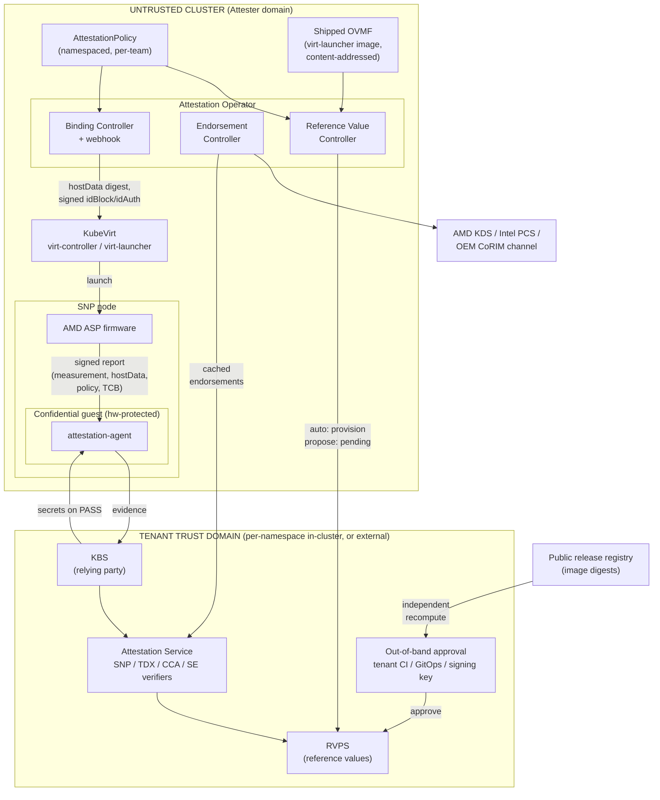

# VEP #NNNN: KubeVirt Attestation Operator

Author: Alan Caldelas (AMD)

Related: VEP #80 (TDX and SEV-SNP enablement), VEP #340 (initdata delivery), kubevirt/kubevirt#16872 (SNP interface fields)

## VEP Status Metadata

### Target releases

- This VEP targets alpha for version:
- This VEP targets beta for version:
- This VEP targets GA for version:

### Release Signoff Checklist

Items marked with (R) are required *prior to targeting to a milestone / release*.

- [ ] (R) Enhancement issue created, which links to VEP dir in [kubevirt/enhancements] (not the initial VEP PR)
- [ ] (R) Alpha target version is explicitly mentioned and approved
- [ ] (R) Beta target version is explicitly mentioned and approved
- [ ] (R) GA target version is explicitly mentioned and approved

## Overview

VEP #80 enables launching confidential VMs (AMD SEV-SNP today, Intel TDX in progress) but explicitly declares attestation infrastructure a non-goal. As a result, users can launch a confidential VM but have no supported path to verify that it is one. This proposal introduces an attestation operator, a separate project under the kubevirt org, that bridges KubeVirt and existing attestation services following the [IETF RATS](https://datatracker.ietf.org/doc/html/rfc9334) model. The operator is TEE-class pluggable from day one: AMD SEV-SNP, Intel TDX, Arm CCA, and IBM Secure Execution.

The operator does not implement evidence verification and does not deploy a key broker. Verification is delegated to an attestation service (CoCo Trustee is the reference backend; it ships verifiers for SNP, TDX, CCA, and SE). The operator's job is the KubeVirt-specific glue that no existing project provides: generating reference values from KubeVirt's domain rendering, managing hardware endorsements for the cluster's node inventory, and binding VMIs to attestation policies.

## Motivation

Remote attestation is what makes confidential computing meaningful. Without it, memory encryption is a claim the platform makes about itself. The verification-side ecosystem exists (Trustee, Veraison), but there is a gap between "a KBS is running" and "this KubeVirt VM can be attested":

1. Reference values must be computed from artifacts only KubeVirt controls. An SNP launch digest depends on the exact OVMF binary shipped in virt-launcher, kernelHashes, vCPU count and CPU model (VMSA pages are measured per vCPU). An Arm CCA Realm Initial Measurement additionally covers the full VM shape (vCPUs, memory, device layout). Today the workflow is a human extracting firmware from a container image and running sev-snp-measure by hand, repeated on every KubeVirt upgrade or VM spec change. This does not scale and is error prone.
2. Hardware endorsements need cluster-aware management. AMD VCEK/VLEK certificates are keyed per chip ID and TCB version and AMD KDS rate-limits aggressively. Intel DCAP collateral needs a PCCS-style cache. Air-gapped clusters need pre-provisioning. Nothing manages this against a Kubernetes node inventory.
3. The VMI-side binding surface is unusable without tooling. The SNP fields added in kubevirt/kubevirt#16872 (hostData, idBlock, idAuth) require computing launch digests and performing ECDSA signing. No user hand-crafts an idBlock.

## Goals

- Provide a reference value generation controller that computes expected measurements for confidential VMIs from the same inputs KubeVirt uses to render the libvirt domain, and provisions them into the configured attestation service (e.g. Trustee RVPS).
- Provide an endorsement controller that discovers TEE-capable nodes (via existing KubeVirt node labels), pre-fetches and caches hardware endorsements (AMD KDS VCEK/VLEK chains keyed by chip ID and TCB, Intel PCS/PCCS collateral, Arm CoRIM endorsements), and refreshes them on firmware TCB changes.
- Provide VMI binding: associate a VMI with an AttestationPolicy, populate launch-time binding fields (SNP hostData digest, signed idBlock/idAuth), and surface attestation-relevant status.
- Define a TEE-class plugin interface so SNP, TDX, CCA, and SE differences are contained in per-vendor providers behind a vendor-neutral API.
- Support shared, per-namespace, and external attestation service topologies. The operator consumes endpoint references; it does not own service lifecycle.

## Non Goals

- Implementing evidence verification. Verifiers are delegated to the attestation service ([Trustee AS](https://github.com/confidential-containers/trustee/tree/main/attestation-service), Veraison).
- Deploying or managing the KBS/AS lifecycle. That is the trustee-operator's job, or the tenant's if they run an external KBS. Rationale: a relying party inside the cluster it is judging weakens the trust model; external endpoints must be first-class. (CI test scaffolding that stands up an in-cluster Trustee is exempt: test tooling, not product surface.)
- Guest-side components. Guests use existing CoCo guest-components (attestation-agent, confidential-data-hub). The operator documents image requirements only.
- Live migration attestation semantics.
- Disk encryption / sealed secrets workflows (candidate for a later phase once the attestation loop exists).
- Prescribing the hostData/initdata delivery mechanism. This VEP consumes whichever model lands via VEP #340 and the static fields in kubevirt/kubevirt#16872; it stays neutral on static vs. subresource delivery. The digest semantics below are aligned with the CoCo initdata format so the design works under either model.

## Definition of Users

- Cluster Admins: operate TEE-capable nodes, configure endorsement sources, connect the cluster to attestation services.
- Platform Teams: host multiple tenants/teams in one cluster, each with independent trust anchors.
- Workload Owners / Developers: declare that their confidential VM must be attestable against a policy, without understanding per-vendor measurement formats.
- Relying Parties / Security Teams: possibly outside the cluster, consume attestation results and gate secret release.

## User Stories

- As a cluster admin, I want VCEK certificates for all my SNP nodes fetched and cached ahead of time so guest attestation does not depend on AMD KDS availability or rate limits at runtime.
- As a developer, I want to label my VM with an attestation policy and have the expected launch measurement computed and provisioned automatically, so that my in-guest attestation-agent can retrieve secrets from the KBS.
- As a developer, I want my VM's hostData populated with a digest of the relying-party configuration so the guest's attestation report is cryptographically bound to the intended KBS and its trust anchor.
- As a platform team, I want each tenant team to bind their policies to their own Trustee deployment (in their namespace or external), with their own reference values and signing keys, without cluster-admin involvement.
- As a security team, I want reference values to update automatically when the cluster upgrades KubeVirt (new OVMF binary) so attestation does not silently break or, worse, silently pass against stale values.
- As a security team with a strict threat model, I want reference values computed in-cluster to require my approval before the verifier accepts them, and I want to be able to verify the underlying firmware bytes independently, so a compromised cluster cannot bless its own images.
- As a cluster admin on aarch64 (future), I want the same policy API to cover CCA realms once KubeVirt can launch them.

## Repos

- New: `kubevirt/attestation-operator` (proposed)
- `kubevirt/kubevirt`: minimal touch points only (status condition, consuming binding fields that already exist or land via VEP #340)

## Design

### Architecture (RATS mapping)

- Attester: the confidential guest (ASP/RMM/TDX module generated evidence, delivered by in-guest attestation-agent).
- Verifier: external attestation service (Trustee AS / Veraison). Out of scope.
- Relying Party: KBS. Out of scope for lifecycle; referenced by endpoint.
- This operator: Reference Value Provider + Endorsement Provider + Kubernetes-native binding and status.

### Component diagram



Key flows: (1) Endorsement Controller pre-fetches VCEK/PCS/CoRIM material per node and provisions the AS. (2) Reference Value Controller computes expected measurements from policy + VM shape + firmware and provisions RVPS directly (auto) or as pending-approval (propose). (3) Binding Controller writes hostData digest and signed idBlock/idAuth into the VMI; virt-launcher launches via ASP. (4) Guest attestation-agent obtains the signed report and presents evidence to the KBS; AS verifies against endorsements and reference values; KBS releases secrets on pass.

### Components

1. Reference Value Controller. Watches AttestationPolicies and the confidential VMIs bound to them. Computes expected measurements per TEE class:
   - SNP: launch digest from the stateless ROM-only OVMF shipped in virt-launcher plus kernelHashes and per-vCPU VMSA state. Reproducibility depends on the ROM-only/no-NVRAM firmware decision already made in VEP #80.
   - TDX: MRTD and RTMR expectations.
   - CCA: RIM/REM via cca-realm-measurements-style computation. Open design point: RIM depends on the rendered VM shape, so this controller needs either a hook into domain rendering or a faithful re-derivation of it. This is the strongest argument for the operator living in the kubevirt org rather than outside it.

   Provisions computed values into the attestation service (RVPS/CoRIM for Trustee), subject to the provisioning mode described under Trust model.
2. Endorsement Controller. Watches nodes with TEE capability labels. Per-vendor providers:
   - AMD: fetch VCEK/VLEK + ARK/ASK from KDS per chip ID and reported TCB; cache in-cluster; refresh on TCB change; support offline import for air-gapped clusters.
   - Intel: manage/point-at PCCS collateral caching; note TDX additionally requires host-side QGS (socket path already surfaced in VEP #80's TDX libvirt XML).
   - Arm: import platform endorsements (CoRIM) from OEM channel; no central KDS analog exists.
3. Binding Controller (+ optional mutating webhook). Resolves VMI-to-policy association (label or spec reference, TBD), computes and injects the hostData digest, signs idBlock/idAuth with policy-held keys, and reflects state.
4. Status. AttestationPolicy status (reference values provisioned/pending, endorsements ready per node) and optionally a VMI condition (AttestationConfigured). Whether attested/failed runtime state is reflected in-cluster is an open question; the KBS gating secret release is the primary enforcement point regardless.

#### Firmware provenance (avoiding self-certification)

firmware.source: shipped means the reference value controller reads the OVMF binary out of the virt-launcher image present in the cluster. Under the strict threat model this is self-certification: a compromised cluster ships a malicious OVMF and the controller faithfully measures it. This is an instance of the provenance limitation above, but it has a stronger fix than approval alone, because approval of a digest is only meaningful if the approver can verify the underlying bytes:

1. shipped must resolve to a public content-addressed artifact. The controller records the virt-launcher image digest (as published in the KubeVirt release registry) alongside the computed value. Tenant-side verification then pulls the same image by digest from the public registry (never from the cluster), extracts OVMF, and recomputes the measurement independently. The trust anchor becomes the KubeVirt project's release supply chain, not the cluster.
2. source: digest: the policy pins an explicit firmware digest. This inverts the flow: the tenant defines the expected firmware, and the controller refuses to compute/provision (and flags status) if the shipped OVMF does not match. Recommended (possibly required, see open questions) for propose-mode policies.
3. Reproducible OVMF builds strengthen 1 further (tenant builds from source and matches); noted as an ecosystem dependency, not a blocker.

The same pattern applies to the other launch digest inputs: kernel/initrd/cmdline under kernelHashes come from content-addressed containerDisk images and are independently recomputable by digest. Note also that the in-cluster idBlock signing key (a Secret) is the same class of problem: a compromised cluster holding the key can sign malicious digests. For strict deployments, idBlock signing may belong in the out-of-band approval flow (tenant signs; cluster only injects); see open questions.

### Deployment topologies

The operator never deploys Trustee. Three supported topologies, differing only in where the AttestationPolicy's endpoint points:

1. Shared cluster-wide. One Trustee for the cluster, deployed via trustee-operator or Helm alongside this operator; documented as the batteries-included path and used by CI. Inherits the in-cluster placement caveat (pattern 2/3 threat models only).
2. Per-namespace / per-team. Teams run their own Trustee in their namespace with their own trust anchors, reference values, and signing keys. Enabled by AttestationPolicy being namespaced; no cluster-admin involvement to add a team.
3. External tenant-controlled. Policy points at an off-cluster KBS (topology matching the strict threat model, and the natural pairing with propose mode).

Consequences:

- AttestationPolicy is namespaced, not cluster-scoped. Required for topology 2, and correct regardless: signing keys and KBS credentials are Secrets, which are namespaced.
- Credential scoping: each policy carries its own attestationService.credentialsRef for RVPS write access. The operator must use per-policy credentials for provisioning and must never allow a policy in namespace A to provision values into namespace B's attestation service. RBAC: the operator reads Secrets only in namespaces containing policies, ideally via scoped informers.

### Multi-vendor phasing

- Phase 1: SNP. Hardware and CI exist (bare-metal EPYC Prow lane), KubeVirt support at Beta.
- Phase 2: TDX. Libvirt support exists per VEP #80; needs QGS host story.
- Tracked: Arm CCA. Guest interface stable since Linux 6.13; host KVM/QEMU/libvirt support still RFC. API accommodates it; implementation gated on upstream and on KubeVirt launchSecurity type=cca.
- Tracked: IBM SE. KubeVirt already supports Secure Execution; Trustee has an SE verifier.

The plugin interface and CRD are vendor-neutral in phase 1 even though only the SNP provider ships.

## API Examples

`AttestationPolicy` uses a discriminated union per TEE class rather than a generic measurement abstraction, consistent with the LaunchSecurity API direction (separate SEV/SNP/TDX structs; measurement formats do not genericize cleanly).

```yaml
apiVersion: attestation.kubevirt.io/v1alpha1
kind: AttestationPolicy      # namespaced
metadata:
  name: production-snp
  namespace: team-a
spec:
  attestationService:
    endpoint: https://kbs.team-a.example:8080   # shared, per-namespace, or external
    caBundleRef: <configmap>     # trust anchor; part of hostData digest material
    credentialsRef: <secret>     # RVPS write credentials, scoped to this policy
  provisioningMode: propose      # auto | propose
  snp:
    minTCB: {...}
    policy: "0x30000"
    hostDataBinding:
      source: relyingPartyConfig # digest of the guest-delivered config document
    idBlockSigning:
      keyRef: <secret>           # strict mode may move signing out-of-band, TBD
    firmware:
      source: digest             # shipped | digest
      digest: sha384:...         # required when source=digest; recorded when shipped
    kernelHashes: true
  # tdx: {...}  phase 2
  # cca: {...}  gated on upstream KVM/QEMU/libvirt support
  # se:  {...}  not designed out
```

Possible second CRD: EndorsementStore (per-node cache status, offline import). TBD whether this is a CRD or internal.

## Alternatives

- Just deploy Trustee (trustee-operator or Helm). Solves service lifecycle only. Does not compute KubeVirt-specific reference values, does not manage endorsements against a node inventory, does not touch VMI binding fields. The measurement-generation gap is the core reason this alternative is insufficient.
- Operator-managed Trustee deployments. Rejected: duplicates trustee-operator, couples our releases to Trustee's cadence and CVE stream, and undermines the external-endpoint trust posture. Composition (this operator + trustee-operator) covers the in-cluster case.
- Fold into KubeVirt core. Rejected: attestation service integration, KDS/PCCS network dependencies, and CoRIM tooling do not belong in virt-controller. Separate operator keeps KubeVirt core dependency-free while the kubevirt org placement keeps domain-rendering knowledge in-family.
- Generic TEE abstraction in the policy CRD. Rejected for the same reason as in the LaunchSecurity API: RIM/REM, MRTD/RTMR, and SNP launch digests are structurally different; a lowest-common-denominator abstraction leaks immediately.

## Scalability

Endorsement fetching is O(nodes) and cached; KDS rate limits are the constraint and pre-fetching is the mitigation. Reference value computation is O(distinct VM shapes per policy), not O(VMIs); identical shapes share a computed measurement. Per-namespace topologies multiply attestation service endpoints, not controller instances; one operator serves all policies with per-policy credentials.

## Update/Rollback Compatibility

KubeVirt upgrades that change the shipped OVMF must trigger reference value recomputation (watch on virt-launcher image digest / KubeVirt CR). Stale reference values must fail closed at the verifier, never pass silently. In propose mode, recomputed values re-enter the approval flow. Policies pinning firmware by digest surface a non-ready status on upgrade until the pin is updated. Operator upgrade must not invalidate cached endorsements.

## Functional Testing Approach

- Unit: per-vendor measurement computation against known-good vectors (sev-snp-measure cross-check); hostData digest vectors shared with a guest-side reference implementation.
- E2e (SNP lane on EPYC hardware): end-to-end flow: create policy, launch SNP VMI with in-guest attestation-agent, verify secret release from Trustee KBS succeeds with correct reference values and fails with perturbed ones. CI stands up an in-cluster Trustee as scaffolding.
- Negative: TCB downgrade, wrong hostData, unsigned idBlock, unapproved reference value in propose mode, firmware digest mismatch under source=digest, cross-namespace provisioning attempt.

## Open Questions

1. VMI-to-policy association mechanism: label selector vs. spec field (spec field requires a core API change).
2. Reference value computation for CCA: hook into KubeVirt domain rendering vs. re-derivation. Affects repo placement arguments.
3. Runtime attestation status in-cluster: useful signal or false comfort (KBS is the enforcement point).
4. hostData delivery neutrality vs. VEP #340 outcome: confirm the operator design works under both static field and initdata subresource models; decide whether to adopt the CoCo initdata document format verbatim as the digest artifact.
5. Repo governance: kubevirt org acceptance criteria for a new repo via VEP.
6. Default provisioningMode: auto (adoption-friendly) vs. propose (secure-by-default). Which approval mechanism ships in phase 1 vs. documented pattern.
7. Whether kubevirt/kubevirt#16872's idBlock/idAuth land in time to keep launch-time enforcement in phase 1 scope.
8. Should propose-mode policies be required (vs. warned) to pin firmware by digest.
9. Tenant-side idBlock signing: move signing into the out-of-band approval flow for strict deployments, with the cluster only injecting the signed block.

## Implementation History

<!--
To be filled as implementation progresses.
-->

## Graduation Requirements

Proposed; to be refined with reviewers.

### Alpha

- [ ] `kubevirt/attestation-operator` repo created under kubevirt org governance
- [ ] SNP provider: reference value computation (OVMF + kernelHashes + VMSA), endorsement caching (KDS VCEK/VLEK), hostData binding
- [ ] At least one propose-mode approval mechanism implemented; unapproved values fail closed
- [ ] E2e flow green on the SNP (EPYC) lane

### Beta

- [ ] TDX provider (MRTD/RTMR, PCCS collateral, QGS host story)
- [ ] idBlock/idAuth launch-time enforcement (pending kubevirt/kubevirt#16872)
- [ ] Per-namespace and external topology e2e coverage, including credential scoping tests

### GA

- [ ] TBD
