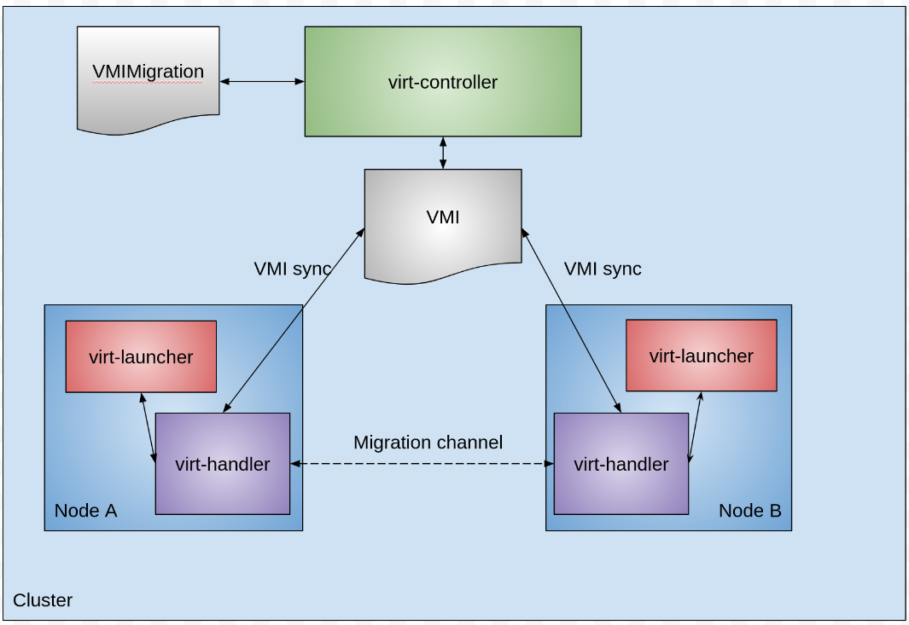
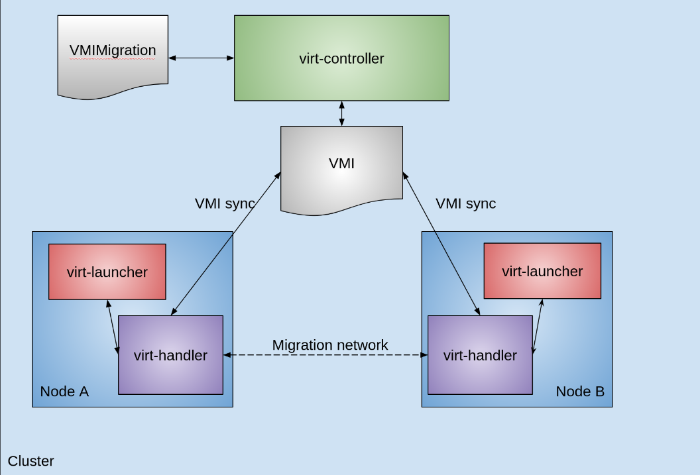
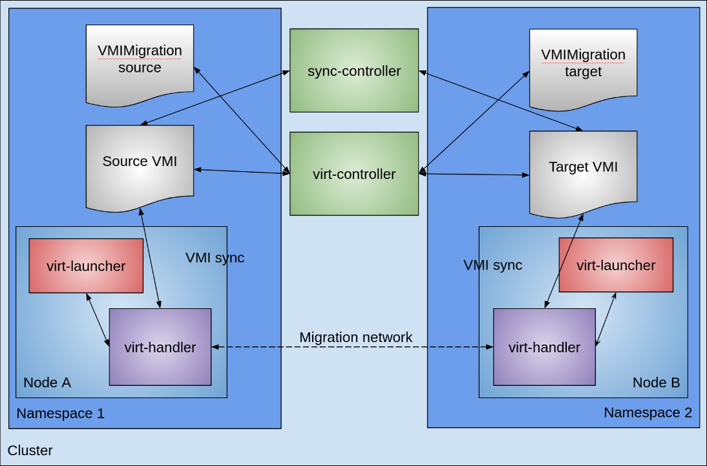
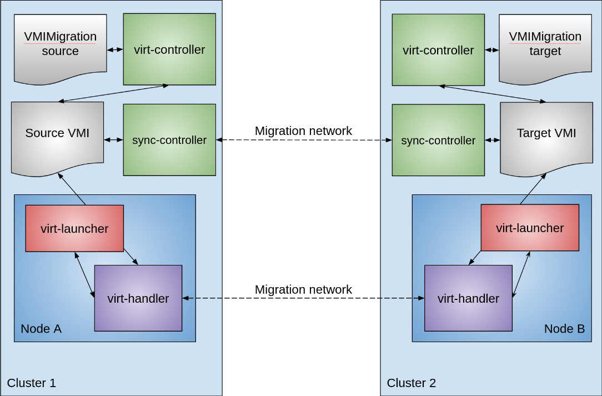
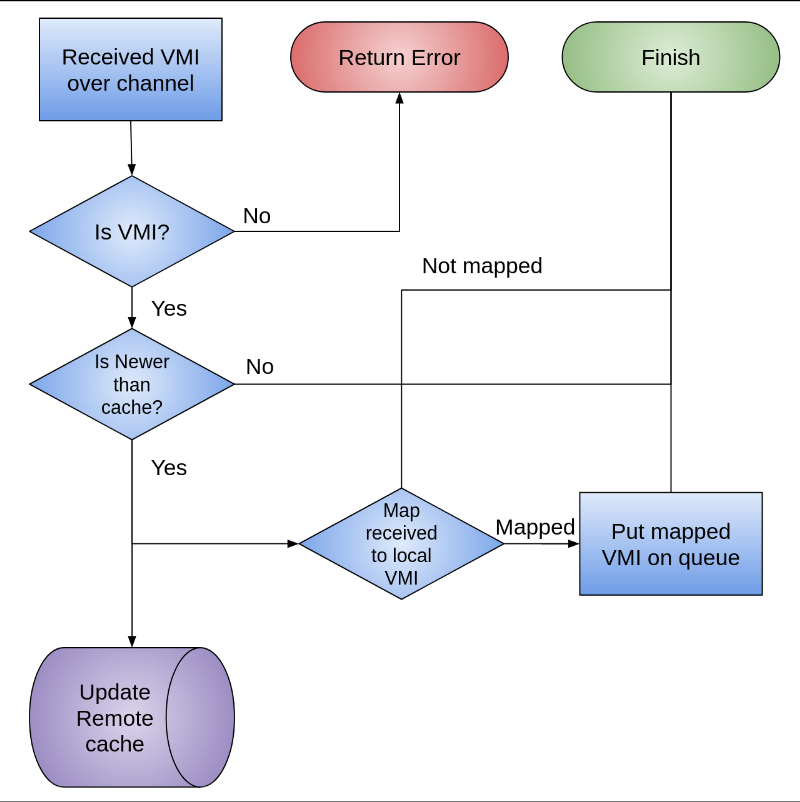
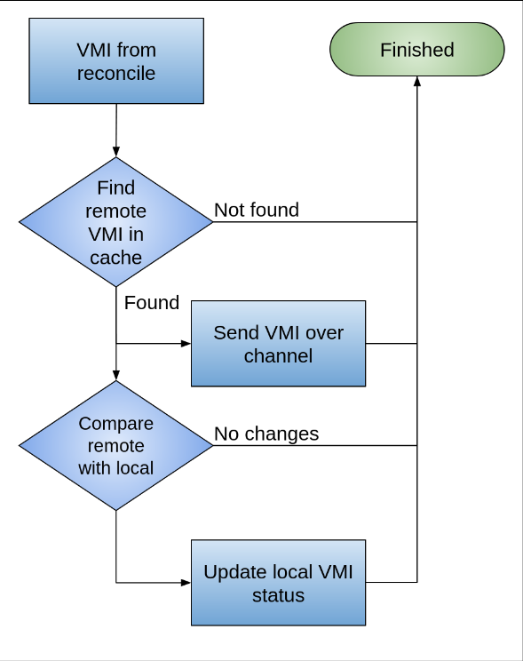

# VEP #Decentralized live migration

## Release Signoff Checklist

Items marked with (R) are required *prior to targeting to a milestone / release*.

- [X] (R) Enhancement issue created, which links to VEP dir in [kubevirt/enhancements] (not the initial VEP PR)

## Overview

Proposal to decentralize live migration into several flows to allow for more flexible live migration. This includes live migration to a different VM in a different namespace or cluster.

## Motivation

Current live migration is limited in its flexiblity because the migration is centralized. This limits live migration to the same namespace and cluster. There are use cases where it would be beneficial to live migrate between namespaces and even between clusters. For instance for balancing `VirtualMachine`s between clusters or promoting a VM from a UAT namespace to the production namespace.

In order to support those use cases, it is needed that live migration is decentralizated into separate flows:

- synchronization
- source
- target

The existing implementation synchronizes state between the source and target throught the `VirtualMachineInstance` migrationState field. This includes the phases of the source and target. For instance is the target scheduling, it is ready to accept the incoming migrating, is the migration running. This information is synchronized through the `VirtualMachineInstance`. With a decentralized flow, the `VirtualMachineInstance` is no longer visible to all the virt-handlers. So it is no longer possible to synchronize in the same way. So solve this problem, we introduce the synchronization flow.

The synchronization flow establishes a connection between the source and target and synchronizes the `VirtualMachineInstance` status between the two. 

The target flow sets up the receiving `virt-launcher` pod, and notifies the source entity through the `VirtualMachineInstance` status, that the migration is ready to begin.

The source flow waits for the target flow to be ready and initiates the migration. Before the migration begins it generates the migration parameters which include the name of the target and any translation of fields/path/names to the target.

## Goals

 - Extend the `VirtualMachineInstanceMigration` entity to decouple the `source` from the `target` flows.
 - Create a synchronization flow to allow the synchronization of two `VirtualMachineInstance` statuses.
 - Update the `VirtualMachineInstance` migrationState to support those separate entities and to allow the virt-controller, and virt-handler to identify which entity they are processing.

## Non Goals

- Orchestration of the building blocks provided by this proposal. A higher level orchestrator is required to make usage easier for end users.
- Ensuring connectivity between clusters if live migrating between clusters.
- Creating and managing required resources needed to migrate a `Virtual Machine` to the target. It is assumed all the required resources will be available at the target.

## Definition of Users

- Cluster Admins
- Admins managing several clusters

## User Stories

- As a KubeVirt admin I would like to evacuate my cluster so I can do disruptive maintance on this cluster (ex. hardware refresh) without disrupting the workloads.
- As a KubeVirt admin maintaining several kubernetes clusters, I would like to rebalance the virtual machines running on my clusters to even out the load of my clusters. without disrupting the workloads.
- As a KubeVirt namespace admin, I would like to move a virtual machine from one namespace to another without disrupting the workloads.

## Repos

[KubeVirt](https://github.com/kubevirt/kubevirt)

## Design

#### Current state
To start a live migration one creates a `VirtualMachineInstanceMigration` resource in the cluster, which references the `VirtualMachineInstance` you want to migrate. This then creates a _receiver_ pod in the same namespace, and starts the migration process.

The actual migration channel is proxied through the `virt-handler` pods that are running on the source and target nodes. Any migration state information is passed through the `VirtualMachineInstance` migrationStatus. This is because `virt-handler` pods can only read/modify `VirtualMachineInstances`.

The reason virt-launcher pods do not communicate directly with each other, is that it is not guaranteed that virt-launchers will have network connectivity. The virt-handler pods also have access to a migration network if one is defined.

The migration channel in figure 1 is either the pod network, or a specially configured migration network.

Figure 1 describes the current interaction between various components:


#### Proposed state
To start a live migration one now has to create two `VirtualMachineInstanceMigration` resources. A `target` resource, and a `source` resource. Additionally in order to migrate a special `VirtualMachine` resource has to be created on the target which is copy of the source `VirtualMachine` but it has a special `runStrategy` indicating it is the receiving `VirtualMachine`. The virt-controller will create a special receiving `VirtualMachineInstance` that can be referenced by the `target` `VirtualMachineInstanceMigration`.

Additionally some other resources may be required if they are referenced by the source `VirtualMachine`. Examples of these additional resources are:
* Secrets, required to eventually start the receiver pod.
* ConfigMaps, required to eventually start the receiver pod.
* InstanceTypes, required to create the receiving `VirtualMachineInstace`.
* PreferenceTypes, required to create the receiving `VirtualMachineInstace`.

The source `VirtualMachine` will reference some disks and networks. Whatever creates the target `VirtualMachine` will be responsible for creating blank receiver disks, and properly mapping the networks from the source `VirtualMachine` to the target `VirtualMachine`

When migrating inside the same namespace, the additional `VirtualMachine` and associated resources are not needed as they already exist in the namespace.

The `source` resource will contain a `connectionURL` that points to the synchronization controller at the target. The `source` resource will also contain a key which has to be unique across all migrations. The `target` resource will contain the same key. This will allow the synchronization controller to map the `VirtualMachineInstance` it receives on the synchronization channel to the appropriate `target` `VirtualMachineInstance`. Once the synchronization has been established, any status updates can be communicated between the `source` and the `target` just like in the current state. This means enough information has been exchanged to start the receiver pod, and once the receiver pod is ready, the migration can start.

The target cluster will have a synchronization controller running in the kubevirt namespace, that has access to the migration channel (either pod network, or migration network). This controller waits for incoming synchronization connections from a source. When a `source` migration resource is created in the cluster, this synchronization controller will connect to the target synchronization and start synchronizing the `VirtualMachineInstance` status between them.

If the source and the target are in the same cluster, the connection will be inside of the synchronization controller.

Once synchronization has been established, each `virt-handler` pod will interact with their respective `VirtualMachineInstance` the same way as before. The major difference being that it is possible there are two separate `VirtualMachineInstance`s.

TBD: How to handle the source `VirtualMachine` once the migration has completed. We can shut down the source `VirtualMachine`, delete it, or keep it running. For now a good starting point is to simply shut down the `VirtualMachine` and something else decides what to do with the `VirtualMachine`

Figure 2 describes the interaction with a source and target `VirtualMachineInstanceMigration` in the same namespace



Figure 3 describes the interaction with a source and target `VirtualMachineInstanceMigration` in different namespaces.



Figure 4 describes the interaction with a source and target `VirtualMachineInstanceMigration` in different clusters



## Synchronization controller

The synchronization controller facilitates the synchronization of migration state between source and target `VirtualMachineInstance`s. This enables the `virt-controller` to interact with its `VirtualMachineInstance` as if it were the sole instance, maintaining consistency in proposed migration flows from the `virt-controller`'s perspective.

Upon creation of `VirtualMachineInstanceMigration` resources, the target `virt-controller` generates a specialized `VirtualMachineInstance`. This instance is not subject to typical interactions with the `virt-controller` or `virt-handler`, nor synchronized with its source counterpart. The synchronization controller assumes responsibility for synchronizing this receiver `VirtualMachineInstance` with others it receives over the synchronization channel, based on the shared keys in the `VirtualMachineInstanceMigration`s.

The synchronization controller empowers the decentralization of two distinct and separate `VirtualMachineInstance`s. It operates as a standalone controller that can modify `VirtualMachineInstance` state and connects to the migration network.

A single active synchronization controller per cluster is designated, listening on an established address port combination. TBD: how this address will be advertised (perhaps through a kubevirt CR?). Since this synchronization controller should connect to the migration network, it cannot be part of the `virt-controller` pod. This means a distinct synchronization pod.

The `VirtualMachineInstanceMigration` resource includes a name for the `VirtualMachineInstance` and a mapping key. Both source and target instances utilize the same mapping key to facilitate the synchronization controller in mapping received `VirtualMachineInstance`s to their respective local counterparts.

Synchronization is achieved by following the flows in figure 5 and 6
##### Incoming VMI


##### Reconcile loop


## API Examples

Two major changes to the API.

#### VirtualMachineInstanceMigration

##### SendTo
If the `VirtualMachineInstanceMigration` contains a `sendTo` field it means it is the `source` of the migration. Using the `sendTo` field explicitly indicates the intent of the user that this is the `source`.

A new required field `key` will be added. This field can be used to uniquely identify a received `VirtualMachineInstance` and map it to a receiving `VirtualMachineInstance`. The suggested `key` is a unique identifier, for instance, if any orchestrator uses a resource to orchestrate the migration, it could be the UID of that resource.

A second required field is `connectURL` this is the URL the `source` synchronization controller will use to connect to the `target` synchronization controller.

Because the id is unique, the order in which the `source` and `target` migration resources are created does not matter. If the `source` is created the first, it will send its VMI to the target controller which will store it for a period of time. If in that period the `target` is created, the synchronization can happen immediately.

_Source VirtualMachineInstanceMigration_
```yaml
apiVersion: kubevirt.io/v1
kind: VirtualMachineInstanceMigration
metadata:
  name: vmim-source
spec:
  sendTo:
    key: <unique id>
    connectURL: "the url to connect the sync channel"
  vmName: vmi-name
```
##### Receive
If the `VirtualMachineInstanceMigration` contains a `receive` field it means it is the `target` of the migration. Using the `receive` field explicitly indicates the intent of the user that this is the `target`.

A new required field `key` will be added. This field can be used to uniquely identify a received `VirtualMachineInstance` and map it to a receiving `VirtualMachineInstance`. The suggested `key` is a unique identifier, for instance, if any orchestrator uses a resource to orchestrate the migration, it could be the UID of that resource.

_Target VirtualMachineInstanceMigration_
```yaml
apiVersion: kubevirt.io/v1
kind: VirtualMachineInstanceMigration
metadata:
  name: vmim-target
spec:
  receive:
    key: <unique id>
  vmName: vmi-name
status:
  syncEndpoint: <address:port>
```

If neither `sendTo` or `receive` is specified it means this is a normal in namespace live migration, and the `VirtualMachineInstanceMigration` can be treated as if it is both the `source` and the `target` migration resource.

#### VirtualMachineInstance status

The `VirtualMachineInstance` status contains a `migrationState` field which is used to coordinate the migration process between the source and target `virt-handlers`. The virt-handlers only have the ability to read/update the `VirtualMachineInstances` so this is the mechanism used to coordinate the migration.

The `migrationState` is a copy of the [VirtualMachineInstanceMigrationState](https://github.com/kubevirt/kubevirt/blob/main/staging/src/kubevirt.io/api/core/v1/types.go#L736-L793)

There are a lot of fields in that state specific to either source or target. This is a non-exhaustive list. For instance:
- TargetNodeTopology
- TargetNodeAddress
- TargetPod
- SourcePersistentStatePVCName
- SourcePod
- SourceNode

It is apparent there are several overlapping fields like `Pod` and `Node` so it makes sense to split that into a source and target state. So instead of the `VirtualMachineInstance` having a `MigrationState` field, it will have a `SourceMigrationState` and a `TargetMigrationState` each mapping to the appropriate `VirtualMachineInstanceMigrationStatus` of either the source or target `VirtualMachineInstanceMigration`. The `VirtualMachineInstance` synchronization controller will then synchronize the source and target status. In order to properly synchronize the status some new fields will be required. Fields for:
- Node label selectors for source virt-launcher pod. The node the source virt-launcher pod is running has labels that can be used for selecting which nodes the target can run on.
- Source and Target `VirtualMachineInstance` UIDs. During the migration process, some assumptions have been made about the UID of the `VirtualMachineInstance`. Because it is now possible to migrate to a new `VirtualMachineInstance` the new and old UIDs have to communicated to the other side of the migration.
- The new name of the `VirtualMachineInstance` and namespace. The domain xml name is generated from the `VirtualMachineInstance` name and namespace, and when migrating from the old domain to the new domain the new domain name has to be known at the source.

For example:
```yaml
  status:
    activePods:
    ...
   sourceMigrationState:
      migrationConfiguration:
        allowAutoConverge: false
        allowPostCopy: false
        allowWorkloadDisruption: false
        bandwidthPerMigration: "0"
        completionTimeoutPerGiB: 150
        nodeDrainTaintKey: kubevirt.io/drain
        parallelMigrationsPerCluster: 5
        parallelOutboundMigrationsPerNode: 2
        progressTimeout: 150
        unsafeMigrationOverride: false
      migrationNetworkType: Pod
      mode: PreCopy
      migrationUid: <uid>
      node: <node>
      pod: <virt-launcher-pod name>
      vmiUID: <virtual machine instance UID>
      nodeLabelSelectors: <map of key/value pairs>
      namespace: <namespace of virtual machine instance>
   targetMigrationState:
      migrationConfiguration:
        allowAutoConverge: false
        allowPostCopy: false
        allowWorkloadDisruption: false
        bandwidthPerMigration: "0"
        completionTimeoutPerGiB: 150
        nodeDrainTaintKey: kubevirt.io/drain
        parallelMigrationsPerCluster: 5
        parallelOutboundMigrationsPerNode: 2
        progressTimeout: 150
        unsafeMigrationOverride: false
      migrationNetworkType: Pod
      mode: PreCopy
      migrationUid: <uid>
      node: <node>
      directMigrationNodePorts:
        "35665": 0
        "35793": 49153
        "42767": 49152
      migrationUid: <uid>
      node: <node>
      nodeAddress: <address>
      nodeDomainDetected: true
      nodeDomainReadyTimestamp: "2025-02-19T19:02:15Z"
      pod: <virt-launcher-pod name>
      vmiUID: <virtual machine instance UID>
      namespace: <namespace of virtual machine instance>
      syncAddress: <address to connect for sync channel>
```

To keep backward compatibility if there is no `key`, it can be assumed it is both and it can follow both source and target flows in the `virt-controller`

## Alternatives

Completely rework the mechanism used for live migrations to be decentralized from the start. As there are quite a few issues with the current mechanism. This was rejected due to the amount of time and effort it would take to do a complete rewrite.

The reason for going with a separate migration controller vs having a `virt-handler` manage the synchronization connection is that the `VirtualMachineInstance`s have to be synchronized before it is possible to reliably start the receiving pod. This means that we don't know before we have synchronized which node the receiver pod will be scheduled on, and thus we don't know which `virt-handler` should handle the synchronization. Further it doesn't matter which component does the synchronization as long as it has 2 properties:
- Ability to read/update `VirtualMachineInstance`
- Access to the migration network

This eliminates the virt-controller because it doesn't have access to the migration network. The `virt-handler` is not ideal either since it is a privileged component and we want to restrict network connections to it as much possible. Therefore it makes sense to have a separate component that handles synchronization.

## Scalability

There is no effective difference in behavior for migration inside the same namespace, so there is no change in scalability there.

When migrating between namespaces and clusters. The live migration will effectively be a storage live migration (the storage needs to be copied) and the scalability will be the same as doing a storage live migration.

## Update/Rollback Compatibility

Since this is adding net new fields to the `VirtualMachineInstanceMigration` resource, there is no compability issue there.

There is potentially an issue with splitting the migrateState into a `source` and `target` state in the `VirtualMachineInstance`. Any ongoing live migrations are at potential risk.

## Functional Testing Approach

There is no functional difference when doing a split live migration in the same namespace vs doing an existing live migration. So to test the new functionality we need to ensure that existing live migration tests still work, and additional tests are added that explicitly use the source and target flow.

Cross cluster live migration is going to be hard to functionally test in the kubevirtci system since it requires two clusters. But conceptually there is no difference between a live migration between namespaces and live migration between clusters. The only difference is the network connectivity between the virt-handlers. And that detail should be handled outside of KubeVirt and thus we can just test cross namespace live migration to ensure this functionality will work.

Since there will be no functional difference between existing live migration and the new mechanism. All the existing live migration tests will still be relevent. In addition we have to add a few tests that use the new `source` and `target` migration resources in the same namespace, and different namespaces.

## Implementation Phases

The implementation phases will closely follow the proposed state diagrams above.
- First decentralize the live migration.
  - Untangle the virt-controller migration controller, to have two flows. Once for the source flow and one for the target flow.
  - Untangle the virt-handler controller into three separate flows. This will likely be achieved by turning the single controller into three controllers:
    - regular flow
    - migration source flow
    - migration target flow
  - Keep the same migration resources unmodified. This will ensure there are no regressions during the untangling.
  - Possibly split the `VirtualMachineInstance` migration state into two states if necessary. If it not necessary this becomes part of the second phase.
- Second modify the migration resources to have the new fields as proposed. And if not modified already, split the `VirtualMachineInstance` migration state into two states.
  - Add functional test that mimics a basic migration functional but with the separated migration resources.
- Third implement the synchronization controller and associated logic. The controller is not need in the first two phases, but once migrating across namespaces some synchronization is required.
- Fourth Implement the logic for cross namespace migration. This will require adding fields to the migration state to properly handle the flow.
  - Add a functional test to do a basic migration across namespaces.
- Fifth To simulate migration across clusters, add a functional test that switches network and storage when migrating between namespaces.

## Feature lifecycle Phases

### Alpha
Initial implementation of decentralized `VirtualMachinceInstanceMigration` resources. Including allowing cross namespace and cross cluster migrations.
Maintain backwards compatibility with existing live migrations.

Including feature gate.

### Beta
API is mature and stable and maintains backwards compatilibity with existing live migrations.

### GA
Remove feature gate