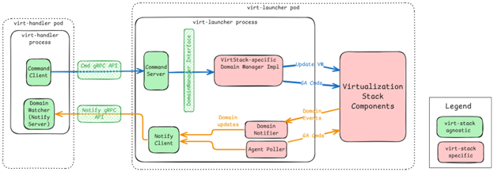
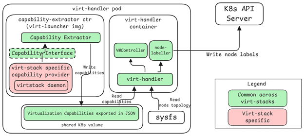
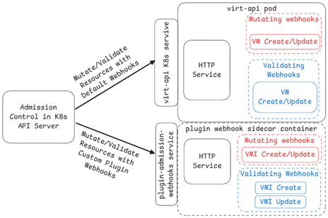
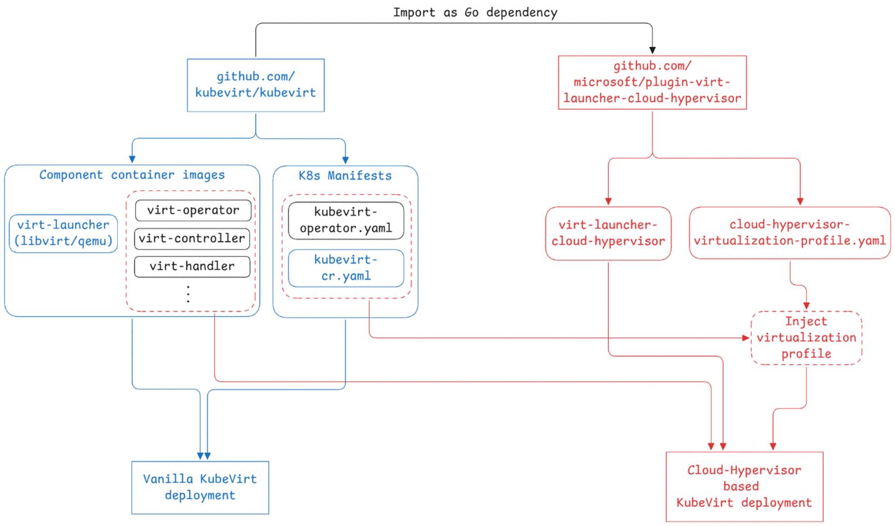

# VEP #NNNN: Your short, descriptive title

## Release Signoff Checklist

Items marked with (R) are required *prior to targeting to a milestone / release*.

- [ ] (R) Enhancement issue created, which links to VEP dir in [kubevirt/enhancements] (not the initial VEP PR)
- [ ] (R) Target version is explicitly mentioned and approved
- [ ] (R) Graduation criteria filled

## Overview

At present KubeVirt can only be used to create and manage virtual machines (VMs) via Libvirt on the QEMU virtual-machine monitor (VMM) and KVM hypervisor. However, in the wider industry, there are an increasing number of VMMs and hypervisors available. Such as Cloud Hypervisor, OpenVMM (VMMs) and HyperV (hypervisor). The strict dependence of KubeVirt on a virtualization stack consisting of Libvirt, QEMU and KVM limits its application in scenarios where the customer would like to utilize a different virtualization stack.

## Motivation

There are multiple reasons to decouple KubeVirt from Libvirt and QEMU/KVM.

- Customer scenarios require different virtualization stack components: Given the increasing number of virtualization stack components available today, different customers of KubeVirt would require specific components to cater to their unique needs. Decoupling KubeVirt from Libvirt/QEMU/KVM would allow them to use their preferred virtualization stack components.

- Limitations and overhead imposed by Libvirt: Libvirt is a management wrapper which executes functions in its API by calling into the underlying VMM. Such functions can be directly invoked against the VMM by virt-launcher, thereby saving the overhead imposed by the Libvirt daemon. The use of Libvirt as the intermediate VM management layer restricts the virtualization stacks that can be used to only those that have a Libvirt driver. For example, OpenVMM does not have a Libvirt driver, and hence cannot be easily integrated into KubeVirt. Libvirt is implemented in C, and a programming language providing easier memory safety would reduce security risks. The plan for incorporating Rust into Libvirt has had relatively slow progress.
Furthermore, although libvirt provides a useful unified Domain definition across virtualization stacks, it is redundant in the presence of KubeVirt’s own VirtualMachineInstance definition.
Additionally, KubeVirt only utilizes around 20% (~57/292) of all the Libvirt APIs available –leaving Libvirt significantly underutilized while virt-launcher still incurs the overhead of running the Libvirt daemon.

### Areas of Tight Coupling Between KubeVirt and Libvirt/QEMU/KVM

- KubeVirt’s virt-launcher is built for Libvirt/QEMU/KVM: Although interaction with virt-launcher takes place through well-defined interfaces (CmdServer and NotifyServer), it is not possible to build a virt-launcher component wherein the implementation of those interfaces can be backed by an alternative virtualization stack.

- Libvirt domain XML’s mirror api.Domain data structure: KubeVirt thoroughly uses the api.Domain data structure to internally represent a virtual machine instance. This definition is meant to mirror Libvirt’s domain definition.

- Node Labeling involves invoking Libvirt’s QEMU driver: During the initialization of KubeVirt’s virt-handler component on a given node, it generates labels for that node based on the node’s virtualization capabilities. The virt-handler component queries node’s virtualization capabilities by running a virt-launcher container and invoking multiple Libvirt APIs, which in turn query the QEMU VMM. In addition to virtualization capabilities, the node topology is also queried from Libvirt, although that is not tied to the virtualization stack nor used for node labeling.

- Hardcoded Libvirt/QEMU/KVM-specific values in control-plane components: Code of components such as virt-controller and virt-handler contain hardcoded literals specific to one of Libvirt, QEMU or KVM. For example, the overhead imposed by Libvirt and QEMU VMM, executable names of QEMU VMM and libvirt daemon processes and name of the libvirt connection socket file.

- Libvirt/QEMU-specific guest agent status determination: Virt-Handler uses checks the state of Libvirt channel "org.qemu.guest_agent.0” to determine if the guest agent is connected. It also assumes that the guest agent is QEMU Guest Agent and compares the list of supported commands with the set of required commands to determine if the agent is supported.

## Goals

- Refactor KubeVirt to allow the development of alternative variants of the virt-launcher component for different virtualization stacks.

- Refactor KubeVirt to decouple it from Libvirt, QEMU and KVM.

- Modify the KubevirtConfiguration CRD to allow specification of virtualization stack properties.

- Streamline the process of building and deployment of KubeVirt for alternative virtualization stacks.

- Ensure backward compatibility with existing KubeVirt deployments. Cluster administrators must be able to upgrade to the latest version of KubeVirt incorporating the proposed changes, while retaining the ability to create virtual machines using the default Libvirt/QEMU/KVM-based architecture without requiring API modifications.


## Non Goals

- Implementation of the proposed plugin components (e.g., virt-launcher and admission webhooks) for alternative virtualization stacks.

## Definition of Users

<!--
Who is this feature set intended for
-->

## User Stories

<!--
List of user stories this design aims to solve
-->

## Repos

<!--
List of repose this design impacts
-->

## Design

At a high level, the proposed design aims to make all virtualization stack-related components of KubeVirt as plugins. These plugins would operate using well-defined interfaces and be declared in the KubevirtConfiguration CRD. We introduce a new member in the KubeVirtConfiguration CRD named VirtualizationProfile that would encapsulate all the virtualization stack’s specific properties and configurations on this KubeVirt cluster.

The VirtualizationProfile is of type VirtualizationProfileSpec, which is structured as follows:

- Name: Name of the virtualization profile.

- VirtualizationComponents: details about the virtualization stack components.

  - HypervisorDevice: Path to the Hypervisor device (e.g., /dev/kvm).

  - VMMDaemonProcess: Name of the VMM daemon process (e.g., virtqemud).

  - VMMProcessExecutable: Name of the VMM executable (e.g., qemu-system-x86).

  - PitPidPrefix: Prefix of the name of the Programmable Interrupt Timer threads spawned by the hypervisor (e.g., kvm-pit). This can be empty for hypervisors that don’t implement PIT threads.

- VirtLauncher: details about the virt-launcher pod.

  - VirtLauncherImage: Container image URI for the plugin virt-launcher for the given virtualization stack.

  - VirtLauncherCapabilities: Capabilities to be added to the virt-launcher container.

  - VirtLauncherOverhead: Total memory overhead of KubeVirt components plus virtualization stack components in the virt-launcher container. This will be added to the memory requested by the VMI to calculate total memory request for the virt-launcher container.

The properties defined above would be used by KubeVirt to construct the virt-launcher pod. The properties would also be used by virt-handler to interact with the virt-launcher. For each KubeVirt deployment on a particular virtualization stack (e.g., libvirt-qemu-kvm), we would have property values specific to that stack in the VirtualizationProfile CR. The presence of these properties in the CR would eliminate any hardcoding in virt-controller or virt-handler.

Note that for backwards compatibility, if the VirtualizationProfile field is not specified in the KubevirtConfiguration, it would default to Libvirt/QEMU stack’s values.

### Pluggable virt-launcher component

The proposed design aims to make it possible to create a virt-launcher image for a specific virtualization stack. The Virt-handler component would use the Cmd gRPC API to interact with the virt-launcher for managing the domain. Internally, the virt-launcher would contain the CmdServer shim that fulfils the Cmd gRPC API calls by invoking its own implementation of the DomainManager interface. In the Notify workflow, each virt-launcher would implement their own version of Notifier and use the SendDomainEvent and SendK8sEvent functions to notify virt-handler of changes to the virtual machine.



#### Refactoring virt-launcher’s code for code-sharing with plugin virt-launchers

Virt-Launcher’s code will be refactored to separate the common, i.e., virtualization-stack-agnostic parts, from the libvirt-specific, i.e., virtualization-stack-specific parts. The common code will contain the definition of DomainManager, the implementation of CmdServer and NotifyClient. This only pertains to the code that carries out communication with virt-handler and will be imported by all other implementations of the virt-launcher plugin.

#### Profiling the Memory Overhead of Plugin Virt-Launcher

The VirtualizationProfile CRD includes a field called VirtLauncherOverhead, which represents the memory consumed by the virt-launcher process and related virtualization stack components, such as the VMM process and, where applicable, the virtualization daemon. As each plugin virt-launcher will have its unique implementation and invoke a distinct set of virtualization stack components, the resulting overhead will vary accordingly. Developers of plugin virt-launchers are therefore responsible for profiling their specific implementations to accurately measure the memory overhead introduced by both the virt-launcher process and associated virtualization stack components. The measured value should then be used to populate the VirtLauncherOverhead field in the VirtualizationProfile CRD.

#### Replace GetQemuVersion gRPC call in Command API with GetVmmVersion

The Command gRPC API between the virt-handler and virt-launcher contains the function call named `GetQemuVersion`, which returns the version of QEMU being used in the virt-launcher container responding to the API call. With the proposed plugin model for virt-launcher, we propose the deletion of this function and have the following two functions in its place:

1. `GetVmmName`: Returns the name of the VMM in use, e.g., QEMU or cloud-hypervisor.

2. `GetVmmVersion`: Returns the version of the VMM in use.

Corresponding changes will have to be made in KubeVirt’s monitoring component that currently consumes the Qemu Version value, to instead log the VMM name and version.


### Pluggable Capability Extraction and Node Labeling Process

KubeVirt queries each node’s virtualization capabilities and labels each node with the virtualization features provided by that specific node. Currently, capabilities are queried by multiple API calls to Libvirt in the virt-launcher container of virt-handler pod. Each libvirt call generates an XML file which is parsed by virt-handler to create a set of labels for the node. The process should be made pluggable so that a different virtualization stack’s virt-launcher component can provide the capabilities information to virt-handler. In other words, the strict dependence on Libvirt to generate the capabilities XML should be avoided.

The proposed solution is to expose the capabilities of the virtualization stack through a Capability Interface. The Capability Interface would have the following functions that would provide the caller with information about the virtualization capabilities on the node:

1. GetHypervFeatures: returns a list of Hyper-V compatible features that are exposed by the hypervisor for optimized guest OS functionality.

2. GetSupportedMachineTypes: return list of machine types supported by the VMM

3. GetSupportedCpuModels: returns list of named CPU models that VMM can expose to the VM.

4. GetHostCpuModelInfo: returns the name of the host-model CPU model and the set of additional features required with the host-model CPU.

5. GetSupportedCpuFeatures: list of CPU features available on the node.

6. GetNodeTscInfo: returns TSC frequency and whether its scalable.

7. GetNodeSevFeatures: whether node supports AMD SEV and SEV+ES.

Each plugin variant of virt-launcher includes a distinct implementation of the Capability Interface within its source code, supplying the required information (declared by the interface) by invoking its specific virtualization stack components. The functions included in the Capability Interface have been defined based on the information requirements of the current node labeling logic. Should KubeVirt expand its range of generated labels in the future and require further information from the virtualization stack, it will be necessary to introduce additional functions to this interface.



Each virt-launcher image will include an implementation of the Capability interface tailored to its respective virtualization stack. Additionally, a Capability Extractor component will invoke this interface to extract relevant capabilities and export them according to the Capabilities API to be consumed by the virt-handler.
The Capabilities API for exporting capabilities will be maintained using Protobuf  under handler-launcher-comm package. For exporting and reading the capabilities data, we would use ProtoJson to ensure that the exported capabilities data is human-readable.

#### Node Topology Extraction to be moved to virt-handler

At present, virt-handler retrieves node topology information from capability XML files generated through Libvirt API calls. Given that node topology is independent of the virtualization stack, we propose to integrate this functionality directly into virt-handler. This approach would streamline the Capabilities API. We recommend that virt-handler obtain node topology by reading files within `/sysfs`.

### Pluggable Validating and Mutating Webhooks for KubeVirt CRs

#### Background

KubeVirt leverages Kubernetes’s extensible admission control policy by implementing custom mutating and validating webhooks for several CRDs. These webhooks are registered with the Kubernetes API server and are invoked every time a particular KubeVirt resource (e.g., VMI or VM) is created or updated.

Mutating webhooks ensure that KubeVirt object specifications are automatically enhanced with appropriate default values (often architecture-specific), and cluster-wide policies before the VMs are created. This reduces the burden on users to specify every configuration detail while ensuring VMs are properly configured for their target environment. Validating webhooks perform validation of the KubeVirt object’s specification, which is more complex than a typical schema validation and involves in-depth analysis of the object’s definition – for example, checking whether a VMI’s disk references a valid volume name or whether an unsupported device model is used. The webhooks in KubeVirt currently are specifically implemented assuming that VMs are going to be created on the Libvirt/QEMU based virtualization stack.

 webhooks on a VMI creation request.")

As pluggable virt-launchers introduce various backend virtualization stacks, it is essential for the mutating and validating webhooks to consider the specific characteristics of the chosen virtualization stack. For example, each virtualization stack can dictate its own unique set of default values for the different fields of a KubeVirt CRD. Similarly, 
not all virtualization stacks support every feature defined in the KubeVirt VMI API, so VMIs should be validated for checking against the use of the specific features that are unsupported by the stack. Therefore, KubeVirt should allow custom admission controllers to be plugged into the cluster and be used to admit specific CRDs.

#### Proposed Design

**Deployment of plugin webhooks**: For a plugin virtualization stack, the custom mutating and validating webhooks would live inside a container image that would expose them via a REST API, like the webhooks in vanilla KubeVirt. The code for these custom webhooks and their build process is the responsibility of the plugin maintainers. This container image would be used to create a sidecar container to virt-api, and the REST API for serving these custom webhooks would be advertised to the K8s cluster via a new Kubernetes service called `plugin-admission-webhooks`.

**Specifying when a custom webhook should be invoked**: To specify when a certain plugin webhook is to be invoked, the `KubeVirtConfiguration` CRD will be extended with a struct called PluginWebhooks that consists of the following fields:

- ValidatingWebhooks: Array of `PluginWebhookSpecification` objects that describe the set of custom validating webhooks.
- MutatingWebhooks: Array of `PluginWebhookSpecification` objects that describe the set of custom mutating webhooks.
- Plugin container image: URI of the plugin admission webhooks’ container image. 
The `PluginWebhookSpecification` CRD consists of the following field:
- Name: Name of the plugin webhook
- Rules: Array of type `RuleWithOperations` (from `k8s.io/api/admissionregistration/v1`). Describes the conditions that will trigger this webhook’s invocation.
- RestServicePath: Path on the custom webhook’s REST service to call when invoking this webhook.

Example of a plugin webhook specification is the following, wherein a custom validating webhook is declared for the VMI resource:

```yaml
name: vmi-validator-plugin
  rules:
  - operations: ["CREATE", "UPDATE"]
    apiGroups: ["kubevirt.io"]
    apiVersions: ["v1"]
    resources: ["virtualmachineinstances"]
  restServicePath: /validate-vmi
```

**Registration of Custom Webhooks with K8s API Server**: The plugin webhooks are designed to override or extend the default admission webhooks configured in a vanilla KubeVirt deployment. During installation, the virt-operator is responsible for computing the final set of admission webhooks to be registered with the Kubernetes API server. This set is derived by taking the default webhooks and selectively replacing them with those defined in `KubeVirtConfiguration.PluginWebhooks`.

To perform this replacement, virt-operator iterates over the rules field of each default webhook configuration. If a rule in a default webhook overlaps with a rule specified for a plugin webhook (i.e., matches the same operations, resources, and API groups), the overlapping trigger condition is removed from the default webhook. This ensures that only one webhook is invoked for a given admission request, in accordance with Kubernetes' matching semantics.

After this replacement, the (modified) default webhooks continue to route admission requests to the REST endpoint served by the main virt-api container. The plugin webhooks are registered as separate webhook configurations and route requests to the REST endpoint exposed by the plugin’s webhook sidecar container. This design ensures that plugin webhooks can cleanly override specific validation or mutation logic without interfering with unrelated default behavior.



### Decoupling Guest Agent condition update from Libvirt

We propose to extend the return type of the GetGuestInfo() gRPC API call  in the CommandAPI to include a new field called guestAgentCondition, which would be of type GuestAgentCondition. The GuestAgentCondition type consists of the following fields:

- Connected: bool. This field shows whether the agent is connected to the communication channel (e.g., the "org.qemu.guest_agent.0" Libvirt channel) that is setup by the virt-launcher.

- Supported: bool. This field shows whether the guest agent supports the required commands.

Instead of the virt-handler querying GuestInfo and itself calculating whether the agent is connected and supported, this detail can be moved into the virt-launcher plugin itself. That would enable a plugin virt-launcher to have its own mechanism of connecting to the guest agent. Furthermore, the proposed design would also enable a plugin virt-launcher to use a guest agent other than the QEMU Guest Agent.

## Code Maintenance

We propose that the kubevirt/kubevirt repository would contain the entire source-code for vanilla KubeVirt (with libvirt-qemu-kvm virt-launcher), which is refactored according to the proposed plugin model. The source code for other plugin virt-launchers for alternative virtualization stacks would reside in separate [DM40.1][HG40.2]repositories, as outlined below.

- Core kubevirt/kubevirt repository:

  - Repository contents: The kubevirt/kubevirt repository will continue to host the source code for the vanilla KubeVirt project, including all control-plane components and the virt-launcher for the libvirt/qemu virtualization stack. 

  - Build artifacts: The build scripts within kubevirt/kubevirt will be utilized to generate container images for all components of a vanilla KubeVirt distribution. Additionally, scripts will also generate the Kubernetes manifests for vanilla KubeVirt’s installation, i.e., kubevirt-operator.yaml and kubevirt-cr.yaml.

  - Release and installation: As usual, each release of the core kubevirt/kubevirt project will include the K8s manifest files (with default libvirt-qemu virtualization profile) and the KubeVirt component container images. Installation on a K8s cluster would require installing the manifest files.

  - Testing required: Testing procedures will remain consistent with current practices. KubeVirt maintainers are responsible for ensuring that the plugin interface for interacting with virt-launchers is preserved.

- Plugin virt-launcher repositories:

  - Repository contents: The plugin code for a specific virtualization stack, i.e., the virt-launcher and webhook components. This repository would leverage the “common” packages pertaining to `virt-launcher` and `virt-api` components from kubevirt/kubevirt.

  - Build artifacts: Build scripts within this repository will generate the container image for the plugin virt-launcher, along with images for the validating and mutating webhook plugins. Additionally, it will also generate a manifest `virtualization-profile-<virtstack>.yaml` containing the virtualizationProfile CR that should be patched into the kubevirt-cr.yaml manifest when installing KubeVirt with the given plugin virt-launcher.

  - Release and installation: The release process of the plugin virt-launcher would take the release artifacts from the core kubevirt/kubevirt repository and update them with the plugin’s build artifacts. The kubevirt-cr.yaml manifest file would be updated with the virtualizationProfile CR (mentioned above). In the set of component container images, the vanilla virt-launcher container image would be replaced with the one built from this plugin repository.
  Installation of KubeVirt with a plugin virt-launcher would require installing the updated K8s manifests.

  - Testing: Testing includes invoking functional tests from the kubevirt/kubevirt repository to test general KubeVirt features on the given virtualization stack. Additional it should incorporate dedicated test cases specific to the plugin virt-launcher and its associated virtualization stack within the context of a KubeVirt deployment.

  - Maintainers: The responsibility for maintaining and testing the code within this repository, including functional integration with the core kubevirt/kubevirt project, will rest with the owners of the repository, who operate independently from the KubeVirt maintainers. As such, KubeVirt maintainers will not be responsible for managing this repository.



### Lifecycle of the Plugin Virt-Launchers

The release cycle of a plugin virt-launcher is independent of the release cycle of the core kubevirt/kubevirt project. Each release of a plugin virt-launcher is tied to a specific release of the core kubevirt/kubevirt project. To incorporate a new release of the core KubeVirt project, the code owners would first need to validate that KubeVirt components part of the new release and the plugin virt-launcher built against the new release pass all test suites. If all tests pass, the owners of the plugin virt-launcher repository would create a new release of the virt-launcher that would be tied to the new core KubeVirt release.


## API Examples

The below example shows the VirtualizationProfile specification for the Libvirt/QEMU/KVM virt-launcher.

```yaml
apiVersion: kubevirt.io/v1
kind: KubeVirt
spec:
  configuration:
    virtualizationProfile:
      name: libvirt-qemu-kvm
      virtualizationComponents:
          hypervisorDevice: /dev/kvm
          vCpuRegex: ^CPU (\d+)/KVM\n$
          vmmDaemonProcess: virtqemud
          vmmProcessExecutable: qemu-system-x86
          pitPidPrefix: kvm-pit
      virtLauncher:
          virtLauncherCapabilities:
          - NET_BIND_SERVICE
          virtLauncherImage: quay.io/kubevirt/virt-launcher:20250708
          virtLauncherOverhead: 220Mi
```

Below is an example of a `VirtualizationProfile` object for an alternative virtualization stack, which in this case is the cloud-hypervisor VMM on KVM hypervisor. In addition to the `virtualizationComponents` and `virtLauncher` fields (that are also specified in the Libvirt-QEMU-KVM case), the `VirtualizationProfile` object also contains the specification of plugin webhooks. The plugin webhooks specified here would override KubeVirt's default validating and mutating webhooks only when VMIs are created and updated. The rest of KubeVirt objects will be subject to the default admission webhooks.

```yaml
apiVersion: kubevirt.io/v1
kind: KubeVirt
spec:
  configuration:
    virtualizationProfile:
      name: cloudhypervisor-kvm
      virtualizationComponents:
          hypervisorDevice: /dev/kvm
          vCpuRegex: ^CPU (\d+)/KVM\n$
          vmmProcessExecutable: cloud-hypervisor
      virtLauncher:
          virtLauncherCapabilities:
          - NET_BIND_SERVICE
          virtLauncherImage: quay.io/<org>/virt-launcher-ch-kvm:20250708
          virtLauncherOverhead: 150Mi
      pluginWebhooks:
        webhookContainerImage: quay.io/<org>/custom-webhooks-ch-kvm:20250708
        validatingWebhooks:
        - name: vmi-validator-plugin
          rules:
          - operations: ["CREATE", "UPDATE"]
            apiGroups: ["kubevirt.io"]
            apiVersions: ["v1"]
            resources: ["virtualmachineinstances"]
          restServicePath: /validate-vmi
        mutatingWebhooks:
        - name: vmi-mutator-plugin
          rules:
          - operations: ["CREATE", "UPDATE"]
            apiGroups: ["kubevirt.io"]
            apiVersions: ["v1"]
            resources: ["virtualmachineinstances"]
          restServicePath: /mutate-vmi
```

## Backwards Compatibility / Upgrade Readiness

This proposal introduces a plugin-based architecture for supporting alternative virtualization stacks in KubeVirt. To ensure a smooth transition and minimize disruption to existing users and deployments, the design explicitly preserves backwards compatibility and provides a clear upgrade path.

### Feature Gate: PluginVirtualizationStacks

When this gate is enabled, KubeVirt will:

- Expect a VirtualizationProfile CR to be present and use it to configure the virt-launcher, validating/mutating webhooks, and node labeling logic.

- Load plugin-specific behavior (e.g., container images, webhook endpoints) as defined in the CR.

- Fall back to the default stack only if no VirtualizationProfile CR is specified under KubevirtConfiguration.

This opt-in model allows for incremental adoption and testing of the plugin architecture without impacting existing users.

### Default Behavior and Compatibility Guarantees

When the PluginVirtualizationStacks feature gate is not enabled, KubeVirt will:

- Continue to operate using the existing Libvirt/QEMU/KVM-based virtualization stack.

- Internally apply a default virtualization profile equivalent to current behavior, without requiring or instantiating a VirtualizationProfile CR.

- Ignore plugin-specific configuration fields (e.g., virtualizationProfile, pluginValidatingWebhooks) in the KubeVirtConfiguration CR, if present.

This ensures that existing clusters, manifests, and workloads remain fully functional without modification. No changes are required from users who do not opt into the plugin-based architecture.

### API Stability

This proposal does not introduce any breaking changes to existing CRDs. All current APIs, including VirtualMachineInstance, KubeVirt, and related resources, remain valid and supported. The plugin architecture is additive and does not require changes to existing manifests or tooling.

### Workload Preservation

All existing workloads (e.g., VMIs created using the Libvirt/QEMU/KVM stack) will continue to function as-is after upgrading to a version of KubeVirt that includes plugin support. In the absence of explicitly configured VirtualizationProfile, the default Libvirt/QEMU/KVM virtualization profile would be used. The Command and Notify APIs between the virt-handler and virt-launcher components has been only minimally altered – which ensures that the upgraded KubeVirt will seamlessly continue working with existing VMIs.

### Upgrade Path

Clusters can upgrade to the new version of KubeVirt without enabling the plugin feature gate. Once upgraded:

- Existing workloads continue to run without changes.

- Administrators can enable plugin support at any time by setting the feature gate and applying a VirtualizationProfile CR.

- No migration or conversion of existing resources is required.

## Functional Testing Approach

This proposal introduces a plugin-based architecture for supporting alternative virtualization stacks in KubeVirt. To ensure correctness, stability, and backwards compatibility, the following testing strategy is proposed:

### Preservation of Existing Functional Tests

All existing functional tests for KubeVirt will continue to run against the default Libvirt/QEMU/KVM stack. These tests serve as a baseline to ensure that the introduction of plugin support does not regress core functionality. No changes are required to existing test cases for validation of the default virtualization stack validation.

### Node Labeling and Capability Extraction tests added to kubevirt/kubevirt

Additional functional tests will be added to validate the pluggable capability extraction mechanism:

- The node labeling logic in virt-handler will be tested to ensure it correctly consumes exported capabilities via the standardized API.

- Tests will confirm that node topology extraction is correctly performed via sysfs.

### Validation and Mutation Webhook Tests

New test cases will be added to verify that:

- Virt-operator can correctly create the plugin webhook sidecar container in virt-api pod.

- Virt-operator replaces only the desired default webhook invocations by the plugin webhooks. It should ensure that the default webhooks not affected by the PluginWebhooks specification continue to be invoked.

These tests will be scoped to plugin-enabled environments and will not affect default stack validation.

### Plugin Virt-Launcher Specific Tests

Each plugin implementation (e.g., for Cloud Hypervisor, Firecracker) is expected to maintain its own functional test suite. These tests will:

- Validate the behavior of the plugin-specific virt-launcher.
- Confirm correct interpretation of the VirtualizationProfile CR.
- Ensure compatibility with the core KubeVirt APIs and lifecycle operations.
- Ensure that the capability interface implementation in the plugin virt-launcher can correctly output the virtualization capabilities offered by the virtualization stack.
- Ensure that the plugin-specific validating and mutating webhooks work correctly.

Plugin maintainers are responsible for ensuring that their test suites cover the full scope of functionality provided by their virtualization stack.

### Performance Benchmarks

KubeVirt’s existing performance benchmarks will be used to validate that the introduction of plugin support does not introduce regressions in resource usage, VM startup latency, or control-plane responsiveness. Plugin maintainers are encouraged to run these benchmarks against their virt-launcher implementations and report results.

## Implementation Phases

We break the proposed implementation into the following phases:

1. Decouple the Guest Agent’s status reporting from Libvirt and move the functionality into the plugin virt-launcher.

2. Decouple node labeling: Migrate the virtualization capability extraction completely to the virt-launcher component and expose it via the Capability Extractor interface. Use sysfs information to query node topology in virt-handler itself.

3. Add the VirtualizationProfile CRD: Replace hardcoding Libvirt/QEMU/KVM-specific values by reading them from the VirtualizationProfile CRD. In case the cluster admin does not specify a VirtualizationProfile, default to the Libvirt/QEMU/KVM profile.

4. Refactor virt-launcher to isolate common code.

5. Implement plugin-based design for custom validating and mutating wehbooks.

## Open Questions

- How to ensure that KubeVirt always follows the plugin-based model, even for new features?

## Feature lifecycle Phases

<!--
How and when will the feature progress through the Alpha, Beta and GA lifecycle phases

Refer to https://github.com/kubevirt/community/blob/main/design-proposals/feature-lifecycle.md#releases for more details
-->

### Alpha

### Beta

### GA
