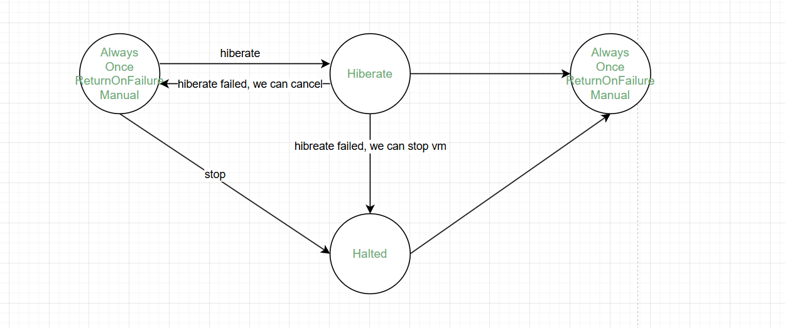
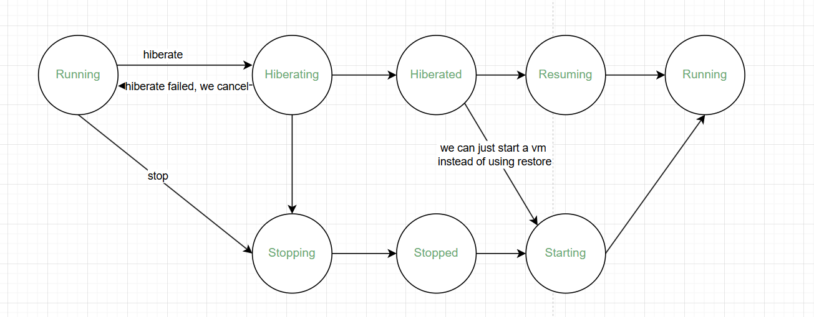
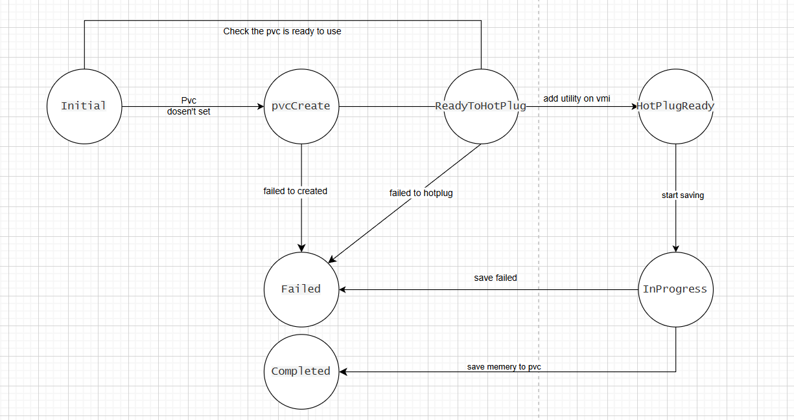
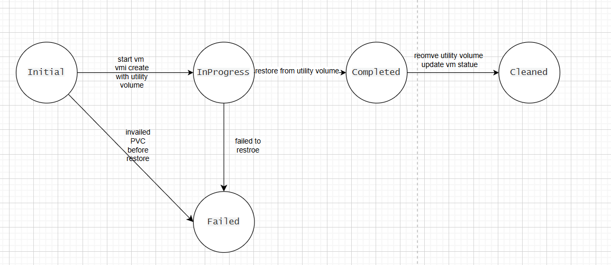

# VEP #NNNN: Your short, descriptive title

## Release Signoff Checklist

Items marked with (R) are required *prior to targeting to a milestone / release*.

- [x] (R) Enhancement issue created, which links to VEP dir in [kubevirt/enhancements] (not the initial VEP PR)
- [ ] (R) Target version is explicitly mentioned and approved
- [ ] (R) Graduation criteria filled

## Overview

This proposal introduces a VM hibernation mechanism for KubeVirt, enabling users to stop and start virtual machines by saving and restoring their running memory state.

## Motivation

Some users wish to shut down running machines to free up resources, but the virtual machine state remains the same when turned on as when turned off.

## Goals

- Add VM hibernation functionality to kubevirt(Using the save restore method while retain the possibility of using the suspendToDisk method)
- Introduce a new runStrategy `Hibernate` to trigger vm Hibernate.
- Use utility volume scheme to save memory data to a file system type PVC through a controller-managed approach

## Non Goals

Any modification to the hotplug and hotunplug volume process.

## Definition of Users

**KubeVirt Controllers:** Primary users with appropriate service account permissions to trigger vm Hibernate.

**Kubernetes Administrators/Operators:** Initiate operations through higher-level APIs that trigger Hibernate.

## User Stories

A user who can edit vm object in k8s. They can edit vm runstrategy to Hibernate a vm which save memory to a pvc and stop vm. As will as user can restore vm form the pvc.

## Repos

[https://github.com/kubevirt/kubevirt](https://github.com/kubevirt/kubevirt)

## Design

### **Triggering Hibernation**

- The user sets `spec.runStrategy: Hibernate` in the VM object to initiate hibernation.
- The controller detects the field change and starts the hibernation process.

```yaml
spec:
  runStrategy: Hibernate
```

The transition of VM `runStrategy` is as follows:



### VM State Transition

Also we need some new `VirtualMachinePrintableStatus`:Hiberating, hiberated, Resuming.



### Hibernation and Wake Strategy

The hibernation configuration includes the method, timeout, and the PVC used.  Also we should have a cluster-level default config.

Add `HibernateStrategy` and `StartStrategy` in `vm.spec` to specify hibernation-related configuration.

```yaml
HibernateStrategy:
  mode: save
  timeoutSeconds: 500
  claimName: XXX-PVC
StartStrategy: restore
```

If the `save` method is used and `claim name` is not set, KubeVirt will create a PVC based on the VM's memory size and render the corresponding strategy fields. If no `hibernation method` is set, the default is the `save` method.

We need to consider scenarios where VM is hiberated but we want to start it directly using the start interface. Therefore, we hope to expose an interface to control this. We have found that there is already a StartStrategy interface available now, If `StartStrategy ` is not set, If we start vm, vm will directly using the start interface. We need to set `StartStrategy` to`restore` to trigger restore a vm  using the `restore`interface. 

#### cluster-level config

We also need cluster-level config, which not only reduces the workload of additional configuration in each virtual machine, but also serves as a fallback mechanism to ensure that the Hibernate process always has a timeout period.

We  can setting global configuration in kubevirt-cr:

```
spec:
  configuration:
    defaultHibernateConfig:
      HibernateStrategy:
        mode: save
        timeoutSeconds: 500
      StartStrategy: restore
```

### VM Status

Just like memorydump add the `VirtualMachineHibernationStatuses` field to the VM's status:

```yaml
VirtualMachineHibernationStatuses:
  Phase:
  Claim:
  filename:
  StartTimestamp:
  EndTimestamp:
  // Empty if Hibernate succeed, contains reason otherwise
  Reason:
```

The `Phase` field references the `dumpmemory` package and includes:

```go
const (
    HibernationPhaseInitial              HibernationPhase = "Initial"
    HibernationPhasepvcCreate            HibernationPhase = "pvcCreate"
    HibernationPhaseReadyToHotPlug       HibernationPhase = "ReadyToHotPlug"
    HibernationPhaseHotPlugFinished      HibernationPhase = "HotPlugFinished"
    HibernationPhaseInProgress           HibernationPhase = "InProgress"
    HibernationPhaseCompleted            HibernationPhase = "Completed"
    HibernationPhaseFailed               HibernationPhase = "Failed"
)
```

Also we need resume from Hibernated(instead of restore already used). Add `VirtualMachineRestoreStatuses`field to the VM's status:

```
VirtualMachineRestoreStatuses:
  Phase:
  StartTimestamp:
  EndTimestamp:
  // Empty if restore succeed, contains reason otherwise
  Reason:
```

The `Phase` field is also references the `dumpmemory` package and includes:

```go
const(
    ResumePhaseRestoreInitial       ResumePhase = "Initial"    
    ResumePhaseRestoreInProgress    ResumePhase = "InProgress"
    ResumePhaseRestoreFailed        ResumePhase = "Failed"
    ResumePhaseRestoreCompleted     ResumePhase = "Completed"
    ResumePhaseClean                ResumePhase = "Cleaned"
)
```

### VMI Status

In my opinion, we can talk about this later.

---

### workflows

### 1. Hibernation

VirtualMachineHibernationStatuses can convert with below workflow.



#### Step 1: Trigger & Initial Check

1. The user triggers hibernation by setting `spec.runStrategy` of the VM to `Hibernate`. vm.status.HibernationStatuses create whith phase `Initial`. and check pvc is ready to use, if pvc is not suitable for use, conntroller will create event.

   > The pvc size should largger than vm memory size + 512MB (I think we can talk about how to define pvc size more deeper)

   > If PVC is not specified in spec.HibernateStrategy, HibernationStatuses phase to `pvcCreate`.and create a pvc(vm memory size + 512MB). 
   >
   > virt-controller should set ownerReferences of PVC with vm.
   
2. Add StartStrategy `restore` on vm.spec.

#### Step 2: Hot Mount PVC

1. While it is confirmed that PVC can be mounted, controller add utilityVolumes spec on vmi.

   ```
     # NEW FIELD:
     utilityVolumes:
       - name: Hibernate-f35782b2bd8c578bea6caf2087efa7e8
         persistentVolumeClaim:
           claimName: data-pvc
         type: Hibernate
   ```
   
2. When pvc has hotpluged to launcher pod, virt-handler sync vmi and exec save domain.

#### Step 3: Perform Hibernation (currently only supports `virsh save`)

1. Use the `save` interface to write memory to fIie with name (restroe-vm.name-timestamp)  and save file name to HibernationStatuses.
2. Record `Phase.StartTime` at the beginning.
3. Upon successful hibernation, record `Phase.StartTime`, and update `Phase` to `Completed`. If failed, update phase to `Failed` and set failed reason.

#### Step 4: Cleanup

1. Sequentially clean up the launcher pod and VMI. Keep VirtualMachineHibernationStatuses(include pvc info)  in vm status.
1. If hibernate failed, just remove StartStrategy `restore` on vm.

---

### 2. Restore

VirtualMachineRestoreStatuses  can convert with below workflow.



#### Step 1: Trigger

1. Set vm `spec.runStrategy` to `always` or other, and `WakeStrategy.mode` to `restore` .

   > webhook: If  pvc name dosen't seva in vm.status.HibernationStatuses, virt-api should deny the update.

2. Set VirtualMachineRestoreStatuses on vm with phase `Initial`

#### Step 2: Use utility volume to mount PVC

1. Based on the existing vm start process,While render and create vmi, add utility volume to vmi with PVC store in vm.VirtualMachineHibernationStatuses.
1. While pvc has mounted on launcher pod, just simple check the file(file name).

#### Step 3: Execute Restore

1. After a simple check of mounted file, virt-handler exec `restore` grpc request with mounted file path.
2. Record `VirtualMachineResumeStatuses.StartTime` at the beginning, phase to `InProgress`.
3. Upon successful restore, record `VirtualMachineResumeStatuses.EndTime`, and update phase to `Completed`. If failed, update phase to `Failed`.
4. Only clean when VirtualMachineResumeStatuses in `Completed` phase. if VirtualMachineResumeStatuses `Failed`, just set failed reason(timeout or something) in VirtualMachineResumeStatuses.Reason.

#### Step 4: Cleanup

1. Remove utility volume on vmi.

2. Remove VirtualMachineHibernationStatuses in vm.status.

   > if pvc is automatically created, it will be automatically deleted as will as user specified pvc will not to delete.

---

### 3. Direct Start Without Restore

In some cases, such as recovery failure or PVC disappeared due to other reasons. It is impossible to restore vm. 

#### Step 1: Trigger

1. The user sets VM `spec.runStrategy` to `always` or other, and remove `startStrategy` on vm .

   > Dosen't add utility volume on vmi while creating vmi.

#### Step 2: Cleanup

1. remove vm.status.VirtualMachineHibernationStatuses(`Clean`).

   > if pvc is automatically created, it will be automatically deleted as will as user specified pvc will not to delete.

## API Examples

### Hibernate a running vm

before

```
spec:
  runStrategy: Running
```

after

```
spec:
  runStrategy: Hibernate
  HibernateStrategy:
    mode: save
    timeoutSeconds: 500
    claimName: XXX-PVC
```

### Resume from a hibernated vm

before

```
spec:
  runStrategy: Hibernate
  HibernateStrategy:
    mode: save
    timeoutSeconds: 500
    claimName: XXX-PVC
```

after

```
spec:
  runStrategy: Running
  HibernateStrategy:
    mode: save
    timeoutSeconds: 500
    claimName: XXX-PVC
  StartStrategy: restore  
```

### start a hibernated vm

before

```
spec:
  runStrategy: Hibernate
  HibernateStrategy:
    mode: save
    timeoutSeconds: 500
    claimName: XXX-PVC
```

after

```
spec:
  runStrategy: Running
  HibernateStrategy:
    mode: save
    timeoutSeconds: 500
    claimName: XXX-PVC
```

## Alternatives

<!--
Outline any alternative designs that have been considered)
-->

## Scalability

<!--
Overview of how the design scales)
-->

## Update/Rollback Compatibility

<!--
Does this impact update compatibility and how?)
-->

## Functional Testing Approach

<!--
An overview on the approaches used to functional test this design)
-->

## Implementation Phases

<!--
How/if this design will get broken up into multiple phases)
-->

## Feature lifecycle Phases

<!--
How and when will the feature progress through the Alpha, Beta and GA lifecycle phases

Refer to https://github.com/kubevirt/community/blob/main/design-proposals/feature-lifecycle.md#releases for more details
-->

### Alpha

### Beta

### GA
