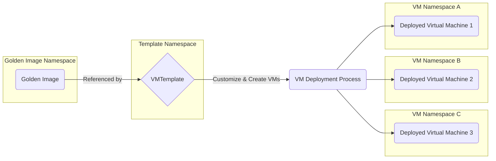
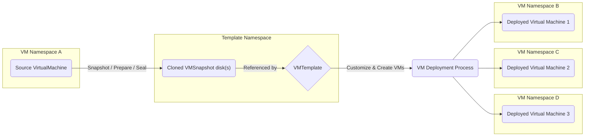
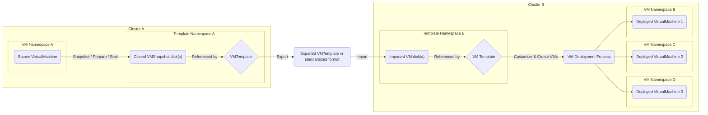
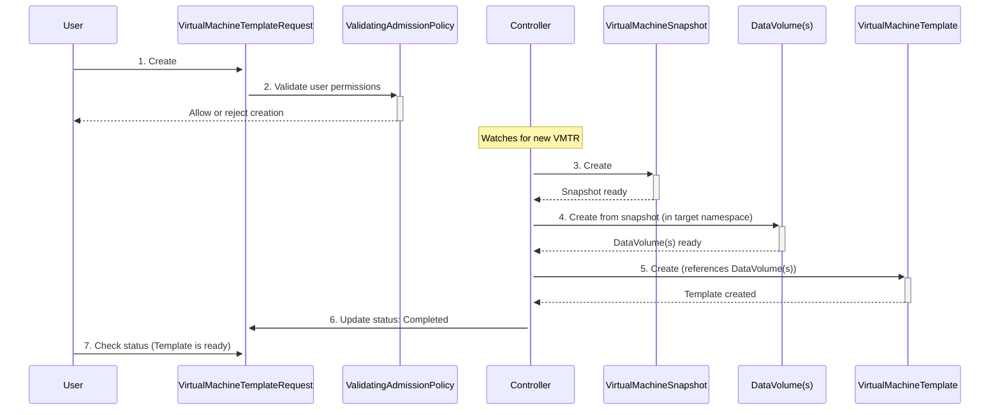

# VEP #76: Native Support For VirtualMachine Templates

## Release Signoff Checklist

Items marked with (R) are required *prior to targeting a milestone / release*.

- [x] (R) Enhancement issue created, which links to VEP dir
  in [kubevirt/enhancements] (not the initial VEP PR)
- [ ] (R) Target version is explicitly mentioned and approved
- [ ] (R) Graduation criteria filled

## Overview

KubeVirt currently lacks native, user-friendly templating workflows, a standard
feature in traditional virtualization that is essential for the rapid and
consistent deployment of VirtualMachines (VMs). This enhancement proposes to
introduce these native workflows, allowing users to create, share, and manage VM
blueprints directly within the cluster. Using templates streamlines the VM
creation process, reduces errors, and ensures uniformity across the virtualized
environment.

Although KubeVirt provides foundational elements for VM templates like snapshots
and cloning, it currently lacks native, user-friendly templating workflows.

This enhancement aims to provide such workflows, reusing and extending existing
functionality where possible to provide native in-cluster templating of
VirtualMachines.

## Motivation

The concept of templating in-cluster workloads is generally discouraged by
Kubernetes, which instead focuses on external workload template tooling such as
Helm and Kustomize. This approach is challenging for VMs because their storage
state must be captured, stored, and referenced by these external definitions.

While users can achieve this today by scripting many native KubeVirt API calls
(snapshot & export etc.) or through the use of external tooling such as the
disk-uploader from `kubevirt-tekton-tasks`, the resulting state must be hosted
and referenced by the external VM template definition.

As the term suggests, external templating of VMs also does not provide any
in-cluster representation of these templated workloads that users of more
traditional virtualization platforms might also expect.

To date, downstream vendors have provided limited support for in-cluster
VirtualMachine templating with KubeVirt.

For example, OKD and OpenShift provide their own in-cluster `Template` CRD, a
generic object templating resource that allows users to parameterize any object
definition before rendering and creating it in the cluster. This CRD is
currently used to provide golden image-based VirtualMachine templates to end
users through the common-templates project. There is currently no support in OKD
or OpenShift for existing VirtualMachines to be turned into reusable templates
with the same level of parametrization and customization as the golden image
templates.

Instance types and preferences were introduced to simplify the initial creation
of VMs but importantly, do not provide references to additional networks and
volumes that should be attached to a VM. This design decision was taken to
ensure instance types and preferences were generic and reusable across differing
clusters by not retaining cluster-specific data. For example, they allow
creating VMs from specific volumes but do not allow the use case of creating
VMs with multiple pre-defined disks. As such, they cannot be used as
a substitute for a more complete and traditional VM template mechanism, that
allows referring to environment specific details such as networks, multiple
disks or possibly DRA resources in the future.

Additionally, there is no method to import or export VMs as reusable
templates between clusters. With the help of an in-cluster templating
mechanism, this workflow can also be made possible.

A native, in-cluster workflow for creating, using, and later importing/exporting
VM templates will reduce the need for users to create custom solutions and
provide a more seamless, traditional virtualization experience.

## Use cases

This enhancement focuses on two core use cases for VM templates. In addition, a
possible import and export mechanism is described, which is to be introduced at
a later stage.

The first core use case is the golden image template where the underlying golden
image is periodically updated. This is the use case currently targeted
downstream within OKD and OpenShift with their use of the `Template` CRD and
[common-templates](https://github.com/kubevirt/common-templates) project.

The second use case is the traditional method of creating a template from an
existing, user-configured VM.

Both use cases should eventually enable the customization and creation of new
VMs in separate namespaces to that of the template.

The existing VM use case should also eventually allow for some level of
automated prepping and sealing of the original VM. For example, running specific
commands within the guest or against the snapshot disks. This can be
optionally implemented in a later phase.

To make VM templates reusable, an import and export mechanism is required. This
mechanism would allow exporting existing VM templates from a cluster into a
standardized format (preferably OVA/OVF) and would allow importing templates in
this standardized format to other clusters. As long as imported templates
conform to the standardized format, they do not have to originate from an
existing VM in a cluster and can also be provided by software vendors for their
appliances or in other ways.

### Golden image templates



### Existing VirtualMachine templates



### Export / Import of VirtualMachine templates between clusters



## Goals

* Provide native support for in-cluster templating of golden image-based
  VirtualMachines
* Provide native support for in-cluster templating of existing VirtualMachines
* Provide inter-namespace sharing of templated VirtualMachines
* Provide inter-cluster sharing of templated VirtualMachines
* Provide import/export of VirtualMachine templates in a standardized format
  (OVA/OVF)

Apart from the import and export of VirtualMachine templates, these goals
should be implemented in the 1.7.0 development cycle.
See [Implementation phases](#implementation-phases-for-v1alpha1-in-v170)
and [Feature
lifecycle phases](#feature-lifecycle-phases) for more.

## Non Goals

* Replace external configuration management tools like Helm or Kustomize.
* Real-time guest operations or application-level quiescing during the template
  creation process are not in scope for the initial implementation
* Adding a plugin mechanism to `virtctl` (such a mechanism could be
  used to break dependencies in the future)
* Factoring out resource settings or runtime preferences (consume instance
  types and preferences in templates instead)

## Definition of users

* Cluster admin: Manages the cluster and should be able to provide templates
  that can be consumed by VM owners
* VM owners: Users on the cluster which should be able to create VMs in freeform
  or from templates. They should also be able to create templates from their
  existing VMs or import templates from a standardized format

## User Stories

* As a VM owner, I want the ability to create a templated VirtualMachines
  referencing a golden image
* As a VM owner, I want the ability to create a templated VirtualMachines from
  an existing VirtualMachine
* As a VM owner, I want the ability to create a VirtualMachine from a templated
  VirtualMachine that is stored in a different namespace
* As a VM template owner, I want the ability to import templates from a
  standardized format (OVA/OVF)
* As a VM template owner, I want the ability to export templates to a
  standardized format (OVA/OVF)
* As a VM template owner or cluster admin, I want the ability to provide
  templates that can be accessed cluster wide.
* As a cluster admin, I want to restrict users via RBAC to only create VMs
  from approved templates

## Repos

* [kubevirt/kubevirt](https://github.com/kubevirt/kubevirt)
* [kubevirt/common-templates](https://github.com/kubevirt/common-templates)
* [kubevirt/common-instancetypes](https://github.com/kubevirt/common-instancetypes)

## Design

### Development and deployment of this feature

This design suggests developing this feature outside the core
`kubevirt/kubevirt` repository, allowing to better organize the new code and to
keep it separate from the core KubeVirt implementation. This means the feature
will have its own API server and controller.

This design proposes using a new `kubevirt/virt-template` repository. The
components in this shall be named `virt-template-controller`,
`virt-template-apiserver` and so on. To allow publishing of the api and client
separately from the main repo the `kubevirt/virt-template-api` and
`kubevirt/virt-template-client-go` repositories are proposed.

Although the feature should be developed separately, it should still be deployed
by the `virt-operator` in the core repository of KubeVirt, so that some changes
to the core repository are still required to finally integrate the feature into
KubeVirt. However, changes to the main repository should be kept to a minimum.
To allow stabilization of the feature first, the integration into
`virt-operator` should be worked on at a later stage in the v1.8.0 development
cycle.

A small downside to this approach is that `kubevirt/kubevirt` will still carry
dependencies on the separate repository, e.g. within `virtctl` as there is
currently no plugin mechanism we could use to extend the binary from outside the
core kubevirt codebase. This also means that this feature must correspond to the
KubeVirt release cycle.

The following changes to the main repository are required:

* Add FeatureGate and/or configurable for the feature to the `KubeVirt` CRD
* Extend `virt-operator` to allow deployment of the feature (pulling in
  `virt-template` manifests so that it can deploy the feature.)
* Extend `virtctl` with the commands described below (pulling in
  dependencies and not using a plugin mechanism.)

### template.kubevirt.io/v1alpha1

#### VirtualMachineTemplate

A new `template.kubevirt.io` APIGroup will be introduced with an initial
`v1alpha1` version being provided. The APIGroup will provide the
`VirtualMachineTemplate` CRD heavily influenced by the `template.openshift.io`
APIGroup and `Template` CRD provided downstream within OKD and OpenShift.
However, instead of being a generic template for all kinds of CRDs, this CRD
will only focus on templating of KubeVirt `VirtualMachines`.

All features supported by the `VirtualMachine` CRD will be supported in the
template, i.e. you can also consume instance types and preferences in a
template. Placeholders, such as `${NAME}`, are replaced with specific values
when the template is processed.

Deployment of the whole template feature will sit behind the `Template`
FeatureGate in core KubeVirt.

This initial version focuses on the use cases described above of the simple VM
template based on a golden image and the creation of templates from existing
VMs. The import and export use case of templates is to be implemented at a later
stage.

Initially, this will handle cross-namespace templates to VM creation using the
same CDI workaround as the common-templates project currently employs. Providing
a namespaced `SourceRef` reference to a `DataSource` golden image within the
DataVolumeTemplate section of the VirtualMachine. This is currently the only way
a VirtualMachine can be created using storage from another namespace
until [KEP-3294](https://github.com/kubernetes/enhancements/tree/master/keps/sig-storage/3294-provision-volumes-from-cross-namespace-snapshots)
and [KEP-3766](https://github.com/robscott/k8s-enhancements/tree/master/keps/sig-auth/3766-referencegrant)
are addressed within core Kubernetes and later KubeVirt’s own CDI project.

This design will hopefully allow users of the current downstream OpenShift-based
template implementation to try out this new implementation, and in doing so
provide quick and valuable feedback we can use to justify graduation. To help
with this, a fork of the common-templates project will be created, replacing the
existing Template definitions with new VirtualMachineTemplates. The use of
instance types and preferences in this fork will significantly reduce the number
of duplicated definitions and templates and also significantly reduce the
maintenance effort.

As with the downstream implementation of the `Template` CRD the associated logic
to process the template will be provided by a local client-side command and
server-side subresource API detailed below.

##### Example VirtualMachineTemplate

```yaml
apiVersion: template.kubevirt.io/v1alpha1
kind: VirtualMachineTemplate
metadata:
  name: fedora
spec:
  virtualMachine:
    metadata:
      name: ${NAME}
    spec:
      dataVolumeTemplates:
      - metadata:
          name: ${NAME}
        spec:
          storage:
            resources:
              requests:
                storage: 30Gi
          sourceRef:
            kind: DataSource
            name: ${DATA_SOURCE_NAME}
            namespace: ${DATA_SOURCE_NAMESPACE}
      runStrategy: Halted
      instancetype:
        name: ${INSTANCETYPE}
      preference:
        name: fedora
      template:
        spec:
          architecture: amd64
          domain:
            devices:
              interfaces:
              - masquerade: {}
                name: default
          terminationGracePeriodSeconds: 180
          networks:
          - name: default
            pod: {}
          volumes:
          - dataVolume:
              name: ${NAME}
            name: disk-1
          - cloudInitNoCloud:
              userData: |-
                #cloud-config
                user: fedora
                password: ${CLOUD_USER_PASSWORD}
                chpasswd: { expire: False }
            name: cloudinitdisk
  parameters:
  - name: NAME
    description: VM name
    from: 'fedora-[a-z0-9]{16}'
    generate: expression
  - name: INSTANCETYPE
    description: VM instance type
    value: u1.medium
  - name: DATA_SOURCE_NAME
    description: Name of the DataSource to clone
    value: fedora
  - name: DATA_SOURCE_NAMESPACE
    description: Namespace of the DataSource
    value: kubevirt-os-images
  - name: CLOUD_USER_PASSWORD
    description: Randomized password for the cloud-init user fedora
    from: '[a-z0-9]{4}-[a-z0-9]{4}-[a-z0-9]{4}'
    generate: expression
```

#### process subresource API

A new` /process` subresource API will be implemented on
`VirtualMachineTemplates` to allow simple server-side processing of templates.
This is very much influenced by the OKD and OpenShift implementation of the
`Template` CRD and will allow for easy processing of `VirtualMachineTemplates`
through lightweight clients such as the console UI found on OKD and OpenShift.

To provide this and other subresource APIs a `virt-template-api` service needs
to be deployed and registered accordingly.

#### create subresource API

A new` /create` subresource API will be implemented on `VirtualMachineTemplates`
to enable easy server-side creation of VMs from templates. By adding this
subresource API, cluster admins can restrict users via RBAC to only create VMs
from approved templates.

#### virtctl template process ${VirtualMachineTemplateName}

A new process subcommand will be introduced to the `virtctl` binary, again very
much influenced by the `oc process` command provided downstream by OKD and
OpenShift. Since this command is related to templates it will be added as a
subcommand to the newly added `template` root command.

This subcommand processes a `VirtualMachineTemplate`, which can be specified
as a reference to a cluster object or a local file. It applies any supplied
parameters and outputs the rendered `VirtualMachine` manifest to standard
output (stdout).

```shell
$ virtctl template process fedora -p foo=bar
```

Internally the` process` subcommand should use the same processing logic as the
`/process` subresource API that is described above. This should be
achieved by vendoring the logic that is hosted in the external
`kubevirt/virt-template` repository into `kubevirt/kubevirt` for use within
`virtctl`.

#### VirtualMachineTemplateRequest

A `VirtualMachineTemplateRequest` CRD will be introduced in the
`template.kubevirt.io` APIGroup. This CRD will allow for an existing
VirtualMachine to be captured as a template.

This process will be orchestrated by a new controller that processes
`VirtualMachineTemplateRequests`, captures a `VirtualMachineSnapshot` of the
target `VirtualMachine`, clones this snapshot via a `DataVolume` into the target
namespace and finally creates the `VirtualMachineTemplate` object that contains
a representation of the original `VirtualMachine` object in the target
namespace. The `VirtualMachineTemplate` will be created in the same namespace as
the `VirtualMachineTemplateRequest`. The name of the newly created
`VirtualMachineTemplate `will be equal to that of the
`VirtualMachineTemplateRequest`.

Any `DataVolumeTemplates` present in the original `VirtualMachine` will be
rewritten to use the `VolumeSnapshots` that were captured by the
`VirtualMachineSnapshot` of the original `VirtualMachine` and that were cloned
into `DataVolumes` in the target namespace.

By using `DataVolumes` to clone `VolumeSnapshots`, it is possible to create
templates outside the namespace in which the original target `VirtualMachine` is
located.

To validate that the user creating the `VirtualMachineTemplateRequest` has
appropriate permissions to create a template from the original
`VirtualMachine` (reading its definition and snapshotting it),
suitable `ValidatingAdmissionPolicy` objects will be provided to check
the permissions of the user before creation of the
`VirtualMachineTemplateRequest` is allowed. If the user does not have
sufficient permissions the creation must be rejected.

The controller will automatically parameterize the `metadata.name` field of the
resulting `VirtualMachineTemplate`. Further parameterization, if needed, can be
applied by manually editing the template object after its creation.

Lastly a `Ready` status condition is added to the `VirtualMachineTemplate`,
to indicate that it is ready to be used.

The resulting `VirtualMachineTemplate` will still need to be processed to
generate a `VirtualMachine` definition.

At a later stage (presumably v1beta1), this CRD could also be used to control
the import of templates from standardized storage formats (such as OVA/OVF) into
a cluster.

**Important note**: The `v1alpha1` implementation does not address sealing VMs
or removing sensitive information such as SSH host keys, machine ID files or
user data. It is the user's responsibility to remove sensitive information from
a VM before creating a template from it.

##### Sequence diagram



##### Example VirtualMachineTemplateRequest

```yaml
apiVersion: template.kubevirt.io/v1alpha1
kind: VirtualMachineTemplateRequest
metadata:
  name: my-template
  namespace: my-template-namespace
spec:
  virtualMachineRef:
    name: my-vm
    namespace: my-vm-namespace
```

##### Example VirtualMachineTemplate

```yaml
apiVersion: template.kubevirt.io/v1alpha1
kind: VirtualMachineTemplate
metadata:
  name: my-template
  namespace: my-template-namespace
spec:
  virtualMachine:
    metadata:
      name: ${NAME}
    spec:
      dataVolumeTemplates:
      - apiVersion: cdi.kubevirt.io/v1beta1
        kind: DataVolume
        metadata:
          name: ${NAME}-disk-1
        spec:
          storage:
            resources:
              requests:
                storage: 30Gi
          source:
            pvc:
              name: my-template-disk-1
              namespace: my-template-namespace
      runStrategy: Halted
      preference:
        name: fedora
      instancetype:
        name: u1.medium
      template:
        spec:
          architecture: amd64
          domain:
            devices: {}
          terminationGracePeriodSeconds: 180
          networks:
          - name: default
            pod: {}
          volumes:
          - dataVolume:
              name: ${NAME}-disk-1
            name: disk-1
          - cloudInitNoCloud:
              userData: |-
                #cloud-config
                user: fedora
                password: 1234
                chpasswd: { expire: False }
            name: cloudinitdisk
  parameters:
  - description: VM name
    from: 'fedora-[a-z0-9]{16}'
    generate: expression
    name: NAME
status:
  conditions:
    - lastProbeTime: null
      lastTransitionTime: "2025-08-06T12:30:15Z"
      status: "True"
      type: Ready
```

#### virtctl template create

A new `create` subcommand will be introduced to the `virtctl` binary below
the `template` root command. This will allow users to generate an
appropriate `VirtualMachineTemplateRequest` object to turn an existing
`VirtualMachine` into a `VirtualMachineTemplate`.

```shell
$ virtctl template create my-template --from-vm=my-vm-namespace/my-vm -n my-template-namespace | kubectl create -f -
$ kubectl wait -n my-template-namespace virtualmachinetemplaterequest/my-template --for condition=Completed
$ virtctl template process -n my-template-namespace my-template -p NAME=my-new-vm | kubectl create -f -
```

The subcommand creates a `VirtualMachineTemplateRequest` object, which
triggers the controller. This asynchronous process ensures that complex
operations like snapshotting and cloning are handled robustly by the cluster
rather than by a client-side command.

#### common-templates - Preview branch

The proposed feature will be prototyped by adapting the existing
`kubevirt/common-templates` project to use the new `VirtualMachineTemplate` CRD,
demonstrating a clear migration path. A `preview` branch will be cut within the
common-templates project switching the existing OpenShift `Template` based
resources over to `VirtualMachineTemplate`. To simplify maintenance of the new
templates, instance types and preferences shall be consumed to allow creating
differently sized VMs from a single template and to reduce the duplication of
runtime settings. This is made possible by parametrizing the used instance
type within the template and keeping preferences hardcoded.

See [Example VirtualMachineTemplate](#example-virtualmachinetemplate) for an
example of an adapted `VirtualMachineTemplate`.

If this proposal is successful, the `kubevirt/common-templates` project would
eventually be adapted to the `VirtualMachineTemplates` found in the new
`kubevirt/virt-template` repository.

### template.kubevirt.io/v1beta1

#### Extended status in VirtualMachineTemplates

To better keep track of the resources associated with a `VirtualMachineTemplate`
the status of the CRD could be extended with a list of volumes on which the
template is dependent. The list should also contain the
`Ready` condition of the volumes.

This function requires that the `VirtualMachineTemplate` controller evaluates
all `DataVolumeTemplates` in a specific template and constructs the status from
all volumes that it can resolve.

#### Import/Export of VirtualMachineTemplates in standardized format

As previously mentioned, to make VM templates reusable, an import and export
mechanism is required. Ideally, this mechanism should use a common and
standardized format, to not only allow the import of templates created by
KubeVirt, but also the import of appliances created by software vendors and
templates created through other tools. As a widely adopted open standard in the
virtualization industry, OVA/OVF is the ideal format for KubeVirt to implement.

The entry point for the import mechanism should be a new
`VirtualMachineTemplateImport` CRD, which contains the required fields to
specify a remote location where an OVA/OVF file can be obtained from and where
it should be imported to. Another option could be the direct upload into the
cluster through `virtctl` and possibly with the help of CDI.

Once the OVA/OVF file can be processed, the contained disks need to be imported
into PVCs and the attached virtual machine definition needs to be converted into
a KubeVirt `VirtualMachine`. Once these tasks are completed the controller can
create a new `VirtualMachineTemplate` from the results. This new template can
then be used to create actual `VirtualMachines` from the imported template.

Similar to the import mechanism, the entry point to the export mechanism should
be a new `VirtualMachineTemplateExport` CRD containing the required
fields to specify either an existing `VirtualMachineTemplate` to be exported.
Once the exported template is ready to be downloaded, the controller should
make the URL to download the template available in the status of the new CRD.

For both import and export, `virtctl` should be extended to enable the feature
to be used easily via the CLI.

## API Examples

For API examples, see the code blocks in the `template.kubevirt.io/v1alpha1`
design.

## Alternatives

### Develop feature inside the core KubeVirt repository

The current design proposes to develop this feature outside the KubeVirt core
repository. An alternative would be to develop the feature within the KubeVirt
core repository. However, this would lead to a slowdown in development as it
would further increase the burden on reviewers in the core repository, would
require all KubeVirt e2e tests to be run, most of which have nothing to do with
the feature, and it would further increase the already substantial codebase.
These advantages outweigh the maintenance effort that another operator entails.

### Use existing k8s workload template solutions such as Helm or Kustomize

As discussed within the Motivation section, there are many drawbacks to using
existing out of cluster k8s template tooling such as Helm and Kustomize to
template VMs. Most notably, these solutions do not manage the underlying storage
state, a critical requirement for templating stateful workloads like VMs.

### Extend the containerdisks to include a VirtualMachine definition

This could be an alternative to using a standardized format such as OVA/OVF to
import and export VM templates. However, this would be a proprietary solution
that is only supported by KubeVirt and does not allow interoperability with the
larger virtualization ecosystem.

However, to make sharing of OVA/OVF files easier, a containertemplate
format could be introduced during the v1beta1 implementation cycle.

### Extend instancetype.kubevirt.io to include networks and volumes

As detailed in the motivation, extending instance types would contradict their
design goal of being generic and cluster-agnostic.

## Scalability

Adding this feature to KubeVirt should not affect its scalability. The new
controller will only be concerned with the CRDs introduced by the design. The
feature itself will mostly make use of the APIs already provided by KubeVirt.

## Update/Rollback Compatibility

The way of implementing this feature suggested by this design only requires
minimal changes to the core KubeVirt repository. Therefore, the worst case when
rolling back to an earlier version of KubeVirt would be that the feature is no
longer available. However, all custom resources created from CRDs proposed in
this design need to be removed by disabling the feature gate before a clean
rollback is possible.

## Functional Testing Approach

Functional tests for the proposed feature should be carried out in its separate
repository, covering all important functional aspects.

In the core KubeVirt repository, functional tests are only required for the
feature's deployment by `virt-operator`.

This approach helps to keep the number of functional tests added to the core
repository to a minimum.

## Implementation Phases (for v1alpha1 in v1.7.0)

* Phase 1: Set up new subproject in its own repository, create and deploy new
  CRDs from within the subproject
* Phase 2: Port over existing `common-templates` to the new
  `VirtualMachineTemplate` CRD
* Phase 3: Implementation of the `VirtualMachineTemplateRequest` feature
* Phase 4: Implementation of the new `virtctl` commands (Optional, may not
  be merged yet)

## Implementation Phases (for v1beta1 in v1.8.0)

* Phase 1: Implementation of the new `virtctl` commands (Continued)
* Phase 2: Integration of the feature within the core KubeVirt repository
* Phase 3: Implementation of the import and export feature (OVA/OVF)

## Feature lifecycle Phases

### Alpha

template.kubevirt.io/v1alpha1 in v1.7.0

### Beta

template.kubevirt.io/v1beta1 in >=v1.8.0

### GA

template.kubevirt.io/v1 in >=v1.9.0
