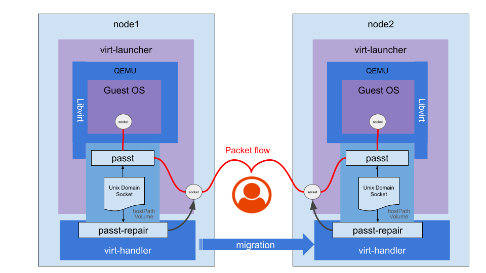

# VEP #21: Seamless TCP migration and vhost-user support with passt

## VEP Status Metadata

### Target releases

- ~This VEP targets alpha for version:~
- This VEP targets beta for version: v1.8
- This VEP targets GA for version: v1.10

### Release Signoff Checklist

Items marked with (R) are required *prior to targeting to a milestone / release*.

- [x] (R) Enhancement issue created, linking to VEP directory in [kubevirt/enhancements] (not the initial VEP PR)
- [ ] ~(R) Alpha target version is explicitly mentioned and approved~
- [x] (R) Beta target version is explicitly mentioned and approved
- [x] (R) GA target version is explicitly mentioned and approved

## Overview

KubeVirt uses [network bindings](https://kubevirt.io/user-guide/network/network_binding_plugins/#network-binding) to provide virtual machines with network connectivity.

Currently, only the core [masquerade binding](https://kubevirt.io/user-guide/network/interfaces_and_networks/#masquerade) supports VM [live-migration](https://kubevirt.io/user-guide/compute/live_migration/). The masquerade binding preserves the IP address in the guest, allowing it to operate post a VM migration. 
A custom network binding plugin may support migration if its author has taken it into consideration (https://github.com/kubevirt/kubevirt/blob/main/docs/network/network-binding-plugin.md#migration-support).

The [passt network binding plugin](https://kubevirt.io/user-guide/network/net_binding_plugins/passt/) has been available for some time, providing a user-space alternative to the kernel-based masquerade binding.

There have been two main challenges with `passt`: its performance and the ability to perform a seamless migration (which masquerade lacks), where seamless migration refers to a process where connections remain uninterrupted throughout the transfer, ensuring no disconnections or downtime for users.

In `passt` [release 2025_02_17.a1e48a0](https://passt.top/passt/tag/?h=2025_02_17.a1e48a0), performance has been improved by using the `vhost-user` [protocol](https://qemu-project.gitlab.io/qemu/interop/vhost-user.html#introduction) to enable direct communication between passt and the guest OS. 
Additionally, seamless migration has been achieved by preserving TCP connections during the VM migration process.

At its base, the network binding does not require any special integration with the migration flow. Once a migration is requested, KubeVirt creates a target pod and expects it to be setup correctly, including the network, 
before the migration is initiated at the domain level. When the domain is started on the target (and stopped on the source), everything should be already in place and operational.
However, to allow the new `passt` to preserve TCP connection during the migration, there is a need for a new special integration with Kubevirt.

The integration involves the ability of `passt` to save the state of the active TCP sockets for migration on the source and their restoration on the target. 
For that, a privileged action is needed, which `passt` does not have, as it is bounded by the capabilities of virt-launcher. 
The integration involves a communication channel between `passt` and KubeVirt virt-handler which will perform limited selected privileged actions on behalf of `passt` on the open TCP sockets.

This feature evolved across phases. It was introduced in Alpha with `passt` delivered as a [network binding plugin](https://kubevirt.io/user-guide/network/network_binding_plugins), where the seamless migration integration with virt-handler was added and guarded by a feature gate.
For Beta and GA, the `passt` binding is migrated into the KubeVirt core and exposed in the API. The core binding enables the seamless migration functionality by default.

> [!NOTE]
> `passt` used to be a core network binding and was [removed](https://github.com/kubevirt/kubevirt/pull/11915) in KubeVirt release 1.3, as Network Binding Plugins 
> functionality was introduced. As the binding is now promoted back into the core, a new API name (`passtBinding`) is used, since the original `passt` `InterfaceBindingMethod` was deprecated in release 1.3.

> [!NOTE]
> Seamless TCP migration requires sticky IP addresses. 
> It will not work with Network Providers/CNIs that do not assign the same IP to source and target pods.

This proposal outlines the integration plan to be implemented in KubeVirt.

## Motivation

Currently, KubeVirt does not support all Primary Network requirements expected by users:
- Seamless network connectivity on migration of TCP connections.
- Observability tools such as [Stackrox Collector](https://github.com/stackrox/collector).
- Service Mesh technologies such as [Istio](https://istio.io) and [Linkerd](https://linkerd.io/).
- High throughput (on par with Masquerade).

Masquerade hides the real IP from the user, Bridge binding does not support observability or service meshes and is [not migratable with pod network](https://github.com/kubevirt/kubevirt/blob/f8aa1f85ffca1a6a477bbb1d369097b3b0e36088/pkg/network/vmispec/interface.go#L57)
, and `passt` until recently lacked seamless migration and tap-level performance.
These gaps have been recently addressed in `passt` [release 2025_02_17.a1e48a0](https://passt.top/passt/tag/?h=2025_02_17.a1e48a0).

## Goals

- Seamless live migration of TCP connections without disconnection for Primary Network.
- Support for observability tools and service mesh technologies.
- Enhanced IPv6 support: Supporting dynamic configuration for the guests (RA, DHCPv6).
- High network throughput, on par with the masquerade network binding.

## Non Goals

- Supporting network protocols other than those that are [currently supported](https://passt.top/passt/about/#protocols).
- Supporting CNIs that do not provide sticky IP addresses during migration (migration succeeds, but existing connections break).
- Deployment of passt binding plugin.

## Definition of Users

- Cluster Admins
- VM/Namespace owners
- Guest VM users – typically unaware of their network binding

## User Stories

- As a Cluster Admin and as a Namespace Owner, I require seamless VM migration to perform infrastructure upgrades without affecting business continuity, preserving connectivity even for sensitive applications and protocols.
- As a Guest VM user, I want optimal network performance comparable to masquerade, ensuring my virtualized applications perform well.  
- As a Cluster Admin and as a Namespace Owner, I want observability and service meshes for enhanced monitoring, encryption, and load balancing.
- As a Cluster Admin, I want to make sure that I can upgrade existing VMs to the new binding and that the procedure to do so is clear.

## Repos

- [https://github.com/kubevirt/kubevirt](https://github.com/kubevirt/kubevirt)

## Design

The migration flow consists of many moving parts, some of which are considered external to KubeVirt or dependencies of the solution:
- `passt` and `passt-repair` perform the technical handling of the network sockets, and communicate with each other.
- `libvirt` and `QEMU` are responsible to invoke `passt`, communicate with it and carry out the actual migration.

As this proposal focuses on integration to KubeVirt, it covers the following parts:
- The DomainXML format is adapted to support `vhost-user` transport.
- The image build process of virt-handler is enhanced to include the `passt-repair` binary.
- `virt-handler` is enhanced to invoke `passt-repair` for migration source and target in precise timing.
- The `passt` binding is exposed as a core `InterfaceBindingMethod` (`passtBinding`) and configured directly by KubeVirt core components (virt-controller, virt-handler, virt-launcher).

### Live Migration with passt
##### Background

`passt`, unlike other bindings that are kernel-based, is a userspace application, running in virt-launcher. 
It manages its own network sockets from userspace (to be clear: those sockets serve as the KubeVirt
end of a connection where the other end is an application that is communicating with a KubeVirt application.
The other leg of the connection, is between `passt` and the guest. It is omitted from this section and is managed by `passt`).
During migration, `passt` runs in both source and target virt-launcher pods, with open sockets per existing connection.
The source `passt` holds the "active" socket whereas the target `passt` socket is not yet active.
Once migration is finalized, there's a "cut-off" of traffic from the source pod to the target pod.
In order for seamless migration to succeed, both source and target sockets must be in identical state at the point of "cut-off";
otherwise the TCP protocol doesn't allow continuity.
The logical steps of "cut-off" are:
1. Freeze source socket. Halting traffic.
2. Record source socket state, by source `passt`.
3. Transfer state data to target `passt`.
4. Set target socket state using imported state data, by target `passt`, while in "frozen" state.
5. Unfreeze target socket, by target `passt`.

Once "cut-off" is complete, packets are resent and are accepted and acked by peers. This is handled by the TCP protocol stack, even without the application's knowledge.
> [!NOTE]
> The so-called "freeze/unfreeze" socket operations mentioned above are implemented in Linux by the TCP_REPAIR socket option. 




#### Support live migration

The [Live Migration](https://kubevirt.io/user-guide/compute/live_migration/#live-migration) process triggers a chain of events, which at a high level networking perspective involves the following steps:
- A target virt-launcher pod is prepared, with applicable network plumbing.
- Libvirt is executed. It receives the DomainXML data from the source VM, and it also launches the `passt` binary, before executing QEMU, which starts the VM.
- Once both source and target VMs are up, depending on [the migration strategy](https://kubevirt.io/user-guide/compute/live_migration/#understanding-different-migration-strategies) a switchover occurs from the source to the target.
- The passt instance running on the source sets the TCP_REPAIR socket option on TCP sockets. Thus freezing the state of the connection and allowing a dump of all the information needed to restore it (sequences, congestion window parameters, pending data queues - IP addresses and ports are already known).
- The `passt` instance in the source host, communicates the state to peer `passt` process running in the target host, via [facilities provided by vhost-user](https://qemu-project.gitlab.io/qemu/interop/vhost-user.html#migrating-back-end-state)
- Upon receipt, the target `passt` sets the `TCP_REPAIR` socket option on a new target socket, it restores the state, and eventually clears the `TCP_REPAIR` socket option. 
- The connection is now seamlessly resumed, continuing from where it left off.

#### Linux capabilities
As explained above, passt needs to set and clear the `TCP_REPAIR` socket option. Since this operation enables "hijacking" connections, it is implemented in Linux as a privileged operation requiring `CAP_NET_ADMIN`.
Since passt runs in the unprivileged Linux context of virt-launcher, it lacks the necessary `CAP_NET_ADMIN` capability. Therefore, passt delegates this operation to a privileged helper running in virt-handler.

#### The Role of passt-repair

The helper responsible for handling `TCP_REPAIR` is called [passt-repair](https://man.archlinux.org/man/passt-repair.1.en). 
It is a [C program](https://passt.top/passt/tree/passt-repair.c) included in the `passt` package.
`passt` creates a Unix Domain Socket in a predefined location (which is available to both virt-launcher and virt-handler as a `hostPath` mounted volume).
It starts a server that binds to the socket, and waits for incoming messages.
`passt-repair` is executed as a **one-off process**, separately on migration source and migration target.
It waits for the Unix Domain Socket to exist, creates a client connection and sends a message to `passt` signaling its availability.
Once `passt`(both source and target) is ready to migrate the connection, upon event from QEMU, it sends a message containing a batch of socket file descriptors and set/clear flags for each.
`passt-repair` upon receiving a request:
- Loops over socket file descriptors in request.
  - For each: Sets or clear the `TCP_REPAIR` socket option, according to socket FD and set/clear flag. 
  - Notifies passt upon completion.

> [!NOTE] 
> In the future, it may be desirable to implement this simple logic in Go rather than call an external binary. 
> However, for the initial introduction of this functionality it will be simpler and safer to have both client and server released and tested together under the same package.    


#### Integration with virt-handler

To support this process, virt-handler is modified to invoke `passt-repair`, during migration, in a dedicated goroutine. This goroutine
runs to completion, cancel or timeout ensuring the migration process does not hang indefinitely.

virt-handler invokes the `passt-repair` goroutine if the migrated VMI has a `passtBinding` (core) interface binding.

> [!NOTE]
> This combination aims to reduce the effect on virt-handler to a safe minimum.
> Note that in any case there would be no harm, even if we needlessly invoked passt-repair during a non-passt migration, 
> as it would simply wait and timeout, without affecting the migration, wasting very little resources. 

> [!NOTE]
> During the Alpha phase, when `passt` was a network binding plugin, condition #2 was satisfied by the primary interface merely having a `binding` attribute, and the invocation was gated by the (now discontinued) `passtIPStackMigration` feature gate.
> Once the binding was migrated into the core, the condition was tightened to explicitly require the `passtBinding` core interface binding.

Two invocation points are added to the virt-handler code in the following places:  

1. Before migration starts (source node) in [vmUpdateHelperMigrationSource](https://github.com/kubevirt/kubevirt/blob/release-1.5/pkg/virt-handler/vm.go#L2718) to set the TCP_REPAIR socket option.
2. Before migration finalizes (target node) in [finalizeMigration](https://github.com/kubevirt/kubevirt/blob/release-1.5/pkg/virt-handler/vm.go#L3428) to set and then clear the TCP_REPAIR socket option.

##### Failure Scenarios:

passt-repair can fail or timeout if:
- The Unix Domain Socket created by passt isn't found.
- Communication with passt is delayed or unresponsive.

Either scenario likely results in broken TCP connections for the guest VM, requiring reconnection.
- virt-handler does not fail migration on passt-repair errors.
- passt currently does not abort migration upon TCP_REPAIR failure.

> [!NOTE]
> Migration can be canceled until passt migration of the first socket is underway. From that point and onward, the switchover is immediate and cannot be undone.
 
> [!NOTE]
> Success of passt-repair doesn't guarantee seamless migration alone; sticky IPs from the network provider and CNI are essential.

### Core network binding

For Beta and GA, the passt binding is migrated into the KubeVirt core and exposed in the API. This removes the dependency on the external binding plugin (sidecar container and CNI) and configures the binding directly from KubeVirt core components.

#### API Changes

The new `passt` core network binding is enabled by a new `InterfaceBindingMethod` member. Its JSON/YAML name is `passtBinding`.

> [!NOTE]
> The `InterfaceBindingMethod` `passt` cannot be used as it was deprecated in release 1.3; therefore, a new name is being used: `passtBinding`

```go
type InterfaceBindingMethod struct {
	...
	PasstBinding InterfacePasstBinding `json:"passtBinding,omitempty"`
}

type InterfacePasstBinding struct{}
```
> [!NOTE]
> DeprecatedPasstBinding is still a member of the struct. It represents a previous generation of passt which has been deprecated in release 1.3.

A feature gate `PasstBinding` was introduced in Beta, to condition the use of this binding and the seamless migration functionality.
The `passtIPStackMigration` feature gate that was used during Alpha is discontinued.

#### Validation Webhook
`passtBinding` network binding is only allowed for interfaces bound to `Pod` network or `multus` default network.
In addition, the admitter also validates enablement of the `PasstBinding` feature gate. 
The validation is implemented in the network binding admitter.

#### virt-controller
250Mi of RAM is added to the compute container of virt-launcher pods if the VMI has passtBinding, as those are the overheads that passt requires (if all ports are forwarded).

#### virt-handler
The passt CNI (used during the plugin phase) invoked 2 sysctl calls:
- Allow ping group range for user 107.
- Allow listening on privileged ports starting from 0.

Both of those calls are implemented in virt-handler for passtBinding related pods. The nmState spec properties already exist in the [code](https://github.com/kubevirt/kubevirt/blob/release-1.6/pkg/network/setup/netpod/netpod.go#L319)
for `DeprecatedPasstBinding`; they just need to be enabled for passtBinding.

#### virt-launcher
The network generator is enhanced to populate the DomainXML with the passt network interface. The code is similar to the code that previously configured 
the domain in the sidecar container.
For example: this is the interface representation when no specific ports to forward are specified. 
```xml
    <interface type="vhostuser">
      <source dev="eth0"/>
      <model type="virtio-non-transitional"/>
      <alias name="ua-passtnet"/>
      <backend type="passt" logFile="/var/run/kubevirt/passt.log"/>
      <portForward proto="tcp"/>
      <portForward proto="udp"/>
    </interface>
```
As in the sidecar code, when Istio is enabled, its reserved ports are marked for exclusion. 

#### persistent guest IP addresses - all IP families
IPv4 guest addresses persist across migration by setting an indefinite TTL for DHCP, however this does not work for ipv6 due to differences in protocol behavior.
Guest IP addresses must remain consistent, even if pod IPs change during migration.
In order to support persistent guest IPs across migration for all IP families, KubeVirt configures passt with the IPs discovered from the pod during initial pod network setup.
Passing IP address arguments to passt, disables its auto-discovery capability, which after migration will cause passt not to discover the target pod's address.
Instead, it will use the IP addresses that exist in the DomainXML configured in the first source pod.

### passt network binding plugin (Alpha)

During the Alpha phase, the binding of passt was implemented as a [network binding plugin](https://kubevirt.io/user-guide/network/network_binding_plugins/#network-binding-plugins).
It comprised:
- A [sidecar container](#sidecar-container) running in the virt-launcher pod. Its sole responsibility was to mutate the DomainXML.
- A [CNI Plugin](#cni-plugin) that was invoked during pod setup/teardown. 
- Configuration.
Further details can be found in the [design document](https://github.com/kubevirt/community/blob/main/design-proposals/network-binding-plugin/network-binding-plugin.md#design-details).

#### Sidecar container

`vhost-user` enables high-performance communication between virtual machines and user-space processes, typically offloading VirtIO emulation to dedicated user-space processes (e.g., DPDK or passt). 
It improves I/O performance through zero-copy mechanisms and reduced context-switching overhead. Additionally, it is required for seamless TCP migration.

`vhost-user` must be enabled in the DomainXML. Small code changes were required in the passt sidecar [code](https://github.com/kubevirt/kubevirt/tree/release-1.5/cmd/sidecars/network-passt-binding). The format is described [here](https://libvirt.org/formatdomain.html#vhost-user-connection-with-passt-backend).

#### CNI plugin

The [passt-cni](https://github.com/kubevirt/kubevirt/tree/release-1.5/cmd/cniplugins/passt-binding) process was called by `Multus` during primary network interface setup/removal. It ran two sysctl commands:
1. Allow binding to all ports starting from 0.
2. Set ping group range to virt-launcher's user ID.

Once migrated to the core, these sysctl calls are performed by virt-handler (see [virt-handler](#virt-handler)).

### Build and Deployment

#### Add passt-repair binary to virt-handler image

The `passt-repair` binary is added to the virt-handler container image installed from the `passt` RPM.
To maintain storage efficiency and eliminate unnecessary security risks, the `passt-repair` binary is extracted from the `passt` RPM and installed in the virt-handler container image without the `passt` binary.

#### passt CNI plugin build and deployment manifests (Alpha)

During the Alpha phase, the [passt-binding directory](https://github.com/kubevirt/kubevirt/tree/release-1.5/cmd/cniplugins/passt-binding) included a build system to create the CNI plugin binary.
A few artifacts were required for the deployment of the network binding plugin:
- A container image build and publish process for the sidecar container.
- A static daemonset manifest which serves to deploy the CNI.
- A static manifest for applying a `network-attachment-definition` CR named `netbindingpasst` referencing to the CNI.
[CNAO](https://github.com/kubevirt/cluster-network-addons-operator) stored and automated the deployment process.

With the migration to the core binding, these deployment artifacts are no longer required.

## API Examples

### VM network interface with the core passt binding

```yaml
apiVersion: kubevirt.io/v1
kind: VirtualMachine
spec:
  template:
    spec:
      domain:
        devices:
          interfaces:
            - name: default
              passtBinding: {}
      networks:
        - name: default
          pod: {}
```

### passt network binding plugin (Alpha) configuration in KubeVirt CR

During the Alpha phase, the plugin was configured in the KubeVirt CR and referenced from the VM interface. These examples are kept for context; they are superseded by the core `passtBinding` API above.

```yaml
apiVersion: kubevirt.io/v1
kind: KubeVirt
spec:
  configuration:
    network:
      binding:
        passt:
          computeResourceOverhead:
            requests:
              memory: 250Mi
          migration: {}
          networkAttachmentDefinition: default/netbindingpass
          sidecarImage: quay.io/kubevirt/network-passt-binding:<tag/sha>
```

```yaml
apiVersion: kubevirt.io/v1
kind: VirtualMachine
spec:
  template:
    spec:
      domain:
        devices:
          interfaces:
          - name: passtnet
            binding:
              name: passt
            ports:
            - name: http
              port: 80
              protocol: TCP
```

## Alternatives

TCP live migration requires a privileged action (TCP_REPAIR socket option). A straightforward approach is granting passt the required capability (`CAP_NET_ADMIN`). Ambient capabilities can be applied to the passt binary similarly to [virt-launcher](https://github.com/kubevirt/kubevirt/blob/release-1.5/cmd/virt-launcher-monitor/virt-launcher-monitor.go#L176).

However, container runtimes drop all capabilities from the [bounding set](https://man7.org/linux/man-pages/man7/capabilities.7.html), and capabilities must explicitly be added in the SecurityContext, as done for CAP_NET_BIND_SERVICE in [virt-launcher](https://github.com/kubevirt/kubevirt/blob/release-1.5/pkg/virt-controller/services/rendercontainer.go#L284).

Since virt-launcher drops the root user, this method is secure. However, KubeVirt follows Kubernetes' `Restricted` Pod Security Standard, which disallows CAP_NET_ADMIN.

## Scalability

- `passt` has a memory overhead of ~250Mi per VM. Users running VMs at scale should revert to other bindings if memory overhead is a concern.
-  VMs with a large number of TCP connections will take longer to live migrate. That's because sockets are handled in a serial
 fashion, each one separately sent back and forth to passt-repair for handling.
- The number of concurrent live migration per node is already limited and bound by the number of virt-handler worker goroutines.

## Update/Rollback Compatibility

### passt network binding plugin deprecation
The `passt` network binding plugin is deprecated once the feature is GA.
Once deprecated, it'll still be maintained for another 3 releases, per KubeVirt's deprecation policy.
This means that the plugin code will continue to work through release 1.12, and although no longer supported and released, will continue to be functional.
The seamless migration functionality is discontinued for `passt` binding plugin users, following the introduction of the `passt` core network binding.
As such, the `passtIPStackMigration` feature gate that was introduced for the binding plugin has been discontinued as well.
Users of the `passt` binding plugin are encouraged to move to the core passt binding in order to enjoy the benefits of the seamless migration feature.

#### Upgrade from the passt binding plugin to core `passtBinding`
An upgrade path from the passt binding plugin to the core binding without VM restart is not supported.
To move a VM from the plugin to the core binding, the interface spec is changed from `binding: { name: passt }` to `passtBinding: {}`, and the VM is restarted.
The sidecar container, CNI plugin, and KubeVirt CR `network.binding` configuration are not used by the core binding.

#### Upgrade behavior and rollback (Alpha, passt binding plugin)
- Live migration of VMs with the passt binding plugin, from nodes running older versions of KubeVirt to an upgraded KubeVirt environment will result in TCP connections being reset, and no `vhost-user` performance boost. Subsequent migrations will retain the same limitations.
- From the client perspective, the connection would be reset and a new handshake will be necessary.
- Rollback of passt migration functionality (in case system stability is impacted) will be possible by disabling the `passtIPStackMigration` feature gate. It is expected that the passt binding plugin would still work, but live migrations would disconnect TCP connections.

#### Recommended upgrade procedure (Alpha, passt binding plugin)
Once the cluster is fully upgraded to KubeVirt 1.6, VMs using the passt binding plugin should be restarted.

It is recommended to upgrade the cluster in 2 separate steps:
1. A full KubeVirt upgrade, without bumping the `passt` sidecar image tag in the cluster-wide configuration.
2. Only once everything else has been upgraded. Bump the sidecar image tag in the configuration.
Once the entire system and configuration is updated, VMs using the passt binding plugin should be restarted to benefit from new `passt` features. If they're not restarted, they are expected to continue to work as before.
As VMs are restarted, they will be using the new virt-launcher image containing the new passt/libvirt stack. The updated cluster config will use the new `passt` sidecar image which will configure the DomainXML to use `vhost-user`.
By the time that live migration is requested, the new virt-handler will run `passt-repair` and migration will be seamless.

> [!NOTE]
> While any of the components mentioned in the solution are not fully upgraded, seamless migration is not possible, and TCP sessions can be expected to disconnect during migration.

> [!WARNING]
> Do not run KubeVirt version 1.5 or older with passt network binding plugin of version 1.6, as the plugin is not backward compatible and is not expected to work.

## Functional Testing Approach

Existing e2e tests cover basic passt connectivity and remain sufficient with vhost-user support. Dedicated e2e tests for seamless migration verify TCP connection persistence. Sticky IP addresses are required, so tests use secondary interfaces with hardcoded IPs.

With the migration to the core binding, e2e `passt` tests are now identical to the legacy binding plugin tests. Tests that had been quarantined/removed due to bugs in the production code are restored, 
in order to validate all expected networking and migration functionality.
> [!NOTE]
> Seamless TCP migration cannot be tested as part of the e2e testing suite, due to limitation of the current CNI/IPAM infrastructure used by kubevirtci.
> This functionality is tested on a regular basis using external infrastructure.

## Implementation History

- Alpha: seamless TCP migration via `passt-repair` integration in virt-handler, gated by the `passtIPStackMigration` feature gate; `passt` delivered as a network binding plugin (sidecar container + CNI).
- Beta (v1.8): the `passt` binding is migrated into the KubeVirt core and exposed in the API as `passtBinding`, gated by the new `PasstBinding` feature gate.
- GA (v1.10): seamless migration is enabled by default for the core binding, with persistent guest IP addresses across migration for all IP families.

## Graduation Requirements

### Alpha

A feature-gate named `passtIPStackMigration` was introduced, requiring explicit user opt-in. virt-handler did not run `passt-repair` unless the feature gate was enabled.

The passt-sidecar did not condition the feature gate and populated DomainXML in vhost-user mode regardless of the gate. That part of the code was external to KubeVirt core.

### Beta

The binding is migrated to the core and ceases to be a plugin, exposed via the new `passtBinding` API and guarded by the `PasstBinding` feature gate. The live migration process using `passt` is optimized and `passt-repair` and its integration points are ironed out.
The criteria to move from Alpha to Beta were stability of the live migration process, and an agreement that the decision to separate `passt-repair` from `passt` was a sustainable one, as other alternatives do exist.
> [!NOTE]
> Despite this proposal's focus on seamless migration, passt is quite useful as a core binding even for clusters that do not support sticky IP addresses and seamless migration, 
> as passt still has many other benefits.


### GA

GA can be declared when the binding is part of the core and a proper alternative to the masquerade binding.
At this point, the migration includes seamless connectivity treatment by default with no option to disable it.

- Remaining issues to be fixed:
  - Guest IP addresses [must persist](https://github.com/kubevirt/kubevirt/issues/17841) across migration in both IPv4 and IPv6.

## Future Enhancements (Appendix)

Support for other IP and non-IP network protocols, in addition to the currently supported TCP/UDP/ICMP.
This capability is planned to be implemented in future releases of passt, and it too is expected to require adaptation in KubeVirt.
