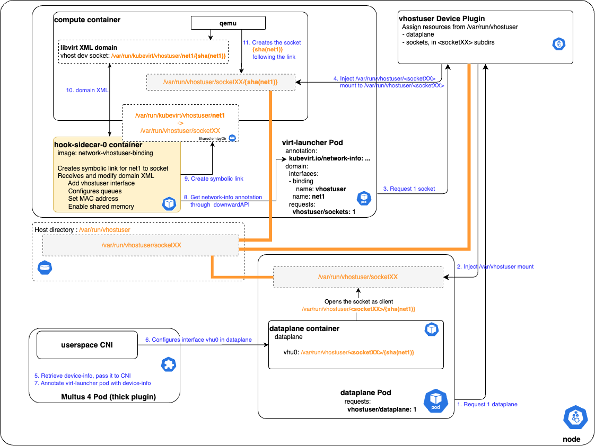

# VEP #307: Network Binding Plugin for vhostuser Interfaces

## Release Signoff Checklist

Items marked with (R) are required *prior to targeting to a milestone / release*.

- [ ] (R) Enhancement issue created, which links to VEP dir in [kubevirt/enhancements] (not the initial VEP PR)
- [ ] (R) Alpha target version is explicitly mentioned and approved
- [ ] (R) Beta target version is explicitly mentioned and approved
- [ ] (R) GA target version is explicitly mentioned and approved

## Overview

`vhostuser` interfaces are supported by QEMU but not implemented in KubeVirt. The Network
Binding Plugin framework is the right vehicle to add `vhostuser` interface support to KubeVirt.

## Motivation

`vhostuser` interfaces are required to attach VMs to a userspace dataplane such as OVS-DPDK
or VPP and achieve a fast datapath from the VM to the physical NIC. This is a mandatory feature
for networking VMs such as vRouter, IPsec gateways, firewalls, or SD-WAN VNFs that typically
bind network interfaces using DPDK. Expected DPDK performance can only be met when the entire
datapath is userspace — kernel interfaces such as those used with standard bridge bindings are
insufficient.

## Goals

Be able to add `vhostuser` secondary interfaces to the VM definition in KubeVirt.

## Non Goals

The `vhostuser` secondary interface configuration in the dataplane is the responsibility of
Multus and the CNI (e.g. `userspace CNI`); it is out of scope for this VEP.

## Definition of Users

- **VM User**: persona that configures `VirtualMachine` or `VirtualMachineInstance`
- **Cluster Admin**: persona that configures `KubeVirt` resources
- **Network Binding Plugin Developer**: persona that implements the `network-vhostuser-binding` plugin
- **CNI Developer**: persona that implements the CNI that configures the dataplane with vhostuser sockets
- **Dataplane Developer**: persona that implements the userspace dataplane

## User Stories

- As a VM User, I want to create a VM with one or several `vhostuser` interfaces attached to a userspace dataplane.
- As a VM User, I want the `vhostuser` interface to be configured with a specific MAC address.
- As a VM User, I want to enable multi-queue on the `vhostuser` interface.
- As a VM User, I want to be able to configure the `vhostuser` interface as transitional.
- As a Cluster Admin, I want to be able to enable `network-vhostuser-binding`.
- As a Network Binding Plugin Developer, I want the shared socket path to be accessible to the `virt-launcher` pod.
- As a Dataplane Developer, I want to access all `vhostuser` sockets of VM pods.
- As a CNI Developer, I want to know where vhostuser sockets are located.

## Repos

- `kubevirt/kubevirt` — primary implementation target; ideally hosted under
  [`cmd/sidecars`](https://github.com/kubevirt/kubevirt/tree/main/cmd/sidecars) alongside
  other reference binding plugins. If the repo is not intended to host third-party plugins,
  `network-vhostuser-binding` would be hosted out-of-tree.

## Design

This proposal leverages the KubeVirt Network Binding Plugin sidecar framework to implement
a new `network-vhostuser-binding-plugin`.

The plugin's role is to implement domain XML modifications according to the VMI definition
passed through its gRPC service by the `virt-launcher` pod on the `OnDefineDomain` event
from `virt-handler`.

`vhostuser` interfaces are declared in the VMI under `spec/domain/devices/interfaces` using
the binding name `vhostuser`:

```yaml
spec:
  domain:
    devices:
      networkInterfaceMultiqueue: true
      interfaces:
      - name: default
        masquerade: {}
      - name: net1
        binding:
          name: vhostuser
        macAddress: ca:fe:ca:fe:42:42
```

`network-vhostuser-binding` translates the VMI definition into libvirt domain XML
modifications on `OnDefineDomain`:

1. Creates a new interface with `type='vhostuser'`
2. Sets the MAC address if specified in the VMI spec
3. Defines model type according to `useVirtioTransitional` in the VMI spec
4. If `networkInterfaceMultiqueue` is `true`, adds the number of queues calculated from the
   number of cores of the VMI
5. Adds `memAccess='shared'` to all NUMA cell elements
6. Defines the device name according to the KubeVirt naming schema
7. Defines the `vhostuser` socket path, immutable across Live Migration

Because `OnDefineDomain` can be called multiple times by KubeVirt, all modifications must
be idempotent.

Example resulting domain XML:

```xml
<cpu mode="host-model">
    <topology sockets="2" cores="8" threads="1"></topology>
    <numa>
        <cell id="0" cpus="0-7" memory="2097152" unit="KiB" memAccess="shared"/>
        <cell id="1" cpus="8-15" memory="2097152" unit="KiB" memAccess="shared"/>
    </numa>
</cpu>
<interface type='vhostuser'>
    <source type='unix' path='/var/run/kubevirt/vhostuser/net1/poda08a0fcbdea' mode='server'/>
    <target dev='poda08a0fcbdea'/>
    <model type='virtio-non-transitional'/>
    <mac address='ca:fe:ca:fe:42:42'/>
    <driver name='vhost' queues='8' rx_queue_size='1024' tx_queue_size='1024'/>
    <alias name='ua-net1'/>
</interface>
```

### Implementation Details

The socket path must be accessible to both the `virt-launcher` pod (and its `compute`
container) and the dataplane pod. To avoid hostPath volumes that require pods to be
privileged, this proposal uses a **vhostuser Device Plugin** that injects mounts to the
sockets directory into unprivileged pods via annotations.

#### Device Plugin for vhostuser Socket Resources

The device plugin manages two resource kinds on the userspace dataplane (conceptually a
virtual switch):

- **`dataplane`** (quantity: `1`): grants access to all subdirectories of
  `/var/run/vhostuser` and the sockets within. Requested by the dataplane pod itself.
  Kubelet injects a `/var/run/vhostuser` mount into the requesting container.
- **`vhostuser sockets`** (quantity: `n`): analogous to a virtual switch port. Can be
  capacity-limited based on dataplane performance or CPU constraints, helping schedule
  workloads on nodes where the dataplane has available resources. Requested via the VM/VMI
  resource spec; KubeVirt propagates the request into the `compute` container of the
  `virt-launcher` pod. The device plugin allocates a subdirectory
  `/var/run/vhostuser/<socketXX>` and mounts it into the `virt-launcher` pod.

The device plugin must comply with the
[`device-info-spec`](https://github.com/k8snetworkplumbingwg/device-info-spec/blob/main/SPEC.md#device-information-specification),
enabling socket path and type information to be shared with the CNI. Multus annotates the
`virt-launcher` pod with this information; KubeVirt extracts the relevant portion into
`kubevirt.io/network-info`. The device plugin must also handle directory permissions and
SELinux so that sockets are accessible from requesting pods.

#### Network Binding Plugin and KubeVirt Requirements

The binding plugin uses the `downwardAPI` feature available from KubeVirt v1.3.0 to
retrieve the `kubevirt.io/network-info` annotation and extract the socket path for the
domain XML. However, it cannot use the allocated socket path directly — those paths
(`/var/run/vhostuser/<socketXX>`) are not stable across Live Migration, because new
directories are allocated for the destination pod.

The solution is to use immutable paths via symbolic links keyed on the interface name (or
its hash): `/var/run/kubevirt/vhostuser/net1` → `/var/run/vhostuser/<socketXX>`.

This requires a KubeVirt enhancement to provide a shared `emptyDir` volume mounted into
both the `compute` and `vhostuser-network-binding-plugin` containers. The mount path can
be either a Network Binding Plugin CRD spec parameter or a well-known fixed path; a
well-known fixed path is simpler and sufficient.

#### Implementation Diagram



## API Examples

### KubeVirt CRD

No modification to the Network Binding Plugin spec of the KubeVirt CR is required; a
well-known fixed path for the shared `emptyDir` volume is sufficient.

### VirtualMachine with vhostuser Interface

```yaml
apiVersion: kubevirt.io/v1
kind: VirtualMachine
metadata:
  name: vhostuser-vm
  namespace: tests
spec:
  running: true
  template:
    metadata:
      labels:
        kubevirt.io/domain: vhostuser-vm
    spec:
      architecture: amd64
      domain:
        cpu:
          cores: 4
        devices:
          disks:
          - disk:
              bus: virtio
            name: containerdisk
          interfaces:
          - masquerade: {}
            name: default
          - binding:
              name: vhostuser
            macAddress: ca:fe:ca:fe:42:42
            name: net1
          networkInterfaceMultiqueue: true
        machine:
          type: q35
        memory:
          hugepages:
            pageSize: 1Gi
        resources:
          limits:
            vhostuser/sockets: 1
          requests:
            memory: 2Gi
            vhostuser/sockets: 1
      networks:
      - name: default
        pod: {}
      - multus:
          networkName: vhostuser-network
        name: net1
      nodeSelector:
        node-class: dpdk
      volumes:
      - containerDisk:
          image: os-container-disk-40g
        name: containerdisk
```

## Alternatives

No alternatives were formally documented in the original proposal.

## Scalability

Scalability is not expected to be a concern. The device plugin and binding sidecar are
per-node and per-pod resources respectively; their overhead is proportional to the number
of VMs using vhostuser interfaces.

## Update/Rollback Compatibility

KubeVirt Network Binding Plugin relies on `hooks/v1alpha3` API for clean termination of
the `network-vhostuser-binding` container in the `virt-launcher` pod.

## Functional Testing Approach

Create a VM with several `vhostuser` interfaces, then:

- Check the generated domain XML contains all interfaces with appropriate configuration.
- Check vhostuser sockets are created in the expected directory of the `virt-launcher` pod.
- Check vhostuser sockets are accessible to the dataplane pod.
- Check the VM is running and has network connectivity.
- Live migrate the VM and verify it remains running with network connectivity.

## Implementation History

- 2024-05-22: Original design proposal submitted as kubevirt/community#294.
- 2026-05-10: VEP converted to the new governance format and set to `deferred` in
  kubevirt/enhancements to preserve the design work done so far. No implementation
  was started in `kubevirt/kubevirt`. The VEP can be revived by updating the status
  to `provisional` and assigning a target milestone.

## Graduation Requirements

### Alpha

- [ ] Feature gate guards all code changes
- [ ] Implement Network Binding Plugin shared `emptyDir` spec in KubeVirt
- [ ] First implementation of `network-vhostuser-binding` sidecar
- [ ] Implement vhostuser device plugin (based on [generic-device-plugin](https://github.com/squat/generic-device-plugin))
- [ ] Upstream `network-vhostuser-binding` to `kubevirt/kubevirt`

### Beta

### GA
