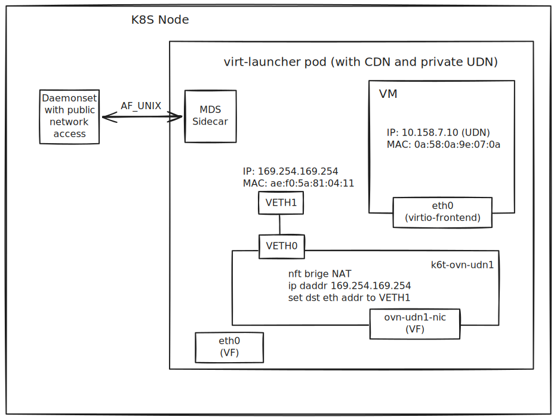

# VEP 224: Metadata Service (MDS) Enablement for KubeVirt VMIs

## Release Signoff Checklist

Items marked with (R) are required *prior to targeting to a milestone / release*.

- [ ] (R) Enhancement issue created, which links to VEP dir in [kubevirt/enhancements] (not the initial VEP PR)

## Overview

This proposal introduces an opt-in mechanism for exposing a link-local **Metadata Service (MDS)** endpoint to a KubeVirt guest.
When enabled on a `VirtualMachineInstance` (VMI), KubeVirt configures the **virt-launcher pod network namespace** such that
guest traffic destined for a well-known link-local IP (default `169.254.169.254/32`) is steered to a local endpoint inside
the pod namespace, without requiring users to inject privileged sidecars into virt-launcher pods.

This document has two focuses
a. **network plumbing** required in the virt-launcher pod namespace to make an MDS endpoint reachable
from the guest in a consistent way, across different cluster overlay/network deployments and KubeVirt interface bindings.

b. **metadata service** injection in virt-launcher pod that responds to the MDS requests.

## Motivation
Users running VM workloads on Kubernetes frequently want a cloud-like metadata endpoint for:

- Instance identity and lifecycle signals
- Bootstrap configuration that must be fetched at runtime (as opposed to static cloud-init)
- In-cluster services that expect the conventional metadata IP (`169.254.169.254`)

## Goals
- Provide a mechanism to expose a link-local MDS endpoint to a guest using bridge networking.
- Provide a mechanism for developers to bringing their own metadata service implementations. 

## Non Goals
- Define the metadata schema/content served by MDS.
- Standardize an authentication/authorization model for metadata content.
- Support arbitrary user-defined privileged containers in virt-launcher pods.
- Provide IPv6 MDS in the initial phase (future work).

## Definition of Users
- A user is a person that wants a guest to access a metadata endpoint over a conventional link-local IP.
- An admin is a person who manages the cluster, defines the platform-level resources and controls the security constraints for KubeVirt VMs.
- A developer is a person who wants to build a metadata provider/service to run alongside KubeVirt.

## User Stories
- As a user, I want my guest OS to retrieve its own workload identity metadata from a well-known link-local IP (e.g. `169.254.169.254`).
- As a developer, I want to plug in my own metadata service implementation that runs as a sidecar in the virt-launcher pod.
- As a developer, I want metadata service enablement to be explicit.
- As an admin, I want my VMs to remain in private subnet (no public internet, no cluster API access), while allowing the guest to reach the metadata service.
- As an admin, I want the MDS packet steering to be constrained so only guest-originated traffic can reach it.

## Use Cases

### Supported Use cases (initial)

1. VMI using **bridge binding** on an overlay network where the guest is configured to use the pod/bridge IPv4 address.
2. Guest consuming metadata via link-local IP `169.254.169.254` over the primary VMI interface.
3. Custom metadata service container that runs alongside each VM to respond to link-local MDS packets.

### Future Use cases
1. VMI using `masquerade` binding (L3/NAT path interception instead of bridge/L2 path).
1. VMI using `sriov` binding (no Linux bridge in the default datapath).
1. Supporting multiple guest interfaces/networks and per-interface MDS enablement.
1. IPv6 metadata endpoint (e.g. `fd00::/128` style link-local equivalent), if desired.

### Unsupported Use cases (initial)
1. Arbitrary user-injected privileged sidecars in virt-launcher pods.
1. Multi-tenant isolation guarantees beyond what the selected datapath can enforce (requires further design).

### Risks and Mitigations

| Risk | Mitigation |
|------|------------|
| **Privilege surface** — The suggested approach requires virt-launcher to hold `CAP_NET_ADMIN` (or equivalent) for veth creation, nftables, sysctls, and route/neighbor changes. MDS may widens the privilege footprint of user-facing pods. | Gate the feature; document that MDS is only supported for bindings that already require these capabilities. Revisit the virt-handler performs plumbing approach, if minimizing virt-launcher privileges becomes a requirement. |
| **Reply routing and `table local` changes** — Editing kernel’s local route for the VM IP and adding host routes/neighbor entries may cause unexpected kernel behavior and may affect other pod networking. | Ensure the network plumbing is limited to the pod network namespace. |
| **Binding mismatch** — Alpha supports only bridge binding. Users on masquerade or SRIOV may enable `spec.mds` and get no steering or undefined behavior. | Webhook validation: reject or ignore `spec.mds` for unsupported bindings and surface a clear condition (e.g., `MetadataServiceReady=False` with reason). |
| **Rollback** — Disabling the feature gate requires deleting VMIs that use `spec.mds` before downgrade; otherwise VMIs may be left in an inconsistent or unsupported state. | Document upgrade/rollback in release notes and operator docs; consider a condition or warning when the gate is off but `spec.mds` is set. |
| **Custom MDS container: privilege escalation** — the API accepts a full container spec to support any generic MDS implementation. Over-elevated capabilities such as  `securityContext.privileged`, `hostPID`/`hostNetwork`/`hostIPC`, `hostPath` maybe provides, and breaching the intended security boundary. | Apply strict webhook or controller sanitization: reject or strip privileged securityContext, host namespace options, hostPath and other unsafe volume types, and disallowed capabilities. |
| **Custom MDS container: malicious or vulnerable images** — the image supplied may be malicious, poorly maintained, or contain vulnerabilities; may pose security threads when running in the same network namespace as other virt-launcher containers | Document that image choice and trust are the user’s responsibility. Optionally support cluster-level policy (e.g., image allowlist, signed images). Enforce non-root and minimal base images if needed. |
| **Custom MDS container: resource abuse** — User can set high CPU/memory requests or limits on the MDS sidecar, causing node pressure or noisy-neighbor effects. | Validate and optionally cap resource requests/limits for the injected MDS container. |

## Design

### Feature gate

Introduce a new feature gate (name TBD), for example `MetadataService` (or `MDS`), gating:

- the `vmi.spec.mds` API
- virt-launcher/virt-controller/virt-handler behavioral changes

### High-level behavior

When `vmi.spec.mds` is set:

1. KubeVirt configures the virt-launcher pod network namespace so that guest traffic destined for the metadata IP is
   redirected to a local interface in the pod namespace.
2. A metadata service endpoint can be provided by developers to runs inside the pod namespace.


### Metadata server injection

To allow developers to bring their own metadata server implementation, this proposal adds an explicit container
specification under `vmi.spec.mds` that KubeVirt can inject into the virt-launcher pod.

#### Proposed API

Add an optional `mdsContainer` field under `vmi.spec.mds`, typed as Kubernetes core `Container` (`k8s.io/api/core/v1.Container`).
It provides a first-class, declarative VMI API for metadata sidecar injection. Alternatives are described in the [Alternatives](#Alternatives) section.
#### Injection behavior

When `vmi.spec.mds.mdsContainer` is set and the feature gate is enabled:

1. virt-controller copies the container spec into the generated virt-launcher pod template as an additional sidecar.
2. KubeVirt applies validation/sanitization rules to keep virt-launcher security boundaries intact (for example, disallowing
   privileged security contexts and host namespace/hostPath assumptions).
3. The injected sidecar runs in the same pod network namespace as virt-launcher and serves the metadata endpoint that the
   network plumbing steers guest traffic to.

When `vmi.spec.mds` is set but `mdsContainer` is omitted, KubeVirt still performs network plumbing and expects the metadata
endpoint to be provided by another supported mechanism (future bundled implementation or cluster policy).


### Network plumbing (bridge binding, alpha)
This section describes the logic of MDS enablement via NFT table entry manipulation for bridge binding mode.

Steps:

1. **Create a veth pair** inside the pod network namespace:
   - `veth1` (bridge-attached end) is attached to the Linux bridge used by the VMI datapath.
   - `veth0` remains unused for dataplane in the minimal design, but provides a paired interface if needed for future use.
2. **Assign the metadata IP** `169.254.169.254/32` to `veth1`.
3. **Ensure bridge forwarding to `veth1`** by adding a static FDB entry for `veth1`'s MAC.
4. **Intercept metadata traffic in the L2 path** using nftables `bridge` family:
   - Create a table `bridge nat` and a `PREROUTING` chain with a `prerouting` hook (e.g. `priority dstnat`).
   - Add a rule matching `ip daddr 169.254.169.254` and rewriting `ether daddr` to `veth1`'s MAC.
   - Optionally also steer ARP "who-has 169.254.169.254" requests to `veth1` by rewriting `ether daddr`.
5. **Fix reply routing to the guest** when the guest uses the VM IP as its source:
   - Remove the kernel’s local host route for the VM IP from `table local` (so it is not dropped as local-delivery).
   - Add a host route for `vmIP` pointing to `veth1`.
   - Add a permanent neighbor entry for `vmIP -> veth1MAC` on `veth1`.

Below is a diagram that shows the veth pairs and NFT record. Note that the illustrated example shows the VM created in its private UserDefinedNetwork.


### Binding-specific considerations

#### `bridge` binding (alpha)

The design above applies directly, because guest packets to the metadata IP traverse the Linux bridge path.

#### `masquerade` binding (future)
_TBD_

#### `sriov` binding (future)
_TBD_

### Where the logic runs

KubeVirt should not require users to inject privileged sidecars. The suggested implementation focuses on virt-launcher executing the network plumbing.
Below is an overview of the virt-launcher's responsibility.

- Implement the setup as part of virt-launcher’s pre-domain-start network preparation, gated by `vmi.spec.mds`.
- Requires virt-launcher to have the necessary Linux capabilities in the pod network namespace (primarily `CAP_NET_ADMIN`).

If over-reaching capability becomes a concern, revisit the virt-handler alternative described in the [Alternatives](#Alternative) section.


### API Changes

Introduce a new optional `mds` field under `vmi.spec`. Initial (alpha) API is designed to be explicit for bridge binding.
It can evolve toward a more binding-agnostic API in later phases.

```go
type VirtualMachineInstanceSpec struct {
	// ...

	// MDS defines metadata service connectivity for the guest.
	// This is an alpha field and requires enabling the MetadataService (name TBD) feature gate.
	// +optional
	MDS *MetadataService `json:"mds,omitempty"`
}

// MetadataService defines how a link-local metadata endpoint is exposed to the guest.
type MetadataService struct {
	// MetadataIP is the guest-visible link-local IP of the metadata service.
	// Defaults to 169.254.169.254.
	// +optional
	MetadataIP *string `json:"metadataIP,omitempty"`

	// Network is the name of the VM network to enable MDS
	Network string `json:"network,omitempty"`

	// MDSContainer defines the sidecar container to inject into virt-launcher pod.
	// It uses the Kubernetes core Container schema.
	// +optional
	MDSContainer *corev1.Container `json:"mdsContainer,omitempty"`
}
```

### API Examples

#### Bridge binding (alpha)

```yaml
apiVersion: kubevirt.io/v1
kind: VirtualMachineInstance
metadata:
  name: example-vmi-with-mds
spec:
  domain:
    devices:
      interfaces:
      - name: default
        bridge: {}
  networks:
  - name: default
    pod: {}
  mds:
    network: default
    mdsContainer:
      # <containerSpec>
```

## Webhook changes

1. Reject `vmi.spec.mds` unless the feature gate is enabled.
2. Validate that required fields are set for the selected binding mode(s) (alpha: bridge binding only).
3. Validate that `metadataIP` (if provided) is a single host address (e.g. `/32` for IPv4), or accept only the canonical IP
   for alpha.
4. Validate the projected metadata server sidecar does not have over-reaching capabilities.

## Virt-controller changes

1. Propagate `vmi.spec.mds` into the virt-launcher pod manifest so virt-launcher can consume it (e.g. via an env var or a
   mounted config file).
2. (If/when KubeVirt provides a bundled metadata endpoint container) render an additional container in the virt-launcher pod
   (unprivileged), and wire it to the `metadataIP` address.

## Virt-launcher changes

1. Add pre-domain-start logic that, when `vmi.spec.mds` is set, performs the network plumbing described above.
2. Ensure the setup is done **before** QEMU starts and before the guest interface is considered “ready”.
3. Restrict nft rules to guest-originated traffic where feasible (e.g. match ingress interface).

## Status and conditions

Add a VMI condition (name TBD) indicating MDS plumbing readiness, for example:

- `status.conditions[type=MetadataServiceReady]` with `True/False` and a reason/message when misconfigured.

Future work may add a small `status.mds` struct containing derived values (selected interface/bridge, metadata IP, etc.) for
debuggability.

## Scalability

The expected overhead is per-VMI and limited to a small number of netlink/nft operations:

- creating a single veth pair
- installing a small nft ruleset
- adding a small number of routes/neigh entries and sysctl writes

The design should not introduce additional watches beyond existing VMI/pod reconciliation loops.

## Update/Rollback Compatibility

- The changes are upgrade compatible when guarded by a feature gate.
- Rollback is supported when the feature gate is disabled and VMIs using `spec.mds` are deleted before downgrade.

## Functional Testing Approach

- Unit tests:
  - validate API and defaulting/validation logic
  - validate nft rule generation logic (string/rule construction)
- E2E tests (alpha):
  - start a VMI with bridge binding and `spec.mds`
  - run a minimal metadata endpoint in the pod namespace (implementation detail TBD) and verify guest can reach
    `169.254.169.254`
  - verify traffic steering is constrained to guest-originated frames if implemented

## Implementation Phases

1. Add feature gate and API types (`vmi.spec.mds`) with validation/defaulting.
2. Implement bridge-binding plumbing in virt-launcher.
3. Add unit tests for the plumbing logic.
4. Add an E2E test for bridge binding (with a minimal endpoint).
5. Extend to additional bindings:
   - `masquerade` (IP/NAT path)
   - `sriov` (VF path / alternative interception)
6. Evaluate whether to move plumbing to virt-handler for capability minimization/hardening.

## Feature lifecycle Phases

### Alpha

- Feature gate required
- Bridge binding support only
- Unit tests + minimal E2E coverage

### Beta

- Expand binding support (`masquerade`, then `sriov` if feasible)
- Harden security constraints (guest-origin filtering, least-privilege execution)
- Broader E2E coverage

### GA

- Confirm upgrade/downgrade behavior
- Stabilize API and document operational guidance

## Alternatives

### Metadata Service Injection

#### Alternative 1: `vmi.spec.mds.mdsTemplate` reference to a namespaced `PodTemplate` resource
This approach allows a shard template object for metadata server to be used across many VMIs, but it introduces indirection and lifecycle coupling to an external object that's not managed to KubeVirt.

#### Alternative 2: Rely entirely on cluster-admin mutation (MutatingWebhook/Kyverno)
This approach does not require further addition to the new KubeVirt API, and is readily available. But it has the drawback of making the MDS injection behavior becomes cluster-specific and less portable. It also adds difficulty to provide consistent validation, and user-facing guarantees in KubeVirt.

#### Alternative 3: Metadata service injection via cloud-init or hook sidecars
Cloud-init provides static bootstrap data at boot. This proposal adds a runtime metadata endpoint for on-demand identity inquiry. They are complementary — cloud-init for one-time config and MDS for metadata service during the VM's lifetime. The existing `hooks.kubevirt.io/hookSidecars` flow is for short-lived hooks that read domain XML or cloud-init payload and write modified contents to stdout; whereas MDS is a long-lived server that listens for guest traffic, so that pattern does not fully fit. We are therefore proposing a dedicated API for declaring the MDS sidecar.

### Network Plumbing

#### Alternative 1: Allow user-injected privileged sidecars in virt-launcher pods

This is the most flexible approach for downstreams, but it significantly expands the attack surface and complicates KubeVirt’s
security posture. It also introduces compatibility concerns across clusters with different PodSecurity admission policies.
For these reasons, this VEP proposes an upstream-managed, opt-in feature rather than arbitrary privileged injection.

#### Alternative 2: MutatingAdmissionWebhook that injects a privileged initContainer

This can be implemented out-of-tree today, but it is not portable across security-restricted clusters and is hard to make
reliable across upgrades. It also does not provide a stable KubeVirt API surface for users.

#### Alternative 3: virt-handler-only netns plumbing

virt-handler is already a privileged node component and can `nsenter` the virt-launcher pod network namespace to apply the nft/sysctl/route changes.
This reduces the need for virt-launcher to carry elevated capabilities, but requires a handshake/readiness mechanism so the VM only starts after MDS plumbing is complete.

#### Alternative 4: VSOCK-based metadata service

A VSOCK-based MDS would simplify the implementation (no veth/nftables/FDB/routes, no extra capabilities, binding-agnostic). The main trade-off is that the guest would use the VSOCK API instead of the well-known metadata IP `169.254.169.254`, which is what most cloud providers and existing IMDS clients use today. Because the proposal expects developers to bring their own MDS, a VSOCK-based design would mean those custom implementations would need to listen on VSOCK rather than on the link-local IP. Validating that the injected MDS is actually listening on the expected VSOCK address/port would be non-trivial.

# References

- nftables bridge family documentation: `https://wiki.nftables.org/wiki-nftables/index.php/Bridge_filtering`
- Link-local metadata convention (common cloud pattern): `https://datatracker.ietf.org/doc/html/rfc3927`


