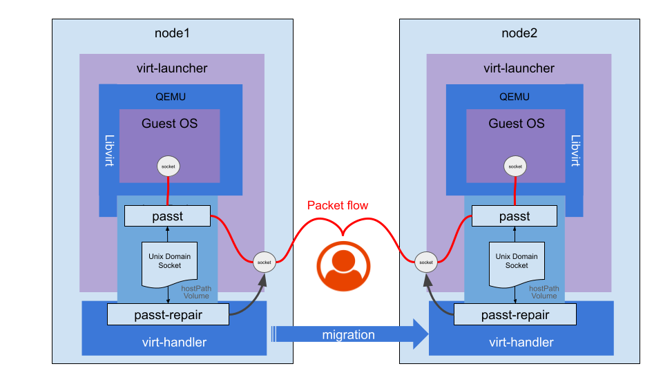

# VEP #21: Seamless TCP migration and vhost-user support with passt

## Release Signoff Checklist

Items marked with (R) are required *prior to targeting to a milestone / release*.

- [x] (R) Enhancement issue created, linking to VEP directory in [kubevirt/enhancements] (not the initial VEP PR)

## Overview

KubeVirt users can benefit from seamless live migration of VMs while preserving TCP connections.
This functionality has recently been introduced in `passt` together with `vhost-user` support, which increases network throughput. 
This proposal outlines the integration plan to be implemented in KubeVirt. 

## Motivation

Currently, KubeVirt does not support all Primary Network requirements expected by users:
- Seamless network connectivity on migration.
- Observability tools such as [Stackrox Collector](https://github.com/stackrox/collector).
- Service Mesh technologies such as [Istio](https://istio.io) and [Linkerd](https://linkerd.io/).
- High throughput (on par with tap)

Bridge binding does not support observability or service meshes, Masquerade hides the real IP from the user, and passt until recently lacked seamless migration and tap-level performance.
These gaps have been recently addressed in passt r[release 2025_02_17.a1e48a0](https://passt.top/passt/tag/?h=2025_02_17.a1e48a0).

## Future potential enhancement

Support for other IP and non-IP network protocols, in addition to the currently supported TCP/UDP/ICMP.
This capability is planned to be implemented in future releases of passt, and it too is expected to require adaptation in KubeVirt.

## Goals

- Seamless live migration of TCP connections without disconnection for Primary Network.
- Support for observability tools and service mesh technologies.
- Enhanced IPv6 support.
- High network throughput, on par with Masquerade and Bridge bindings.

## Non Goals

- Supporting network protocols other those that are [currently supported](https://passt.top/passt/about/#protocols).
- Supporting CNIs that do not provide sticky IP addresses during migration (migration succeeds, but existing connections break).

## Definition of Users

- Cluster Admins
- VM/Namespace owners
- Guest VM users – typically unaware of their network binding

## User Stories

- As a Guest VM user, I want optimal network performance comparable to bridge and masquerade, ensuring my virtualized applications perform well.  
- As a Cluster Admin and as a Namespace Owner, I want observability and service meshes for enhanced monitoring, encryption, and load balancing.
- As a Cluster Admin and as a Namespace Owner, I require seamless VM migration to perform infrastructure upgrades without affecting business continuity, preserving connectivity event for sensitive applications and protocols.
- As a Cluster Admin, I want to make sure that I can upgrade existing VMs to the new binding and that the procedure to do so is clear.

## Repos

- [https://github.com/kubevirt/kubevirt](https://github.com/kubevirt/kubevirt)

## Design
### Live Migration with passt


### About passt

`passt` is a lightweight user-space networking solution designed for virtualized environments. It allows guest VMs to access the host’s network stack without requiring root privileges or additional network bridges. 
It is already used in KubeVirt as a network binding plugin, and is documented in the [user guide](https://kubevirt.io/user-guide/network/net_binding_plugins/passt/#passt-binding).

### Support live migration

The [Live Migration](ttps://kubevirt.io/user-guide/compute/live_migration/#live-migration) process triggers a chain of events, which at a high level networking perspective involves the following steps:
- A target pod is prepared, with applicable network plumbing.
- Libvirt is executed. It receives the DomainXML data from the source VM and it also launches the `passt` binary, before executing QEMU which starts the VM.
- Once both source and target VMs are up, depending on [the migration strategy](https://kubevirt.io/user-guide/compute/live_migration/#understanding-different-migration-strategies) a switchover occurs from the source to the target.
- the passt instance running on the source sets the TCP_REPAIR socket option on TCP sockets, thus freezing the state of the connection and allowing a dump of all the information needed to restore it (sequences, congestion window parameters, pending data queues - IP addresses and ports are already known.).
- It communicates the state to peer `passt` process running in the target host, via [facilities provided by vhost-user](https://qemu-project.gitlab.io/qemu/interop/vhost-user).html#migrating-back-end-state)
- Upon receipt, the target `passt` sets the `TCP_REPAIR` socket option on a new target socket, it restores the state, and eventually clears of the `TCP_REPAIR` socket option. 
- The connection is now seamlessly resumed, continuing from where it left off.

### Linux capabilities
As explained above, passt needs to set and clear the `TCP_REPAIR` socket option. Since this operation enables "hijacking" connections, it is implemented in Linux as a privileged operation requiring `CAP_NET_ADMIN`.
Since passt runs in the unprivileged Linux context of virt-launcher, it lacks the necessary `CAP_NET_ADMIN` capability. Therefore, passt delegates this operation to a privileged helper running in virt-handler.

#### The Role of passt-repair

The helper responsible for handling `TCP_REPAIR` is called [passt-repair](https://man.archlinux.org/man/passt-repair.1.en). It is 

 a [C program]((https://passt.top/passt/tree/passt-repair.c) included in the passt package.

#### How passt-repair Works:
- Executed as a **one-off process**, separately on migration source and migration target.
- Communicates with passt over a named Linux Domain Socket.
- Signals availability and waits for passt requests.
- Upon receiving a request:
  - Sets or clear the `TCP_REPAIR` socket option.
  - Notifies passt upon completion.

**Note**: In the future, it may be desirable to implement this simple logic in Go rather than call an external binary. However, for the initial introduction of this functionality it will be simpler and safer to have both client and severer released and tested together under the same package.    


#### Integration with virt-handler

To support this process, virt-handler will be modified to invoke `passt-repair` in a dedicated goroutine. This goroutine will
run to completion or timeout, ensuring the migration process does not hang indefinitely.

The invocation is conditioned to the VMI having an interface with `passt` network binding and an enabled feature gate:

1. Before migration starts (source node) in [vmUpdateHelperMigrationSource](https://github.com/kubevirt/kubevirt/blob/release-1.5/pkg/virt-handler/vm.go#L2714) to set the TCP_REPAIR socket option.
2. Before migration finalizes (target node) in [finalizeMigration](https://github.com/kubevirt/kubevirt/blob/release-1.5/pkg/virt-handler/vm.go#L2714) to set and then clear the TCP_REPAIR socket option.

##### Failure Scenarios:
passt-repair can fail or timeout if:
- The Unix Domain Socket created by passt isn't found.
- Communication with passt is delayed or unresponsive.

Either scenario likely results in broken TCP connections for the guest VM, requiring reconnection.
- virt-handler does not fail migration on passt-repair errors.
- passt currently does not abort migration upon TCP_REPAIR failure.

**Note**: Success of passt-repair doesn't guarantee seamless migration alone; sticky IPs from the network provider and CNI are essential.

#### Add passt-repair binary to virt-handler image
The `passt-repair` binary must be added to the virt-handler container image. The simplest solution is to install the passt RPM. A more secure and storage-efficient solution is extracting only the passt-repair binary from the RPM and installing it standalone.

### passt network binding plugin 
The binding of passt is implemented as a [network binding plugin](https://kubevirt.io/user-guide/network/network_binding_plugins/#network-binding-plugins).
It is comprised of:
- A [sidecar container](https://github.com/kubevirt/kubevirt/tree/release-1.5/cmd/sidecars/network-passt-binding) running in the virt-launcher pod. 
- A [CNI Plugin](https://github.com/kubevirt/kubevirt/tree/release-1.5/cmd/cniplugins/passt-binding) that is invoked during pod setup/teardown. 
- Configuration.
Further details can be found in the [design document](https://github.com/kubevirt/community/blob/main/design-proposals/network-binding-plugin/network-binding-plugin.md#design-details).

#### DomainXML updates to support vhost-user protocol
vhost-user enables high-performance communication between virtual machines and user-space processes, typically offloading VirtIO emulation to dedicated user-space processes (e.g., DPDK or passt). It improves I/O performance through zero-copy mechanisms and reduced context-switching overhead. Additionally, it is required for seamless TCP migration.

`vhost-user` must be enabled in the DomainXML. Small code changes are required in passt sidecar code. The format is described [here](https://libvirt.org/formatdomain.html#vhost-user-connection-with-passt-backend).

#### passt network binding plugin 
The passt-cni process is called by `Multus` during primary network interface setup/removal. It runs two sysctl commands:
1. Allow binding to all ports starting from 0.
2. Set ping group range to virt-launcher's user ID.

The [passt-binding directory](https://github.com/kubevirt/kubevirt/tree/release-1.5/cmd/cniplugins/passt-binding) will include:
- A `Dockerfile` to build and publish the container image.
- YAML manifests for a DaemonSet to deploy the CNI onto nodes.

These artifacts already exist under the IPAM Controller repository and can be moved as-is from their [current location](https://github.com/kubevirt/ipam-extensions/tree/v0.1.10-alpha/passt).

A manifest for applying a `network-attachment-definition` (NAD) CR named `netbindingpasst` pointing to the CNI will also be included:

```yaml
apiVersion: k8s.cni.cncf.io/v1
kind: NetworkAttachmentDefinition
metadata:
  name: netbindingpasst
  namespace: {{ .namespace }}
spec:
  config: '{ "cniVersion": "0.3.1", "name": "netbindingpasst", "plugins": [{"type": "kubevirt-passt-binding"}]}'
```

**Note**: No changes are expected in the passt sidecar container.

## API Examples
No API changes are expected in kubevirt/kubevirt.
### passt network binding plugin configuration in KubeVirt CR
```yaml
apiVersion: kubevirt.io/v1
kind: KubeVirt
spec:
  configuration:
    network:
      binding:
        passt:
          computeResourceOverhead:
            requests:
              memory: 250MiB
          migration: {}
          networkAttachmentDefinition: default/netbindingpass
          sidecarImage: 
            registry: quay.io/kubevirt/network-passt-binding:<tag/sha>
```

### VM network interface with passt network binding 

```yaml
apiVersion: kubevirt.io/v1
kind: VirtualMachine
spec:
  template:
    spec:
      domain:
        devices:
          interfaces:
          - name: passtnet
            binding:
              name: passt
            ports:
            - name: http
              port: 80
              protocol: TCP
```

## Alternatives

TCP live migration requires a privileged action (TCP_REPAIR socket option). A straightforward approach is granting passt the required capability (`CAP_NET_ADMIN`). Ambient capabilities can be applied to the passt binary similarly to [virt-launcher](https://github.com/kubevirt/kubevirt/blob/release-1.5/cmd/virt-launcher-monitor/virt-launcher-monitor.go#L176).

However, container runtimes drop all capabilities from the [bounding set](https://man7.org/linux/man-pages/man7/capabilities.7.html), and capabilities must explicitly be added in the SecurityContext, as done for CAP_NET_BIND_SERVICE in [virt-launcher](https://github.com/kubevirt/kubevirt/blob/release-1.5/pkg/virt-controller/services/rendercontainer.go#L284).

Since virt-launcher drops the root user, this method is secure. However, KubeVirt follows Kubernetes' `Restricted` Pod Security Standard, which disallows CAP_NET_ADMIN.

## Scalability

- `passt` has a memory overhead of ~250Mi per VM. Users running VMs at scale should revert to other bindings if memory overhead is a concern.
-  VMs with a large number of TCP connections will take longer to live migrate. That's because sockets are handled in a serial
 fashion, each one separately sent back and forth to passt-repair for handling.
- The number of concurrent live migration per node is already limited and bound by the number of virt-handler worker goroutines.

## Update/Rollback Compatibility

- Live migration of passt VMs from nodes running older versions of KubeVirt to an upgraded KubeVirt environment will result in TCP connections being reset.
- Rollback of passt migration functionality (in case system stability is impacted) will be possible by disabling of the feature
e gate. It is expected that passt would still work, but live migrations would disconnect TCP connections.


## Functional Testing

Existing e2e tests cover basic passt connectivity and remain sufficient with vhost-user support. Dedicated e2e tests for seamless migration will verify TCP connection persistence. Sticky IP addresses are required, so tests will use secondary interfaces with hardcoded IPs.

## Implementation Phases
1. Implement vhost-user in passt-sidecar.
2. Add passt-repair to virt-handler.
3. Implement calls to passt-repair in virt-handler.
4. Enhance e2e tests.
5. Deployment activities (omitted from this proposal).

Phases can proceed in parallel.

## Feature Lifecycle Phases

`passt` is currently a network binding plugin external to the KubeVirt core, and its use as a network binding is not subject to lifecycle phases. However, the calls to passt-repair from virt-handler impose a risk and should be protected by a feature gate and subject to lifecycle phases.

### Alpha

`passt live migration` will be feature-gated, requiring explicit user opt-in. virt-handler will not run `passt-repair` unless the feature gate is enabled.

passt-sidecar will not condition the feature gate and will populate DomainXML in vhost-user mode regardless of the gate. This part of the code is external to KubeVirt core.

### Beta

For several releases, the live migration process using `passt` network binding, will be optimized. Specifically, `past-repair` and its integration points will be ironed out. 
The criteria to move to from Alpha to Beta will be stability of the live migration process, and an agreement that the decision to separate `passt-repair` from `passt` was a sustainable one, as other alternatives do exist.

### GA

GA status will be reached after successful long-term production deployment without issues.
An additional criteria for GA is feature completeness and support of non TCP/UDP/ICMP protocols, but only if there's a real demand in the community.

At that point, passt may be declared the recommended/default network binding for KubeVirt and potentially moved into the KubeVirt core.
