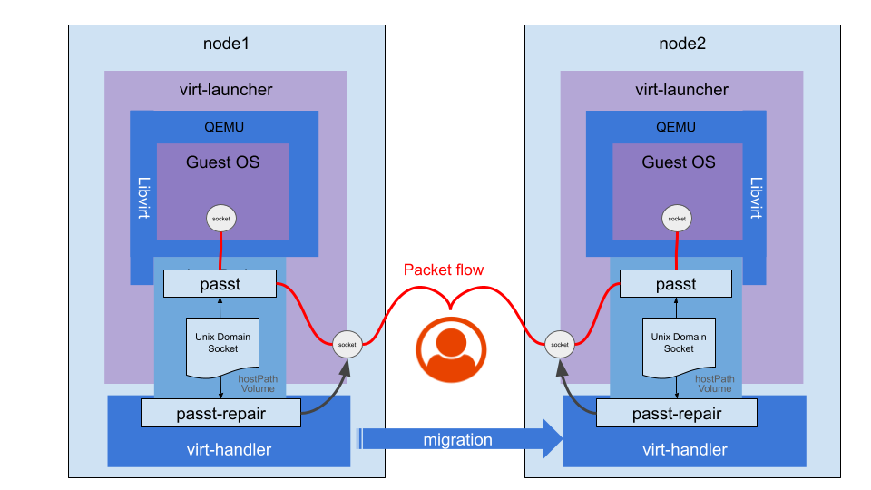

# VEP #21: Seamless TCP migration and vhost-user support with passt

## Release Signoff Checklist

Items marked with (R) are required *prior to targeting to a milestone / release*.

- [x] (R) Enhancement issue created, linking to VEP directory in [kubevirt/enhancements] (not the initial VEP PR)

## Overview

KubeVirt uses [network bindings](https://kubevirt.io/user-guide/network/network_binding_plugins/#network-binding) to provide virtual machines with network connectivity.

Currently, only the core [masquerade binding](https://kubevirt.io/user-guide/network/interfaces_and_networks/#masquerade) supports VM [live-migration](https://kubevirt.io/user-guide/compute/live_migration/). The masquerade binding preserves the IP address in the guest, allowing it to operate post a VM migration. 
A custom network binding plugin may support migration if its author has taken it into consideration (https://github.com/kubevirt/kubevirt/blob/main/docs/network/network-binding-plugin.md#migration-support).

The [passt network binding plugin](https://kubevirt.io/user-guide/network/net_binding_plugins/passt/) has been available for some time, providing a user-space alternative to the kernel-based masquerade binding.

There have been two main challenges with `passt`: its performance and the ability to perform a seamless migration (which masquerade lacks), where seamless migration refers to a process where connections remain uninterrupted throughout the transfer, ensuring no disconnections or downtime for users.

In `passt` [release 2025_02_17.a1e48a0](https://passt.top/passt/tag/?h=2025_02_17.a1e48a0), performance has been improved by using the `vhost-user` [protocol](https://qemu-project.gitlab.io/qemu/interop/vhost-user.html#introduction) to enable direct communication between passt and the guest OS. 
Additionally, seamless migration has been achieved by preserving TCP connections during the VM migration process.

At its base, the network binding does not require any special integration with the migration flow. Once a migration is requested, KubeVirt creates a target pod and expects it to be setup correctly, including the network, 
before the migration is initiated at the domain level. When the domain is started on the target (and stopped on the source), everything should be already in place and operational.
However, to allow the new `passt` to preserve TCP connection during the migration, there is a need for a new special integration with Kubevirt.

The integration involves the ability of `passt` to save the state of the active TCP sockets for migration on the source and their restoration on the target. 
For that, a privileged action is needed, which `passt` does not have, as it is bounded by the capabilities of virt-launcher. 
The integration involves a communication channel between `passt` and KubeVirt virt-handler which will perform limited selected privileged actions on behalf of `passt` on the open TCP sockets.

> [!NOTE]
> Seamless TCP migration requires sticky IP addresses. 
> It will not work with Network Providers/CNIs that do not assign the same IP to source and target pods.

This proposal outlines the integration plan to be implemented in KubeVirt.

## Motivation

Currently, KubeVirt does not support all Primary Network requirements expected by users:
- Seamless network connectivity on migration of TCP connections.
- Observability tools such as [Stackrox Collector](https://github.com/stackrox/collector).
- Service Mesh technologies such as [Istio](https://istio.io) and [Linkerd](https://linkerd.io/).
- High throughput (on par with Masquerade).

Masquerade hides the real IP from the user, Bridge binding does not support observability or service meshes and is [not migratable with pod network](https://github.com/kubevirt/kubevirt/blob/f8aa1f85ffca1a6a477bbb1d369097b3b0e36088/pkg/network/vmispec/interface.go#L57)
, and `passt` until recently lacked seamless migration and tap-level performance.
These gaps have been recently addressed in `passt` [release 2025_02_17.a1e48a0](https://passt.top/passt/tag/?h=2025_02_17.a1e48a0).

## Goals

- Seamless live migration of TCP connections without disconnection for Primary Network.
- Support for observability tools and service mesh technologies.
- Enhanced IPv6 support: Supporting dynamic configuration for the guests (RA, DHCPv6).
- High network throughput, on par with the masquerade network binding.

## Non Goals

- Supporting network protocols other than those that are [currently supported](https://passt.top/passt/about/#protocols).
- Supporting CNIs that do not provide sticky IP addresses during migration (migration succeeds, but existing connections break).
- Deployment of passt binding plugin.

## Definition of Users

- Cluster Admins
- VM/Namespace owners
- Guest VM users – typically unaware of their network binding

## User Stories

- As a Cluster Admin and as a Namespace Owner, I require seamless VM migration to perform infrastructure upgrades without affecting business continuity, preserving connectivity even for sensitive applications and protocols.
- As a Guest VM user, I want optimal network performance comparable to masquerade, ensuring my virtualized applications perform well.  
- As a Cluster Admin and as a Namespace Owner, I want observability and service meshes for enhanced monitoring, encryption, and load balancing.
- As a Cluster Admin, I want to make sure that I can upgrade existing VMs to the new binding and that the procedure to do so is clear.

## Repos

- [https://github.com/kubevirt/kubevirt](https://github.com/kubevirt/kubevirt)

## Design

The migration flow consists of many moving parts, some of which are considered external to KubeVirt or dependencies of the solution:
- `passt` and `passt-repair` perform the technical handling of the network sockets, and communicate with each other.
- `libvirt` and `QEMU` are responsible to invoke `passt`, communicate with it and carry out the actual migration.

As this proposal focuses on integration to KubeVirt, it covers the following parts:
- The DomainXML format will to be adapted to support `vhost-user` transport.
- The image build process of virt-handler will be enhanced to include the `passt-repair` binary.
- `virt-handler` will be enhanced to invoke `passt-repair` for migration source and target in precise timing.
- The build and deployment processes of the `passt` network binding plugin.

### Live Migration with passt
##### Background

`passt`, unlike other bindings that are kernel-based, is a userspace application, running in virt-launcher. 
It manages its own network sockets from userspace (to be clear: those sockets serve as the KubeVirt
end of a connection where the other end is an application that is communicating with a KubeVirt application.
The other leg of the connection, is between `passt` and the guest. It is omitted from this section and is managed by `passt`).
During migration, `passt` runs in both source and target virt-luncher pods, with open sockets per existing connection.
The source `passt` holds the "active" socket whereas the target `passt` socket is not yet active.
Once migration is finalized, there's a "cut-off" of traffic from the source pod to the target pod.
In order for seamless migration to succeed, both source and target sockets must be in identical state at the point of "cut-off";
otherwise the TCP protocol doesn't allow continuity.
The logical steps of "cut-off" are:
1. Freeze source socket. Halting traffic.
2. Record source socket state, by source `passt`.
3. Transfer state data to target `passt`.
4. Set target socket state using imported state data, by target `passt`, while in "frozen" state.
5. Unfreeze target socket, by target `passt`.

Once "cut-off" is complete, packets are resent and are accepted and acked by peers. This is handled by the TCP protocol stack, even without the application's knowledge.
> [!NOTE]
> The so-called "freeze/unfreeze" socket operations mentioned above are implemented in Linux by the TCP_REPAIR socket option. 




### Support live migration

The [Live Migration](https://kubevirt.io/user-guide/compute/live_migration/#live-migration) process triggers a chain of events, which at a high level networking perspective involves the following steps:
- A target virt-launcher pod is prepared, with applicable network plumbing.
- Libvirt is executed. It receives the DomainXML data from the source VM, and it also launches the `passt` binary, before executing QEMU, which starts the VM.
- Once both source and target VMs are up, depending on [the migration strategy](https://kubevirt.io/user-guide/compute/live_migration/#understanding-different-migration-strategies) a switchover occurs from the source to the target.
- The passt instance running on the source sets the TCP_REPAIR socket option on TCP sockets. Thus freezing the state of the connection and allowing a dump of all the information needed to restore it (sequences, congestion window parameters, pending data queues - IP addresses and ports are already known).
- The `passt` instance in the source host, communicates the state to peer `passt` process running in the target host, via [facilities provided by vhost-user](https://qemu-project.gitlab.io/qemu/interop/vhost-user.html#migrating-back-end-state)
- Upon receipt, the target `passt` sets the `TCP_REPAIR` socket option on a new target socket, it restores the state, and eventually clears of the `TCP_REPAIR` socket option. 
- The connection is now seamlessly resumed, continuing from where it left off.

#### Linux capabilities
As explained above, passt needs to set and clear the `TCP_REPAIR` socket option. Since this operation enables "hijacking" connections, it is implemented in Linux as a privileged operation requiring `CAP_NET_ADMIN`.
Since passt runs in the unprivileged Linux context of virt-launcher, it lacks the necessary `CAP_NET_ADMIN` capability. Therefore, passt delegates this operation to a privileged helper running in virt-handler.

#### The Role of passt-repair

The helper responsible for handling `TCP_REPAIR` is called [passt-repair](https://man.archlinux.org/man/passt-repair.1.en). 
It is a [C program](https://passt.top/passt/tree/passt-repair.c) included in the `passt` package.
`passt` creates a Unix Domain Socket in a predefined location (which is available to both virt-launcher and virt-handler as a `hostPath` mounted volume).
It starts a server that binds to the socket, and waits for incoming messages.
`passt-repair` is executed as a **one-off process**, separately on migration source and migration target.
It waits for the Unix Domain Socket to exist, creates a client connection and sends a message to `passt` signaling its availability.
Once `passt`(both source and target) is ready to migrate the connection, upon event from QEMU, it sends a message containing a batch of socket file descriptors and set/clear flags for each.
`passt-repair` upon receiving a request:
- Loops over socket file descriptors in request.
  - For each: Sets or clear the `TCP_REPAIR` socket option, according to socket FD and set/clear flag. 
  - Notifies passt upon completion.

> [!NOTE] 
> In the future, it may be desirable to implement this simple logic in Go rather than call an external binary. 
> However, for the initial introduction of this functionality it will be simpler and safer to have both client and severer released and tested together under the same package.    


#### Integration with virt-handler

To support this process, virt-handler will be modified to invoke `passt-repair`, during migration, in a dedicated goroutine. This goroutine will
run to completion, cancel or timeout ensuring the migration process does not hang indefinitely.

During the alpha phase, virt-handler will invoke the `passt-repair` gorutine if both the following conditions are met:
1. The new `passtIPStackMigration` feature gate is enabled.
2. The primary network interface of the migrated VM spec, has a `binding` attribute.

> [!NOTE]
> This combination aims to reduce the effect on virt-handler to a safe minimum, while mitigating the concern that a plugin 
> would affect the behavior of the core.
> Note that in any case there would be no harm, even if we needlessly invoked passt-repair during a non-passt migration, 
> as it would simply wait and timeout, without affecting the migration, wasting very little resources. 

Once in Beta phase, as the plugin is merged into the core, condition #2 will be modified to explicitly require `passt` binding.  

Two invocation points will be added to the virt-handler code in the following places:  

1. Before migration starts (source node) in [vmUpdateHelperMigrationSource](https://github.com/kubevirt/kubevirt/blob/release-1.5/pkg/virt-handler/vm.go#L2718) to set the TCP_REPAIR socket option.
2. Before migration finalizes (target node) in [finalizeMigration](https://github.com/kubevirt/kubevirt/blob/release-1.5/pkg/virt-handler/vm.go#L3428) to set and then clear the TCP_REPAIR socket option.

##### Failure Scenarios:

passt-repair can fail or timeout if:
- The Unix Domain Socket created by passt isn't found.
- Communication with passt is delayed or unresponsive.

Either scenario likely results in broken TCP connections for the guest VM, requiring reconnection.
- virt-handler does not fail migration on passt-repair errors.
- passt currently does not abort migration upon TCP_REPAIR failure.

> [!NOTE]
> Migration can be canceled until passt migratation of the first socket is underway. From that point and onward, the switchover is immediate and cannot be undone.
 
> [!NOTE]
> Success of passt-repair doesn't guarantee seamless migration alone; sticky IPs from the network provider and CNI are essential.

### passt network binding plugin 

The binding of passt is implemented as a [network binding plugin](https://kubevirt.io/user-guide/network/network_binding_plugins/#network-binding-plugins).
It comprises:
- A [sidecar container](#sidecar-container) running in the virt-launcher pod. Its sole responsibility is to mutate the DomainXML.
- A [CNI Plugin](#cni-plugin) that is invoked during pod setup/teardown. 
- Configuration.
Further details can be found in the [design document](https://github.com/kubevirt/community/blob/main/design-proposals/network-binding-plugin/network-binding-plugin.md#design-details).

#### Sidecar container

`vhost-user` enables high-performance communication between virtual machines and user-space processes, typically offloading VirtIO emulation to dedicated user-space processes (e.g., DPDK or passt). 
It improves I/O performance through zero-copy mechanisms and reduced context-switching overhead. Additionally, it is required for seamless TCP migration.

`vhost-user` must be enabled in the DomainXML. Small code changes are required in passt sidecar [code](https://github.com/kubevirt/kubevirt/tree/release-1.5/cmd/sidecars/network-passt-binding). The format is described [here](https://libvirt.org/formatdomain.html#vhost-user-connection-with-passt-backend).

#### CNI plugin

The [passt-cni](https://github.com/kubevirt/kubevirt/tree/release-1.5/cmd/cniplugins/passt-binding) process is called by `Multus` during primary network interface setup/removal. It runs two sysctl commands:
1. Allow binding to all ports starting from 0.
2. Set ping group range to virt-launcher's user ID.
> [!NOTE] 
> No changes are expected in the `passt` CNI code.

### Build and Deployment

#### Add passt-repair binary to virt-handler image

The `passt-repair` binary will be added to the virt-handler container image installed from the `passt` RPM.
To maintain storage efficiency and eliminate unnecessary security risks, the `passt-repair` binary will be extracted from the `passt` RPM and installed in the virt-handler container image without the `passt` binary.

#### passt CNI plugin build and deployment manifests

The [passt-binding directory](https://github.com/kubevirt/kubevirt/tree/release-1.5/cmd/cniplugins/passt-binding) currently includes a build system to create the CNI plugin binary.
A few artifacts are required for the deployment of the network binding plugin:
- A container image build and publish process for the sidecar container.
- A static daemonset manifest which serves to deploy the CNI.
- A static manifest for applying a `network-attachment-definition` CR named `netbindingpasst` referencing to the CNI.
[CNAO](https://github.com/kubevirt/cluster-network-addons-operator) will be enhanced to store and automate the deployment process.

## API Examples

No API changes are expected in kubevirt/kubevirt.
### passt network binding plugin configuration in KubeVirt CR
```yaml
apiVersion: kubevirt.io/v1
kind: KubeVirt
spec:
  configuration:
    network:
      binding:
        passt:
          computeResourceOverhead:
            requests:
              memory: 250Mi
          migration: {}
          networkAttachmentDefinition: default/netbindingpass
          sidecarImage: quay.io/kubevirt/network-passt-binding:<tag/sha>
```

### VM network interface with passt network binding 

```yaml
apiVersion: kubevirt.io/v1
kind: VirtualMachine
spec:
  template:
    spec:
      domain:
        devices:
          interfaces:
          - name: passtnet
            binding:
              name: passt
            ports:
            - name: http
              port: 80
              protocol: TCP
```

## Alternatives

TCP live migration requires a privileged action (TCP_REPAIR socket option). A straightforward approach is granting passt the required capability (`CAP_NET_ADMIN`). Ambient capabilities can be applied to the passt binary similarly to [virt-launcher](https://github.com/kubevirt/kubevirt/blob/release-1.5/cmd/virt-launcher-monitor/virt-launcher-monitor.go#L176).

However, container runtimes drop all capabilities from the [bounding set](https://man7.org/linux/man-pages/man7/capabilities.7.html), and capabilities must explicitly be added in the SecurityContext, as done for CAP_NET_BIND_SERVICE in [virt-launcher](https://github.com/kubevirt/kubevirt/blob/release-1.5/pkg/virt-controller/services/rendercontainer.go#L284).

Since virt-launcher drops the root user, this method is secure. However, KubeVirt follows Kubernetes' `Restricted` Pod Security Standard, which disallows CAP_NET_ADMIN.

## Scalability

- `passt` has a memory overhead of ~250Mi per VM. Users running VMs at scale should revert to other bindings if memory overhead is a concern.
-  VMs with a large number of TCP connections will take longer to live migrate. That's because sockets are handled in a serial
 fashion, each one separately sent back and forth to passt-repair for handling.
- The number of concurrent live migration per node is already limited and bound by the number of virt-handler worker goroutines.

## Update/Rollback Compatibility

- Live migration of VMs with `passt` network binding, from nodes running older versions of KubeVirt to an upgraded KubeVirt environment will result in TCP connections being reset, and no `vhost-user` performance boost. Subsequent migrations will retain the same limitations.
- From the client perspective, the connection would be reset and a new handshake will be necessary.      
- Rollback of passt migration functionality (in case system stability is impacted) will be possible by disabling of the feature gate. It is expected that passt would still work, but live migrations would disconnect TCP connections.

### Recommended upgrade procedure
Once the cluster is fully upgraded to KubeVirt 1.6 release, VMs running older versions of `passt` network binding, should be restarted.

It is recommended to upgrade the cluster in 2 separate steps:
1. A full KubeVirt upgrade, without bumping the `passt` sidecar image tag in the cluster-wide configuration.
2. Only once everything else has been upgraded. Bump the sidecar image tag in the configuration.
Once the entire system and configuration is updated, `passt` based VMs should be restarted to benefit from new `passt` features. If they're not restarted, they are expected to continue to work as before.
As VMs are restarted, they will be using the new virt-launcher image containing the new passt/libvirt stack. The updated cluster config will use the new `passt` sidecar image which will configure the DomainXML to use `vhost-user`.
By the time that live migration is requested, the new virt-handler will run `passt-repair` and migration will be seamless. 

> [!NOTE]
> While any of the components mentioned in the solution are not fully upgraded, seamless migration is not possible, and TCP sessions can be expected to disconnect during migration.

> [!WARNING]
> Do not run KubeVirt version 1.5 or older with passt network binding plugin of version 1.6, as the plugin is not backward compatible and is not expected to work.

## Functional Testing

Existing e2e tests cover basic passt connectivity and remain sufficient with vhost-user support. Dedicated e2e tests for seamless migration will verify TCP connection persistence. Sticky IP addresses are required, so tests will use secondary interfaces with hardcoded IPs.

## Implementation Phases

1. Implement vhost-user in passt-sidecar.
2. Implement calls to passt-repair in virt-handler.
3. Enhance e2e tests and demonstrate migration without disconnection.

Phases can proceed in parallel.

## Feature Lifecycle Phases

`passt` is currently a network binding plugin external to the KubeVirt core, and its use as a network binding is not subject to lifecycle phases. However, the calls to passt-repair from virt-handler impose a risk and should be protected by a feature gate and subject to lifecycle phases.

### Alpha

A feature-gate named `passtIPStackMigration` will be introduced, requiring explicit user opt-in. virt-handler will not run `passt-repair` unless the feature gate is enabled.

passt-sidecar will not condition the feature gate and will populate DomainXML in vhost-user mode regardless of the gate. This part of the code is external to KubeVirt core.

### Beta

For up to two releases, the live migration process using `passt` network binding, will be optimized. Specifically, `passt-repair` and its integration points will be ironed out. 
The criteria to move to from Alpha to Beta will be stability of the live migration process, and an agreement that the decision to separate `passt-repair` from `passt` was a sustainable one, as other alternatives do exist.
While the feature gate is still in place for protection, the binding will be migrated to the core and will cease to be a plugin. 
> [!NOTE]
> Despite this proposal's focus on seamless migration, passt will be quite useful as a core binding even for clusters that do not support sticky IP addresses and seamless migration, 
> as passt still has many other benefits.

See [passt beta proposal](./passt-beta.md), which extends this proposal to the Beta phase.

### GA

GA can be declared when it is part of the core binding and a proper alternative to the masquerade binding.
At this point, the migration will include seamless connectivity treatment by default with no option to disable it.

## Future Enhancements (Appendix)

Support for other IP and non-IP network protocols, in addition to the currently supported TCP/UDP/ICMP.
This capability is planned to be implemented in future releases of passt, and it too is expected to require adaptation in KubeVirt.
