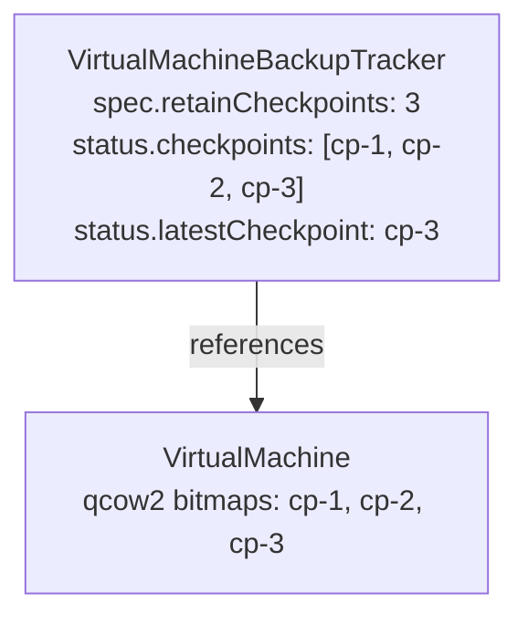
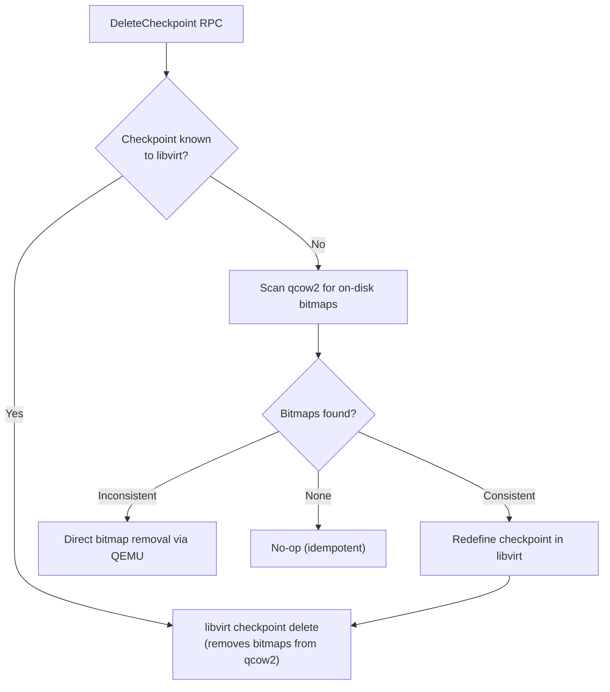

# VEP 25.1: Introduce CBT Multi-checkpoint

## VEP Status Metadata

### Target releases
- This VEP targets alpha for version: 1.10
- This VEP targets beta for version: 1.11
- This VEP targets GA for version: 1.12

### Release Signoff Checklist
Items marked with (R) are required *prior to targeting to a milestone / release*.

- [x] (R) Enhancement issue created, which links to VEP dir in [kubevirt/enhancements] (not the initial VEP PR)
- [ ] (R) Alpha target version is explicitly mentioned and approved
- [ ] (R) Beta target version is explicitly mentioned and approved
- [ ] (R) GA target version is explicitly mentioned and approved

## Overview
In version 1.8, KubeVirt introduced the `IncrementalBackup` feature gate as an Alpha feature which enables incremental backup of VM disks by leveraging QEMU CBT via dirty bitmaps and libvirt checkpoints. Currently the feature, facilitated via the `VirtualMachineBackup` and `VirtualMachineBackupTracker` CRDs, only supports a single checkpoint per backup. This VEP extends incremental backup with multi-checkpoint retention and the ability to back up from a specific previous checkpoint.

## Motivation
Many backup vendors expect the ability to retry an incremental backup from an older checkpoint when the latest backup is lost due to an external failure beyond those that may occur on KubeVirt's part. With a single checkpoint, any upstream failure forces a full backup, an expensive operation for large VMs with terabytes of disk.

## Goals
- Enable count-based checkpoint retention for incremental backups.
- Allow referencing a specific past checkpoint out of the list of retained checkpoints.
- Support checkpoint/bitmap garbage collection.

## Non Goals
- Cross `VirtualMachineBackupTracker` checkpoint sharing.
- Parallel backup chains within a single `VirtualMachineBackupTracker`.
- TTL-based or age-based retention policies for checkpoints.
- Per-disk checkpoint override (i.e., the ability to perform a backup from specific checkpoints for certain disks).

## Definition of Users
- Backup vendors: External backup solution that utilizes the KubeVirt incremental backup API.
- Cluster admin: Configures incremental backup defaults (e.g., selectors for opt-in).

## User Stories
- As a backup vendor, I want to retain multiple checkpoints so I can retry an incremental backup from an older checkpoint when my latest backup data is lost, avoiding a full backup.
- As a backup vendor, I want to select which checkpoint to use as the incremental base for a backup, so I can recover from upstream failures.
- As a backup vendor, I want to force a full backup and purge my checkpoint chain without affecting other vendors' checkpoints.
- As a cluster admin, I want excess checkpoints to be pruned automatically so bitmap storage is bounded.

## Repos
- kubevirt/kubevirt

## Design

### Background: QEMU Dirty Bitmaps and Libvirt Checkpoints
KubeVirt's incremental backup feature relies on QEMU dirty bitmaps. A dirty bitmap is a bit vector where each bit indicates a modified ("dirty") extent of a block device. The extent size is the bitmap's _granularity_.

A libvirt _checkpoint_ is the user-facing abstraction on top of QEMU bitmaps. When a checkpoint is created, libvirt creates a bitmap with the same name on each included disk's qcow2 file. The bitmap begins recording writes from that moment forward.

Key properties relevant to this design:
- Bitmaps are persisted in a qcow2 overlay, but libvirt metadata (i.e., checkpoints) is transient and must be redefined after restart.
- Bitmaps marked `+inconsistent` after an unclean shutdown need to be treated as invalid and removed.
- Bitmaps introduce a memory and storage overhead.
- Checkpoints form a parent->child chain and redefinition after restart must preserve chain ordering.

### Architecture Overview
Multi-checkpoint support is additive to the existing single-checkpoint architecture. The `VirtualMachineBackupTracker` is extended from tracking a single `latestCheckpoint` to maintaining an ordered list of retained checkpoints, with count-based pruning.



Each backup creates a new checkpoint and appends it to the tracker's checkpoint list. Excess checkpoints beyond `retainCheckpoints` are pruned automatically (see Checkpoint Retention and Pruning below).

### Checkpoint Lifecycle

#### 1. Checkpoint Creation (on backup completion)
When a `VirtualMachineBackup` completes successfully and its source is a `VirtualMachineBackupTracker`:
1. The backup controller appends a `BackupCheckpoint` to `status.checkpoints` and updates `status.latestCheckpoint` to point to it.
2. If `forceFullBackup` was set, all previous checkpoints are purged before the new one is recorded.

#### 2. Checkpoint Retention and Pruning
The `retainCheckpoints` field controls the maximum checkpoint count. When the checkpoint list exceeds this value, the controller prunes excess checkpoints (oldest first):
1. The controller verifies no active (non-terminal) backups reference the tracker. If any exist, pruning is deferred.
2. For each excess checkpoint, a `DeleteCheckpoint` RPC is sent to virt-launcher, which removes the bitmap from the qcow2 file via libvirt.
3. If a `DeleteCheckpoint` RPC fails mid-pruning, partial progress is persisted (already-pruned entries are removed from the list) and the controller requeues.
4. If for some reason a checkpoint doesn't exist but a bitmap does, a checkpoint redefinition followed by deletion will be attempted to allow libvirt to handle the cleanup.

#### 3. Checkpoint Redefinition (after VM restart)
Since libvirt checkpoint metadata is transient, redefinition restores it from on-disk bitmaps:
1. virt-handler detects trackers with existing checkpoints during CBT initialization (transition from `Initializing` -> `Enabled`) and sets `status.checkpointRedefinitionRequired = true`.
2. virt-controller walks the checkpoint chain sequentially (oldest -> newest), calling `RedefineCheckpoint` RPC for each. Each checkpoint is redefined with its predecessor as the parent, preserving the QEMU bitmap parent -> child chain.
3. Error handling:
	1. If the checkpoint is invalid, the chain is truncated at the failing checkpoint. All checkpoints from the failing one onward are deleted in reverse order (leaf -> root) via `DeleteCheckpoint`, which uses QMP `block-dirty-bitmap-remove` for any inconsistent bitmap encountered during cleanup. The next backup will be full.
	2. Requeue on transient errors with no truncation.
4. After processing, `checkpointRedefinitionRequired` is cleared.

#### 4. Checkpoint Deletion (on tracker deletion)
When a VMBT is deleted, its finalizer ensures bitmap cleanup:
1. If active (non-terminal) backups reference the tracker, deletion is blocked.
2. If the VMI is running with CBT enabled, all checkpoints are deleted in reverse order (newest -> oldest) via `DeleteCheckpoint` RPC. Partial failures leave remaining checkpoints for retry.
3. If the VM is stopped, bitmap cleanup is deferred until the VM starts.
4. If the VM has been permanently deleted (both VM and VMI gone), checkpoints are cleared immediately (no bitmap cleanup needed since the disks are gone).

### `DeleteCheckpoint` RPC Flow



The redefine-then-delete fallback handles the case where libvirt has lost checkpoint metadata (e.g., after VM restart) but bitmaps still exist in the qcow2 files.

### `FromCheckpoint`
`fromCheckpoint` on `VirtualMachineBackupSpec` allows the user to specify which checkpoint to use as the incremental base, rather than defaulting to the latest. This enables retry-from-older-checkpoint scenarios.

Flow:
1. The admission webhook validates that the named checkpoint exists in the tracker's `status.checkpoints` list.
2. At backup start, the controller resolves the checkpoint from the tracker. If `fromCheckpoint` is nil, it defaults to `latestCheckpoint`.
3. The resolved checkpoint's name is passed to `BackupBegin` as the `incremental` parameter, causing QEMU to export only blocks dirty since that checkpoint.
4. `status.fromCheckpoint` records which checkpoint was actually used.

### `ForceFullBackup`
When `forceFullBackup` is set on a backup with a tracker source:
1. The backup is treated as full regardless of existing checkpoints.
2. On successful completion, all previous checkpoints are purged (newest -> oldest) via `DeleteCheckpoint` RPC.
3. The tracker's checkpoint list is cleared and replaced with only the new checkpoint.

This allows a backup vendor to reset their backup chain without creating a new tracker.

## API Examples

### Create a Backup Tracker with 3-Checkpoint Retention

```yaml
apiVersion: backup.kubevirt.io/v1alpha1
kind: VirtualMachineBackupTracker
metadata:
  name: my-vm-tracker
  namespace: default
spec:
  source:
    apiGroup: kubevirt.io
    kind: VirtualMachine
    name: my-vm
  retainCheckpoints: 3
```

### Full Backup

```yaml
apiVersion: backup.kubevirt.io/v1alpha1
kind: VirtualMachineBackup
metadata:
  name: my-vm-full-backup
  namespace: default
spec:
  source:
    apiGroup: backup.kubevirt.io
    kind: VirtualMachineBackupTracker
    name: my-vm-tracker
  mode: Push
  pvcName: backup-target-pvc
```

On completion, the tracker status becomes:

```yaml
status:
  latestCheckpoint:
    name: my-vm-full-backup-xxxxxxxxxxxxxx
    creationTime: "xxxx-xx-xxT12:00:00Z"
    type: Full
    volumes: [rootdisk, datadisk]
  checkpoints:
    - name: my-vm-full-backup-xxxxxxxxxxxxxx
      creationTime: "xxxx-xx-xxT12:00:00Z"
      type: Full
      volumes: [rootdisk, datadisk]
```

### Incremental Backup from a Specific Checkpoint

```yaml
apiVersion: backup.kubevirt.io/v1alpha1
kind: VirtualMachineBackup
metadata:
  name: my-vm-retry-from-cp1
  namespace: default
spec:
  source:
    apiGroup: backup.kubevirt.io
    kind: VirtualMachineBackupTracker
    name: my-vm-tracker
  mode: Push
  pvcName: backup-target-pvc-3
  fromCheckpoint: my-vm-full-backup-xxxxxxxxxxxxxx
```

The resulting backup exports all blocks changed since checkpoint `my-vm-full-backup-xxxxxxxxxxxxxx`, regardless of whether newer checkpoints exist.

### Force Full Backup (Purge Checkpoint Chain)

```yaml
apiVersion: backup.kubevirt.io/v1alpha1
kind: VirtualMachineBackup
metadata:
  name: my-vm-fresh-full
  namespace: default
spec:
  source:
    apiGroup: backup.kubevirt.io
    kind: VirtualMachineBackupTracker
    name: my-vm-tracker
  mode: Push
  pvcName: backup-target-pvc-4
  forceFullBackup: true
```

On completion, all previous checkpoint bitmaps are removed from the qcow2 files and the tracker's checkpoint list is replaced with only the new checkpoint.

## Scalability
- QEMU memory: See https://github.com/Acedus/kubevirt/blob/3a0c52fa76ba79a44b9f6e87d5a498951dfb6fce/pkg/storage/resources/memory.go#L59-L78
- qcow2 overlay on-disk: See https://github.com/kubevirt/kubevirt/pull/18443#issue-4873188065

## Update/Rollback Compatibility
All new fields are optional with backward-compatible defaults.

**Upgrade**: Existing trackers continue working. `checkpoints[]` is populated from `latestCheckpoint` on first reconciliation. `retainCheckpoints` defaults to 1 (existing behavior).

**Rollback**: The older controller ignores `checkpoints[]` and uses `latestCheckpoint`. Excess bitmaps in qcow2 persist harmlessly. `fromCheckpoint`/`forceFullBackup` on in-flight backups are ignored.

**Feature gate**: Introduces a new `MultiCheckpointIncrementalBackup` feature gate.

## Implementation History
N/A

## Graduation Requirements

### Alpha
- [ ] IncrementalBackup feature promoted to Beta
- [ ] Multi-checkpoint with configurable count-based retention, each checkpoint reflected at the `VirtualMachineBackupTracker` status level
- [ ] Ability to specify `fromCheckpoint` to initiate an incremental backup from a previous checkpoint that isn't the latest one
- [ ] `forceFullBackup` to purge checkpoint chain and start fresh
- [ ] Multi-checkpoint redefinition after VM restart and live migration
- [ ] Multi-checkpoint pruning with bitmap cleanup via `DeleteCheckpoint` RPC
- [ ] VMBT finalizer with bitmap cleanup on deletion

### Beta
- [ ] Sufficient backup vendor stakeholder approval (> 80% alpha adoption rate)

### GA
- [ ] IncrementalBackup feature promoted to GA
- [ ] Full backup vendor stakeholder approval
- [ ] At least one release cycle of beta stability without API changes
