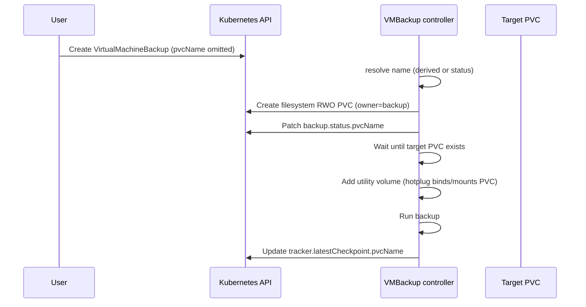

# VEP #25 Addendum: Auto-provision VirtualMachineBackup target PVCs

## VEP Status Metadata

### Target releases

- This VEP targets alpha for version: v1.10
- This VEP targets beta for version:
- This VEP targets GA for version:

### Release Signoff Checklist

Items marked with (R) are required *prior to targeting to a milestone / release*.

- [X] (R) Enhancement issue created, which links to VEP dir in [kubevirt/enhancements]: https://github.com/kubevirt/enhancements/issues/416
- [ ] (R) Alpha target version is explicitly mentioned and approved
- [ ] (R) Beta target version is explicitly mentioned and approved
- [ ] (R) GA target version is explicitly mentioned and approved

## Overview

This addendum extends [VEP #25](./vep.md) so that `VirtualMachineBackup.spec.pvcName` is optional.
When omitted, the VMBackup controller creates a filesystem RWO target PVC and records the resolved
name on `VirtualMachineBackup.status.pvcName`. The same PVC name may also be recorded on the
associated `VirtualMachineBackupTracker` checkpoint for vendor metadata—primarily when the caller
supplied the target PVC and it outlives the backup CR.

## Motivation

VEP #25 requires callers to pre-create a filesystem PVC and pass its name via `spec.pvcName` for
both push and pull mode. That forces backup vendors and operators to:

1. Discover CBT-eligible disks and estimate required capacity before creating the backup CR.
2. Choose a storage class compatible with hot-plugging into the virt-launcher pod.
3. Create a PVC using the storage class and size to hold the backup.

The parent VEP already states that for push mode "the PVC name containing the backup is provided in
the `VirtualMachineBackup` CR status", but the Status API never defined that field, and `spec.pvcName`
remained required. Making the PVC optional and exposing the resolved name in status closes that gap
and removes boilerplate for the common case where KubeVirt can size and provision the target itself.

## Goals

- Make `VirtualMachineBackup.spec.pvcName` optional.
- When `spec.pvcName` is omitted, auto-create a filesystem RWO PVC owned by the backup.
- Optional `targetPvcSizePercent` on the backup spec to tune auto-provisioned target size (default 120).
- Record the PVC actually used for the backup on `VirtualMachineBackup.status.pvcName`.
- Persist the target PVC name on `VirtualMachineBackupTracker.status.latestCheckpoint.pvcName`
  when a tracker is updated after a successful backup (see [Tracker checkpoint association](#tracker-checkpoint-association)).
- Preserve the existing path where callers supply their own PVC via `spec.pvcName`.

## Non Goals

- Changing backup modes (push/pull), quiescing, export endpoints, or restore APIs.
- Auto-provisioning source (guest) disks or VM state/CBT overlay PVCs.
- Choosing arbitrary storage classes unrelated to the VM's disks (the class is copied from
  CBT-eligible source PVCs or their bound PVs; callers that need a different class supply
  `spec.pvcName`).
- Garbage-collecting user-provided PVCs after backup completion (ownership and lifecycle of
  caller-supplied PVCs remain the caller's responsibility).
- Introducing a new feature gate; this rides on the existing incremental backup / CBT feature.

## Definition of Users

* Backup vendors integrating with `VirtualMachineBackup`
* Cluster admins scripting cluster-wide backups
* VM owners taking ad-hoc backups without managing scratch/target PVCs

## User Stories

* As a backup vendor, I want to create a `VirtualMachineBackup` without pre-creating a target PVC,
  and then read `status.pvcName` to find where the backup data landed.
* As a backup vendor using a tracker with my own target PVC, I want each checkpoint to record which
  PVC held that backup so my catalog can correlate checkpoint metadata with durable storage even
  after the `VirtualMachineBackup` CR is deleted.
* As a cluster admin, I still want to supply my own PVC via `spec.pvcName` when I need a specific
  storage class, size, or retention policy.

## Repos

[KubeVirt](https://github.com/kubevirt/kubevirt)

## Design

### Resolving the target PVC name

The controller resolves the backup target PVC as follows:

1. If `spec.pvcName` is set and non-empty, use that name (user-provided; no auto-create).
2. Else if `status.pvcName` is already set, reuse that name (idempotent reconcile after create).
3. Else derive a deterministic name from the backup name with suffix `backup-target-pvc`
   (DNS-1035 truncated via the existing KubeVirt naming helper).

In all cases the resolved name is written to `status.pvcName` once the PVC is known.

### Auto-created PVC shape

When auto-creating, the controller creates a PVC with:

| Property | Value |
| --- | --- |
| `volumeMode` | Filesystem |
| `accessModes` | `ReadWriteOnce` |
| Size | See [`targetPvcSizePercent`](#targetpvcsizepercent) below. After scaling, CDI may raise the request further via `applyStorageProfile`. |
| Storage class | Same class as CBT source disks (from PVC or bound PV); see [Storage class inference](#storage-class-inference). |
| Labels | `backup.kubevirt.io/auto-created: "true"` |
| Annotations | `cdi.kubevirt.io/applyStorageProfile: "true"` so CDI can raise the request to the storage profile minimum when the calculated size is below the profile floor—avoiding provisioning failures on profiles with minimum volume sizes. |
| Owner reference | Controller reference to the `VirtualMachineBackup` |

Ownership ensures the auto-created PVC is deleted with the backup CR. If a PVC with the derived
name already exists but is not owned by this backup, or is block mode, the backup fails with an
error directing the caller to choose a different `spec.pvcName` or remove the conflicting PVC.

Callers who need full control over size, storage class, or retention should continue to pre-create
a PVC and set `spec.pvcName`. This addendum intentionally does not embed a PVC spec on the backup
CR; the only sizing knob beyond the default algorithm is `targetPvcSizePercent` (not storage class,
access modes, or other PVC fields).

### `targetPvcSizePercent`

Optional `*int` on `VirtualMachineBackupSpec` (default **120**, range **1–1000**). When
`spec.pvcName` is omitted, the controller sizes the auto-provisioned target PVC as a percentage of
the summed CBT-eligible source PVC sizes (each size using CDI's `min(request, capacity)` rule):
`ceil(sum × targetPvcSizePercent / 100)`. CDI may raise the bound size further when
`cdi.kubevirt.io/applyStorageProfile: "true"` is set and the storage profile minimum is higher.
Ignored when `spec.pvcName` is set.

**Default sizing across backup modes:** the same formula applies to full push, incremental push, and
pull-mode scratch unless the caller overrides `targetPvcSizePercent`. Example: a VM with two
100 Gi CBT disks and default `targetPvcSizePercent` yields a **240 Gi** target PVC every time
(200 Gi summed × 120%). Incremental push and pull scratch often need less than a full-disk
footprint; callers should lower the percent (for example `50` for lean pull scratch) rather than
expecting the controller to infer backup type automatically.

**When the target is too small:** there is no automatic resize. If the backup job exhausts space
on the target PVC, the backup fails with `Failed` and the caller must increase
`targetPvcSizePercent`, delete and recreate the backup CR (for auto-provisioned PVCs), or supply a
larger PVC via `spec.pvcName`.

### Storage class inference

Online backup requires a running VMI, so CBT-eligible disk PVCs are bound. The controller picks a
storage class for auto-provisioned target PVCs as follows:

1. **Boot-candidate CBT disk** — lowest `bootOrder` among CBT-eligible disks, else the first
   CBT-eligible volume. Resolve class from that volume's backing PVC:
   - `pvc.spec.storageClassName` when set, else
   - `pv.spec.storageClassName` for the PVC's bound PV (`pvc.spec.volumeName`).
2. **Other CBT-eligible volumes** — if step 1 yields no class, repeat for the remaining
   CBT-eligible volumes until a class is found.
3. **Failure** — if no CBT-eligible volume yields a class (for example a legacy PV with no
   `storageClassName`), the backup fails with an error directing the caller to set `spec.pvcName`.

When the source PVC omits `storageClassName`, the effective class—including one chosen via the
cluster default at provision time—is read from the **bound PV**, not from cluster default
annotations. That matches the class the VM disk actually uses without substituting a different
KubeVirt or Kubernetes default name.

The controller does **not** look up `storageclass.kubevirt.io/is-default-virt-class` or
`storageclass.kubernetes.io/is-default-class`, and does **not** omit `storageClassName` on the
target PVC as a fallback. Unbound source PVCs are out of scope: backup of a never-started VM is
not supported, and a running VM's disks must already be bound.

Callers who need a specific storage class should set `spec.pvcName` and pre-create the PVC
themselves.

Kubernetes does not expose a storage-class capability API (for example, whether a class supports
RWO with filesystem `volumeMode`). The controller does not probe provisioner capabilities; it
creates a filesystem RWO PVC with the resolved storage class name—the same access mode and volume
mode used for typical VM disks, and we are not aware of storage classes in common KubeVirt use that
reject that combination. If provisioning or binding fails, the backup fails with the underlying
PVC/PV error.

Topology-sensitive classes used with VMs are typically `WaitForFirstConsumer` (WFFC): the PVC
binds only when a consuming pod schedules. The target PVC is attached as a
[utility volume](../90-utility-volumes/vep.md) through the existing hotplug path—virt-controller
creates an attachment pod on the **same node as virt-launcher**, and that pod is the consumer that
triggers WFFC binding. That is how node locality is handled; we do not need a separate topology
check in the backup controller. Immediately-binding classes follow the same RWO rules operators
already rely on for the VM's disks.

**After create or resolve:** the backup controller waits until the target PVC **object exists**
(is observed in the controller cache after create, or already present when `spec.pvcName` is set),
then adds it to `vmi.spec.utilityVolumes`. Binding (including WFFC via the attachment pod on the
virt-launcher node) and mount completion are handled by the utility-volume hotplug pipeline; the
backup controller waits until `HotplugVolumeMounted` before issuing backup `Start`. While the PVC
object is not yet observed, the backup stays in `Initializing`; provisioning, binding, attach, or
backup runtime errors surface as terminal `Failed`.

### User-provided PVC path

When `spec.pvcName` is set, behavior matches VEP #25 today: the controller waits for the PVC to
exist, rejects block-mode PVCs, and does not create or own the PVC. `status.pvcName` is still set
to the resolved (spec) name so consumers have a single place to read it. Storage class inference,
WFFC binding, and utility-volume attach apply the same way as for auto-provisioned targets.

### PVC reuse on reconcile

The controller resolves the target name from `spec.pvcName`, else reuses `status.pvcName`, else
derives a new name from the backup name. That idempotency is for reconcile safety during an
in-flight backup (controller restart, transient API errors), not for sharing PVCs across different
backup CRs (each backup gets a unique derived name).

If a PVC with the resolved name already exists and is owned by this backup, the controller reuses
it **without wiping** existing content. That matters only while the backup is still non-terminal:
for example, a reconcile after partial write during `Initializing` or `Progressing` may see data
already on the PVC from the current attempt.

**`Failed` is terminal:** once the backup reaches `Failed`, the controller does **not** start backup
work again on the same `VirtualMachineBackup` CR. Leftover files on an auto-created PVC are
therefore not an in-controller retry problem; they matter only if an operator manually reuses the
PVC outside this flow (for example by deleting the CR and creating a new one that happens to
conflict with a retained PVC, or by supplying `spec.pvcName` pointing at a PVC from a prior run).

**Recovery after failure:** delete the `VirtualMachineBackup` CR (which deletes an auto-created
target PVC via owner reference) and create a new backup CR (which provisions a new empty PVC).
Vendors should not expect an in-place retry on the same CR after `Failed`.

### Tracker checkpoint association

On successful backup completion, when updating
`VirtualMachineBackupTracker.status.latestCheckpoint`, the controller sets `pvcName` from
`backup.spec.pvcName` if present, otherwise from `backup.status.pvcName`.

**What incremental backups need:** chaining incremental backups requires the checkpoint **name**
(and its libvirt metadata), not the target PVC name. The next backup reads
`latestCheckpoint.name` as the incremental base; `pvcName` does not participate in backup mechanics.

**When `latestCheckpoint.pvcName` is useful:**

| Scenario | Role of `pvcName` on tracker |
| --- | --- |
| User-provided target PVC (`spec.pvcName` set) | The PVC typically outlives the backup CR. After the vendor deletes `VirtualMachineBackup`, the tracker remains the durable record of which PVC held that checkpoint's output. |
| Auto-provisioned target PVC | The PVC is owned by the backup CR and is deleted when the backup CR is deleted. Consumers must read `status.pvcName`, copy or export backup data, **then** delete the backup CR. `latestCheckpoint.pvcName` is audit/metadata only; it does not preserve data after the backup CR is removed. |
| Pull mode (scratch PVC) | Scratch space is transient. `pvcName` is optional catalog metadata; it is not needed to run the next incremental backup. |

**Consumer workflow (push mode, auto-provisioned):**

1. Wait for backup `Complete`.
2. Read `VirtualMachineBackup.status.pvcName` and export data from that PVC.
3. Delete `VirtualMachineBackup` (which deletes the auto-created PVC via owner reference).

Skipping step 2 before step 3 loses backup data regardless of what the tracker records.

### Flow



## API Examples

### Auto-provisioned push backup

Caller omits `spec.pvcName`. The controller creates the target PVC and reports it in status.

```yaml
apiVersion: backup.kubevirt.io/v1alpha1
kind: VirtualMachineBackup
metadata:
  name: backup1
  namespace: ns1
spec:
  source:
    apiGroup: backup.kubevirt.io
    kind: VirtualMachineBackupTracker
    name: my-backup-tracker
  mode: Push
status:
  type: Full
  checkpointName: my-backup-tracker-2025-03-03T16:13:28Z
  pvcName: backup1-backup-target-pvc
  conditions:
  - type: Complete
    status: "True"
    reason: Completed
```

### Auto-provisioned incremental pull with lean scratch

`targetPvcSizePercent` below 100 requests a smaller scratch PVC than the summed source disks—useful
for pull mode where the PVC is transient scratch, not the final backup destination.

```yaml
apiVersion: backup.kubevirt.io/v1alpha1
kind: VirtualMachineBackup
metadata:
  name: backup-incremental-1
  namespace: ns1
spec:
  source:
    apiGroup: backup.kubevirt.io
    kind: VirtualMachineBackupTracker
    name: my-backup-tracker
  mode: Pull
  tokenSecretRef: my-token
  targetPvcSizePercent: 50
```

### Explicit PVC (unchanged)

```yaml
apiVersion: backup.kubevirt.io/v1alpha1
kind: VirtualMachineBackup
metadata:
  name: backup1
  namespace: ns1
spec:
  source:
    apiGroup: kubevirt.io
    kind: VirtualMachine
    name: my-vm
  mode: Push
  pvcName: backup-output-pvc
status:
  type: Full
  pvcName: backup-output-pvc
```

### Tracker checkpoint with PVC reference

```yaml
apiVersion: backup.kubevirt.io/v1alpha1
kind: VirtualMachineBackupTracker
metadata:
  name: my-backup-tracker
  namespace: ns1
spec:
  source:
    apiGroup: kubevirt.io
    kind: VirtualMachine
    name: my-vm
status:
  latestCheckpoint:
    name: my-backup-tracker-2025-03-03T16:13:28Z
    creationTime: "2025-03-03T16:13:28Z"
    pvcName: backup1-backup-target-pvc
    volumes:
    - volumeName: datavolumedisk1
```

### API field summary

**`VirtualMachineBackupSpec.pvcName`** (`*string`, optional, immutable with the rest of spec)

- When set: existing user-provided PVC path.
- When omitted: controller auto-creates a target PVC and records it in status.

**`VirtualMachineBackupSpec.targetPvcSizePercent`** (`*int`, optional, default `120`, range `1`–`1000`)

- Sizes auto-provisioned target PVCs as a percent of summed CBT-eligible source PVC sizes.
- Ignored when `spec.pvcName` is set.

**`VirtualMachineBackupStatus.pvcName`** (`*string`, optional, controller-owned)

- Name of the PVC used to store backup output (push) or scratch data (pull).
- Set for both auto-created and user-provided targets.

**`BackupCheckpoint.pvcName`** (`*string`, optional, controller-owned)

- Name of the PVC that stored backup output (push) or scratch data (pull) for this checkpoint.
- Copied from the completing `VirtualMachineBackup` when the tracker is updated.
- Not required for incremental backup chaining; most valuable when the target PVC is user-provided
  and persists after the backup CR is deleted.

Validation changes:

- Remove the CRD rule that required `spec.pvcName` to be present.
- Add `targetPvcSizePercent` with default `120` and range `1`–`1000`.

## Alternatives

1. **Keep `spec.pvcName` required and only add `status.pvcName`**  
   Improves discoverability but still forces every caller to size and create the PVC. Rejected
   because the sizing/storage-class logic already has to live in-tree for validation of
   user-provided PVCs and can serve the default path directly.

2. **Mutate `spec.pvcName` after create**  
   Would make the resolved name visible on spec, but the backup spec is immutable
   (`self == oldSelf`). Status is the correct place for controller-resolved values.

3. **Separate CRD for backup target storage**  
   Overkill for a single PVC per backup; ownership from the backup CR is sufficient.

4. **Embed PVC spec (or parts of it) on the backup CR**  
   Gives granular control but largely duplicates the PVC API and still forces callers to size and
   choose storage class themselves—only lifecycle management moves to KubeVirt. Rejected for this
   addendum; callers who need that level of control should pre-create a PVC and set `spec.pvcName`.
   `targetPvcSizePercent` covers the common "default is too big/small" case without a second PVC
   API on the backup CR.

5. **Infer size only, without `cdi.kubevirt.io/applyStorageProfile`**  
   Rejected. Storage profiles often enforce minimum volume sizes; without the CDI annotation,
   calculated sizes below the profile floor can fail provisioning or behave inconsistently across
   storage backends.

## Scalability

- Auto-create adds at most one PVC create per `VirtualMachineBackup` (idempotent on reconcile).
- Sizing walks CBT-eligible volumes already known to the backup path and reads PVC objects from
  the existing informer cache (O(disks) cache lookups, no extra watches).
- Storage class resolution may perform one PV GET per CBT volume when the source PVC has no
  `storageClassName`; bounded to the number of CBT-eligible disks.
- `status.pvcName` and checkpoint `pvcName` are single short strings; negligible API object growth.
- No new controllers or cluster-scoped resources.

## Update/Rollback Compatibility

- Additive API change: new optional status fields; `spec.pvcName` becomes optional rather than
  required.
- Existing backups that already set `spec.pvcName` behave as before; `status.pvcName` is populated
  for consistency.
- Rolling back to a build that still requires `spec.pvcName` will reject new backups that omit it;
  already-created backups with an empty spec field may fail validation on update/replay. Operators
  should not omit `spec.pvcName` until the new validation is rolled out cluster-wide.
- Auto-created PVCs owned by the backup are deleted when the backup CR is deleted; no orphaned
  cluster state beyond normal Kubernetes garbage collection timing.
- No change to guest disk data formats or CBT overlay layout.

## Testing Approach

Unit / controller tests:

- Omit `spec.pvcName` → PVC created with filesystem/RWO, owner ref, auto-created label,
  `cdi.kubevirt.io/applyStorageProfile: "true"`, and `status.pvcName` set to the derived name.
- Provide `spec.pvcName` → no create; `status.pvcName` mirrors spec; missing PVC yields
  initializing/wait behavior.
- Name collision with an existing non-owned or block PVC → terminal error.
- Reconcile after create reuses `status.pvcName` rather than deriving a new name.
- Tracker update copies PVC name from status when spec is empty.
- Default `targetPvcSizePercent` (120) sizes PVC to `ceil(baseSize × 1.2)`; custom values honored.
- `targetPvcSizePercent` ignored when `spec.pvcName` is set.
- Undersized target PVC → backup `Failed`; no auto-resize.
- Reconcile reuses `status.pvcName` and existing owned PVC without wiping contents (non-terminal
  backup only).
- Backup in `Failed` → controller does not restart backup work on the same CR.
- Storage class from boot-candidate PVC or bound PV; walk other CBT volumes if needed; fail when no
  class is found.

## Implementation History

- 2026-08: Auto-provision target PVCs when `pvcName` is omitted; add
  `VirtualMachineBackup.status.pvcName` and `BackupCheckpoint.pvcName`. Branch:
  `internal_provision_cbt_pvc` in kubevirt/kubevirt.

## Graduation Requirements

### Alpha

- [X] Validation no longer requires `spec.pvcName`
- [X] Controller auto-creates filesystem RWO target PVCs when omitted
- [ ] Auto-created PVCs set `cdi.kubevirt.io/applyStorageProfile: "true"`
- [ ] `targetPvcSizePercent` implemented (default 120, range 1–1000, ignored when `spec.pvcName` set)
- [X] `status.pvcName` always reflects the PVC used for the backup
- [X] Tracker checkpoint records `pvcName` on successful backup
- [X] Unit coverage for create, reuse, collision, sizing, and storage-class selection
- [] Docs updated to show optional `pvcName` and how to read status

### Beta

#### On-By-Default Readiness

- [ ] No outstanding bugs around PVC ownership, sizing underestimation, or storage-class selection
- [ ] Backup vendor feedback confirming `status.pvcName` / checkpoint `pvcName` are sufficient

### GA

- [ ] Behavior stable across at least one release as beta
- [ ] User-guide documentation for both auto-provisioned and explicit PVC workflows
