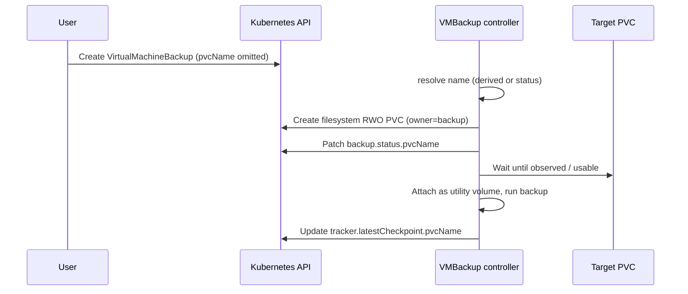

# VEP #25 Addendum: Auto-provision VirtualMachineBackup target PVCs

## VEP Status Metadata

### Target releases

- This VEP targets alpha for version: v1.10
- This VEP targets beta for version:
- This VEP targets GA for version:

### Release Signoff Checklist

Items marked with (R) are required *prior to targeting to a milestone / release*.

- [X] (R) Enhancement issue created, which links to VEP dir in [kubevirt/enhancements]: https://github.com/kubevirt/enhancements/issues/416
- [ ] (R) Alpha target version is explicitly mentioned and approved
- [ ] (R) Beta target version is explicitly mentioned and approved
- [ ] (R) GA target version is explicitly mentioned and approved

## Overview

This addendum extends [VEP #25](./vep.md) so that `VirtualMachineBackup.spec.pvcName` is optional.
When omitted, the VMBackup controller creates a filesystem RWO target PVC and records the resolved
name on `VirtualMachineBackup.status.pvcName`. The same PVC name is also recorded on the associated
`VirtualMachineBackupTracker` checkpoint so backup vendors can correlate checkpoints with the PVC
that holds the backup data.

## Motivation

VEP #25 requires callers to pre-create a filesystem PVC and pass its name via `spec.pvcName` for
both push and pull mode. That forces backup vendors and operators to:

1. Discover CBT-eligible disks and estimate required capacity before creating the backup CR.
2. Choose a storage class compatible with hot-plugging into the virt-launcher pod.
3. Create a PVC using the storage class and size to hold the backup.

The parent VEP already states that for push mode "the PVC name containing the backup is provided in
the `VirtualMachineBackup` CR status", but the Status API never defined that field, and `spec.pvcName`
remained required. Making the PVC optional and exposing the resolved name in status closes that gap
and removes boilerplate for the common case where KubeVirt can size and provision the target itself.

## Goals

- Make `VirtualMachineBackup.spec.pvcName` optional.
- When `spec.pvcName` is omitted, auto-create a filesystem RWO PVC owned by the backup.
- Record the PVC actually used for the backup on `VirtualMachineBackup.status.pvcName`.
- Persist that PVC name on `VirtualMachineBackupTracker.status.latestCheckpoint.pvcName` so
  incremental backup history retains the association between checkpoint and backup data.
- Preserve the existing path where callers supply their own PVC via `spec.pvcName`.

## Non Goals

- Changing backup modes (push/pull), quiescing, export endpoints, or restore APIs.
- Auto-provisioning source (guest) disks or VM state/CBT overlay PVCs.
- Choosing arbitrary storage classes unrelated to the VM's disks (the default class is derived from
  the boot-candidate CBT disk; callers that need a different class continue to supply `spec.pvcName`).
- Garbage-collecting user-provided PVCs after backup completion (ownership and lifecycle of
  caller-supplied PVCs remain the caller's responsibility).
- Introducing a new feature gate; this rides on the existing incremental backup / CBT feature.

## Definition of Users

* Backup vendors integrating with `VirtualMachineBackup`
* Cluster admins scripting cluster-wide backups
* VM owners taking ad-hoc backups without managing scratch/target PVCs

## User Stories

* As a backup vendor, I want to create a `VirtualMachineBackup` without pre-creating a target PVC,
  and then read `status.pvcName` to find where the backup data landed.
* As a backup vendor using a tracker, I want each checkpoint to record which PVC held that backup
  so I can locate historical backup data after the `VirtualMachineBackup` CR is deleted.
* As a cluster admin, I still want to supply my own PVC via `spec.pvcName` when I need a specific
  storage class, size, or retention policy.

## Repos

[KubeVirt](https://github.com/kubevirt/kubevirt)

## Design

### Resolving the target PVC name

The controller resolves the backup target PVC as follows:

1. If `spec.pvcName` is set and non-empty, use that name (user-provided; no auto-create).
2. Else if `status.pvcName` is already set, reuse that name (idempotent reconcile after create).
3. Else derive a deterministic name from the backup name with suffix `backup-target-pvc`
   (DNS-1035 truncated via the existing KubeVirt naming helper).

In all cases the resolved name is written to `status.pvcName` once the PVC is known.

### Auto-created PVC shape

When auto-creating, the controller creates a PVC with:

| Property | Value |
| --- | --- |
| `volumeMode` | Filesystem |
| `accessModes` | `ReadWriteOnce` |
| Size | Sum of CBT-eligible source PVC sizes (using CDI's `min(request, capacity)` rule), plus 20% filesystem overhead |
| Storage class | Storage class of the boot-candidate CBT disk (lowest `bootOrder` among CBT disks, else first CBT-eligible volume). If the class cannot be determined, the backup fails and the caller must supply `spec.pvcName`. |
| Labels | `backup.kubevirt.io/auto-created: "true"` |
| Owner reference | Controller reference to the `VirtualMachineBackup` |

Ownership ensures the auto-created PVC is deleted with the backup CR. If a PVC with the derived
name already exists but is not owned by this backup, or is block mode, the backup fails with an
error directing the caller to choose a different `spec.pvcName` or remove the conflicting PVC.

### User-provided PVC path

When `spec.pvcName` is set, behavior matches VEP #25 today: the controller waits for the PVC to
exist, rejects block-mode PVCs, and does not create or own the PVC. `status.pvcName` is still set
to the resolved (spec) name so consumers have a single place to read it.

### Tracker checkpoint association

On successful backup completion, when updating
`VirtualMachineBackupTracker.status.latestCheckpoint`, the controller sets `pvcName` from
`backup.spec.pvcName` if present, otherwise from `backup.status.pvcName`. This keeps the PVC
reference available after the `VirtualMachineBackup` object is deleted (the usual end state for
completed backups).

### Flow



## API Examples

### Auto-provisioned push backup

Caller omits `spec.pvcName`. The controller creates the target PVC and reports it in status.

```yaml
apiVersion: backup.kubevirt.io/v1alpha1
kind: VirtualMachineBackup
metadata:
  name: backup1
  namespace: ns1
spec:
  source:
    apiGroup: backup.kubevirt.io
    kind: VirtualMachineBackupTracker
    name: my-backup-tracker
  mode: Push
status:
  type: Full
  checkpointName: my-backup-tracker-2025-03-03T16:13:28Z
  pvcName: backup1-backup-target-pvc
  conditions:
  - type: Complete
    status: "True"
    reason: Completed
```

### Explicit PVC (unchanged)

```yaml
apiVersion: backup.kubevirt.io/v1alpha1
kind: VirtualMachineBackup
metadata:
  name: backup1
  namespace: ns1
spec:
  source:
    apiGroup: kubevirt.io
    kind: VirtualMachine
    name: my-vm
  mode: Push
  pvcName: backup-output-pvc
status:
  type: Full
  pvcName: backup-output-pvc
```

### Tracker checkpoint with PVC reference

```yaml
apiVersion: backup.kubevirt.io/v1alpha1
kind: VirtualMachineBackupTracker
metadata:
  name: my-backup-tracker
  namespace: ns1
spec:
  source:
    apiGroup: kubevirt.io
    kind: VirtualMachine
    name: my-vm
status:
  latestCheckpoint:
    name: my-backup-tracker-2025-03-03T16:13:28Z
    creationTime: "2025-03-03T16:13:28Z"
    pvcName: backup1-backup-target-pvc
    volumes:
    - volumeName: datavolumedisk1
```

### API field summary

**`VirtualMachineBackupSpec.pvcName`** (`*string`, optional, immutable with the rest of spec)

- When set: existing user-provided PVC path.
- When omitted: controller auto-creates a target PVC and records it in status.

**`VirtualMachineBackupStatus.pvcName`** (`*string`, optional, controller-owned)

- Name of the PVC used to store backup output (push) or scratch data (pull).
- Set for both auto-created and user-provided targets.

**`BackupCheckpoint.pvcName`** (`*string`, optional, controller-owned)

- Name of the PVC that stored the backup data for this checkpoint.
- Copied from the completing `VirtualMachineBackup` when the tracker is updated.

Validation change: remove the CRD rule that required `spec.pvcName` to be present.

## Alternatives

1. **Keep `spec.pvcName` required and only add `status.pvcName`**  
   Improves discoverability but still forces every caller to size and create the PVC. Rejected
   because the sizing/storage-class logic already has to live in-tree for validation of
   user-provided PVCs and can serve the default path directly.

2. **Mutate `spec.pvcName` after create**  
   Would make the resolved name visible on spec, but the backup spec is immutable
   (`self == oldSelf`). Status is the correct place for controller-resolved values.

3. **Separate CRD for backup target storage**  
   Overkill for a single PVC per backup; ownership from the backup CR is sufficient.

4. **Always require a StorageClass / size on the backup spec**  
   More flexible, but duplicates PVC API surface. Callers that need custom parameters can still
   create the PVC themselves and set `spec.pvcName`.

## Scalability

- Auto-create adds at most one PVC create per `VirtualMachineBackup` (idempotent on reconcile).
- Sizing walks CBT-eligible volumes already known to the backup path and reads PVC objects from
  the existing informer cache (O(disks) cache lookups, no extra watches).
- Storage class resolution may perform one PV GET when the source PVC has no `storageClassName`
  but is bound; this is uncommon and bounded to once per backup.
- `status.pvcName` and checkpoint `pvcName` are single short strings; negligible API object growth.
- No new controllers or cluster-scoped resources.

## Update/Rollback Compatibility

- Additive API change: new optional status fields; `spec.pvcName` becomes optional rather than
  required.
- Existing backups that already set `spec.pvcName` behave as before; `status.pvcName` is populated
  for consistency.
- Rolling back to a build that still requires `spec.pvcName` will reject new backups that omit it;
  already-created backups with an empty spec field may fail validation on update/replay. Operators
  should not omit `spec.pvcName` until the new validation is rolled out cluster-wide.
- Auto-created PVCs owned by the backup are deleted when the backup CR is deleted; no orphaned
  cluster state beyond normal Kubernetes garbage collection timing.
- No change to guest disk data formats or CBT overlay layout.

## Testing Approach

Unit / controller tests:

- Omit `spec.pvcName` → PVC created with filesystem/RWO, owner ref, auto-created label, and
  `status.pvcName` set to the derived name.
- Provide `spec.pvcName` → no create; `status.pvcName` mirrors spec; missing PVC yields
  initializing/wait behavior.
- Name collision with an existing non-owned or block PVC → terminal error.
- Reconcile after create reuses `status.pvcName` rather than deriving a new name.
- Tracker update copies PVC name from status when spec is empty.
- Size calculation uses `min(request, capacity)` and applies filesystem overhead.
- Storage class follows boot-candidate CBT disk; failure when class cannot be resolved.

## Implementation History

- 2026-08: Auto-provision target PVCs when `pvcName` is omitted; add
  `VirtualMachineBackup.status.pvcName` and `BackupCheckpoint.pvcName`. Branch:
  `internal_provision_cbt_pvc` in kubevirt/kubevirt.

## Graduation Requirements

### Alpha

- [X] Validation no longer requires `spec.pvcName`
- [X] Controller auto-creates filesystem RWO target PVCs when omitted
- [X] `status.pvcName` always reflects the PVC used for the backup
- [X] Tracker checkpoint records `pvcName` on successful backup
- [X] Unit coverage for create, reuse, collision, sizing, and storage-class selection
- [] Docs updated to show optional `pvcName` and how to read status

### Beta

#### On-By-Default Readiness

- [ ] No outstanding bugs around PVC ownership, sizing underestimation, or storage-class selection
- [ ] Backup vendor feedback confirming `status.pvcName` / checkpoint `pvcName` are sufficient

### GA

- [ ] Behavior stable across at least one release as beta
- [ ] User-guide documentation for both auto-provisioned and explicit PVC workflows
)
