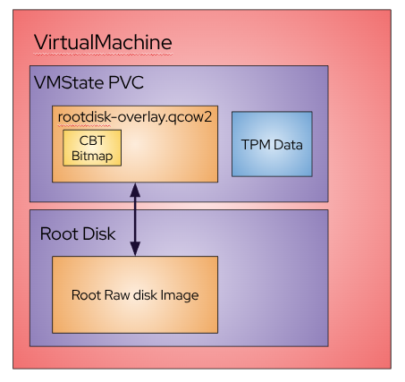
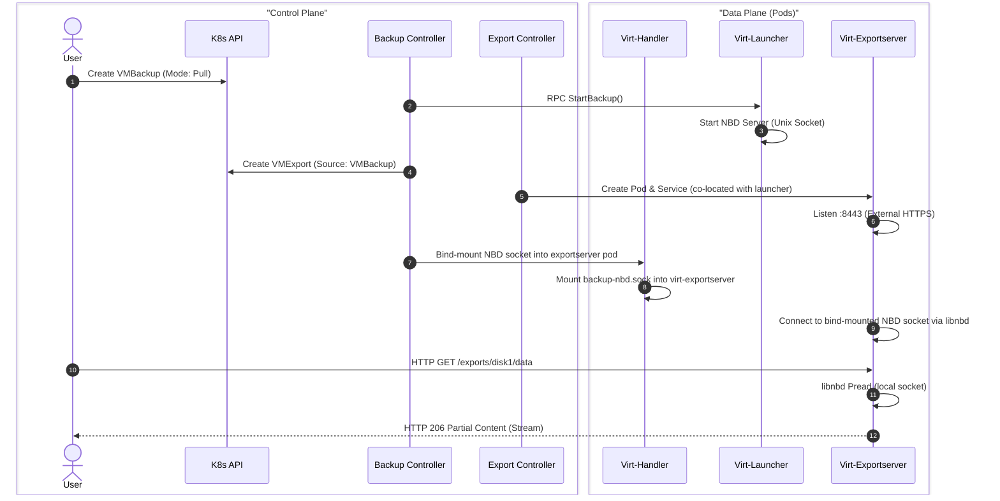

# VEP #25: Storage-agnostic incremental backup using QEMU

## VEP Status Metadata

### Target releases

- This VEP targets alpha for version: v1.8
- This VEP targets beta for version: v1.10
- This VEP targets GA for version:

### Release Signoff Checklist

Items marked with (R) are required *prior to targeting to a milestone / release*.

- [X] (R) Enhancement issue created, which links to VEP dir in [kubevirt/enhancements] : https://github.com/kubevirt/enhancements/issues/25
- [x] (R) Alpha target version is explicitly mentioned and approved
- [ ] (R) Beta target version is explicitly mentioned and approved
- [ ] (R) GA target version is explicitly mentioned and approved

## Table of contents

- [Overview](#overview)
- [Motivation](#motivation)
- [Goals](#goals)
- [Non Goals](#non-goals)
- [Definition of Users](#definition-of-users)
- [User Stories](#user-stories)
- [Repos](#repos)
- [Design](#design)
  - [Enable/disable QEMU backup](#enabledisable-qemu-backup)
  - [Backup type model](#backup-type-model)
  - [Checkpoint redefinition](#checkpoint-redefinition)
  - [Full backup](#full-backup)
  - [Incremental backup](#incremental-backup)
  - [VM crash](#vm-crash)
  - [Migration and backup](#migration-and-backup)
  - [VMSnapshot and backup](#vmsnapshot-and-backup)
  - [TTL](#ttl)
- [API Examples](#api-examples)
  - [Enable/disable QEMU backup](#enabledisable-qemu-backup-1)
  - [VirtualMachineBackupTracker CR](#virtualmachinebackuptracker-cr)
  - [VirtualMachineBackup CRD](#virtualmachinebackup-crd)
  - [Collection of the backup](#collection-of-the-backup)
  - [Restore](#restore)
- [Pull mode](#pull-mode)
  - [Chosen approach: export type backup](#chosen-approach-export-type-backup)
  - [Backup handler export command](#backup-handler-export-command)
  - [Pull mode Q&A](#pull-mode-qa)
  - [Pull mode data path](#pull-mode-data-path)
  - [Pull mode alternatives](#pull-mode-alternatives-considered)
- [Alternatives](#alternatives)
- [Scalability](#scalability)
- [Update/Rollback Compatibility](#updaterollback-compatibility)
- [Functional Testing Approach](#functional-testing-approach)
- [Known limitations](#known-limitations)
- [Implementation History](#implementation-history)
- [Graduation Requirements](#graduation-requirements)
  - [Alpha](#alpha)
  - [Beta](#beta)
    - [On-By-Default Readiness](#on-by-default-readiness)
  - [GA](#ga)

## Overview

Enables differential and incremental storage agnostic VM backup.

## Motivation

Current backup options rely on CSI storage and create a full snapshot with each backup. A 500 GiB VM backed up daily burns through storage fast and ties the backup pipeline to a single provider. KubeVirt VM backup sidesteps both problems by leveraging QEMU and libvirt's Changed Block Tracking (CBT) to transfer only what changed, on any storage backend.

## Goals

- API for cluster admins to select which VMs have CBT enabled.
- API to perform backups using QEMU CBT without requiring specific storage capabilities.

> [!NOTE]
> This feature exposes low-level backup primitives for backup vendors who provide the platform and handle data movement. It is not intended to be used standalone by VM owners.

## Non Goals

API to restore from backup. This VEP presents a restore method but does not formalize it as an API.

## Definition of Users

- Backup vendors
- Cluster admins
- VM owners

## User Stories

- As a user, I want to back up my VM efficiently in time and storage.
- As an admin, I want to take a full backup then subsequent incremental backups of only the changes.
- As an admin, I want to minimize data transfer when storing backups off-site.

## Repos

[KubeVirt](https://github.com/kubevirt/kubevirt)

## Design

### Enable/disable QEMU backup

QEMU backup with CBT works on QCOW2 images, but KubeVirt uses raw. To bridge the gap, a thin QCOW2 overlay is created on top of each raw disk to hold image metadata and dirty bitmaps. These overlays live on the VM state (backend storage) PVC (introduced in [kubevirt/kubevirt#8156](https://github.com/kubevirt/kubevirt/pull/8156)), alongside TPM and EFI state.



A `changedBlockTrackingLabelSelectors` field in the KubeVirt CR allows defining `namespace` and/or `virtualMachine` label selectors. VMs matching these selectors have CBT enabled for their supported volumes (DataVolumes, PVCs, and HostDisks).

The `changedBlockTracking` status field on VMs and VMIs reflects the CBT state in its `state` subfield:
- `PendingRestart`: VM needs a restart for changes to take effect.
- `Initializing`: Restart occurred, setup in progress.
- `Enabled`: CBT is active with QCOW2 overlays.
- `Disabled`: CBT was enabled but the VM no longer matches the selector; resources have been cleaned up.
- `IncrementalBackupFeatureGateDisabled`: The VM matches the selector but the `IncrementalBackup` feature gate is off, so no changes are made.

When a VM is selected for CBT:
1. VM status set to `Initializing` after restart.
2. VM state PVC created if needed.
3. QCOW2 overlay created for each disk, using the raw image as its data-file.
4. Domain XML modified to use the overlay with a `data-store` tag.
5. Status updated to `Enabled`.

Hot-plugged disks do not require a restart because the overlay is created before the disk is presented to the guest.

### Backup type model

Backup type is a per-disk property determined by bitmap presence at backup start, not a whole-backup scalar. At backup start, virt-launcher inspects every disk via QMP `query-named-block-nodes` and looks for the bitmap belonging to the tracker's latest checkpoint. A bitmap that is present but flagged `inconsistent` (for example after an unclean shutdown or an interrupted migration) counts as absent. Each disk then gets `backupmode="incremental"` (usable bitmap) or `backupmode="full"` (no usable bitmap) in the libvirt backup XML, so a single `BackupBegin` call can mix both.

A disk that lost its bitmap (i.e., volume live migration, volume unplug and replug, or an inconsistent bitmap after a crash) falls back to full on its own, without affecting the other disks. Per-volume type is reported on `status.includedVolumes[].type`.

The `forceFullBackup` field bypasses per-disk logic and forces all VM disks to full.

Checkpoints are treated by KubeVirt as opaque resume tokens: `{name, creationTime}`. They carry no per-volume contract and no guarantee about which disks have corresponding bitmaps. Bitmap presence is the source of truth, checked at backup start.

### Checkpoint redefinition

Libvirt checkpoint metadata is transient and must be restored after VM restart. Redefinition uses `DOMAIN_CHECKPOINT_CREATE_REDEFINE` on its own; the `DOMAIN_CHECKPOINT_CREATE_REDEFINE_VALIDATE` flag used in alpha is dropped, because redefinition exists to restore metadata and bitmap integrity is now decided per-disk at backup start. Disks without bitmaps are excluded from the redefinition XML, so a checkpoint survives partial bitmap loss instead of being discarded as a whole.

### Full backup

The backup controller drives libvirt domain commands to run the QEMU backup job. A `VirtualMachineBackup` resource initiates the process.

Two modes are supported:
- **Push mode**: A filesystem PVC is hot-plugged into the virt-launcher pod as a directory (see [VEP 90: Utility Volumes](https://github.com/kubevirt/enhancements/blob/main/veps/sig-storage/90-utility-volumes/vep.md)). Backup data is written directly to the PVC, then detached on completion.
- **Pull mode**: A filesystem PVC is hot-plugged into the virt-launcher pod for scratch space. Libvirt creates a Unix domain socket exposing NBD exports. A user-facing endpoint is exposed over HTTPS for external components to read disk data and query bitmaps.

Before the backup begins, an FSFreeze command ensures filesystem consistency (skippable via `skipQuiesce` field on a `VirtualMachineBackup`). A failed freeze does not cancel the backup: it completes with a warning and the resulting data is crash-consistent rather than application-consistent.

In push mode, the backup job terminates when all data is written. In pull mode, the job persists until the user deletes the `VirtualMachineBackup` CR, which triggers cleanup.

### Incremental backup

Libvirt provides [Checkpoints](https://libvirt.org/formatcheckpoint.html#checkpoint-xml) that mark when a backup was taken. A checkpoint is created for every backup. To perform an incremental backup, the checkpoint from the most recent backup is provided as the base.

A `VirtualMachineBackupTracker` CR tracks the latest checkpoint per VM per backup solution. Multiple independent trackers can exist for a single VM. The tracker stores the latest checkpoint name, which is automatically updated on backup completion and used as the base for the next incremental backup.

If no tracker is referenced or the tracker has no checkpoint, a full backup is performed. The `forceFullBackup` field forces a full backup even when a checkpoint exists.

### VM crash

After a VM crash, dirty bitmaps may not have been flushed to the QCOW2 metadata header and can come back flagged `inconsistent`. Checkpoints are no longer discarded for this reason: redefinition restores the checkpoint metadata for whichever disks still carry a bitmap, and the examination at backup start (see [Backup type model](#backup-type-model)) demotes each affected disk to full on its own. A post-crash backup is therefore full only for the disks whose bitmaps did not survive, and stays incremental for the rest.

### Migration and backup

Backup and migration never run concurrently. Backup wins by default, and only a `system-critical` migration overrides it:
- A backup requested while the VMI is migrating waits for the migration to finish; it does not fail.
- A migration started while a backup is in progress is held with a `migrationBlockedByBackup` condition until the backup completes or is canceled.
- A migration with `spec.priority: system-critical` (node drain/evacuation, workload update) is not held. The in-progress backup is canceled and marked `Failed`.

Canceling the backup does not release the migration on its own. Both modes keep the backup PVC attached to the virt-launcher pod as a utility volume, so the migration then blocks on `migrationBlockedByUtilityVolumes` until the backup controller detaches it. That wait is bounded by `migrationConfiguration.utilityVolumesTimeout` (default 150 seconds, counted from the migration object's creation, so the time spent waiting for the cancellation is charged against the same budget). If the volume is still attached when the timeout expires, the migration itself fails.

Dirty bitmaps are transferred with the disk image during migration. After migration, checkpoints are redefined for the new libvirt instance. If the VM state PVC is not shared, a new one is created. Incremental backups resume normally after redefinition.

### VMSnapshot and backup

Online snapshots (a Kubernetes-level feature, not native to libvirt) interfere with bitmap integrity. Restoring from an online snapshot discards all checkpoints. The next backup after a restore will be full.

### TTL

`ttlDuration` (default 2 hours) bounds the lifetime of both push and pull backups, counted from the backup's creation timestamp. If the backup has not reached a terminal state by expiration, the controller cancels the QEMU job and fails the backup. In push mode this guards against stuck jobs that would otherwise block migrations and hold a utility volume indefinitely. In pull mode the same applies but since the backup consumer is the one signaling completion, TTL expiration will always fail the backup.

## API Examples

### Enable/disable QEMU backup

KubeVirt CR configuration:

```yaml
apiVersion: kubevirt.io/v1
kind: KubeVirt
metadata:
  name: kubevirt
  namespace: kubevirt
spec:
  configuration:
    changedBlockTrackingLabelSelectors:
      namespaceLabelSelector:
        matchLabels:
          changedBlockTracking: "true"
      virtualMachineLabelSelector:
        matchLabels:
          workload-type: db
```

VM status after enabling:
```yaml
status:
  changedBlockTracking:
    state: PendingRestart
```

Domain XML modification (raw disk to QCOW2 overlay with data-store):
```xml
<disk type='file' device='disk' model='virtio-non-transitional'>
  <driver name='qemu' type='qcow2' cache='none' error_policy='stop' discard='unmap'/>
  <source file='/run/kubevirt-private/libvirt/qemu/swtpm/datavolumedisk.qcow2'>
    <dataStore type='file'>
      <format type='raw'/>
      <source file='/run/kubevirt-private/vmi-disks/datavolumedisk/disk.img'/>
    </dataStore>
  </source>
</disk>
```

### VirtualMachineBackupTracker CR

Namespace-scoped CR tracking the latest checkpoint per VM per backup solution. `IncrementalBackup` feature gate must be enabled.

**Spec:**
- `source`: The VM this tracker is associated with.

**Status:**
- `latestCheckpoint`: Checkpoint of the latest backup (`name`, `creationTime`). Updated by the backup controller. Passed to virt-launcher as the reference point for bitmap examination.

```yaml
apiVersion: backup.kubevirt.io/v1alpha1
kind: VirtualMachineBackupTracker
metadata:
  name: my-backup-tracker
  namespace: ns1
spec:
  source:
    apiGroup: kubevirt.io
    kind: VirtualMachine
    name: my-vm
status:
  latestCheckpoint:
    name: my-backup-tracker-2025-03-03T16:13:28Z
    creationTime: "2025-03-03T16:13:28Z"
```

### VirtualMachineBackup CRD

Namespace-scoped CR that initiates a backup. Only one backup per VM at a time.

**Spec:**
- `source`: The VM to back up, or a `VirtualMachineBackupTracker` reference (for incremental backups).
- `mode`: `Push` (default) or `Pull`.
- `pvcName`: Required. PVC for backup output (push) or scratch space (pull).
- `skipQuiesce`: Skip filesystem freeze before backup.
- `forceFullBackup`: Force a full backup for all VM disks, even when a checkpoint exists.
- `tokenSecretRef`: Required for pull mode. Secret containing the authentication token.
- `ttlDuration`: Time to live for the backup (default: 2 hours).

**Status:**
- `checkpointName`: Checkpoint created for this backup.
- `conditions`: `Progressing`, `Complete`, `Failed`, and `Quiesced`, as standard `metav1.Condition`s. Phase detail is carried in the condition `reason`: `Initializing`, `Initiated`, `PreparingExport`, `ExportInitiated`, `ExportReady`, `Aborting`, `Completed`, `CompletedWithWarning`, `Failed`, `SourceLost`, `SourceUnhealthy`.
  `Quiesced` reports the outcome of the filesystem freeze (`QuiesceSucceeded`, `QuiesceFailed`, `QuiesceSkipped`); a failed freeze completes the backup with reason `CompletedWithWarning`.
- `includedVolumes`: Volumes included in the backup, each with `volumeName` and `type` (`Full` or `Incremental`).
- `links`: Pull mode only. Export endpoints split into `internal` and `external` entries, each carrying its own CA certificate and per-volume data/map endpoint URLs.

`links` follows `VirtualMachineExport`'s `status.links` in splitting internal from external and giving each half its own `cert`. It does not reuse that API's `backups[].endpoints[]` shape: inside a `VirtualMachineBackup` the entries are volumes, and keying them by `volumeName` is what lets a client correlate them with `includedVolumes[]`.

Push mode example:
```yaml
apiVersion: backup.kubevirt.io/v1alpha1
kind: VirtualMachineBackup
metadata:
  name: backup1
  namespace: ns1
spec:
  source:
    apiGroup: backup.kubevirt.io
    kind: VirtualMachineBackupTracker
    name: my-backup-tracker
  mode: Push
  pvcName: backup-output-pvc
status:
  checkpointName: my-backup-tracker-2025-03-03T16:13:28Z
  includedVolumes:
    - volumeName: rootdisk
      type: Incremental
    - volumeName: datadisk
      type: Full
```

Pull mode example:
```yaml
apiVersion: backup.kubevirt.io/v1alpha1
kind: VirtualMachineBackup
metadata:
  name: backup1
  namespace: ns1
spec:
  source:
    apiGroup: backup.kubevirt.io
    kind: VirtualMachineBackupTracker
    name: my-backup-tracker
  mode: Pull
  pvcName: backup-scratch-pvc
  tokenSecretRef: my-token
status:
  checkpointName: my-backup-tracker-2025-03-03T16:13:28Z
  includedVolumes:
    - volumeName: rootdisk
      type: Incremental
    - volumeName: datadisk
      type: Full
  links:
    internal:
      cert: "<base64-encoded CA cert>"
      volumes:
        - volumeName: rootdisk
          dataEndpoint: https://backup-export-backup1.ns1.svc/exports/rootdisk/data
          mapEndpoint: https://backup-export-backup1.ns1.svc/exports/rootdisk/map
        - volumeName: datadisk
          dataEndpoint: https://backup-export-backup1.ns1.svc/exports/datadisk/data
          mapEndpoint: https://backup-export-backup1.ns1.svc/exports/datadisk/map
    external:
      cert: "<base64-encoded CA cert>"
      volumes:
        - volumeName: rootdisk
          dataEndpoint: https://virt-exportproxy-kubevirt.apps.example.com/.../rootdisk/data
          mapEndpoint: https://virt-exportproxy-kubevirt.apps.example.com/.../rootdisk/map
        - volumeName: datadisk
          dataEndpoint: https://virt-exportproxy-kubevirt.apps.example.com/.../datadisk/data
          mapEndpoint: https://virt-exportproxy-kubevirt.apps.example.com/.../datadisk/map
```

### Collection of the backup

> [!IMPORTANT]
> The following are suggestions for backup vendors. KubeVirt does not provide an API for these operations.

**Push mode:** The backup PVC contains sparse QCOW2 images, one per disk. A data-mover pod can be spawned to copy the data to remote storage.

**Pull mode:** Clients connect via HTTPS to endpoints in the backup status, authorized with the user-provided token (`x-kubevirt-export-token` header).

| Method | Endpoint | Description |
|--------|----------|-------------|
| GET | `/exports/{disk}/data` | Streams raw disk data. Supports `offset` and `length` query params. |
| GET | `/exports/{disk}/map` | Returns JSON extents (clean/dirty). Supports `offset`, `length`, and `page_size` query params. |

### Restore

> [!IMPORTANT]
> The following is a naive approach only. KubeVirt does not provide an API for this operation.

Assuming full and incremental backups are available, apply incrementals in order using `qemu-img rebase`:

```bash
qemu-img rebase -b fullbackup.qcow2 -f qcow2 -u incremental1.qcow2
qemu-img rebase -b incremental1.qcow2 -f qcow2 -u incremental2.qcow2
```

Convert the final QCOW2 to raw for use in KubeVirt:

```bash
qemu-img convert -f qcow2 -O raw incremental2.qcow2 restored-raw.img
```

Store the raw image in a PVC using import or upload.

## Pull mode

### Chosen approach: export type backup

KubeVirt's `VirtualMachineExport` API is generalized to support a new source kind: `VirtualMachineBackup`.

Flow:
1. User creates a `VirtualMachineBackup` with `mode: Pull`.
2. Backup controller invokes `Backup` RPC on virt-launcher, starting the libvirt backup job and NBD server on a Unix socket.
3. Backup controller creates an owned `VirtualMachineExport` with source `VirtualMachineBackup`.
4. Export controller launches the virt-exportserver pod with volume info from the backup status, carrying a pod affinity term towards the virt-launcher pod so that it lands on the same node (required by step 5).
5. Backup controller instructs virt-handler to bind-mount the virt-launcher's NBD Unix socket into the virt-exportserver pod's filesystem.
6. Virt-exportserver connects to the bind-mounted NBD socket via libnbd. No network I/O between the pods for data transfer.
7. Virt-exportserver registers HTTP handlers per backup volume. Client requests are served via libnbd reads on the local socket.



Security: external traffic secured via the existing export certificate API with user-provided token authorization. The bind-mounted NBD socket relies on filesystem-level isolation and pod security context for access control. No network traffic between the pods for data transfer.

### Backup handler export command

The bind-mount is triggered through the existing `Backup` subresource on virt-handler using `BackupOptions{Cmd: Export, ExporterPodUID: "<uid>"}`. Virt-handler resolves the launcher and exporter pod paths, then performs a bind mount via `virt-chroot` to project the NBD socket into the exporter pod's emptyDir volume. The mount is recorded locally for idempotency.

### Pull mode Q&A

**Q: How does the virt-exportserver interact with the NBD socket?**

It connects to the bind-mounted NBD Unix socket via libnbd, keeping the entire data path local to the node with no network hop between the pods. For data requests it uses `libnbd.Pread` and streams binary data into the HTTP response. For map requests it uses `libnbd.BlockStatus` to query dirty bitmap extents and returns them as JSON.

**Q: How are failures handled?**

- Virt-exportserver failure: Export controller recreates the pod. Backup controller re-establishes the bind-mount. Clients retry until the endpoint is available again.
- Virt-launcher failure: Backup is marked `Failed`. The NBD server is gone and dirty bitmaps may be inconsistent, requiring a full backup next time.

**Q: How are node evictions handled?**

- Virt-exportserver eviction: same as abrupt termination.
- Virt-launcher eviction: node drain issues a `system-critical` migration, which cancels the in-progress backup instead of being blocked by it (see [Migration and backup](#migration-and-backup)). The backup is marked `Failed` and the client has to start a new one once the VM has landed on the target node. In pull mode the VMExport and the exportserver pod have to be torn down before the scratch PVC can detach, so that teardown competes with the utility volume timeout that gates the migration.

### Pull mode data path

The data path has significant impact on pull mode throughput.

#### Chosen: NBD socket bind-mount

Virt-handler bind-mounts the virt-launcher's NBD Unix socket into the virt-exportserver pod. The data path is:

```
QEMU -> NBD Unix socket -> libnbd Pread -> HTTP response writer
```

This eliminates protobuf serialization, gRPC framing, and inter-pod mTLS encryption.

The export pod declares an emptyDir volume at `/var/run/kubevirt/nbd` with `MountPropagationHostToContainer`. Virt-exportserver watches for the socket and connects via `libnbd.ConnectUnix`. Reads use 1 MiB chunks streamed directly into the HTTP response. The VMExport becomes Ready once the NBD connection is established.

The bind-mount only works when the exporter and the launcher share a node. This is currently expressed as a preferred (soft) pod affinity towards the virt-launcher pod, so co-location is not guaranteed and an exporter scheduled elsewhere never becomes Ready. Turning this into a hard constraint is a graduation item.

**Throughput benchmarks** (full 20 GiB disk pull, external network storage):

| Approach | Throughput | vs. Baseline |
|---|---|---|
| gRPC tunnel, sync Pread, 256 KiB chunks (baseline) | 89.4 MB/s | - |
| gRPC tunnel, libnbd AIO (16 in-flight), 256 KiB chunks | 103 MB/s | +15% |
| gRPC tunnel, libnbd AIO (16 in-flight), 1 MiB chunks | 117 MB/s | +31% |
| **NBD socket bind-mount, sync Pread, 1 MiB chunks** | **132 MB/s** | **+48%** |

The `libnbd AIO` rows replace the synchronous `Pread` loop with `AioPread` + `Poll` and up to 16 reads in flight, overlapping NBD reads with downstream writes. That optimization sits at the NBD read layer and is orthogonal to the transport, so it applies to the bind-mount path as well. The bind-mount row was measured with synchronous reads only, so it is a lower bound for the chosen approach rather than a like-for-like ceiling.

### Pull mode alternatives considered

**gRPC tunnel**: Virt-launcher establishes a gRPC-over-HTTP/2-CONNECT tunnel to virt-exportserver. Each read traverses: libnbd -> protobuf marshal -> gRPC HTTP/2 frames -> HTTP/2 CONNECT tunnel (mTLS) -> virt-exportserver -> HTTP response. CPU profiling shows ~28-30% in syscalls and ~6% in TLS, overhead inherent to the transport. See throughput benchmarks above.

**Network push**: Virt-launcher connects to a remote endpoint and pushes data. Requires secret hotplug for TLS certificates. Breaks pull-mode features.

**Ingress**: A service exposes the virt-launcher directly. Requires conditional DNAT to route traffic to virt-launcher instead of the guest, and secret hotplug. No ingress solution for the virt-launcher pod exists today.

## Alternatives

[KEP-3314: CSI Changed Block Tracking](https://github.com/kubernetes/enhancements/tree/master/keps/sig-storage/3314-csi-changed-block-tracking) was considered as an alternative.

Advantages: aligns with the Kubernetes ecosystem; backup vendors already use CSI for full backups.

Disadvantages: still in early stages with no timeline for maturity; requires optional per-provider SnapshotMetadata API adoption; requires guest freeze during the full snapshot duration (vs. libvirt's quick state capture); limited flexibility in API design.

## Scalability

### QCOW2 overlay storage overhead

QCOW2 overlays are stored on the VM state PVC. The overhead per overlay includes L2 tables, refcount tables, and dirty bitmap data. For a high-end scenario (5 disks x 500 GiB, 256 KiB clusters, 10 bitmaps, 64 KiB bitmap granularity), total overlay overhead is approximately 148 MiB. The backend state PVC is provisioned with 512 MiB by default to accommodate this. See [`CBTBackendStateOverhead`](https://github.com/kubevirt/kubevirt/blob/92dff93d6f/pkg/storage/cbt/cbt.go#L41-L57) for the detailed calculation.

### Storage provider minimum volume size

Some storage providers provision larger volumes than requested based on their minimum volume size. With many VMs, this can lead to storage inefficiency. This is a general limitation shared with VM state PVCs.

## Update/Rollback Compatibility

Users must opt in by enabling CBT. Rollback is equivalent to disabling CBT. No data migration is required.

## Functional Testing Approach

- Data consistency before and after overlay creation and removal.
- Data consistency of incremental backups.
- Data consistency after VM restart.
- Failure scenarios where incremental backup is not possible (fallback to full).
- Mixed full/incremental backup in a single job: unplug and replug a disk of a running VM to destroy its bitmap, then verify the replugged disk reports `Full` while the others stay `Incremental`.

## Known limitations

- **Live overlay addition**: Enabling CBT currently requires a VM restart because overlays cannot be inserted under a running disk yet (tracked in [RHEL-80680](https://issues.redhat.com/browse/RHEL-80680)). The `PendingRestart` state will be deprecated once live addition lands.
- **Offline backup**: Only online (running VM) backup is supported today. Offline backup will be addressed by a separate VEP.
- **State interruptions**: If the guest OS initiates a shutdown during backup, the backup is canceled and marked as failed because there is no way to finish cleanly before the domain disappears (pending [RHEL-8067](https://issues.redhat.com/browse/RHEL-8067)).
- **Differential backup**: Only the latest checkpoint can serve as a base for incremental backup. Multi-checkpoint retention and the ability to back up from a specific previous checkpoint will be addressed by a separate VEP.
- **Backup teardown during node drain**: A `system-critical` migration cancels an in-progress backup, but the migration stays blocked until the backup's utility volume detaches. If teardown has not completed when `utilityVolumesTimeout` (default 150 seconds) fires, the utility volume is force-detached. Pull mode is especially sensitive here: the VMExport and exportserver pod must be torn down before the scratch PVC can detach, so a drain landing on a long-lived pull-mode backup is the likeliest path to a force-detach. Metrics are exposed to give operators visibility into how often this occurs.
- **Orphaned overlays**: Replacing a disk's backing PVC (offline or online) can leave orphaned QCOW2 overlays on the VM state PVC with no automatic reclaim path.

## Implementation History

- v1.8 (Alpha): CBT enable/disable via label selectors and QCOW2 overlays, `VirtualMachineBackup` and `VirtualMachineBackupTracker` CRs, push and pull mode, single-checkpoint incremental backup, checkpoint redefinition after VM restart.
- v1.9 (Alpha): backup conditions moved to `metav1.Condition` and consolidated into `Progressing`/`Complete`/`Failed` with the phase carried in the condition reason, `system-critical` migrations cancel an in-progress backup instead of being blocked by it.

## Graduation Requirements

### Alpha

- [x] Enable/disable CBT per VM via label selectors and QCOW2 overlays
- [x] `VirtualMachineBackup` CR with push and pull modes
- [x] `VirtualMachineBackupTracker` CR for checkpoint tracking
- [x] Single-checkpoint incremental backup
- [x] Checkpoint redefinition after VM restart and migration

### Beta

- [ ] Per-volume backup type reporting, with disk-level fallback to full for missing or inconsistent bitmaps
- [ ] Pull-mode internal and external endpoints reported through `status.links`
- [ ] TTL support for both modes (Push and Pull), resulting in backup failure on expiration
- [ ] virt-exportserver co-location with virt-launcher enforced as a hard scheduling constraint rather than a preference
- [ ] Pull-mode teardown on a `system-critical` migration force-detaches the utility volume when `utilityVolumesTimeout` fires, with metrics exposed for operator observability
- [ ] [VEP 90](https://github.com/kubevirt/enhancements/blob/main/veps/sig-storage/90-utility-volumes/vep.md) Utility Volumes graduates to beta
- [ ] Backup vendor stakeholder approval

#### On-By-Default Readiness

- [ ] Storage cost documented for cluster admins: every CBT-enabled VM's backend storage PVC grows by 512 MiB, more on storage with a large minimum volume size (see [Scalability](#scalability)).
- [ ] Backup cancellation on `system-critical` migration covered by functional tests, since node drain and workload updates now interact with a feature that is on by default.

### GA

- [ ] At least one release cycle of beta stability without API changes
