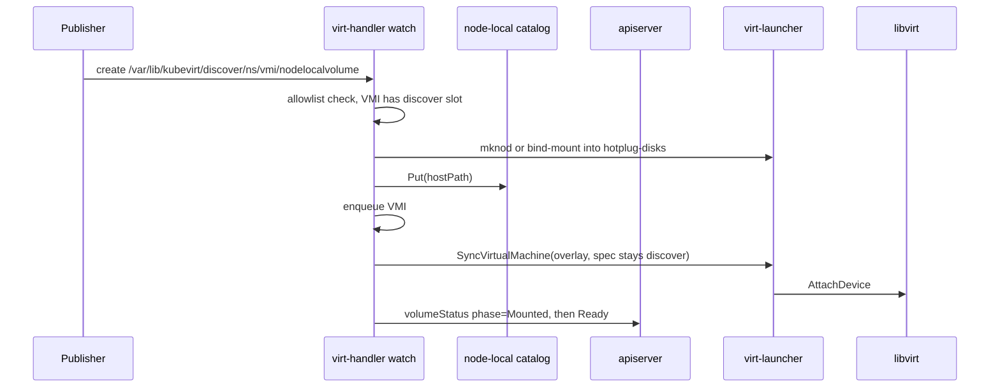
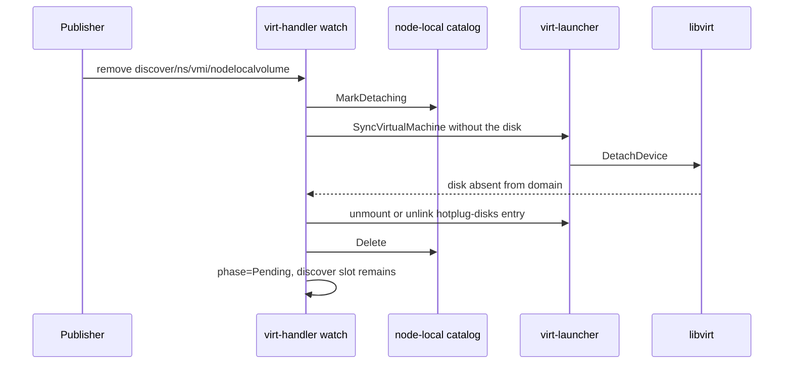

# VEP #293: Extend Hotplug APIs

## VEP Status Metadata

### Target releases

-  This VEP targets alpha for version: v1.10
-  This VEP targets beta for version: TBD
-  This VEP targets GA for version: TBD

### Release Signoff Checklist

Items marked with (R) are required *prior to targeting to a milestone / release*.

- [+] (R) Enhancement issue created, which links to VEP dir in [kubevirt/enhancements] (not the initial VEP PR)
- [] (R) Alpha target version is explicitly mentioned and approved
- [] (R) Beta target version is explicitly mentioned and approved
- [] (R) GA target version is explicitly mentioned and approved

## Overview

This VEP extends volume hotplug by splitting the current monolithic flow into three steps that can be driven independently: **volume delivery**, **volume attach**, and **volume detach**.

Volume delivery is the step the user selects. KubeVirt ships two optional delivery options, and the same attach and detach steps run after either of them:

1. **Attachment pod.** The existing virt-controller path for a hotpluggable PVC or DataVolume. The user opts into it. Turning on node-local hotplug leaves this path in place for volumes that ask for it.
2. **Node-local discover volume.** Optional, behind the `NodeLocalHotplug` feature gate. The empty `discover: {}` slot is added to the VMI spec when it is created. virt-handler watches `/var/lib/kubevirt/discover/<namespace>/<vmi-name>/<volume>` and, as soon as that file is there, publishes it and updates the volume. Removing the file detaches it. No attachment pod is created.

`AddVolume` and `RemoveVolume` stay. They remain the way a user selects the attachment-pod option.

## Motivation

KubeVirt hotplug today works but is monolithic and Pod-heavy for PVC-backed volumes. The mechanism works by:

1. **Launching an attachment Pod** on the target node, which mounts the PVC so the volume is available on the host.
2. **Manipulating bind mounts on the host** to expose that volume into the `virt-launcher` Pod's mount namespace, since Kubernetes does not allow mutating a Pod's `volumes` spec after creation.
3. **Hotplugging the disk into the VM** via libvirt/QEMU once the volume is visible inside `virt-launcher`.

While this design successfully leverages standard Kubernetes components and reuses as many Kubernetes apis as possible to limit the burden on kubevirt to maintain custom code, the end-to-end flow is hard-wired inside KubeVirt and exposed through a single API surface. Every step — volume delivery, attachment into the VM, and detachment — is driven by the same built-in controllers, which makes it difficult to customize or replace any individual stage for workloads that have specialized requirements.

This VEP proposes an extension of the hotplug APIs that decomposes the current monolithic flow into discrete, independently replaceable stages. Some callers need the attachment pod. Others add an empty discover slot when the VMI is created and let an on-node publisher write a file. virt-handler watches that path and updates the volume as soon as the file is there. The user chooses the delivery option per volume. Attach into `virt-launcher` and the libvirt hotplug stay shared.

## Goals

- Decompose hotplug into three steps: volume delivery, volume attach, and volume detach. A new delivery option reuses attach and detach.
- Let the user choose the delivery option on the volume.
- Keep the attachment-pod flow as an optional delivery option for hotpluggable PVCs and DataVolumes.
- Add an optional node-local discover volume. The empty slot is added when the VMI is created. virt-handler watches the discover path and updates the volume as soon as the file is there.
- Leave the VMI spec free of host paths. A path on the spec remains a `HostDisk`.
- Keep libvirt attach and detach on the existing `syncDisks` path.

## Non Goals

- Removing the attachment pod for volumes whose delivery option is a hotpluggable PVC or DataVolume.
- Replacing the `AddVolume` / `RemoveVolume` subresources.
- Changing libvirt attach and detach semantics.
- Migrating a VMI that has a discover volume. The VMI is marked non-migratable for as long as that volume is on the spec.
- A gRPC API on virt-handler.
- Teaching virt-controller how to provision discover disks. Whoever writes the file on the node owns delivery.

## Definition of Users

- **Cluster administrators** who hotplug a PVC or DataVolume with today's attachment pod, and who also declare a discover slot on the same VM.
- **On-node publishers** (CSI sidecars, vendor agents, debug tooling) that write a file under the discover path and expect virt-handler to attach it without an attachment pod.
- **Operators** who add an empty discover slot when the VMI is created and let a node-local agent fill it.

## User Stories

* As a user hotplugging a PVC, I want the attachment pod to keep working when node-local hotplug is enabled, so that existing `addvolume` clients stay on the delivery option I selected.
* As an operator, I want to put an empty discover volume and its matching disk on the VM template so they are on the VMI at creation, and have a privileged on-node publisher write a file that virt-handler attaches without an attachment pod.
* As that publisher, I want removing the file to detach the disk and leave the same slot in place for the next file.
* As a cluster administrator, I want a VMI that has a discover volume to be non-migratable, because the file exists only on the node where it was published.
* As a KubeVirt developer, I want a new delivery option to plug in at step 1 only, so attach and detach do not grow a new code path per volume type.

# Repos

[KubeVirt](https://github.com/kubevirt/kubevirt)

# Design

## High-level Approach

Volume hotplug today is a single, KubeVirt-managed pipeline exposed through one API. Conceptually, however, it breaks down into three independent steps:

1. **Volume delivery** — making the underlying storage available on the target node (today, by launching an attachment Pod that binds the PVC and exposes it on the host).
2. **Volume attach (hot plug)** — surfacing the delivered volume inside the running `virt-launcher` Pod and hotplugging the corresponding disk into the VM via libvirt/QEMU.
3. **Volume detach (hot unplug)** — reversing the above: detaching the disk from the VM, removing it from the `virt-launcher` Pod, and tearing down any delivery resources.

This VEP decomposes that flow into three steps — volume delivery, volume attach, and volume detach — so a delivery option can change on its own and still use the same attach and detach paths. The user selects the delivery option on the volume. The attachment pod stays an optional delivery option for a hotpluggable PVC or DataVolume. A discover volume is the other optional option. The empty `discover: {}` slot is added when the VMI is created. virt-handler watches `/var/lib/kubevirt/discover/<namespace>/<vmi-name>/<volume>` and, as soon as that file is there, updates the volume through the shared attach path. Removing the file runs the shared detach path. No attachment pod is created for that volume.

### Phase Pipeline

The end-to-end flow is modeled as a three-phase pipeline. Phase 1 (Delivery) is pluggable and may run off-node or on-node; Phases 2 and 3 (Attach / Detach) are the node-local surface introduced by this VEP and run inside `virt-handler`:

```text
+-------------------------------+     +-------------------------------+     +-------------------------------+
| 1. Volume delivery            |     | 2. Volume attach              |     | 3. Volume detach              |
| user-selected, optional       | --> | shared                        | --> | shared                        |
|                               |     |                               |     |                               |
| Option A: attachment pod      |     | publish into virt-launcher    |     | drop the disk from the sync  |
|   hotpluggable PVC / DV       |     | hotplug-disks                 |     | libvirt DetachDevice          |
|   virt-controller             |     |   block: mknod + cgroup       |     | unmount / unlink in launcher  |
|                               |     |   file: bind-mount            |     |                               |
| Option B: discover volume     |     | overlay into launcher sync    |     | attachment pod: delete pod    |
|   virt-handler watches the    |     | syncDisks -> libvirt attach   |     | discover: file removed,       |
|   discover path and updates   |     |                               |     | return the slot to Pending    |
|   as soon as the file is there|     |                               |     |                               |
+-------------------------------+     +-------------------------------+     +-------------------------------+
```

Enabling `NodeLocalHotplug` does not switch every volume onto option B. virt-controller still creates attachment pods for hotpluggable PVCs and DataVolumes. It skips the attachment pod only for volumes the user marked node-local (`discover: {}`, or `hotplugVolume.nodeLocal: true`).

A future delivery option is another way to produce a host path. If that option must skip the attachment pod, it sets `hotplugVolume.nodeLocal`. Attach and detach stay as they are.

### Option A — attachment pod

The user selects this option by hotplugging a PVC or DataVolume, through `AddVolume`, declarative volume hotplug, or `hotpluggable: true` on the volume. virt-controller creates the attachment pod, virt-handler bind-mounts it into `virt-launcher`, and `syncDisks` hotplugs the disk. That sequence is unchanged.

`volumesForAttachmentPod` filters the hotplug list before any pod is created:

- a volume with `discover: {}` is left out
- a volume whose status has `hotplugVolume.nodeLocal: true` is left out
- every other hotplug volume is passed through

With the feature gate off, the filter is a no-op and discover volumes are rejected at admission.

### Option B — node-local volume

The user selects this option by adding an empty discover slot to the VM template, so it is on the VMI spec at creation time. The slot is a volume plus a matching disk under `domain.devices.disks`, with the same name. Admission already requires every volume to map to a disk, and that rule covers `discover` too. Bus, serial, and boot order are set on that disk when the VMI is created. The spec never gains a host path.

`AddVolume`, `RemoveVolume`, and declarative volume hotplug apply to hotpluggable PVCs and DataVolumes. They do not add a discover slot to a VMI that is already running. While the VM is running, the publisher creates and removes the file on the node.

```yaml
domain:
  devices:
    disks:
    - name: nodelocalhotplugvolumes
      disk:
        bus: scsi
volumes:
- name: nodelocalhotplugvolumes
  discover: {}
```

`DiscoverVolumeSource` is empty. virt-handler computes one path and watches it. Until the file is there, the launcher sync omits this disk, so the guest domain does not contain it. As soon as the file is there, virt-handler publishes it into `virt-launcher` and includes that same disk in the sync. The disk on the VMI spec is the one the guest receives.

```text
/var/lib/kubevirt/discover/<namespace>/<vmi-name>/<volume>
/var/lib/kubevirt/discover/<namespace>/<vmi-name>/<volume>.img
```

The virt-handler DaemonSet mounts that directory from the host (`HostPathDirectoryOrCreate`). A publisher writes the file. The publisher does not call virt-handler, and it does not patch the VMI.

virt-handler watches that path and updates the volume as soon as it finds the file:

1. On startup it watches the tree and attaches every file it finds.
2. On each VMI reconcile it creates `<namespace>/<vmi-name>/` and attaches any file it finds there.
3. On `fsnotify` create or write it waits briefly for the file to settle, then attaches and updates the volume.
4. On remove or rename it marks the catalog entry detaching and enqueues the VMI.

The path must be exactly those three components. `.`, `..`, empty segments, and names starting with `.` are ignored. The lookup uses the local VMI cache. A file for an unknown VMI is retried for a short window and then dropped.

While the file is absent, status stays `Pending` with message `Waiting for volume <name> to be published on the node`. The disk is omitted from the launcher sync, so the guest does not see an empty device. A discover volume is not a hotpluggable PVC, so `Pending` does not block VMI startup. The guest boots with that disk left out.

On each reconcile, virt-handler scans the discover path before the domain sync. A file that is already there when the VMI starts is published and included in that first sync.

A discover volume sets `status.volumeStatus[].hotplugVolume.nodeLocal: true` and leaves `attachPodName` / `attachPodUID` empty. virt-controller does not invent an attachment-pod phase for it. virt-handler owns the phase.

The on-node record of a delivered disk is a `NodeLocalVolume` in a catalog virt-handler keeps at `/var/run/kubevirt-private/node-local-hotplug/<vmi-uid>.json`:

- `name` — volume name on the VMI
- `hostPath` — the discover path virt-handler found
- `disk` / `volume` — what the launcher sync should see
- `detaching` — set when detach has been requested and the guest disk is not gone yet

The catalog is node-local state. It is not a CRD and it is not written back onto the VMI spec. A host path on the VMI spec is a `HostDisk`.

### Step 2 — attach

Attach starts once delivery has a host path.

For an attachment-pod volume, virt-handler keeps using `hotplugVolumeMounter`: the pod's volume is bind-mounted into the launcher, then `syncDisks` calls libvirt.

For a node-local volume, virt-handler publishes the host path into the launcher Pod's `hotplug-disks` directory. The publisher does not need mount or mknod rights.

| Source | Action inside virt-launcher |
|---|---|
| Block device | `mknod` with the host major/minor, cgroup allow, chown |
| Regular file | bind-mount as `<volume>.img`, chown |
| Directory | bind-mount as `<volume>/`, chown |

The VMI object in the API is left as `discover: {}`. virt-handler deep-copies it for the launcher sync and overlays the catalog entry onto that copy only:

- the volume source on the copy becomes a synthetic hotpluggable PVC whose claim name is the volume name, so the existing converter looks in the launcher `hotplug-disks` directory
- that claim is not a PVC in the cluster and is never written back to the API
- the disk from the VMI spec is included
- volumes still waiting, and volumes marked detaching, are left out of the copy

`SyncVirtualMachine` then runs the existing converter and `syncDisks` path. libvirt attach is unchanged.



A catalog entry with the same host path that is not detaching is left alone. A second publish of the same file does not stage the device again.

### Step 3 — detach

**Attachment pod.** `RemoveVolume` (or deleting the hotpluggable volume from the VM spec) follows today's flow: virt-controller deletes the attachment pod, virt-handler unmounts the launcher, libvirt detaches the disk, and the volume status is removed once the phase reaches `UnMountedFromPod`.

**Discover.** The slot stays on the spec. Detach starts when the file disappears from the discover path.

1. The publisher removes the file. virt-handler marks the catalog entry detaching.
2. virt-handler sets the volume phase to `Detaching`.
3. The launcher sync copy omits that disk. `syncDisks` issues libvirt detach.
4. After the domain no longer reports the disk, virt-handler removes the mount or device node from `virt-launcher` and deletes the catalog entry.
5. Status returns to `Pending`. The empty `discover: {}` slot remains, ready for the next file.

virt-handler does not delete the publisher's file. Detach starts because the file is already gone.

When the VMI is deleted, virt-handler removes `/var/run/kubevirt-private/node-local-hotplug/<vmi-uid>.json`. The `virt-launcher` Pod going away drops the mounts and device nodes inside that Pod.



### Status

`VolumeStatus` keeps its current fields. Node-local volumes add `hotplugVolume.nodeLocal: true`. They do not use `attachPodName` or `attachPodUID`.

Discover volumes move through these phases. virt-handler writes them. virt-controller preserves them.

| Phase | Meaning |
|---|---|
| `Pending` | Slot is declared. Nothing is published on the node yet. |
| `MountedToPod` (`HotplugVolumeMounted`) | The host path is published into `virt-launcher`. libvirt has not reported a target. |
| `Ready` | The domain XML has a target for the disk. |
| `Detaching` | Detach was requested. The catalog entry is kept until the guest disk is gone. |
| `Pending` | The guest disk is gone, the catalog entry is gone, and the slot is waiting again. |

`Ready` is set only when the domain reports a target. `Pending` and `Detaching` clear `target` so a stale target cannot flip the phase back to `Ready`.

Attachment-pod volumes keep today's phases (`Pending`, `Bound`, `AttachedToNode`, `MountedToPod`, `Ready`, `Detaching`, `UnMountedFromPod`). virt-controller still fills those. A node-local phase is not overwritten by that logic.

If a node-local status entry no longer has a matching spec volume, virt-controller keeps it until the phase is `UnMountedFromPod`, then drops it. Discover slots stay on the spec, so a detach returns them to `Pending` rather than deleting the status.

### Migration

A discover volume's file exists only on the node where the publisher wrote it. virt-handler marks a VMI non-migratable for as long as its spec contains a `discover` volume, whether the phase is `MountedToPod`, `Ready`, or `Detaching`. Migration stays a non-goal. The VMI is not sent down the block-migration path that other local disks use.

### Feature gate and admission

`NodeLocalHotplug` is an alpha feature gate, off by default. When it is on, virt-handler creates the catalog, watches `/var/lib/kubevirt/discover`, and runs the node-local publish and release steps.

Admission counts `discover` as a volume source, so a volume still has exactly one source. A `discover` volume is rejected while the feature gate is off.

### Restart

On virt-handler start the catalog is reloaded from disk and the discover tree is scanned again. A file that is still present is attached if the catalog does not already record it. A detaching entry finishes libvirt detach and cleanup.

Recreating the `virt-launcher` Pod drops the `hotplug-disks` mounts inside that Pod. Re-publishing into a new launcher Pod after the catalog already has the entry is outside alpha. The caller can remove and publish the file again, which marks the volume detaching and then attaches it cleanly.

### Security

virt-handler creates `/var/lib/kubevirt/discover` mode `0700`, owned by root, and the virt-handler DaemonSet mounts that host path. A publisher has to be a privileged on-node process that can create a file in that directory.

The directory is the allowlist. virt-handler attaches a file only when the path is `/var/lib/kubevirt/discover/<namespace>/<vmi-name>/<volume>` and the VMI on that node has that volume as `discover`. Symlinks are rejected.

Privileged work (`mknod`, bind-mount, cgroup, chown) stays in virt-handler. The publisher does not get a socket that can name an arbitrary host path.

## API Examples

Attachment pod and node-local volumes can sit on the same VM. Each volume names its own delivery option.

```yaml
apiVersion: kubevirt.io/v1
kind: VirtualMachine
metadata:
  name: vm
spec:
  template:
    spec:
      domain:
        devices:
          disks:
          - name: root
            disk:
              bus: virtio
          - name: data
            disk:
              bus: scsi
          - name: nodelocalvolume
            disk:
              bus: scsi
            serial: nodelocalvolume-1
      volumes:
      - name: root
        dataVolume:
          name: root-disk
      # Option A — attachment pod. Selected by a hotpluggable PVC.
      - name: data
        persistentVolumeClaim:
          claimName: data-pvc
          hotpluggable: true
      # Option B — discover. The empty volume and its matching disk are
      # added when the VMI is created. virt-handler watches the discover
      # path and includes this disk in the guest domain as soon as the
      # file is there.
      - name: nodelocalvolume
        discover: {}
```

Enable the gate before using `discover`:

```yaml
apiVersion: kubevirt.io/v1
kind: KubeVirt
metadata:
  name: kubevirt
spec:
  configuration:
    developerConfiguration:
      featureGates:
      - NodeLocalHotplug
```

A discover volume that is waiting:

```yaml
status:
  volumeStatus:
  - name: nodelocalvolume
    phase: Pending
    reason: VolumePending
    message: Waiting for nodelocalvolume to be published on the node
    hotplugVolume:
      nodeLocal: true
```

The same volume after the file is published and libvirt has attached it:

```yaml
status:
  volumeStatus:
  - name: nodelocalvolume
    phase: Ready
    reason: VolumeReady
    message: Successfully attach hotplugged volume nodelocalvolume to VM
    target: sdb
    hotplugVolume:
      nodeLocal: true
```

API additions:

```go
// DiscoverVolumeSource is an empty node-local slot.
// The spec stays discover: {}. virt-handler computes
// /var/lib/kubevirt/discover/<namespace>/<vmi-name>/<volume>
// and attaches the file published there.
// A path on the spec is a HostDisk.
type DiscoverVolumeSource struct{}

type VolumeSource struct {
    // Discover is an empty node-local volume.
    // virt-handler attaches a disk when a file for it appears on the node.
    // +optional
    Discover *DiscoverVolumeSource `json:"discover,omitempty"`
}

type HotplugVolumeStatus struct {
    AttachPodName string `json:"attachPodName,omitempty"`
    AttachPodUID  types.UID `json:"attachPodUID,omitempty"`
    // NodeLocal means virt-handler delivered this volume on the node.
    // virt-controller does not create an attachment pod for it.
    NodeLocal bool `json:"nodeLocal,omitempty"`
}
```

## Alternatives

### Alternative A — One API that always runs all three steps

Leave hotplug as it is today. `AddVolume` and the virt-controller hotplug loop own delivery, attach, and detach together. Every hotpluggable volume gets an attachment pod, a bind-mount into `virt-launcher`, and a libvirt attach.

* **Pros:** One code path. Callers already know `AddVolume` and `RemoveVolume`. PVC and DataVolume semantics stay as they are. No new volume source, feature gate, or on-node directory.
* **Cons:** Delivery cannot be swapped. A file a publisher writes on the node still pays for an attachment pod and a virt-controller reconcile. An on-node publisher has no way to hand virt-handler that file. The three steps stay fused, so a new delivery option means editing the same controllers that own attach and detach.
* **Conclusion:** Rejected as the only path. The attachment pod stays as an optional delivery option for callers who select a hotpluggable PVC or DataVolume. It is no longer the path every volume must take.

### Alternative B - Drive attach through a node-local gRPC service

Run a privileged Unix socket on virt-handler, for example `/var/lib/kubelet/plugins/node-local-hotplug/grpc.sock`, with `AttachVolume` and `RemoveVolume`. The caller passes a PVC, a DataVolume, or a host path. virt-handler resolves the on-node path, publishes it into `virt-launcher` with `mknod` or a bind-mount, and patches the VMI so the usual reconcile performs the libvirt attach.

* **Pros:** The caller stays on the node and avoids creating an attachment pod. virt-handler still performs the privileged publish. Detach is an explicit RPC, so the caller controls the lifetime. A PVC can be resolved to a host path inside the handler.
* **Cons:** The socket is a new trust boundary. A successful call can name a host path and have virt-handler bind it into a running VMI, so the caller must already be root on the node. The caller has to know when the disk is ready and must retry the RPC itself. A publisher that only wants to create a file now has to speak gRPC. The volume and disk land on the VMI at call time, so the empty slot is no longer part of VMI creation. If the RPC called libvirt itself, virt-handler would have two writers to the same domain.
* **Conclusion:** Rejected. The empty `discover: {}` slot and its disk are added when the VMI is created. virt-handler watches the discover path and updates that volume as soon as the file is there. Callers that want a PVC keep the attachment pod.

### Put the host path on the VMI spec

Use `HostDisk`, or a new volume source that carries `path`, and set that path to the file on the node. virt-handler would read the path from the spec and attach it.

```yaml
volumes:
- name: inbox
  hostDisk:
    path: /var/lib/kubevirt/discover/default/vm/inbox
    type: Disk
```

* **Pros:** No watch directory and no node-local catalog. The path is visible to anyone who can read the VMI. Existing `HostDisk` machinery already turns a path into a libvirt source. A publisher that can patch the VMI can point the volume at a new file by editing the spec.
* **Cons:** The path is node-local layout stored in the API. It changes if the VMI is recreated on another node, and it records host filesystem details in etcd. Every publish and every removal is a spec write. `HostDisk` is attached for the life of the VMI. It does not stay out of the guest until a file appears, and it does not drop out of the guest when the file is removed. A discover slot has to exist before the file does.
* **Conclusion:** Rejected. The spec stays `discover: {}` plus the matching disk added at VMI creation. The host path is recorded only in the node-local catalog, and only after virt-handler has found the file.

### A CRD per hotplug

Define a namespaced request, for example `NodeLocalDiskRequest`, that names the VMI, the volume, and the host path. virt-handler watches requests for VMIs on its node, publishes the path, and writes status back on the CR. Detach is deletion of the CR.

* **Pros:** Kubernetes RBAC decides who may attach. The request and its status survive virt-handler restarts because they live in etcd. Audit logs show who created the request. There is no new socket and no host directory convention.
* **Cons:** Every attach is a create plus status updates, and every detach is a delete. That is apiserver and etcd load for a file that is already on the node. The publisher waits on CR status instead of creating a file. The empty slot on the VMI is still required, so the CR has to stay in sync with `discover: {}` and with `volumeStatus`. Crash recovery then has two stores, the CR and the VMI, beside the catalog file.
* **Conclusion:** Rejected. The VMI spec holds the slot from creation. The catalog under `/var/run/kubevirt-private/node-local-hotplug/` holds the host path virt-handler found. `volumeStatus` is the user-visible signal.

### Extend `AddVolume` with a node-local source

Keep a single subresource. Add a source such as `nodeLocalDevice` to `AddVolumeOptions`. virt-controller either creates an attachment pod, for a PVC or DataVolume, or skips the pod and signals virt-handler to attach a host path.

* **Pros:** `virtctl addvolume` gains one flag. Clients that already hotplug PVCs keep their call. The volume and the disk are added together at hotplug time, which matches the current hotplug API. There is no discover directory and no slot reserved at VMI creation.
* **Cons:** The subresource runs in virt-api, off the node. It cannot see the host path, classify block versus file, or publish into `virt-launcher`. It would still hand the work to virt-handler by writing the VMI and waiting for a reconcile, or by calling a node-local RPC, which brings back the gRPC and CRD options above. The publisher must be allowed to update the VMI. A file that appears on the node does not attach until someone calls `AddVolume`. Deleting the file would leave the disk in the guest until a later `RemoveVolume`.
* **Conclusion:** Rejected for the node-local option. `AddVolume` and `RemoveVolume` stay the way a user selects the attachment-pod option. The discover slot is part of the VMI spec from creation, and the file on the discover path is what starts attach and detach.

### Call libvirt directly from the discover watch

When the file appears, virt-handler builds a disk element and calls `AttachDeviceFlags` on the live domain. On removal it calls `DetachDeviceFlags`. The VMI spec stays `discover: {}`, and `syncDisks` is not the writer for this disk.

* **Pros:** The attach does not wait for a VMI reconcile. There is no overlay copy and no catalog entry for the launcher sync to consume. The watch is the only component that has just seen the file.
* **Cons:** The domain then has two writers. The discover watch attaches the disk, and the existing reconcile builds the domain from the VMI spec. A later sync drops the disk because the spec still says `discover: {}` and the overlay is absent, or it attaches a second copy. Detach races the same way. Crash recovery has to inspect the live domain instead of the catalog and `volumeStatus`. Attachment-pod volumes would keep using `syncDisks`, so the two delivery options would no longer share attach and detach.
* **Conclusion:** Rejected. The watch publishes the file into `virt-launcher` and records a catalog entry. The launcher sync overlays that entry onto a copy of the VMI, and the existing `syncDisks` path attaches and detaches the disk.

## Upgrade/Rollback Compatibility

This VEP introduces:

1. A `discover` volume source on `VolumeSource`.
2. `hotplugVolume.nodeLocal` on `HotplugVolumeStatus`.
3. The `NodeLocalHotplug` feature gate, off by default.

**Upgrade.**

`discover` and `hotplugVolume.nodeLocal` ship behind `NodeLocalHotplug`. Existing hotpluggable PVCs and DataVolumes keep using attachment pods whether or not the gate is on. A VMI created before the gate is enabled has no discover slot. Adding one means recreating the VMI from a template that includes it.

**Rollback.**

Remove discover volumes from VM templates and restart those VMIs before downgrading to a release that does not know `discover`. An older virt-handler does not watch the discover directory and does not overlay the catalog. The attachment-pod path is unchanged on downgrade.

**API compatibility.**

`DiscoverVolumeSource` and `hotplugVolume.nodeLocal` are added behind the alpha gate. New fields are `+optional`. No existing field is renamed or removed, and the JSON tags stay stable from alpha onward.

## Functional testing

* Unit tests
* Integration tests (in-tree, no real cluster)
* End-to-end tests

## Graduation Requirements

### Alpha

- [ ] `NodeLocalHotplug` feature gate, disabled by default.
- [ ] `discover` volume source, rejected while the gate is off.
- [ ] `hotplugVolume.nodeLocal` set by virt-handler and preserved by virt-controller.
- [ ] Attachment-pod hotplug still runs for hotpluggable PVCs and DataVolumes when the gate is on.
- [ ] Discover directory watch: virt-handler updates the volume as soon as it finds the file, and file removal detaches and returns the slot to `Pending`.
- [ ] A VMI with a discover volume in use is non-migratable.
- [ ] Catalog reload on virt-handler restart, and catalog removal when the VMI is deleted.
- [ ] Unit and integration coverage from [Functional testing](#functional-testing).

### Beta

- [ ] End-to-end coverage for attachment-pod and discover volumes on the same VM.
- [ ] Add another potential delivery mechanisms.
- [ ] Republish into a recreated `virt-launcher` Pod, or an explicit documented limitation.

### GA

- [ ] User-facing documentation.
- [ ] Operational guidance for the discover directory permissions and for detaching node-local volumes before downgrade.
