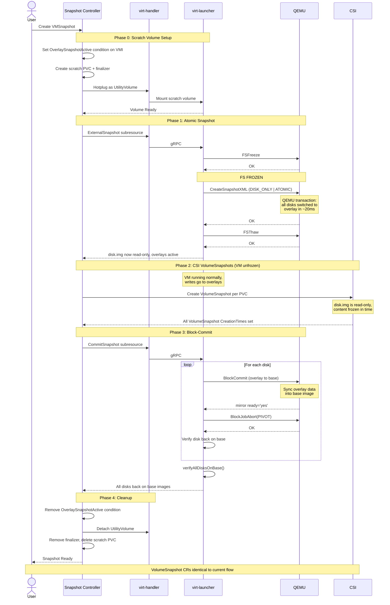

# VEP #321: Online VMSnapshot Using QEMU External Snapshots

## VEP Status Metadata

### Target releases

- This VEP targets alpha for version: v1.11
- This VEP targets beta for version:
- This VEP targets GA for version:

### Release Signoff Checklist

Items marked with (R) are required *prior to targeting to a milestone / release*.

- [ ] (R) Enhancement issue created, which links to VEP dir in [kubevirt/enhancements]
- [ ] (R) Alpha target version is explicitly mentioned and approved
- [ ] (R) Beta target version is explicitly mentioned and approved
- [ ] (R) GA target version is explicitly mentioned and approved


## Overview

The current online VMSnapshot flow keeps the VM frozen while CSI snapshots are
taken, making the freeze duration entirely dependent on CSI driver speed and
Kubernetes snapshot infrastructure throughput. This VEP introduces a new flow
that uses a QEMU external snapshot transaction to atomically establish the
snapshot point at the libvirt level in sub-millisecond time, unfreeze the guest
immediately, then take CSI VolumeSnapshots of the now-read-only base images
asynchronously while the VM runs normally. After CSI snapshots are complete,
block-commit the overlays back into the base images and clean up. The existing
VMSnapshot flow remains unchanged and serves as the default.

This makes the freeze duration independent of CSI driver speed, disk count, or
Kubernetes API throughput.


## Motivation

The online VMSnapshot flow freezes the guest filesystem and creates
CSI VolumeSnapshots for each of the VM's disks. The VM stays frozen until all
snapshots have their `CreationTime` set, meaning the freeze duration depends
entirely on how fast the CSI driver and the Kubernetes snapshot infrastructure
can process the requests. Even for a single disk, a slow CSI driver can exceed
acceptable freeze times. For VMs with multiple disks, tuning the
external-snapshotter's `--kube-api-qps`/`--kube-api-burst`/`--worker-threads` can
reduce the Kubernetes API throttling overhead, but even with optimal settings the
bottleneck moves to the CSI driver and storage layer, which KubeVirt has no control
over. This creates several problems:

### 1. Windows VSS hard timeout

Windows has a [non-configurable 10-second limit](https://learn.microsoft.com/en-us/windows/win32/vss/overview-of-processing-a-backup-under-vss)
on how long the filesystem can be held frozen during shadow copy creation. When
this limit is exceeded, the VSS provider returns
[`VSS_E_HOLD_WRITES_TIMEOUT` (0x80042314)](https://support.microsoft.com/en-us/topic/time-out-errors-occur-in-volume-shadow-copy-service-writers-and-shadow-copies-are-lost-during-backup-and-during-times-when-there-are-high-levels-of-input-output-69abf5d3-eadd-9a9a-416a-d1a5752dbef4),
VSS writers enter Failed state, and the snapshot is crash-consistent rather
than application-consistent. If the CSI
driver or Kubernetes snapshot infrastructure takes more than 10 seconds to
process the snapshots, the freeze window exceeds this limit.

### 2. Long freeze is dangerous on any OS

Even without the Windows 10-second limit, keeping a filesystem frozen for
extended periods is harmful on Linux as well:

- **`fsfreeze` is designed for brief use**: intended for the short window
  needed to take a storage-level
  snapshot (typically <100ms for LVM/dm snapshots). Holding it for extended
  periods while waiting for CSI round-trips is far outside the intended use case.
- **Application disruption**: applications running inside the VM (databases,
  web servers, etc.) experience blocked I/O during the freeze. This
  can cause client disconnects, replication lag, and service interruptions,
  especially for latency-sensitive workloads commonly migrated to KubeVirt.

A snapshot operation should not keep the guest frozen while waiting for
external infrastructure (CSI drivers, Kubernetes controllers) to respond.
The freeze should only last as long as the hypervisor-level snapshot point
needs to be established.


## Goals

- Reduce the VM freeze window during snapshot to sub-second, regardless of
  CSI driver latency or number of disks
- Make VMSnapshot work reliably for Windows VMs without exceeding the
  VSS 10-second limit
- Restore from snapshots taken with the new flow works identically to today -
  the VolumeSnapshot CRs produced are the same, no changes to the restore path

## Non Goals

- Replacing CSI VolumeSnapshots with a different snapshot mechanism. We still
  use CSI VolumeSnapshots for the actual storage-level snapshot
- Offline VM snapshots. This VEP focuses on online (running) VM snapshots
- Incremental backup integration. CBT/incremental backup is a separate feature
  ([VEP #25](https://github.com/kubevirt/enhancements/blob/main/veps/sig-storage/incremental-backup.md))
  that coexists with this proposal
- Backup vendor integration. External backup providers (Velero, Kasten) that
  manage their own CSI snapshots currently use freeze/unfreeze hooks. Exposing
  the libvirt-level snapshot to these vendors via a dedicated CRD
  (e.g. `VirtualMachineSnapshotRequest`) could be addressed in a follow-up VEP
- Memory state capture. QEMU external snapshots can also save the full VM
  state (memory, CPU, devices) alongside disk snapshots, enabling exact
  restore to the running state. This could also be addressed in a follow-up VEP


## Definition of Users

- **VM owners:** Users who create VMSnapshots of their running VMs, especially
  VMs where the CSI driver or disk count causes the freeze to exceed acceptable
  durations
- **Cluster administrators:** Operators who manage KubeVirt and need to
  understand the new snapshot flow for troubleshooting


## User Stories

As a Windows VM owner, I want to take a VMSnapshot without VSS writers failing
so that my backups are application-consistent and I can migrate from VMware
to KubeVirt

As a Linux VM owner running a database, I want the snapshot freeze window to
be as short as possible so that my database connections don't time out and my
application doesn't experience visible hangs during snapshot

As a VM owner who snapshots regularly, I want VMSnapshot to work reliably
regardless of how many disks the VM has or how fast the CSI driver is so that
I can take snapshots without worrying about freeze timeouts or guest application
disruption


## Repos

- [kubevirt/kubevirt](https://github.com/kubevirt/kubevirt)


## Design

### Current flow (what changes)

```
1. Freeze guest filesystem (QEMU guest agent)
2. Create N VolumeSnapshot CRs
3. Wait for all CreationTime to be set - VM stays frozen
4. Unfreeze guest filesystem
```

### New flow

The new flow is enabled by setting `spec.externalSnapshot: true` on the
VMSnapshot. If not set, the current flow is used.

```
Phase 0: Create scratch PVC, hotplug as UtilityVolume
Phase 1: Freeze -> QEMU transaction (all disks, atomic, ~20ms) -> Unfreeze
Phase 2: Create N VolumeSnapshot CRs (VM is unfrozen, no time pressure)
Phase 3: Block-commit overlays back to base images
Phase 4: Cleanup scratch volume
```

Freeze duration is sub-second regardless of disk count.

### Phase 0: Scratch volume setup

Before taking the snapshot, the snapshot controller:

1. Sets the `OverlaySnapshotActive` condition on the VMI.
2. Creates a PVC (`snap-scratch-{uid}`) sized to hold qcow2 overlay files
   for all disks during the overlay window. The size can be set explicitly
   via `spec.overlayScratchSize` on the VMSnapshot. If not configured, a
   default size is used
   (see [Scalability](#scalability) for details).
3. Hotplugs the PVC as a UtilityVolume to the VMI via JSON patch on
   `spec.utilityVolumes` (same mechanism as [VEP #90 Utility Volumes](https://github.com/kubevirt/enhancements/blob/main/veps/sig-storage/utility-volumes.md),
   same pattern as the incremental backup push-target PVC in [VEP #25](https://github.com/kubevirt/enhancements/blob/main/veps/sig-storage/incremental-backup.md)).
4. Adds a Kubernetes finalizer `snapshot.kubevirt.io/overlay-protection`
   on the scratch PVC to prevent its deletion while overlays are active.
5. Waits for the volume to reach `VolumeReady` or `HotplugVolumeMounted` status.

### Phase 1: QEMU atomic snapshot (overlay creation)

Once the scratch volume is mounted, the snapshot controller calls a new
`ExternalSnapshot` subresource on the VMI. Inside virt-launcher:

```go
dom.FSFreeze(nil, 0)
dom.CreateSnapshotXML(snapshotXML,
    DOMAIN_SNAPSHOT_CREATE_DISK_ONLY |
    DOMAIN_SNAPSHOT_CREATE_ATOMIC |
    DOMAIN_SNAPSHOT_CREATE_NO_METADATA)
dom.FSThaw(nil, 0)
```

This is a single [`virDomainSnapshotCreateXML`](https://libvirt.org/html/libvirt-libvirt-domain-snapshot.html#virDomainSnapshotCreateXML)
call that sends one QEMU `transaction` QMP command
containing a [`blockdev-snapshot`](https://qemu-project.gitlab.io/qemu/interop/live-block-operations.html)
action for every snapshotable disk. QEMU executes them all atomically in
sub-millisecond time. Non-snapshotable disks (cloud-init, ephemeral) are
marked with `snapshot='no'` in the XML.

After this call:
- The original disk images (disk.img / block devices) are **read-only** - the
  snapshot point
- New VM writes go to qcow2 overlay files on the scratch volume
- The VM is unfrozen and running normally


### Phase 2: CSI VolumeSnapshots

The snapshot controller creates VolumeSnapshot CRs for each PVC - exactly
the same as today. The only difference is that the VM is **unfrozen** during
this phase. The CSI snapshots capture the read-only base images, which contain
the exact frozen-point-in-time data regardless of how long the CSI processing
takes.

**Safety mechanisms:** While the VM is unfrozen during this phase, the overlay
files on the scratch PVC continue to grow with every write. Two mechanisms
prevent the scratch PVC from filling up:

- **Overlay usage monitoring:** virt-launcher monitors scratch volume usage
  in the background (same pattern as the freeze auto-unfreeze safety timer).
  If usage crosses a threshold (e.g. 80%), it notifies the snapshot controller,
  which aborts Phase 2, deletes pending VolumeSnapshot CRs, triggers
  block-commit to restore the VM, and marks the VMSnapshot as Failed with a
  clear error indicating insufficient scratch space.

- **Timeout:** Phase 2 is bounded by the VMSnapshot's existing
  `FailureDeadline` (default: 5 minutes, configurable per-snapshot). If any
  VolumeSnapshot has not received its `CreationTime` within this deadline,
  the same abort flow is triggered.

The scratch PVC is sized to accommodate the maximum possible writes within
the `FailureDeadline` (see [Scalability](#scalability)).

### Phase 3: Block-commit

After all VolumeSnapshots have `CreationTime` set, the snapshot controller
calls a new `CommitSnapshot` subresource on the VMI. Inside virt-launcher,
for each disk:

1. **Check state**: Is the disk on overlay? If already on base, skip (idempotent).
   Is there an existing block job? Resume waiting instead of starting a new one.
2. **Start commit**: `dom.BlockCommit(disk, "", "", 0, ACTIVE | DELETE)` ([ref](https://libvirt.org/kbase/merging_disk_image_chains.html))
3. **Wait for READY**: Parse domain XML for `<mirror ready='yes'>` attribute,
   which reflects libvirt's internal state after receiving QEMU's
   [`BLOCK_JOB_READY`](https://libvir-list.redhat.narkive.com/KKDmcDw5/libvirt-rfc-exposing-ready-bool-of-query-block-jobs-or-qmp-block-job-ready-event) event.
4. **Pivot**: `dom.BlockJobAbort(disk, PIVOT)` with retry (10x, 200ms backoff).
5. **Verify**: Read domain XML and confirm the disk source is back on the
   original base image. If still on overlay, return error - do NOT proceed
   to cleanup.

After ALL disks are committed and verified, a final check reads the full
domain XML and confirms every disk source is back on the base image.

The block-commit is idempotent and resumable: already committed disks are
skipped, active block jobs from a previous attempt are resumed. After all
disks are committed, the domain XML is verified to confirm every disk is
back on the base image before proceeding to cleanup. If commit fails, the
scratch PVC is preserved (finalizer prevents deletion) and the controller
requeues for retry.

### Phase 4: Cleanup

Once all disks are back on their base images:
- Remove the `OverlaySnapshotActive` condition from the VMI
- Detach the utility volume via JSON patch
- Remove the finalizer from the scratch PVC
- Delete the scratch PVC

### New flow sequence diagram



### Overlay state tracking

A VMI condition `OverlaySnapshotActive` is set at the start of Phase 0 and
removed after successful commit (Phase 3). This condition is checked by:

- **Migration**: blocks `startMigration()` - the overlay references the
  base image on the source node which would not exist on the target
- **Backup**: blocks `BackupVirtualMachine()` - concurrent backup and
  snapshot overlay operations would conflict
- **Volume unplug**: blocks `removeVolumeRequestHandler()` - unplugging a
  disk with an active overlay would orphan the overlay
- **Disk resize**: skips resize in `syncDisks()` - resizing during overlay
  could cause size mismatch between overlay and base
- **VM destroy**: `KillVMI()` aborts active block jobs before
  `DestroyFlags()` - prevents orphaned block jobs
- **VM crash / pod eviction**: the scratch PVC finalizer ensures it
  survives across restarts. On startup, virt-launcher inspects the actual
  disk state (checks for overlay files on the scratch PVC). If overlays
  are found, the VM starts in paused mode with the overlay still active
  and a live block-commit is performed before unpausing. If the scratch PVC is lost (despite the finalizer), the
  base images are consistent (application-consistent at the snapshot
  point) but missing writes from the overlay window.

### Restore (unchanged)

The VolumeSnapshot CRs produced by the new flow are identical to what the
current flow produces - they capture the same disk.img content at the same
frozen point-in-time. The restore controller creates PVCs from these
VolumeSnapshots the same way it does today. No changes to the restore path.

## API Examples

### VMSnapshot with external snapshot enabled

```yaml
apiVersion: snapshot.kubevirt.io/v1beta1
kind: VirtualMachineSnapshot
metadata:
  name: my-snapshot
spec:
  source:
    apiGroup: kubevirt.io
    kind: VirtualMachine
    name: my-windows-vm
  externalSnapshot: true          # optional, defaults to false (current flow)
  overlayScratchSize: "8Gi"       # optional, overrides default scratch size
```

### VMI condition during overlay snapshot

```yaml
apiVersion: kubevirt.io/v1
kind: VirtualMachineInstance
metadata:
  name: my-windows-vm
status:
  conditions:
  - type: OverlaySnapshotActive
    status: "True"
    reason: SnapshotInProgress
    message: "Snapshot my-snapshot has active overlays"
    lastTransitionTime: "2026-05-28T12:00:00Z"
```

### Scratch PVC with finalizer

```yaml
apiVersion: v1
kind: PersistentVolumeClaim
metadata:
  name: snap-scratch-ae375815
  labels:
    snapshot.kubevirt.io/scratch: my-snapshot
  finalizers:
  - snapshot.kubevirt.io/overlay-protection
spec:
  accessModes: [ReadWriteOnce]
  resources:
    requests:
      storage: 6Gi
```


## Alternatives

### Push-mode backup to separate PVC

Instead of switching VM disks to overlays, use KubeVirt's existing push-mode
backup API (which uses `virDomainBackupBegin` under the hood) to copy
consistent point-in-time disk data to separate target PVCs. QEMU preserves
old blocks before overwriting them while a background job copies the data
out. The snapshot controller would then take CSI VolumeSnapshots of those
target PVCs and attach them to the VMSnapshot.

If the target PVCs are kept persistently and combined with CBT (Changed Block
Tracking), the first VMSnapshot of a VM performs a full copy of every disk to
the target PVCs, but any subsequent VMSnapshot of the same VM only copies the
blocks that changed since the last snapshot.

**Pros:**
- No overlays on the live disk chain, no block-commit, no live merge risk
- Avoids the complexity of managing overlay lifecycle entirely
- If target PVCs are kept persistently and combined with CBT, subsequent
  snapshots only push the delta (changed blocks), making them fast

**Cons:**
- Without persistent target PVCs, every snapshot requires a full data copy
  of every disk, which can be heavy I/O for large VMs and take minutes to
  hours
- With persistent target PVCs, the full copy only happens once, but requires
  2x permanent storage (a full-size target PVC per disk for the lifetime of
  the VM)
- Additional PVC management complexity (sizing, lifecycle, storage class)
- Uses the backup API (`virDomainBackupBegin`) for snapshot purposes,
  conflating two APIs that are intentionally kept separate in libvirt/QEMU

### Tuning external-snapshotter parameters

Increase `--kube-api-qps`, `--kube-api-burst`, and `--worker-threads` on
the external-snapshotter sidecar to reduce Kubernetes API throttling during
multi-disk snapshot creation.

**Pros:**
- No code changes in KubeVirt
- Can meaningfully reduce the freeze window for multi-disk VMs where API
  throttling is the bottleneck

**Cons:**
- Only addresses the Kubernetes API overhead, not the CSI driver latency.
  Once throttling is eliminated, the bottleneck moves to the storage layer
  which KubeVirt has no control over
- A single slow CSI driver can still exceed the VSS 10-second limit
  regardless of tuning
- Requires cluster-level configuration changes that may not be feasible
  in all environments
- Does not solve the fundamental problem: the VM stays frozen while
  waiting for external infrastructure


## Scalability

- **Scratch PVC sizing.** Users can set `spec.overlayScratchSize` on the
  VMSnapshot to control the scratch PVC size directly. If not set, the
  following default calculation is used:

  ```
  min(FailureDeadline × 125MB/s × 2, total_disk_size × 1.1)
  ```

  The calculation is based on two bounds:

  1. **Write-rate estimate** (`FailureDeadline × 125MB/s × 2`): the qcow2
     overlay only stores blocks that the VM actually writes during the
     overlay window (new writes are redirected to the overlay, the base
     image is untouched). `FailureDeadline` is the VMSnapshot's existing
     `spec.failureDeadline` (default: 5 minutes, configurable per-snapshot).
     125MB/s is a conservative estimate of maximum sustained write throughput,
     and `× 2` is a safety margin to account for write bursts.

  2. **Disk capacity cap** (`total_disk_size × 1.1`): `total_disk_size` is the
     sum of all snapshotable disk virtual sizes. The overlay can never exceed
     this, since writes are bounded by the guest's addressable space, plus
     extra 10% for metadata.

  For example, a VM with 10 × 10Gi disks and default 5-minute deadline:
  `min(5min × 125MB/s × 2, 100Gi × 1.1) = min(75Gi, 110Gi) = 75Gi`.
  A small VM with 2 × 5Gi disks: `min(75Gi, 11Gi) = 11Gi` (capped by
  total disk size + metadata).

- The QEMU transaction takes the same amount of time regardless of disk
  count (sub-millisecond).
- Block-commit time scales with overlay data size, not disk count. Overlay
  size depends on guest I/O activity during the snapshot window.


## Update/Rollback Compatibility

The feature is additive and behind a feature gate. On upgrade, the existing
VMSnapshot flow continues to work unchanged until the feature gate is enabled.
On rollback, disabling the feature gate reverts VMSnapshot to the current
sequential CSI path. No data migration is needed. Snapshots taken with the
new flow are restorable by any version, since the VolumeSnapshot CRs produced
are standard Kubernetes objects with no format changes.


## Functional Testing Approach

- End-to-end VMSnapshot with varying disk configurations (root only,
  root + multiple hotplug disks), verifying the full lifecycle: scratch
  volume creation, external snapshot, CSI VolumeSnapshots, block-commit,
  cleanup, and successful restore
- Windows VM testing to verify VSS writers remain stable after snapshot
- Fallback to sequential path when guest agent is unavailable
- Edge case coverage: pod kill during overlay window and during commit,
  concurrent snapshot requests, migration and backup blocked during
  overlay window


## Implementation History


## Implementation Phases

- External snapshot and block-commit subresources on VMI, including gRPC
  and virt-launcher implementation
- Scratch volume lifecycle in the snapshot controller (creation, hotplug,
  sizing, finalizer, cleanup)
- Snapshot controller integration with fallback to current flow
- Edge case guards and overlay state tracking (migration, backup, unplug,
  resize, destroy)
- Testing and hardening (unit, integration, Windows VSS, crash recovery)
- Upstream QEMU RFE for write-blocking mode on block-commit
  ([RHEL-178640](https://issues.redhat.com/browse/RHEL-178640))


## Graduation Requirements

### Alpha

Behind `ExternalVMSnapshot` feature gate, disabled by default.

### Beta

Enable by default after the feature has been validated across one or two
releases.

### GA

Remove feature gate once stable in production with no regressions in
existing snapshot/restore functionality.


