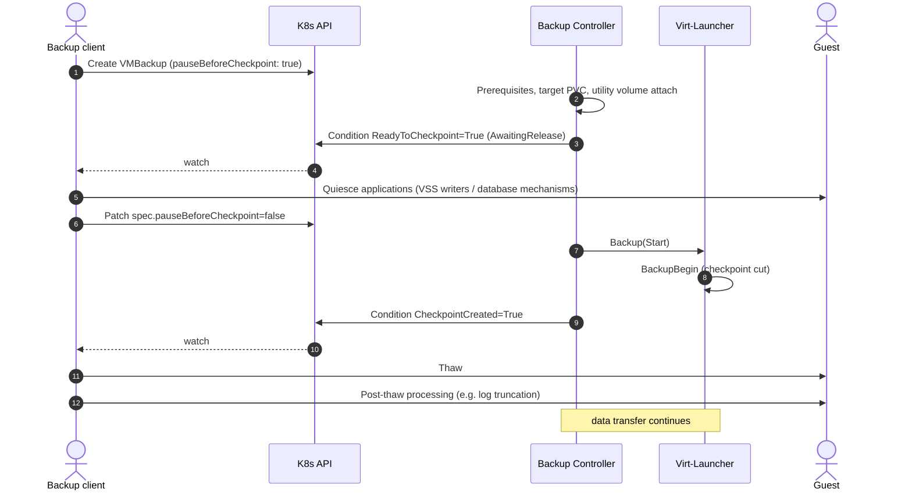

# VEP #482: Checkpoint gate for externally coordinated guest quiesce

## VEP Status Metadata

### Target releases

- This VEP targets alpha for version:
- This VEP targets beta for version:
- This VEP targets GA for version:

### Release Signoff Checklist

Items marked with (R) are required *prior to targeting to a milestone / release*.

- [x] (R) Enhancement issue created, which links to VEP dir in [kubevirt/enhancements] (not the initial VEP PR): https://github.com/kubevirt/enhancements/issues/482
- [ ] (R) Alpha target version is explicitly mentioned and approved
- [ ] (R) Beta target version is explicitly mentioned and approved
- [ ] (R) GA target version is explicitly mentioned and approved

## Table of contents

- [Overview](#overview)
- [Motivation](#motivation)
- [Goals](#goals)
- [Non Goals](#non-goals)
- [Definition of Users](#definition-of-users)
- [User Stories](#user-stories)
- [Repos](#repos)
- [Design](#design)
  - [Gating the checkpoint](#gating-the-checkpoint)
  - [Signalling that the checkpoint exists](#signalling-that-the-checkpoint-exists)
  - [Deadline on the paused state](#deadline-on-the-paused-state)
  - [Cancellation and deletion](#cancellation-and-deletion)
  - [Retry and idempotency](#retry-and-idempotency)
  - [Relationship to skipQuiesce](#relationship-to-skipquiesce)
- [API Examples](#api-examples)
- [Alternatives](#alternatives)
- [Does it belong to core KubeVirt?](#does-it-belong-to-core-kubevirt)
- [Scalability](#scalability)
- [Update/Rollback Compatibility](#updaterollback-compatibility)
- [Functional Testing Approach](#functional-testing-approach)
- [Implementation History](#implementation-history)
- [Graduation Requirements](#graduation-requirements)
  - [Alpha](#alpha)
  - [Beta](#beta)
    - [On-By-Default Readiness](#on-by-default-readiness)
  - [GA](#ga)

## Overview

Two additions to the [VEP-25](https://github.com/kubevirt/enhancements/blob/main/veps/sig-storage/25-incremental-backup/vep.md) backup API: an optional gate that holds a `VirtualMachineBackup` after preparation and before the checkpoint is taken, and a declared condition reporting that the checkpoint has been created. Together they let a backup application that quiesces the guest by its own means hold the guest across the checkpoint only, instead of across the whole start path.

## Motivation

VEP-25 quiesces the guest inside virt-launcher, immediately around `BackupBegin`, and thaws it as soon as the call returns. The window is as short as the platform can make it, and VEP-25 names that brevity as an advantage over CSI-based alternatives.

The processing this VEP is concerned with is application-level rather than filesystem-level. VEP-25 draws the same line: the freeze it performs is described as ensuring filesystem consistency, and a backup whose freeze failed is described as crash-consistent rather than application-consistent. Reaching application consistency requires the applications themselves to take part — on Windows through the VSS writers that databases, Exchange and Active Directory register, on Linux through each database's own mechanism — and part of that participation happens after the thaw, when an application is told the backup succeeded and can release or truncate the transaction logs it was holding until then. Driving this is the job of an agent inside the guest, coordinated by the backup application that owns the session, which is what "guest processing" refers to below.

A backup application that performs its own guest processing cannot use that window. Its quiesce runs inside the guest and is driven from outside the cluster, so it has to be in place before the `VirtualMachineBackup` is created — there is no later point at which it can intervene — and it has to stay in place until it can tell that the checkpoint was cut. That hold therefore spans the whole start path: creation of the resource, the prerequisite checks, verification of the target PVC, the utility-volume hotplug (which returns and requeues, so at least one further reconcile), the `Backup` RPC to virt-launcher and finally `BackupBegin`. What should be a single point-in-time operation becomes several reconcile passes, and the guest is held for all of them.

The guest side is where this is paid. A quiesced guest is holding application state still; the longer it is held, the more the hold costs and the more of it is exposed to unrelated scheduling latency. Preparation is also the variable part: hotplug latency depends on the cluster, while the cut does not.

There is also no declared way to learn that the checkpoint exists. `status.conditions` carries a single `Progressing` condition whose `reason` multiplexes `Initializing`, `Initiated`, `PreparingExport`, `ExportInitiated`, `ExportReady` and `Aborting`. A client can infer that the cut has happened once the reason leaves `Initializing`, because the controller sets `Initiated` after the `Backup` RPC returns — but that ordering is a consequence of the RPC being synchronous, not part of the API. If the call ever becomes asynchronous, the same reason would mean "cut requested" rather than "cut taken", clients would release the guest too early, and the resulting backups would be inconsistent with no error reported anywhere. Nor can a client check the result after the fact: `checkpointName` is recorded in the VMI backup metadata before the quiesce block, so its presence does not establish that the checkpoint was created. Because the reason is overwritten by later phases, a client that missed the transition cannot recover the fact either.

Together these make the combination unsupportable rather than merely expensive. The missing signal is the sharper of the two: a client that cannot tell when the checkpoint was taken has no supportable way to decide when to release the guest, and releasing on an inferred ordering is a silent-correctness risk rather than a performance compromise, since nothing observable distinguishes a backup released too early from a correct one.

The length of the window compounds it, and on Windows it binds outright. A VSS-based quiesce flushes the filesystem and then holds writes while the snapshot is taken, and Windows bounds that hold: writes may be held for roughly ten seconds, after which the operation fails. This is the limit the QEMU guest agent's own VSS requester is written against — `VSS_E_HOLD_WRITES_TIMEOUT`, "fsfreeze is limited up to 10 seconds" — so it is not a figure particular to one backup application. KubeVirt's own quiesce fits inside it comfortably, because virt-launcher freezes, cuts and thaws within a single call. An externally coordinated hold does not fit: the start path is not bounded at all, and it includes a PVC hotplug. A quiesce that materialises a shadow copy and holds that instead is bounded differently, but that is the exception rather than the common configuration.

A backup application implementing against VEP-25 today therefore has to fall back to CSI snapshots whenever its own guest processing is requested — losing, for exactly those VMs, the storage independence and the incremental transfer that VEP-25 exists to provide. Removing that fallback is what this VEP is for.

This proposal comes out of implementing a backup integration against VEP-25.

## Goals

- Allow a client to complete all preparation for a backup before the guest is quiesced, so that only the checkpoint falls inside the quiesce window.
- Give clients a declared, durable signal that the checkpoint has been created.
- Bound the resources held while a backup waits to be released, so that a client that stops responding cannot hold them indefinitely.

## Non Goals

- An API for guest processing itself. How a client quiesces the guest is out of scope; this VEP only provides the point at which it can do so.
- Changing how KubeVirt quiesces the guest, or the behaviour of `skipQuiesce`.
- A general-purpose suspend mechanism for backups. Exactly one gate point is introduced, immediately before the checkpoint.
- Offline backup, which VEP-25 defers to a separate proposal.

## Definition of Users

- Backup vendors, as defined by VEP-25.
- Cluster admins, who are affected by the resources a waiting backup holds.

## User Stories

- As a backup vendor, I want the backup to be fully prepared before I quiesce the guest, so that the guest is held for the checkpoint and not for the preparation.
- As a backup vendor, I want to learn that the checkpoint exists from a documented part of the API, so that releasing the guest does not depend on the controller's internal ordering.
- As a backup vendor, I want to learn that the checkpoint exists even if my client restarted and missed the transition.
- As a cluster admin, I want a backup whose client has stopped responding to release its utility volume and fail, rather than block migrations indefinitely.

## Repos

[kubevirt/kubevirt](https://github.com/kubevirt/kubevirt)

## Design

### Gating the checkpoint

A new optional field `spec.pauseBeforeCheckpoint` (boolean, default `false`) is added to `VirtualMachineBackup`. When it is `true`, the backup controller performs the whole start path as it does today — finalizers, prerequisite checks, target PVC verification, utility-volume attach — and then stops before sending the `Start` command to virt-launcher.

While it is stopped, the controller reports a new condition `ReadyToCheckpoint` with status `True` and reason `AwaitingRelease`. Setting it is the statement that nothing further is required from the cluster: the next step is the checkpoint itself.

The client releases the backup by setting `spec.pauseBeforeCheckpoint` to `false`. The controller then proceeds exactly as it does for an ungated backup. This follows the shape of `Job.spec.suspend` in core Kubernetes, where a mutable boolean going from `true` to `false` is the resume signal, and keeps the addition to a single field rather than a field plus a command.

Preparation can also fail while a client is waiting — a prerequisite that is never satisfied, a target PVC that never becomes available. Those paths are unchanged and end in `Progressing` reason `Initializing` or in a terminal `Failed`, so a client waiting to release must watch for failure as well as for `ReadyToCheckpoint`.



### Signalling that the checkpoint exists

A new condition `CheckpointCreated` is set to `True`, with reason `CheckpointCreated`, once the checkpoint has been taken. It is **latching**: once `True` it remains `True` for the lifetime of the resource, including after the backup completes or fails. Its `lastTransitionTime` gives the client the time of the cut.

The condition is reported whether or not `pauseBeforeCheckpoint` was used, because the value of a declared signal is not limited to gated backups.

A separate condition type is proposed rather than another `Progressing` reason for three reasons. `Progressing` multiplexes phases onto one condition, so the fact would be overwritten by the next phase and a client that missed the transition could not recover it. A latching condition is recoverable at any later point, which matters for clients that reconnect. And a condition type is the part of a condition that consumers can depend on, whereas the set of reasons under a type is free to grow and change.

### Deadline on the paused state

A gated backup holds real resources while it waits: a hotplugged utility volume and the VMI-level backup status that makes the VM unavailable to other backups. Unlike a running backup it holds them with no libvirt job in progress, so nothing else would eventually end it.

A new optional field `spec.pauseTimeout` (`*metav1.Duration`) bounds the wait. It applies only to a gated backup and has no effect on one where `pauseBeforeCheckpoint` was never set.

The clock starts when `ReadyToCheckpoint` is set, which is also the earliest moment at which the client could act: the condition is reported only for a gated backup, and only once preparation is complete. Time spent in preparation is deliberately not charged against it, so that a slow utility-volume hotplug cannot consume the client's budget and fail the backup before the client was ever in a position to release it. Preparation stays bounded by `ttlDuration`, as it is for an ungated backup. A client that releases the backup before the condition appears never engages the gate at all, and no deadline applies to it.

On expiry the controller rolls preparation back through the existing cleanup path — detaching the utility volume and clearing the VMI backup status — and marks the backup `Failed` with a distinct reason (`PauseTimeout`), so that a client can tell a deadline from a genuine preparation failure.

A default in the order of a few minutes is suggested, on the grounds that the field exists to bound a guest-side quiesce and not to accommodate long-running work. The concrete value is left to the SIG. `ttlDuration` from VEP-25 still applies to the backup as a whole; it is not a substitute here, because its default of two hours is far longer than a quiesce should last and the resources are held with no job running.

### Cancellation and deletion

A paused backup is an in-progress backup for the purposes of the rules VEP-25 already defines:

- A migration with `spec.priority: system-critical` cancels it, as it cancels a running backup. This matters more than in the ungated case, because the utility volume a paused backup holds is exactly what `migrationBlockedByUtilityVolumes` and `utilityVolumesTimeout` govern during a drain.
- Deleting the resource while it is paused follows the existing deletion path for a backup that has not started: preparation is rolled back and the backup ends `Failed`.

In both cases the client learns from the terminal condition that no checkpoint will be taken, and releases the guest.

### Retry and idempotency

Releasing is a spec write and may be observed more than once, and the controller may reconcile the same resource repeatedly. Neither can produce a second checkpoint: entry into the start path is already guarded by `status.type` being unset and by the VMI-level backup status, which rejects a second backup for the same VM. Re-setting `pauseBeforeCheckpoint` to `true` after the release has been observed has no effect — the gate is evaluated on the way into the start path and not afterwards.

### Relationship to skipQuiesce

The two fields are independent, and all four combinations of them are valid. None is rejected.

`pauseBeforeCheckpoint: true` together with `skipQuiesce: true` is the combination this VEP exists for, and must be supported: the client quiesces the guest itself and KubeVirt does not. `pauseBeforeCheckpoint: true` with `skipQuiesce: false` is supported as well — the gate holds the backup before the `Start` command is sent, and KubeVirt's own freeze happens inside virt-launcher after the release, so a client can have preparation finished before anything touches the guest.

In both cases the gate provides the same guarantee: while `ReadyToCheckpoint` is `True` and the backup has not been released, no freeze is issued and no checkpoint is taken.

One consequence is worth recording. With `skipQuiesce: true` the `Quiesced` condition reports `QuiesceSkipped`, as VEP-25 defines it, even though the guest was in fact quiesced — by the client rather than by KubeVirt. That condition reports what KubeVirt did, not whether the resulting data is application-consistent, and this VEP does not propose to change it: a backup application performing its own guest processing is the party that knows that outcome and reports it to its own users. For the same reason, `skipQuiesce: true` means virt-launcher issues no freeze at all, so guest-agent freeze and thaw hooks do not run for such a backup.

## API Examples

A gated backup, after preparation and before release:

```yaml
apiVersion: backup.kubevirt.io/v1alpha1
kind: VirtualMachineBackup
metadata:
  name: backup1
  namespace: ns1
spec:
  source:
    apiGroup: backup.kubevirt.io
    kind: VirtualMachineBackupTracker
    name: my-backup-tracker
  mode: Pull
  pvcName: backup-scratch-pvc
  tokenSecretRef: my-token
  skipQuiesce: true
  pauseBeforeCheckpoint: true
  pauseTimeout: 5m
status:
  conditions:
    - type: Progressing
      status: "True"
      reason: Initializing
      message: Waiting for release before taking the checkpoint
    - type: ReadyToCheckpoint
      status: "True"
      reason: AwaitingRelease
      lastTransitionTime: "2026-03-03T16:13:26Z"
```

Releasing it:

```console
$ kubectl patch virtualmachinebackup backup1 -n ns1 --type=merge \
    -p '{"spec":{"pauseBeforeCheckpoint":false}}'
```

After the checkpoint has been taken:

```yaml
status:
  checkpointName: my-backup-tracker-2025-03-03T16:13:28Z
  conditions:
    - type: Progressing
      status: "True"
      reason: PreparingExport
      message: Backup export is being initialized
    - type: ReadyToCheckpoint
      status: "False"
      reason: Released
    - type: CheckpointCreated
      status: "True"
      reason: CheckpointCreated
      lastTransitionTime: "2026-03-03T16:13:28Z"
```

A backup whose client never released it:

```yaml
status:
  conditions:
    - type: Progressing
      status: "False"
      reason: PauseTimeout
      message: 'Backup has failed: not released within 5m0s'
    - type: Failed
      status: "True"
      reason: PauseTimeout
      message: 'Backup has failed: not released within 5m0s'
```

## Alternatives

**Infer the cut from the `Progressing` reason.** A client can treat the reason leaving `Initializing` as evidence that the checkpoint was taken, since the controller sets `Initiated` after the `Backup` RPC returns. This works today and is a reasonable stopgap, but it is behaviour rather than contract: it holds only while the RPC is synchronous and while that particular statement stays where it is. If either changes, clients release the guest before the cut and produce inconsistent backups silently, and no runtime check would catch it. It also does nothing about the length of the window, which is the larger of the two problems.

**Pre-attach the utility volume before creating the backup.** Attaching the target PVC as a utility volume in advance would take the hotplug out of the window, since the controller skips the attach when the volume is already present in `vmi.Spec.UtilityVolumes`. That is an implementation detail rather than a documented contract, it leaves the remaining reconcile latency inside the window, and it asks clients to manipulate the VMI directly.

**Shorten the start path instead.** Making preparation faster would reduce the window but not bound it: what is inside it is reconcile scheduling, which no single optimisation removes.

**Drive guest processing from the QEMU guest agent's freeze and thaw hooks.** This would remove the need for a gate, since the agent's freeze already brackets the checkpoint tightly. It does not carry application-level processing. That processing is decided by whoever holds the requester role, and under this approach the agent holds it: on Windows the agent freezes the VSS writers but never calls `IVssBackupComponents::SetBackupSucceeded`, so the writers do not perform their post-backup work such as log truncation, and the context it uses (`VSS_CTX_APP_ROLLBACK` with `NO_AUTORECOVERY`) together with a provider whose `CommitSnapshots` only blocks until thaw means no shadow copy is materialised. On Linux, `fsfreeze-hook` runs a script with no channel back to the backup application, while the work that follows the thaw belongs to the same backup session. A backup using `skipQuiesce: true` issues no freeze at all, so no hook runs for it in any case.

**A subresource for the release instead of a spec field.** A `release` subresource would express the one-shot nature of the operation more precisely, at the cost of more API machinery and a less familiar client flow. The `Job.spec.suspend` precedent suggests the field is adequate.

## Does it belong to core KubeVirt?

Yes. The gate sits inside the backup controller's state machine, between preparation and the `Backup` RPC, and there is no extension point at which an external controller could interpose: by the time any external observer sees the resource progressing, the checkpoint has already been taken. The completion signal likewise originates in virt-launcher and reaches the resource through the VMI status, both of which are core components.

Plugins as described in VEP-190 were considered and do not apply for the same reason: the behaviour being changed is the ordering inside a core controller, not an additional capability layered on top of it.

## Scalability

The gate adds one condition write and one requeue per gated backup, and no polling: the release is a spec update, which the existing informer already delivers.

A paused backup holds the same resources a running one does — a hotplugged utility volume and the VMI-level backup status — with no libvirt job in progress. VEP-25 already permits only one backup per VM at a time, so the number of such holds is bounded by the number of VMs, and each individual hold is bounded by `pauseTimeout`.

## Update/Rollback Compatibility

Both additions are additive and opt-in. `pauseBeforeCheckpoint` defaults to `false`, which is exactly today's behaviour, and `CheckpointCreated` is a new condition that existing clients ignore. No data migration is required, and no stored resource changes meaning.

On rollback to a version without this feature the field is ignored, and a backup created with `pauseBeforeCheckpoint: true` proceeds to the checkpoint without waiting. A client that had quiesced the guest in expectation of a gate would not be released at the moment it expects. Clients should therefore treat the absence of `ReadyToCheckpoint` within their own timeout as a failure to gate rather than waiting indefinitely, and should not quiesce the guest before that condition appears.

## Functional Testing Approach

- A gated backup reaches `ReadyToCheckpoint` and takes no checkpoint until released: no checkpoint and no bitmap exist for it while it waits.
- The backup proceeds normally after release, and `CheckpointCreated` is set.
- Both quiesce modes work under the gate: with `skipQuiesce: true` no freeze is issued at any point, and with `skipQuiesce: false` the freeze is issued only after the release and never while the backup is waiting.
- `CheckpointCreated` latches: it is still `True` after the backup reaches `Complete`, and after `Failed`.
- `CheckpointCreated` is reported for an ungated backup as well.
- A backup that is never released fails with reason `PauseTimeout` when `pauseTimeout` elapses, its utility volume is detached and the VMI backup status is cleared, leaving the VM available for a further backup.
- Preparation taking longer than `pauseTimeout` does not fail the backup: the deadline begins at `ReadyToCheckpoint`, and a client releasing promptly after it appears succeeds regardless of how long preparation took.
- A `system-critical` migration cancels a paused backup, and its utility volume detaches within `utilityVolumesTimeout`.
- Deleting a paused backup rolls preparation back and reaches a terminal state.
- A backup with `pauseBeforeCheckpoint` unset behaves exactly as before, including the conditions it reports.

## Implementation History

- 30-09-2026: Initial proposal. Tracking issue: https://github.com/kubevirt/enhancements/issues/482.

## Graduation Requirements

### Alpha

- [ ] `spec.pauseBeforeCheckpoint` gates the backup after preparation and before the `Backup` RPC, released by setting the field to `false`
- [ ] `ReadyToCheckpoint` condition reported while gated
- [ ] `CheckpointCreated` condition reported and latching, for gated and ungated backups alike
- [ ] `spec.pauseTimeout` bounds the paused state, rolling preparation back and failing the backup on expiry
- [ ] A `system-critical` migration cancels a paused backup

### Beta

- [ ] Functional coverage of the failure paths: timeout, `system-critical` migration during the pause, deletion during the pause
- [ ] At least one backup integration implemented against the gate, with feedback on the deadline default

#### On-By-Default Readiness

This feature is part of the `IncrementalBackup` feature gate and introduces no gate of its own, so it becomes enabled by default when VEP-25 does. Being enabled changes nothing on its own: `pauseBeforeCheckpoint` defaults to `false` and the only unconditional change is an additional condition on the resource.

- [ ] Default for `pauseTimeout` agreed and documented, including what a cluster admin should expect a paused backup to hold and for how long.

### GA

- [ ] At least one release cycle of beta stability without API changes
