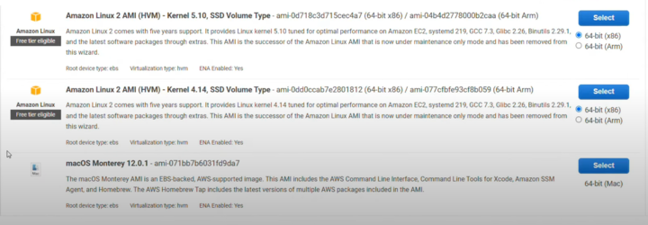

# VEP #48: Golden Images Support For Heterogeneous Clusters

## Release Signoff Checklist

Items marked with (R) are required *prior to targeting to a milestone / release*.

- [x] (R) Enhancement issue created, which links to VEP dir in [kubevirt/enhancements] (not the initial VEP PR)
- [ ] (R) Target version is explicitly mentioned and approved
- [x] (R) Graduation criteria filled

## Overview

Golden images are commonly used OS boot disk images that are used to create virtual machines (VMs) in a Kubernetes
cluster. Their purpose is to ensure these images are automatically available and kept up-to-date. The original design of
the golden images is documented in the [kubevirt/community repository](https://github.com/kubevirt/community/blob/69d061862e0839608932d225a728a7a6e7a89f29/design-proposals/golden-image-delivery-and-update-pipeline.md).

The initial design assumed homogeneous clusters, where all nodes in the cluster share the same architecture. However, as
there is a need to support heterogeneous clusters, where nodes may have different architectures (e.g., `arm64`, `amd64`,
`s390x`), this assumption does not apply anymore, and some changes are required to support this use-case.

This enhancement proposal addresses the challenges of managing golden images in heterogeneous Kubernetes clusters.

## Motivation

The high level flow of the golden images is as follows:

1. The HyperConverged Cluster Operator (HCO) image, includes predefined DataImportCronTemplate files. HCO generates
   a list of `DataImportCronTemplate` objects in the `SSP` CR, based on these files.
2. SSP creates `DataImportCron` CRs from the `DataImportCronTemplate` objects in the `SSP` CR.
3. Either SSP or CDI create a `DataSource` CRs based on the `DataImportCron` CRs.
   The CDI monitors the `DataImportCron` CRs, and ensures the corresponding `DataSource` CRs are updated as needed.
4. CDI checks the image URL or the ImageStream periodically (according to the cron expression in the
   `DataImportCron` CR), and if the image is updated, it creates a new `VolumeSnapshot` (or a `PVC`), imports the
   latest version of the requested image into this new `VolumeSnapshot`/`PVC`, and modifies the `DataSource` CR to point
   to the latest `VolumeSnapshot`/`PVC`.
   
   To perform the actual import, CDI creates a `DataVolume` CR, from the `spec.template` field in the `DataImportCron`
   CR.
5. When creating a VM, users set the VM's `spec.dataVolumeTemplate` field, to point to the desired `DataSource` CR.
   CDI creates a new `PVC`, and clones the `VolumeSnapshot`/`PVC` that is referenced by the `DataSource`,
   into this `PVC`.
   > **Note**: On OKD or OCP, creating a VM is often done using a pre-prepared template, which is created by the SSP
   > operator, and already points to the desired `DataSource` CR.

Cluster administrators can create custom golden images, by adding `DataImportCronTemplate` objects to the
`HyperConverged` CR. The HCO adds these custom templates to the `SSP` custom resource, initiating the same workflow.

The current design assumes homogeneous clusters, where all nodes in the cluster share the same architecture. However,
heterogeneous clusters with nodes of different architectures (e.g., `arm64`, `amd64`, `s390x`) introduce challenges:

* The predefined `DataImportCronTemplate` already configured with multi-architecture images (image manifests pointing to
  multiple architecture-specific images). However, when the cdi-importer pulls an image, it selects one suitable for the
  node's architecture, which may not match the architecture of the VM being created. For example, pulling an `arm64`
  image for a VM running on an `amd64` node will cause the VM to fail.

* Users may need to create VMs with specific architectures to run architecture-specific applications. For that, they
  will want to create a custom golden image with a specific architecture, and use it to create VMs with the same
  architecture. This use-case is not supported by the current design.

This enhancement proposal addresses these challenges to support golden images in heterogeneous Kubernetes clusters

## Goals

- Enable users to create persistent virtual machines (VMs) with specific architectures, on a heterogeneous cluster.
  > note: multi-arch is already supported for ephemeral VMs. 
- Allow users to define custom golden images with multi-architecture support.
- Be backward compatible with existing custom golden images. This is important for users who have existing
  scripts or tools that refers to specific `DataSource` CRs, and expect them to be usable without any changes.

## Non Goals

- Validate the architecture of custom golden images.
- Update existing virtual machines.
- At that point, we'll not support the platform variant format (e.g. `linux/arm64/v8`). This is a future work item,
  if we'll need it.

## Definition of Users

- **VM creators**: Users who create virtual machines using golden images.
- **Cluster administrators**: Users managing the Kubernetes cluster and its resources, including golden images.

## User Stories

- As a VM creator, I want to create virtual machines with specific architectures to run architecture-specific
  applications.
- As a cluster administrator, I want to define custom golden images with multi-architecture support, enabling VM
  creators to deploy VMs with the desired architecture.
- I want to create custom golden images for specific architectures and ensure that VMs using these images run only on
  nodes with matching architectures.
- As a VM creator, I want my existing tools and script will continue to work as before, without any changes.

## Repos
- KubeVirt: [kubevirt/kubevirt](https://github.com/kubevirt/kubevirt)
- CDI: [kubevirt/containerized-data-importer](https://github.com/kubevirt/containerized-data-importer)
- SSP: [kubevirt/SSP operator](https://github.com/kubevirt/SSP operator)
- HCO: [kubevirt/hyperconverged-cluster-operator](https://github.com/kubevirt/hyperconverged-cluster-operator)
- UI: [kubevirt-ui/kubevirt-plugin](https://github.com/kubevirt-ui/kubevirt-plugin)

## Design
To design a solution for heterogeneous clusters, the following key aspects must be addressed:

- **Container disk image name**: For example, `"centos-stream9"`.
- **Workload node architectures**: The architectures of the cluster nodes where the virtual machines (VMs) will run.
- **Architectures supported by this image**: The architectures listed in the image manifest.

### Responsibilities
HCO manages the predefined golden images information, and is the configuration point for the custom golden images. That
makes it responsible for the first aspect: the image names.

HCO already watches the cluster nodes, and it makes sense to extend this functionality to monitor the current nodes,
and maintain a list of supported architectures. That means that HCO will be responsible for the second aspect: the
workload node architectures.

The DataImportCron controller in CDI, is the component that monitors the images and that makes it to be responsible for
the third aspect: the architectures supported by the image.

### The DataImportCronTemplates file in the HCO image
On HCO image build time, the predefined `DataImportCronTemplate` objects in the DataImportCronTemplates file will be
annotated with the `ssp.kubevirt.io/dict.architectures` annotation, with a comma-separated list of the architectures
listed in the specific image manifest.

Currently, it will be a manual process. In a future phase we could automate by reading the image manifests at the image
build time.

### Maintaining a List of Supported Architectures
The HCO will be enhanced to track the architectures of workload and control-plane nodes in the cluster. It will maintain
two distinct lists of these architectures, derived from the `status.nodeInfo.architecture` field of each node, one for 
the control-plane nodes and one for the workload nodes.

These lists will be dynamically updated as nodes are added or removed from the cluster.

By default, the HCO will identify workload nodes as those labeled with `node-role.kubernetes.io/worker`. If the
`spec.workloads.nodePlacement` field in the `HyperConverged` CR is defined, HCO will use this field to determine the
workload nodes instead.

HCO will identify control-plane nodes as those labeled with `node-role.kubernetes.io/control-plane`.

>**Note**: The control-plane architecture list is expected to always be with only one architecture, as the control-plane
> nodes are expected to be homogeneous. HCO will not force this, though.

### Reconciling the `SSP` Custom Resource
The following changes in HCO behavior will be applied if:
1. The new `enableMultiArchCommonBootImageImport` feature gate is enabled in the `HyperConverged` CR. This feature gate
   is disabled by default.
2. The cluster is not a single node cluster.

When reconciling the `SSP` CR, HCO will:
1. Set the `spec.enableMultipleArchitectures` field to the value of the HCO feature gate, 
   to enable or disable this feature in SSP.

2. Populate the `spec.cluster.workloadArchitectures` field in the `SSP` CR with the architectures of the workload nodes
   currently present in the cluster.

3. Populate the `spec.cluster.controlPlaneArchitectures` field in the `SSP` CR with the architectures of the
   control-plane nodes currently present in the cluster.
   > **Note**: The control-plane architecture list is expected to always be with only one architecture.

4. The pre-prepared DataImportCronTemplate files in the HCO image, will already contain the 
   `ssp.kubevirt.io/dict.architectures` annotation for each `DataImportCronTemplate`. When adding the
   `DataImportCronTemplate` object to the `SSP` CR, HCO will clean the architectures that are not present in cluster
    from the annotation.
   
   If there are no architectures that are supported by the image and present in the cluster, HCO will not add this
   `DataImportCronTemplate` object to the `SSP` CR.

5. HCO will not add the `ssp.kubevirt.io/dict.architectures` annotation to the custom `DataImportCronTemplate` objects.
   The user is responsible for adding the annotation to their custom `DataImportCronTemplate` objects.

   However, if the annotation exists in a custom `DataImportCronTemplate` objects, HCO will clean the architectures that
   are not present in the cluster from the annotation.

For example:

If the pre-prepared `DataImportCronTemplate` object is annotated with `amd64,arm64`, and the cluster worker nodes are
both `amd64` and `s390x`, HCO will set the corresponding object in the `SSP` CR like this:

```yaml
apiVersion: ssp.kubevirt.io/v1beta3
kind: SSP
spec:
  enableMultipleArchitectures: true
  cluster:
    workloadArchitectures:
      - amd64
      - s390x
  commonTemplates:
    dataImportCronTemplates:
      - metadata:
          name: "centos-stream9-image-cron"
          annotations:
            ssp.kubevirt.io/dict.architectures: "amd64"
    ...
```

### Reconciling the `DataImportCron` Custom Resources
Upon reconciling the `SSP` CR, for each `DataImportCronTemplate` object, SSP will create or update a `DataImportCron` CR
for each architecture listed in the `template.kubevirt.io/architecture` annotation:
1. The `DataImportCron` name will be the name of the `DataImportCronTemplate` object, with a suffix of the architecture.
   e.g. `centos-stream9-image-cron-amd64`, `centos-stream9-image-cron-arm64`, and so on.
2. Set the `spec.managedDataSource` field to the value of the `DataImportCronTemplate`'s `spec.managedDataSource` field,
   with the architecture suffix.
3. Set the `spec.template.spec.source.registry.platform.architecture` field in the `DataImportCron` CR, to the
   architecture of the image. This field is used by the cdi-importer to import the desired image from the registry.
4. Add the `template.kubevirt.io/architecture` label with the required architecture.
5. Add the `cdi.kubevirt.io/storage.import.datasource-name` label with the value of `DataImportCronTemplate`'s
   `spec.managedDataSource` field.
6. SSP will not copy the `ssp.kubevirt.io/dict.architectures` annotation to the `DataImportCron` CR, to avoid
   confusion.

<div style="padding-left: 25px;">

For example:
```yaml
apiVersion: ssp.kubevirt.io/v1beta3
kind: SSP
spec:
  enableMultipleArchitectures: true
  cluster:
    workloadArchitectures:
      - "amd64"
      - "arm64"
      - "s390x"
    controlPlaneArchitectures:
      - "amd64"
  commonTemplates:
    dataImportCronTemplates:
      - metadata:
          annotations:
            cdi.kubevirt.io/storage.bind.immediate.requested: "true"
            ssp.kubevirt.io/dict.architectures: "arm64,amd64,s390x"
          name: centos-stream9-image-cron
        spec:
          garbageCollect: Outdated
          managedDataSource: centos-stream9
          schedule: "0 */12 * * *"
          template:
            spec:
              source:
                registry:
                  url: docker://quay.io/containerdisks/centos-stream:9
              storage:
                resources:
                  requests:
                    storage: 10Gi
```

For the above `DataImportCronTemplate` object, SSP will create three `DataImportCron` CRs, one for `amd64`,
one for `arm64`, and one for `s390x`. The `DataImportCron` CR for the `amd64` architecture, will look like this:

```yaml
apiVersion: cdi.kubevirt.io/v1beta1
kind: DataImportCron
metadata:
  annotations:
    cdi.kubevirt.io/storage.bind.immediate.requested: "true"
  labels:
    template.kubevirt.io/architecture: "amd64"
    cdi.kubevirt.io/storage.import.datasource-name: "centos-stream9"
  name: centos-stream9-image-cron-amd64
spec:
  garbageCollect: Outdated
  managedDataSource: centos-stream9-amd64
  schedule: 0 */12 * * *
  template:
    spec:
      source:
        registry:
          url: docker://quay.io/containerdisks/centos-stream:9
          platform:
            architecture: "amd64"
      storage:
        resources:
          requests:
            storage: 10Gi
```

The `DataImportCron` CRs for `arm64` and `s390x` will be similar, differing only in their names, the value of the
`spec.template.spec.source.registry.platform.architecture` field, and the value of the
`template.kubevirt.io/architecture` label.
</div>

For backward compatibility, if the `ssp.kubevirt.io/dict.architectures` annotation is absent from a
`DataImportCronTemplate` object, SSP will create a single `DataImportCron`
CR using the template's name (with no suffix), and without the new field and labels.
This `DataImportCron` will manage the default `DataSource`, that is described in a section below.

This approach ensures that existing custom `DataImportCronTemplate` configurations remain operational. It is crucial for
custom `DataImportCronTemplate`s functional after an upgrade, giving users the flexibility to update their custom
`DataImportCronTemplate` objects to the new design at their own pace.
Additionally, it allows for independent implementation of components. For instance, if SSP implements this
design before the HCO, it will not introduce breaking changes.

If a `DataImportCronTemplate` object contains the `ssp.kubevirt.io/dict.architectures` annotation, but
a `DataImportCron` exists with the same name as the `DataImportCronTemplate`, and lacks the
`template.kubevirt.io/architecture` label, SSP will remove it. This behavior addresses two scenarios:

1. Cleaning up resources in the previous format during an upgrade from an older HCO version that does not implement this
   feature.
2. Cleaning up after a user adds the `cdi.kubevirt.io/storage.import.architectures` annotation to their custom
   `DataImportCronTemplate` object.

### Creating and Updating the `DataSource` Custom Resources
> **note**: The `DataSource` CR can be created by either CDI or SSP.

When creating or updating a `DataSource` CR, the `template.kubevirt.io/architecture` and the
`cdi.kubevirt.io/storage.import.datasource-name` labels must be propagated from the corresponding `DataImportCron` CR.

#### Preserving the existing `DataSource`
The users may have an existing scripts or tools that are referencing to a specific `DataSource` CR; e.g. scripts to
create a specific type of virtual machine. These scripts are expected to keep working even after implementing the
heterogeneous cluster support.

To achieve that, CDI API will introduce the new "pointer" DataSource, by adding the `spec.source.dataSource` field to
the DataSource API. 

SSP will create the architecture agnostic `DataSource` CR with no architecture label, and with the original name, 
as listed in the virtual machine `Template` object, or `spec.managedDataSource` field in the `DataImportCronTemplate` object (without architecture suffix). 
This `DataSource` CR points to the default `DataSource` CR, as described below.

For each group of `DataSources` that point to the same image, SSP will select one `DataSource` to be the default.
If there is only one supported architecture, this will be the default one.
If there is more than one supported architecture, the default one will be the one with the same architecture as the
    control-plane architecture, listed in the `spec.cluster.controlPlaneArchitectures` field in the `SSP` CR.

> **Note**: The `spec.cluster.controlPlaneArchitectures` field contains only one architecture, as the control-plane
> is expected to be homogeneous. But if for some reason there are multiple architectures, SSP will select the first
> one in the list. This is not a real life scenario.

The architecture agnostic `DataSource` will point to the default, architecture specific `DataSource` CR, by populating
the `spec.source.dataSource` new field, and will not set any other field under `spec.source`.

On upgrade from a previous version of HCO, or when the `enableMultiArchCommonBootImageImport` feature gate is enabled in
the HyperConverged CR, there will be already an existing `DataSource` CR for the specific image. SSP will modify the
existing `DataSource` CR by replacing the existing `spec.source.pvc` or `spec.source.snapshot` fields, with the new 
`spec.source.dataSource` field.

If the existing `DataSource` points to a PVC or Snapshot that was manually created, and is not managed by a `DataImportCron`,
SSP will assume that the image is for the default architecture, and it will create the default `DataSource` 
that points to the same PVC or Snapshot.

CDI, when reconciling a `DataSource` CR, with the `spec.source.dataSource` field populated, will set the `status.source`
to be the same as the `status.source` of the pointed `DataSource` CR.

For example if the default `DataSource` CR is `centos-stream9-amd64`, the architecture agnostic `DataSource` CR will
look like this:

```yaml
apiVersion: cdi.kubevirt.io/v1beta1
kind: DataSource
metadata:
  name: centos-stream9 # <<=== the architecture agnostic name
  namespace: kubevirt-os-images
spec:
  source:
    dataSource:
      name: centos-stream9-amd64
      namespace: kubevirt-os-images
status:
  conditions:
  - message: DataSource is ready to be consumed
    reason: Ready
    status: "True"
    type: Ready
  source:
    snapshot: # <<=== the actual source, as defined in the *default* DataSource, pointed by this DataSource
      name: centos-stream9-e065d9079064
      namespace: kubevirt-os-images
```

### Importing the Image
When the cdi-importer creates a `DataVolume` CR importing an image to populate a `VolumeSnapshot` (or the `PVC`), it
will use the architecture specified in the `spec.template.spec.source.registry.platform.architecture` field of the
`DataImportCron` CR, if provided.

The importer will pull the image corresponding to the specified architecture and loads it into the `VolumeSnapshot`.
1. if the `pullMethod` is `pod`, then the cdi-importer will use the platform field to pull the architecture specific
   image.
   > **Note**: when the cdi-importer is trying to pull an architecture specific image in a registry, it will set the
   > `os` field of the image platform to `linux`. The platform reflecting the runtime environment rather than the image
   > contents (i.e., VM images in KubeVirt may represent different operating systems).

2. when the `pullMethod` is `node`, the cdi-controller creates a pod with an init container with the required image
   letting the node's CRI to perform the actual pull. In this case the CRI will pull the image matches to its own 
   architecture. the cdi-controller will make sure that the pod will run on a node with the required architecture by
   modifying the pod's `nodeSelector` or `nodeAffinity` fields, to force scheduling on a node with the
   `kubernetes.io/arch` label, matching the architecture specified in the
   `spec.template.spec.source.registry.platform.architecture` field.

   if there is no available node with the required architecture, the cdi-controller will report this failure in a
   condition on the corresponding `DataImportCron` CR.

If the image is not a manifest or does not include the specified architecture, the CDI will report this failure in a
condition on the corresponding `DataImportCron` CR.

If the `spec.template.spec.source.registry.platform.architecture` field is not populated, the cdi-importer will pull the 
image without specifying an architecture, maintaining the current behavior.

### Cloning the Image into a Virtual Machine's PVC
In order to support the new "pointer" `DataSource` CR, The cdi-cloner, when populating the virtual-machine PVC, will use
the `status.source` field to find the right `VolumeSnapshot` or `PVC`, rather than the value of the `spec.source` field.

### Creating a Virtual Machine Templates
SSP will deploy all templates supported in the cluster, corresponding to the architectures listed in the new
`spec.cluster.workloadArchitectures` `SSP` CR's field. SSP will dynamically add or remove templates if the architecture list
in the `SSP` CR changes.

For each architecture-specific template, SSP will set the `DATA_SOURCE_NAME` to the name of the
architecture-specific `DataSource`. The `DataSource` can be identified using its `template.kubevirt.io/architecture` and
the `cdi.kubevirt.io/storage.import.datasource-name` labels.

### Creating a Virtual Machine from a Template
Assuming the user knows the architecture of the VM they want to create, the kubevirt-plugin (UI) will prompt the user to
select the desired architecture. Once selected, the UI will display templates corresponding to the chosen architecture.

While the above assumption is valid, this approach contrasts with practices observed in other virtualization solutions.
For instance, AWS integrates architecture selection directly into the template selection UI:



## API Changes

### CDI API Changes
The following API changes are required:
The `DataVolumeSourceRegistry` type in the CDI API will be extended with the new `platform` field, with the new type of
`PlatformOptions`; e.g.

```go
type DataVolumeSourceRegistry struct {
	//Platform describes the minimum runtime requirements of the image
	// +optional
	Platform *PlatformOptions `json:"platform,omitempty"`
}
```

```go
type PlatformOptions struct {
	//Architecture specifies the image target CPU architecture
	// +optional
	Architecture string `json:"architecture,omitempty"`
}
```

Add the "pointer" `DataSource` type, by adding the `spec.source.dataSource` field to the `DataSource` API:
```go
type DataSourceSource struct {
	...
	// +optional
	DataSource *DataSourceRefSource `json:"dataSource,omitempty"`
}
```

```go
type DataVolumeSourceRefDataSource struct {
	// The namespace of the source DataSource
	Namespace *string `json:"namespace"`
	// The name of the source DataSource
	Name *string `json:"name"`
}
```

### SSP API Changes
By adopting the new CDI API, the `DataImportCronTemplate` type in SSP will include the CDI change, as the type of the
`spec` field is CDI's `DataImportCronSpec`, that one of its nested fields is the `DataVolumeSourceRegistry` type.

In addition, the `SSP` CR's `spec` field will be extended with the new `enableMultipleArchitectures` boolean,
and the `cluster` field with a new struct type, similar to:

```go
type Cluster struct {
    //WorkloadArchitectures is a list of the architectures supported by the cluster
    // +optional
    WorkloadArchitectures     []string `json:"workloadArchitectures,omitempty"`
    ControlPlaneArchitectures []string `json:"controlPlaneArchitectures,omitempty"`
}
```

### HyperConverged API Changes
By adopting the new CDI and SSP APIs, the `DataImportCronTemplate` type in HyperConverged will include the CDI change,
as the type of the `spec` field is CDI's `DataImportCronSpec`, that one of its nested fields is the
`DataVolumeSourceRegistry` type.

The HyperConverged API will introduce the new `enableMultiArchCommonBootImageImport` feature gate, with default value of
`false`.

## Alternatives
### Multiplying the `DataImportCronTemplate` into Multiple `DataSource` CRs
It is clear that any design will end up with multiple `DataSource` CRs, one for each supported architecture, pointing to
the latest `VolumeSnapshot`/`PVC` for that architecture.

The question is how high in the hierarchy the multiplication should be occurred. The above design suggests that it will
be SSP to create multiple `DataImportCron` CRs for each multi-arch `DataImportCronTamplate`.

Below are too additional suggestions for the same question.

#### *[Rejected]* Create Multiple `DataImportCronTemplate` Objects, One for Each Architecture
HCO could create a new `DataImportCronTemplate` object for each architecture in the `SSP` CR, and the user will be
responsible for doing the same for custom `DataImportCronTemplate` objects.

pros:

- no changes are required from SSP, except for adopting the new CDI API, and changes regarding the VM templates.

cons:

- the user will be responsible for creating and maintaining the `DataImportCronTemplate` objects, and
  the user will need to create a new `DataImportCronTemplate` object for each architecture.
- the `SSP` CR will be huge, and will contain a lot of `DataImportCronTemplate` objects. It will be hard to maintain it
  or understand it.
- it looses the meaning of the templating mechanism, by the `DataImportCronTemplate` type.

#### *[Rejected]* Create Multiple `DataSource` CRs from a Single `DataImportCron` Object
No changes in SSP, regarding the `DataImportCronTemplate` objects. SSP will create a single `DataImportCron` CR for each
`DataImportCronTemplate` object in the `SSP` CR, as done today. The `ssp.kubevirt.io/dict.architectures` (with a new
name, e.g. `cdi.kubevirt.io/dict.architectures`) annotation will be copied to the `DataImportCron` CR, as any other
annotation.

CDI will create multiple `DataSource` CRs, one for each architecture, according to the
`cdi.kubevirt.io/dict.architectures` annotation, and will import the images into architecture specific `VolumeSnapshot`
resources. 

When performing the actual image import, if the `cdi.kubevirt.io/dict.architectures` annotation is set in
the `DataImportCron` CR, the CDI will create architecture specific `DataVolume` CR, for each architecture
listed in the annotation. CDI will set the `DataVolome` CR's `spec.source.registry.platform.architecture` field, to the
required architecture.

CDI will add the `template.kubevirt.io/architecture` label to the `DataSource` CR, with the architecture of the image,
and will set the `cdi.kubevirt.io/storage.import.datasource-name` label to the value of the `spec.managedDataSource` 
field in the `DataImportCron` CR.

CDI will need to remove any orphan `DataSource` or `VolumeSnapshot` CRs, that are not referenced by any `DataImportCron`
CR.

SSP will still need to create architecture specific templates, and will still need to set the `DataSource` name 
in each template, to the architecture specific `DataSource` CR name.

Open questions:
1. SSP currently creates the `DataSource` CRs in some cases. We have two options here:
   1. SSP will have to have the same logic as in CDI, when creating the architecture specific `DataSource` CRs.
   2. SSP will no longer create the `DataSource` CRs, and will let CDI to do that.

2. What is the best way for SSP to find out which architecture specific templates to create? 
   1. SSP can use the new `spec.cluster.workloadArchitectures` field in the `SSP` CR, and create the templates
      accordingly. 
   
      The problem with this approach is that if a specific `DataImportCronTemplate` object supports only
      part of the architectures listed in the `spec.cluster.workloadArchitectures` field, there will be unused templates
      deployed. It can be mitigated by not deploying a template, if its `DataSource` was not found.
   
   2. SSP can use the `cdi.kubevirt.io/dict.architectures` annotation in each `DataImportCronTemplate`, and create the
      templates accordingly.
   
      The problem with this approach is that SSP will need to implement the logic to find out
      which `DataImportCronTemplate` objects is related to each template. SSP can use the `spec.managedDataSource` field
      in the `DataImportCronTemplate` object, to find the templates using the same `DataSource` name. It may be too 
      complex to implement this solution.
      > **Important**: this alternative will require no API changes in SSP, as the `spec.cluster.workloadArchitectures`
        field is not needed.

pros:

- no changes are required from SSP, except for adopting the new CDI API, and changes regarding the VM templates.
- The development of the changes in SSP and in HCO is not dependent on CDI.
- If the 2nd option in the 2nd open question is chosen, the development of the changes in HCO is not dependent on SSP,
  and each component can be developed and released independently.
- In deployments without SSP, this solution will work as well, if the user creates the `DataImportCron` CRs manually.

cons:

- template handling in SSP seems to be more complex.

### *[Accepted]* The Source of the Architecture List for Each Predefined Image
For the predefined images, the architecture list is known in advance, and can be hardcoded in the DataImportCronTemplate
file in the HCO image. HCO then will check what are the workload node architectures in the cluster, and will add the
`ssp.kubevirt.io/dict.architectures` annotation to the `DataImportCronTemplate` object in the `SSP` CR, only with the
architectures that are supported by the image, and by the cluster.

However, these images are frequently updated, and we can never know if the architecture list that was set at HCO image
build time, is still valid or not, at any point in the future.

It seems like a low risk, but it will require a new release of HCO to update the architecture list.

## Scalability

n/a

## Update/Rollback Compatibility

### Upgrade Compatibility
As outlined above, SSP should maintain the current behavior for `DataImportCronTemplate` objects, that
do not include the `ssp.kubevirt.io/dict.architectures` annotation. Similarly, the cdi-importer preserve its existing
behavior when the `DataSource`'s `spec.template.spec.source.registry.platform.architecture` is not populated.

This ensures forward compatibility for all`DataImportCronTemplates` objects. For instance, even after
upgrading the HCO to a version that implements this feature, the custom `DataImportCronTemplate` objects will remain
unaltered and continue to function as expected, allowing users to update them at their own pace.

In addition, existing architecture agnostic `DataSource` CRs will be modified to point to the new default architecture 
specific `DataSource` CR, as described above.

### Rollback Compatibility
For the same reason, an older version of the HCO will reconcile the `DataImportCronTemplate` objects in the `SSP` CR
without including the `spec.workloads.nodePlacement` field and the `ssp.kubevirt.io/dict.architectures` annotation.
SSP will treat these as legacy `DataImportCronTemplate` objects, as described above.

SSP is responsible for removing any `DataImportCron` CRs created by the SSP that are not defined by any
current `DataImportCronTemplate` object in the `SSP` CR.

## Functional Testing Approach
Effective functional tests will require to build a test environment with heterogeneous cluster, which presents a
significant challenge.

However, it is possible to validate the new functionality on a single-architecture cluster. For instance, tests can
ensure that all new fields, annotations, and labels are correctly set with single-architecture values. Additionally,
the image loaded into the `VolumeSnapshot` can be verified to confirm it matches the expected configuration.

## Implementation Phases
### Implement the CDI changes:

1. Add the new `platform` field to the `DataVolumeSourceRegistry` type.
2. for `pullMethod==pod`: Import the right image according to the `platform` field.
3. for `pullMethod==node`: modify the importer pod's  `nodeSelector` `nodeAffinity` fields, to force scheduling on a
   node with the `kubernetes.io/arch` label.
4. Create and update the `DataSource` CRs, as describe above, with the required changes.

### Implement the SSP changes:

1. Add the new `enableMultipleArchitectures` and `cluster` fields to the `SSP` CR.
2. Deploy the multiple templates, one for each architecture listed in the `cluster.workloadArchitectures` field.
3. Adopt the new CDI API, then:
4. Create multiple `DataImportCron` CRs, as describe above, with the required changes.
5. Create the `DataSource` CRs, as describe above.

### Implement the HCO changes:

1. Add the `ssp.kubevirt.io/dict.architectures` annotation to all the pre-defined `DataImportCronTemplate` objects in
   the DataImportCronTemplates file in the HCO image, according to the manifest of the specific image.
2. extend the node controller to watch the nodes and maintain a list of the workload node architectures.
3. Adopt the new CDI and the SSP API changes, then:
4. Add the new `cluster` field to the `SSP` CR. Populate the `cluster.workloadArchitectures` field with the list of
   workload node architectures.
5. remove the architectures that are not present in the cluster worker nodes, from the
   `ssp.kubevirt.io/dict.architectures` annotation in all the `DataImportCronTemplate` objects in the `SSP` CR.

### Dependencies
SSP changes from #3 and above depend on a new release of CDI, that will contain the CDI API changes.
HCO changes from #2 and above depend on a new releases of CDI and SSP, that will contain their API changes.

## Feature lifecycle Phases

### Alpha
HCO will have a new feature gate that will be disabled by default. Since all the functionality is backward compatible,
all the components are expected to work as before the implementation of the feature.

### Beta
After the feature will successfully run for a while in the community, and all the components will be stable, the feature
default value will be changed to `true`.

### GA
After the feature will successfully run for a while in the community, and all the components will be stable, the feature
gate will be removed, the functionality in HCO will work unconditionally, and the feature will be marked as GA.
