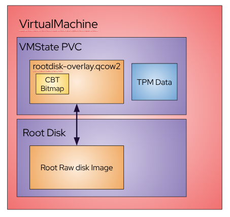

# VEP #22: Storage agnostic incremental backup using qemu

## Release Signoff Checklist

Items marked with (R) are required *prior to targeting to a milestone / release*.

- [X] (R) Enhancement issue created, which links to VEP dir in [kubevirt/enhancements] : https://github.com/kubevirt/enhancements/issues/25

## Overview

Proposal to enable incremental backup with Changed Block Tracking (CBT) using QEMU capabilities.

## Motivation

The current backup options rely on CSI-storage and create a full snapshot of the storage with each backup. This leads to longer backup times and increased storage space usage, whether the backup is stored in the cluster or off-site. Additionally, when stored off-site, a large amount of data needs to be copied over which further extends the backup time.
This can be improved by leveraging QEMU's capability to create incremental backups, which use Changed Block Tracking (CBT) to save only the changes made since the last backup.

## Goals

- Have an API to enable/disable incremental backup in VM.
- Have an API to have a backup either incremental or full using QEMU capabilities that provides CBT without the need for specific storage capabilities.

>> Note: this API's main consumer is backup vendors. They will provide the backup platform and will be responsible for getting the data and moving it to a defined location. A user may imitate backup vendors capabilities for this feature is not directed to the common VM owner.

## Non Goals

Have an API to restore from backup. In this VEP we will present a way to do it but its not something that we will have an API for.

## Definition of Users

* Backup vendors
* Cluster Admins
* VM owners

## User Stories

* As a KubeVirt user, I would like to back up my VM in the most efficient way possible, both in terms of time and storage usage.
* As a Kubevirt admin I would like to take a complete backup of my cluster. Then, I would like to take backup of the changes since the previous backup.
* As a Kubevirt admin I would like to store the backups off-site and lower the amount of data I am copying each time.
* As a Kubevirt admin I would like to restore to a specific time by applying both base backup and smaller time-specific increment.

## Repos

[KubeVirt](https://github.com/kubevirt/kubevirt)

## Design

### Enable/Disable QEMU backup

QEMU backup with CBT is only supported with QCOW2 images, currently, Kubevirt supports only raw images.
To enable QEMU backup for a disk, we need to create a QCOW2 overlay that will store the **image metadata** (Not data!) and enable the use of QCOW2 features.
This overlays will be stored on a VM state PVC, similar to how TPM and EFI are handled. If the VM uses either of these features, the overlays will be created on the same PVC. Figure 1 describes how this will look like:


A `changedBlockTrackingLabelSelectors` field will be added to the configurations section of the kubevirt CR. This will allow users to define `namespace` and/or `virtualMachine` label selectors.
Virtual Machines residing in one of the selected namespaces or matching the specified virtualMachine label selector will be configured to have Changed Block Tracking enabled for their supported volumes(DataVolumes and PersistentVolumeClaims).

Currently, live addition of the overlay is not supported, a limitation the Libvirt team is actively addressing. Once this capability is available, we will integrate it into KubeVirt. Until then, enabling Changed Block Tracking, along with the creation of the QCOW2 overlay, will require a VM restart.

To reflect the `changedBlockTracking` state, an indication will be added to the status of selected VirtualMachines and their VirtualMachineInstances. This state can be:
- `PendingRestart`: The VM needs a restart for the changes to take effect. This state field will be deprecated once the Libvirt enhancement is available.
- `Initializing`: A restart has occurred, and the necessary setup for the changes is in progress.
- `Enabled`: The VM's supported volumes now have Changed Block Tracking enabled with a QCOW2 overlay.
- `Disabled`: The feature was once enabled for this VM, but it no longer matches the label selector. All associated CBT resources have been deleted.

When a VM is selected for Changed Block Tracking:
- `changedBlockTracking: pendingRestart` will be added to the VM status if the VMI is already running.
- The user will restart the VM. (will not be required once libvirt enhancement is available)
- `changedBlockTracking: Initializing` will be updated in the VM and VMI status.
- A VM state PVC will be created (if one doesn’t already exist).
- A QCOW2 image overlay will be created on top of the relevant disks.
- A `data-store` tag will be added to each of these disks in the domain XML.
- VMI `changedBlockTracking` status will be updated to `Enabled`.
- VM `changedBlockTracking` status will be updated to `Enabled`.

When a VM is removed from the Changed Block Tracking label selector:
- `changedBlockTracking: pendingRestart` will be added to the VM status if VMI is already running.
- The user will restart the VM. (will not be required once libvirt enhancement is available)
- `changedBlockTracking: Disabled` will be updated in the VM and VMI status.
- VM state PVC will be deleted (unless it is required by another feature), along with its associated QCOW2 overlays.
- Domain XML will be generated normally, without any `data-store` tags.

NOTE: For hot-plugged disks, a restart is not necessary as they can be hot-plugged with the data-store tag already present in the domain XML.

### Full backup

Libvirt's domain commands will be used to leverage QEMU backup capabilities, with the aim of making our backup API similar to libvirt's backup and incremental backup API but as simple as possible on our side.

To initiate a backup, a `VirtualMachineBackup` resource will be created. This resource will be managed by a new VMBackup controller.

As outlined in Libvirt, there are two general modes for backup:

```
A `push` mode (where the hypervisor writes out the data to the destination file, which may be local or remote), and a `pull` mode (where the hypervisor creates an NBD server that a third-party client can then read as needed, and which requires the use of temporary storage, typically local, until the backup is complete).
```
* In the initial phase, we will implement **push** mode. In this mode, the user provides a filesystem-based PersistentVolumeClaim (PVC) to store the backup data for all relevant VM disks. Before the process begins, an estimation of the required backup size will be performed. If the provided PVC size is insufficient, an error will be returned.
The PVC will be hot-plugged into the virt-launcher pod as a directory (rather than as a disk attached to the VM, as is typical for hot-plugged volumes). The backup process will then proceed, writing data directly to the mounted PVC. Once the backup is complete, the PVC will be detached. It is then the user’s responsibility to manage the backup data—for example, by transferring it to a remote storage location, if needed.
* In the second phase, we will implement **pull** mode. This will involve defining a complete network API that exposes an endpoint the user can connect to in order to retrieve the backup.
>> Note: More details on the pull mode will be described in a subsequent VEP.

Once the backup is initialized, the controller will pass a backup command to the virt-launcher via the virt-handler using a subresource, containing all the relevant information. Before the backup begins, an FSFreeze command will be issued to ensure file system consistency during the backup. This will be the default behavior, with an option to skip filesystem quiescing if desired.
Then, [`virDomainBackupBegin`](https://libvirt.org/html/libvirt-libvirt-domain.html#virDomainBackupBegin) will be invoked, which, as documented in libvirt, starts a point-in-time backup job for the desired disks of the running domain. This job captures the domain's disks state at the time of initiation, allowing to then call FSThaw (if needed). This minimizes guest downtime and enables the backup to be fetched while the guest continues its workload.

In `push` mode, the backup job in libvirt automatically terminates once all data has been successfully backed up. The controller will be notified when the job completes and will update the `VirtualMachineBackup` phase to `Done`. At this stage, the PVC will be detached from the VM and made available for user operations. Since the `VirtualMachineBackup` resource is no longer needed, it can be safely deleted.

**Backup-PVC hotplugging**
As mentioned, the PVC that will store the backup output must be hot-plugged into the virt-launcher pod. We will leverage an existing approach already used in the memory dump process, where a volume is hot-plugged as a directory directly into the pod—without being attached to the VM as a disk.
This is considered an implementation detail rather than an exposed API, as it is not user-configurable and will be handled automatically as part of the backup workflow.

### Incremental backup

The incremental backup process should closely mirror the full backup process, with a few distinctions.

Libvirt provides a [Checkpoint](https://libvirt.org/formatcheckpoint.html#checkpoint-xml) resource, which marks the point in time when a backup is taken. A checkpoint is created for every backup—both full and incremental. To perform an incremental backup, the backup job must be provided with the name of a previous checkpoint. Typically, this is the checkpoint from the most recent backup, and it is used to identify which disk blocks have changed.

To facilitate incremental backups by tracking previous backups, a new `VirtualMachineBackupTracker` CR will be introduced. This CR will store the checkpoint of the most recent successful backup.
Given that a VM might be backed up by multiple independent solutions, a dedicated `VirtualMachineBackupTracker` should be created for each to manage its respective backup history.

The `VirtualMachineBackupTracker` can be referenced within the `VirtualMachineBackup` CR. This association allows checkpoint metadata to be preserved and utilized for subsequent incremental backups. The tracker CR will include a field indicating the name of the latest checkpoint, which will serve as the base for the next incremental backup. This field is automatically updated in the CR status upon the successful completion of each backup along side with the checkpoint metadata, and the previous checkpoint will be deleted.

If a backup is initiated without referencing a `VirtualMachineBackupTracker`, a full backup will be performed, and no checkpoint history will be maintained for future incremental backups. Similarly, if a tracker is referenced but contains no record of a previous checkpoint, the backup will also default to a full backup. To explicitly perform a full backup even if a previous checkpoint exists, the `forceFullBackup` field can be set on the backup CR.

**Handling Incremental backups Across VM Restarts**
One challenge in Kubevirt is that Libvirt is re-created each time a VM restarts, causing all existing libvirt checkpoints to be lost. To enable incremental backups after a restart—rather than falling back to a full backup, checkpoints metadata must be provided to libvirt during VM initialization. This allows libvirt to redefine the checkpoints, ensuring that an incremental backup can be continued as expected.
To address this, the VM controller will leverage the stored metadata within the VM associated `VirtualMachineBackupTracker` CRs during VM startup. The controller will iterate through these trackers and re-create the corresponding checkpoints in Libvirt based on the stored metadata. This mechanism ensures that incremental backups can resume seamlessly, even after a VM restart.

### Offline backups

An initial proposed solution involves starting the VM in a paused state to perform the backup, and then either unpausing or shutting it down once the backup is complete. However, this approach introduces additional considerations and trade-offs, which justify a separate, dedicated discussion. As such, this section is intentionally left without a formal API definition for now and only online backup will be supported at first.

### State interruptions during backup

During an online backup, if a user tries to stop the VM, Libvirt is developing a built-in [solution](https://issues.redhat.com/browse/RHEL-8067) to ensure the backup completes cleanly before shutdown.
Until this Libvirt feature is implemented, KubeVirt will either prevent VM state changes during a backup or wait for the VirtualMachineBackup job to finish before allowing the VM to stop.
If the guest operating system initiates a shutdown, the backup will be aborted and fail, with an error indicated in the backup CR.

### VM crash

In the event of a VM crash, the CBT information may become corrupted and must be discarded. QEMU provides an API to verify the validity of the dirty bitmaps. Upon VM restart, as part of redefining the checkpoints, we will utilize this API to check the bitmap validity. If a corrupted bitmap is detected, the associated checkpoints will be discarded.
Consequently, the first backup performed after such a crash will likely be a full backup. If an attempt at an incremental backup fails due to the absence of a valid checkpoint, the backup status will indicate a fallback to a full backup, and a full backup will be executed instead. Following the successful full backup, the existing (and potentially invalid) checkpoint will be deleted from the VirtualMachineBackupTracker and replaced with the new checkpoint generated by the full backup.

### Migration and Backup

Migration and backup operations are mutually exclusive and cannot be performed simultaneously.
If a backup is in progress and a migration is initiated, the backup will be aborted to prioritize the migration. Similarly, if a migration is already in progress, any attempt to initiate a backup will fail.

During a migration, the dirty bitmaps from all previous backups are automatically transferred along with the disk image. The only additional step required on the destination host is similar to the process after a VM restart: the checkpoints must be redefined for the newly initialized Libvirt instance.
If the VM state PVC is not shared between the source and destination, a new one will be created for the migrated VM. And so, since the dirty bitmaps are migrated regardless of PVC sharing, incremental backups should function normally after the checkpoints are redefined.

### VMSnapshot and Backup

Online snapshots, being a Kubernetes-level feature rather than native to Libvirt, interfere with the integrity of backup bitmaps. Therefore, restoring a VM from an online snapshot will lead to the discarding of all existing checkpoints. As a consequence, the subsequent backup performed after such a restore will be a full backup.

## API Examples

### Enable/disable QEMU backup

Kubevirt CR configurations will be added with the following field:

```yaml
apiVersion: kubevirt.io/v1
kind: KubeVirt
metadata:
  name: kubevirt
  namespace: kubevirt
spec:
  configuration:
    changedBlockTrackingLabelSelectors:
      namespaceSelector:
        changedBlockTracking: true
      virtualMachineSelector:
        workload-type: db
```

A `changedBlockTracking` field will be added to the VirtualMachine status.
Example:
```yaml
apiVersion: kubevirt.io/v1
kind: VirtualMachine
metadata:
  name: vmfedora
  namespace: default
spec:
....
status:
  changedBlockTracking: PendingRestart
```

After restart the field is set to `Initializing`.
A VM state PVC will be created if doesn't already exist.
Then, For every disk a QCOW2 image will be created using the raw disk image as its data-file.
Before applying the domain XML and starting it in virt-launcher manager, the XML will be modified for each disk to use the newly created QCOW2 image as the disk.

The XML will modified from:
```xml
    <disk type='file' device='disk' model='virtio-non-transitional'>
      <driver name='qemu' type='raw' cache='none' error_policy='stop' discard='unmap'/>
      <source file='/var/run/kubevirt-private/vmi-disks/datavolumedisk/disk.img' index='2'/>
      ...
    </disk>
    <disk type='block' device='disk' model='virtio-non-transitional'>
      <driver name='qemu' type='raw' cache='none' error_policy='stop' io='native' discard='unmap'/>
      <source dev='/dev/datavolumedisk2' index='3'/>
      ...
    </disk>

```

To:
```xml
    <disk type='file' device='disk' model='virtio-non-transitional'>
      <driver name='qemu' type='qcow2' cache='none' error_policy='stop' discard='unmap'/>
      <source file='/run/kubevirt-private/libvirt/qemu/swtpm/datavolumedisk.qcow2' index='2'>
        <dataStore type='file'>
          <format type='raw'/>
          <source file='/run/kubevirt-private/vmi-disks/datavolumedisk/disk.img' index='3'/>
        </dataStore>
      </source>
      ...
    </disk>
    <disk type='file' device='disk' model='virtio-non-transitional'>
      <driver name='qemu' type='qcow2' cache='none' error_policy='stop' discard='unmap'/>
      <source file='/run/kubevirt-private/libvirt/qemu/swtpm/datavolumedisk2.qcow2' index='4'>
        <dataStore type='block'>
          <format type='raw'/>
          <source dev='/dev/datavolumedisk2' index='5'/>
        </dataStore>
      </source>
      ...
    </disk>
```

### VirtualMachineBackupTracker CR

`VirtualMachineBackupTracker` is a namespace-scoped Custom Resource designed to track the latest backup checkpoint per-VM, per-backup-solution basis.
It is intended to be created by a backup provider or user for a specific VM to monitor and manage incremental backups associated with a given backup solution.
`IncrementalBackup` FeatureGate must be enabled in order to create this CR.
Checkpoints of this tracker will be prefixed with the backupTracker's name, followed by a timestamp representing when the backup was taken.

**Spec:**
- `source` <br>
Specifies the VM that this backup tracker is associated with.

**Status**
- `latestCheckpoint` <br>
The checkpoint of the latest backup, updated by the backup controller. This checkpoint will serve as the base for the next incremental backup when providing this tracker as a reference.
This struct will consist of the needed information to redefine Libvirt's checkpoint XML and will consist of:
- name
- disks
- creationTime

* If no latestCheckpoint in the status, a full backup will be initiated and the latestCheckpoint will be updated with the full backup checkpoint.
* If latestCheckpoint is in the status an incremental backup will be performed using the `latestCheckpoint` as the base for determining which changed blocks need to back up.

*VirtualMachineBackupTracker
```yaml
apiVersion: backup.kubevirt.io/v1alpha1
kind: VirtualMachineBackupTracker
metadata:
    name: my-backup-tracker
    namespace: ns1
spec:
    source:
        apiGroup: kubevirt.io
        kind: VirtualMachine
        name: my-vm
status:
    latestCheckpoint:
      name: my-backup-tracker-2025-03-03T16:13:28Z
      creationTime: "2025-03-03T16:13:28Z"
      disks:
        - my-volume
```

### VirtualMachineBackup CRD

`VirtualMachineBackup` is a namespace-scoped Custom Resource that initiates the backup process.

The CR name should be a unique identifier for the backup within the namespace, with only one backup allowed per VM at a time.

**Spec:**
- `source`<br>
Optional. Specifies the VM to back up. If not provided, a reference to a `VirtualMachineBackupTracker` must be specified instead.
- `backupTracker` <br>
Optional. A reference to a `VirtualMachineBackupTracker` CR. Required to enable incremental backups, will be updated with the backup latestCheckpoint and use the existing `latestCheckpoint` as a base for the incremental backup. If not specified, a full backup will be performed and the source field will be expected.
- `mode`<br>
Optional. Should be either `push` or `pull`. Initially, as mentioned, only `push` will be allowed. If not specified, `push` will be the default behavior.
- `pvcName` <br>
Optional. Required in `push` mode. Specifies the name of the PVC where the backup output will be stored. A PVC with that name needs exist otherwise the backup will wait for it to exist.
- `skipQuiesce` <br>
Optional. If set to true, the VM's filesystem will not be quiesced before the backup. By default, the system attempts to quiesce the filesystem to ensure data consistency.
- `forceFullBackup` <br>
Optional. If a backupTracker is provided and this field is set to true, force a full backup (instead of incremental using `latestCheckpoint`). The `latestCheckpoint` will be updated with the new full backup checkpoint.

**Status:**
- `checkpointName`<br>
The name of the checkpoint created for the current backup. This field is updated by the backup controller.
- `conditions`<br>
Represents the current state of the backup process, such as `Initializing`, `Done`, `Failed` or `Deleting`
- `backupType` <br>
Either `Full` or `Incremental`. Indicates the backup's scope, allowing users to confirm it aligns with their expectations or understand any deviation.

Example:
```yaml
apiVersion: backup.kubevirt.io/v1alpha1
kind: VirtualMachineBackup
metadata:
    name: backup1
    namespace: ns1
spec:
    backupTracker: my-backup-tracker
    mode: push
    pvcName: backup-output-pvc
status:
    checkpointName: my-backup-tracker-2025-03-03T16:13:28Z
    backupType: full
```

### Collection of the backup

> Note: All of the information mentioned below are suggestions for backup vendors or users to fetch the backup. **There will not be an API providing this operations.**

**Push mode:**
PVC name containing the backup is provided in the VirtualMachineBackup CR status. The backup output will be stored as sparsed qcow2 images, one per disk. In the `Restore` section we document an example of how to stitch these files together to construct a restorable image. To move the images, a data-mover pod can be spawned to attach to the PVC and copy the data over to a remote storage. After the data is moved, the PVC can be deleted.

### Restore

> Note: The information mentioned below is a naive option only. **There will not be an API provided for this.**

Assuming that the full backup and all incremental backups up to the desired restore point are available, the incremental backups must be applied in the correct order (from the first incremental to the last) to ensure proper integration with the full backup.

The typical process for applying incremental backups in the QCOW2 format involves using the `qemu-img` tool, which can merge incremental backups with the base full image. You can use the qemu-img rebase command to sequentially apply each incremental backup on top of the full backup.

```bash
$ qemu-img rebase -b fullbackup.qcow2 -f qcow2 -u incremental1.qcow2
```

After applying the first incremental backup, subsequent incremental backups must be applied one by one, in the correct order. For example, apply incremental2.qcow2 on top of the image that already includes incremental1.qcow2, and continue this process for each subsequent incremental backup.
```bash
$ qemu-img rebase -b incremental1.qcow2 -f qcow2 -u incremental2.qcow2
$ qemu-img rebase -b incremental2.qcow2 -f qcow2 -u incremental3.qcow2
.
.
.
```

Since KubeVirt only supports raw disk images, the final step is to convert the merged QCOW2 image to a raw format.

```bash
$ qemu-img convert -f qcow2 -O raw incremental3.qcow2 restored-raw.img
```

Once the raw restored image is created, you can store it in a PVC and use this PVC as the restored volume for the VM. You can use any population method like import or upload.


## Alternatives

The option to use [KEP-3314: CSI Changed Block Tracking](https://github.com/kubernetes/enhancements/tree/master/keps/sig-storage/3314-csi-changed-block-tracking), the native Kubernetes approach for CBT, was considered as an alternative to facilitating libvirt backups.
Advantages:
- Aligning with k8s ecosystem.
- Avoid the need to implement this complex feature ourselves.
- Backup vendors already use CSI API currently for full backups.

Disadvantages:
- This KEP is still in the early stages of implementation and will take considerable time to mature before reaching a stable v1 version and it is not under our control.
- Beyond waiting for the Kubernetes API to mature, each storage provider must implement the optional SnapshotMetadata API as outlined in the KEP. Since this is optional, not all providers will support it, and adoption will be gradual, restricting the available options for users.
- When using Kubernetes VolumeSnapshot, the guest must be frozen during the snapshot of all the VM volumes. In contrast, libvirt uses a dedicated job to capture the disk state quickly, minimizing guest downtime.
- The API is limited to the design choices made by Kubernetes, offering little flexibility for adjustments or additions.

## Scalability

- QCOW2 overlay requires a minimum PVC size.
With certain storage providers, even when a small PVC size is requested, a larger volume may be provisioned based on the provider’s minimum volume size. When managing a large number of VMs, this behavior can lead to inefficient storage.
**This is a general limitation that also affects VM state PVCs.**

- Managing a large number of checkpoints.
If too many checkpoints accumulate, the `CheckpointsList` CR can become large and difficult to manage. To keep it maintainable, it is recommended that users periodically delete old checkpoints. Realistically, once a checkpoint has been successfully backed up from, it is no longer needed and can be deleted.

## Update/Rollback Compatibility

Since the new feature allows users to enable or disable it, upgrades will not pose any issues. Users must opt in by setting the changedBlockTracking to true. The rollback will not be a problem either, as it is essentially the same as setting the changedBlockTracking to false, which will be the default value.

## Functional Testing Approach

Testing should check data consistency before and after add and remove of the QCOW2 overlay.
Data consistency of incremental backup.
Data consistency after VM restart.
Check failure scenario where incremental backup cannot be done and in such case full backup should be required.

## Implementation Phases

- Add/remove the qcow2 overlay
- Subresource to initiate backup (full and incremental) including Libvirt wrapper backup functions.
- New VirtualMachineBackup CR + controller for backups - online backup only
- New VirtualMachineCheckpointsList CR, Handling restart of VM and redefinition of checkpoints.
- Handle VM failure where bitmap is corrupted - next backup needs to be full.
- Offline backup
- API to allow to pull the backup over network.

* Live qcow2 overlay addition - depends on [https://issues.redhat.com/browse/RHEL-80680](https://issues.redhat.com/browse/RHEL-80680)


## Feature lifecycle Phases

### Alpha

IncrementalBackup FeatureGate. Users will have to opt in.

### Beta

After several releases, when we are confident that the feature is working as expected, move to beta.

### GA

GA once the feature has been running in production without issue.
