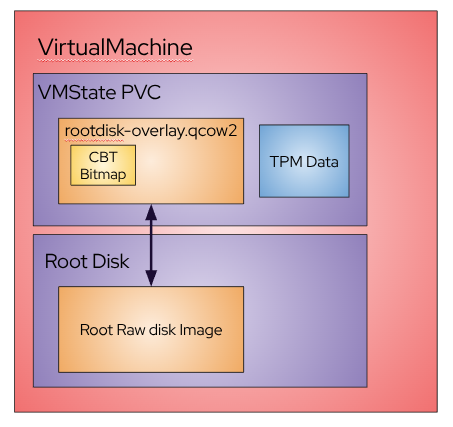

# VEP #22: Storage agnostic incremental backup using qemu

## Release Signoff Checklist

Items marked with (R) are required *prior to targeting to a milestone / release*.

- [X] (R) Enhancement issue created, which links to VEP dir in [kubevirt/enhancements] : https://github.com/kubevirt/enhancements/issues/25

## Overview

Proposal to enable incremental backup with CBT using QEMU capabilities.

## Motivation

The current backup options rely on CSI-storage and create a full snapshot of the storage with each backup. This leads to longer backup times and increased storage space usage, whether the backup is stored in the cluster or off-site. Additionally, when stored off-site, a large amount of data needs to be copied over which further extends the backup time.
This can be improved by leveraging QEMU's capability to create incremental backups, which use Changed Block Tracking (CBT) to save only the changes made since the last backup.

## Goals

Have an API to enable/disable incremental backup in VM.
Have an API to start a backup either incremental or full using QEMU capabilities that provides CBT without the need for specific storage capabilities.
Have an API that allows backup partners to pull the backup to an off-site location.

>> Note: this API's main consumer is backup vendors. They will provide the backup platform and will be responsible for getting the data and moving it to a defined location. A user may imitate backup vendors capabilities for this feature is not directed to the common VM owner.

## Non Goals

Have an API to restore from backup. In this VEP we will present a way to do it but its not something that we will have an API for.

## Definition of Users

* Backup vendors
* Cluster Admins
* VM owners

## User Stories

* As a KubeVirt user, I would like to back up my VM in the most efficient way possible, both in terms of time and storage usage.
* As a Kubevirt admin I would like to take a complete backup of my cluster. Then, I would like to take backup of the changes since the previous backup.
* As a Kubevirt admin I would like to store the backups off-site and lower the amount of data I am copying each time.
* As a Kubevirt admin I would like to restore to a specific time by applying both base backup and smaller time-specific increment.

## Repos

[KubeVirt](https://github.com/kubevirt/kubevirt)

## Design

### Enable/Disable QEMU backup

QEMU backup with CBT is only supported with QCOW2 images, currently, Kubevirt supports only raw images.
To enable QEMU backup for a disk, we need to create a QCOW2 overlay that will store the **image metadata** (Not data!) and enable the use of QCOW2 features.
This overlays will be stored on a VM state PVC, similar to how TPM and EFI are handled. If the VM uses either of these features, the overlays will be created on the same PVC. Figure 1 describes how this will look like:


A new field, `CBT`(*NOTE: open to other name suggestions*), will be added to the VirtualMachine and VirtualMachineInstance CRDs. This field will control the addition or removal of the QCOW2 overlay to each of the VM disks. To enable the feature, one will set it to `true`. If the VM is already running, a restart will be required for the change to take effect (Currently, live addition of the overlay is not possible. Libvirt is working on this, and once it's available, we will work on incorporating it into KubeVirt as well).
When the VM starts with this field set to `true`, the VMI spec will also be created with this field set to `true`. This will trigger the creation of a VM state PVC (if one doesn’t already exist), create a QCOW2 image overlay on top the raw boot image for the disks that have the CBT field, and for each of those disks add a data-store tag in the domain XML, resulting in a domain with QCOW2 overlays.
*NOTE: In the case of a hot-plugged disk, the VM will need to be restarted for it to be included in the backup and have CBT. Once live addition of the overlay is supported, restarts will no longer be required.

### Full backup

Libvirt's domain commands will be used to leverage QEMU backup capabilities, with the aim of making our backup API as similar as possible to libvirt's backup and incremental backup API.

To initiate a backup, a VirtualMachineBackup resource will be created. This resource will be managed by a new VMBackup controller.

As outlined in Libvirt, there are two general modes for backup:

```
A `push` mode (where the hypervisor writes out the data to the destination file, which may be local or remote), and a `pull` mode (where the hypervisor creates an NBD server that a third-party client can then read as needed, and which requires the use of temporary storage, typically local, until the backup is complete).
```
* For the first phase of implementation, we will start with push mode. In this mode, a PVC will either be provided or be created, and will be hot-plugged to the virt-launcher. Backup will be initiated, and the data will be pushed to the attached PVC. Afterward, the PVC will be unplugged and the user can decide what to do with the it, and how to move it to a remote location if desired.
* In the second phase, we will implement pull mode. This will involve defining a complete network API to expose the endpoint that the user can connect to in order to pull the backup. The design for this API is still **TBD** and will be updated accordingly. The endpoint information will be updated in the VMBackup CR for user reference. As specified in libvirt documentation, an additional scratch PVC, sized to accommodate all the VM disks, will be required to serve as temporary backup space to store any blocks that change during the backup job. The PVC must be large enough to hold the total size of all the VM disks, as in the worst-case scenario, the entire storage could be written to during the backup.

Once the backup is initialized, the controller will pass a backup command to the virt-launcher via the virt-handler using a subresource, containing all the relevant information. Before the backup begins, an FSFreeze command will be issued to ensure file system consistency during the backup. Then, [`virDomainBackupBegin`](https://libvirt.org/html/libvirt-libvirt-domain.html#virDomainBackupBegin) will be invoked, which, as documented in libvirt, starts a point-in-time backup job for the specified disks of the running domain. This job captures the domain's disks state at the time of initiation, allowing to then call FSThaw. This minimizes guest downtime and enables the backup to be fetched while the guest continues its workload.

Once the data has been pushed or fetched, the VirtualMachineBackup resource can be deleted. Deleting the object will abort the libvirt backup job, effectively terminating the backup process.

### Incremental backup

The incremental backup process should closely mirror the full backup process, with a few distinctions.

Libvirt has a [Checkpoint](https://libvirt.org/formatcheckpoint.html#checkpoint-xml) resource that represents the point in time when the backup was taken. A checkpoint is created for every backup, including full backups. The checkpoint name can be provided, or if not, it will automatically use a predefined prefix followed by the backup timestamp.

During an incremental backup, libvirt returns the changed blocks based on the provided checkpoint name, which is typically the checkpoint from the previous backup. In the `VirtualMachineBackup` CR, the user will add an `incrementalBackup` field, which will be populated with the checkpoint name from which the changed blocks should be tracked.
In push mode, the data pushed to the PVC will include only the data changes up to the backup point. In pull mode, the user will be asked to request only the dirty bitmap blocks.

A challenge in Kubevirt is that Libvirt is recreated each time a VM restarts, causing any existing checkpoints to be lost. To continue incremental backups after a restart, the checkpoint metadata must be provided to libvirt during VM initialization. This allows libvirt to redefine the checkpoints, ensuring the incremental backup process can resume from the correct point in time.

Two approaches are being considered to be able to redefine the checkpoints after a VM restart:
- Create a `Checkpoint` CR to store the XML data, either as a plain string or base64 encoded. This approach is more visible and easier to query using the k8s API, but could result in a large number of checkpoints per VM, potentially causing performance issues due to the increased number of objects in the cluster.
- Store checkpoint metadata alongside the QCOW2 overlay in the VM state PVC to ensure persistence. The checkpoint will be stored as an XML, which takes up very little space. This method does not introduce another CR, but since it is not a Kubernetes resource, it requires an alternative method to get checkpoints information. To access the existing checkpoints data, it will be possible to either execute a virsh command through the virt-launcher pod or a new API will need to be created to provide this info. Alternatively, or additionally, the backup vendor can use the backup's checkpoint name, which will be updated in the VirtualMachineBackup CR status, to manage the checkpoints list themselves, providing their users with checkpoints information through their API.

### Offline backups

Another challenge that needs to be addressed is taking offline backups. Currently, there is no option to create offline backups in Libvirt and QEMU. Backups require QEMU, as it is necessary to interpret the QCOW2 metadata/bitmap.
The proposed solution is to start the VM in a paused state to take the backup, and then either unpause or shut it down once the process is complete.

### State interruptions during backup

According to the previous solution, if the VM was offline when the backup was requested, we will start the VM in a paused state. When the VM is in a paused state, there is no issue with starting it during the backup process, as Libvirt and QEMU guarantee that any VM operations, such as overwriting blocks in the data file, will not affect the backup's consistency. This consistency assurance could not have been guaranteed if an alternative, non-built-in solution had been considered.

In the case of an online backup if the user tries to stop the VM there will be a built-in [solution](https://issues.redhat.com/browse/RHEL-8067) that Libvirt is currently working on. Until then, we may need to handle it on the Kubevirt side by preventing changes to the VM state during the backup or before stopping the VM we would wait for the VirtualMachineBackup object to be deleted and only then allow the VM to stop.

### VM crash

In the event of a VM crash, the CBT information may become corrupted and must be discarded. QEMU provides an API to verify if the dirty bitmaps are valid. Upon VM restart, before redefining the checkpoints, we will check the validity of the bitmaps. If a corrupted bitmap is detected, the checkpoints will be discarded, and the next backup will need to be a full backup.

## API Examples

### Enable/disable QEMU backup

A new `CBT` field will be added to the VirtualMachine and VirtualMachineInstance CRs. In the VirtualMachine CR, it will be added under: `Spec.Template.Spec.Domain.Devices.Disk[i].CBT`. Similarly, in VirtualMachineInstance CR, it will be added under: `Spec.Domain.Devices.Disk[i].CBT`.
The field will be of type \*bool and will determine whether the QCOW2 overlay should be applied on that disk. As with any other field in the VMI template, this change will only take effect when the VM is restarted. Upon restart, the VMI spec will be created with the updated field value.

When the field is present and set to `true`, a VM state PVC will be created if doesn't already exist. Then, For every disk a QCOW2 image will be created using the raw disk image as its data-file. Before applying the domain XML and starting it in virt-launcher manager, the XML will be modified for each disk to use the newly created QCOW2 image as the disk.

The XML will modified from:
```xml
    <disk type='file' device='disk' model='virtio-non-transitional'>
      <driver name='qemu' type='raw' cache='none' error_policy='stop' discard='unmap'/>
      <source file='/var/run/kubevirt-private/vmi-disks/datavolumedisk/disk.img' index='2'/>
      ...
    </disk>
    <disk type='block' device='disk' model='virtio-non-transitional'>
      <driver name='qemu' type='raw' cache='none' error_policy='stop' io='native' discard='unmap'/>
      <source dev='/dev/datavolumedisk2' index='3'/>
      ...
    </disk>

```

To:
```xml
    <disk type='file' device='disk' model='virtio-non-transitional'>
      <driver name='qemu' type='qcow2' cache='none' error_policy='stop' discard='unmap'/>
      <source file='/run/kubevirt-private/libvirt/qemu/swtpm/datavolumedisk.qcow2' index='2'>
        <dataStore type='file'>
          <format type='raw'/>
          <source file='/run/kubevirt-private/vmi-disks/datavolumedisk/disk.img' index='3'/>
        </dataStore>
      </source>
      ...
    </disk>
    <disk type='file' device='disk' model='virtio-non-transitional'>
      <driver name='qemu' type='qcow2' cache='none' error_policy='stop' discard='unmap'/>
      <source file='/run/kubevirt-private/libvirt/qemu/swtpm/datavolumedisk2.qcow2' index='4'>
        <dataStore type='block'>
          <format type='raw'/>
          <source dev='/dev/datavolumedisk2' index='5'/>
        </dataStore>
      </source>
      ...
    </disk>
```

In the case the field is not present or set to `false`, the VM state PVC will deleted if it is not required by other features. The QCOW2 images will be deleted if exists. And the domain XML will be modified back to use the raw images as the disks images.


### VirtualMachineBackup CRD

`VirtualMachineBackup` is a namespace-scoped Custom Resource that initiates the backup process.

The CR name should be a unique identifier for the backup within the namespace, with only one backup allowed per VM at a time.
The CR spec includes the following fields:
- `source`<br>
Specifying the VM source for the backup.
- `mode`<br>
Optional. Should be either `push` or `pull`. Initially, as mentioned, only `push` will be allowed. If not specified, `push` will be the default behavior.
- `pvcName` <br>
Optional. A name for a PVC that the user provides that in case of `push` will store the backup output, and for `pull` will store the scratch space. If provided no PVC will be created in the process.
- `incremental` <br>
Optional. If not specified, a full backup will be taken. When set, the field value should be the checkpoint name from which the incremental backup should be taken.
- `checkpointName` <br?>
Optional. If not specified a name will be generated from a prefix of the domain name, followed by the timestamp of the backup. Example: `my-vm-checkpoint-2025-03-03T16:13:28Z`

The CR status includes the following fields:
- `checkpointName`<br>
Updated by the controller with the name of the created Checkpoint for the current backup.
- `pvcName` <br>
Present only for push mode backup. Updated by the controller with the name of the PVC containing the backup output.
- `endpoint` <br>
Present only for pull mode backup. Update by the controller with the endpoint info from which to read the backup.
- `conditions`<br>
Indicates the state of the backup, such as Initializing, ReadyToPull, Failed or Deleting

Examples:

_Full Backup_
```yaml
apiVersion: kubevirt.io/v1
kind: VirtualMachineBackup
metadata:
    name: backup1
    namespace: ns1
spec:
    source:
        apiGroup: kubevirt.io
        kind: VirtualMachine
        name: my-vm
    mode: push
status:
    checkpointName: backup1-16210527022025
    pvcName: backup-my-vm-16210527022025
```

_Incremental Backup_
```yaml
apiVersion: kubevirt.io/v1
kind: VirtualMachineBackup
metadata:
    name: backup2
    namespace: ns1
spec:
    source:
        apiGroup: kubevirt.io
        kind: VirtualMachine
        name: my-vm
    incremental: backup1-16210527022025
status:
    checkpointName: backup1-15290501032025
    pvcName: incbackup-my-vm-16210527022025
```

### Checkpoints

As mentioned two approaches are considered:

- In case CR will be chosen it will look like:

_Checkpoint_
```yaml
apiVersion: kubevirt.io/v1
kind: VirtualMachineCheckpoint
metadata:
    name: my-vm-backup-16210527022025
    namespace: ns1
spec:
    xmlData: |
        <?xml version="1.0" encoding="UTF-8"?>
        <domaincheckpoint>
            <name>1525889631</name>
            <parent>
                <name>1525111885</name>
            </parent>
            <creationTime>1525889631</creationTime>
            <disks>
                <disk name='vda' checkpoint='bitmap' bitmap='1525889631'/>
                <disk name='vdb' checkpoint='no'/>
            </disks>
        </domaincheckpoint>
    OR
    xmlData: PGRvbWFpbmNoZWNrcG9pbnQ+CiAgICA8bmFtZT4xNTI1ODg5NjMxPC9uYW1lPgogICAgPHBhcmVudD4KICAgICAgICA8bmFtZT4xNTI1MTExODg1PC9uYW1lPgogICAgPC9wYXJlbnQ+CiAgICA8Y3JlYXRpb25UaW1lPjE1MjU4ODk2MzE8L2NyZWF0aW9uVGltZT4KICAgIDxkaXNrcz4KICAgICAgICA8ZGlzayBuYW1lPSd2ZGEnIGNoZWNrcG9pbnQ9J2JpdG1hcCcgYml0bWFwPScxNTI1ODg5NjMxJy8+CiAgICAgICAgPGRpc2sgbmFtZT0ndmRiJyBjaGVja3BvaW50PSdubycvPgogICAgPC9kaXNrcz4KPC9kb21haW5jaGVja3BvaW50Pg== 
status:
    creationTime: "2025-03-03T16:13:28Z"
```

Users can list and retrieve checkpoint information via kubectl.
In the event of a VM restart, during initialization, the virt-launcher will list the checkpoints CRs and use the XML data to redefine the checkpoints in Libvirt.

- If we choose not to create a CR and instead store the XML in the VM state PVC, we will create a directory specifically for the checkpoint XML files. Each xml file is very minimal and doesn't take much space.
In the event of a VM restart, we will use the saved checkpoints xml at the time of the restart to redefine them in libvirt.
To retrieve information about the checkpoints, user can exec virsh command on the virt-launcher pod, or we can use libvirt commands like `virDomainListAllCheckpoints` and `virDomainCheckpointGetXMLDesc` and implement an API to provide this information to the user.
Alternatively, or additionally, the backup vendor can use the backup's checkpoint name, which will be updated in the VirtualMachineBackup CR status, to manage the checkpoints list themselves, providing their users with checkpoints information through their API.


### Collection of the backup

> Note: All of the information mentioned below are suggestions for backup vendors or users to fetch the backup. **There will not be an API provided for this.**

**Push mode:**
PVC name containing the backup is provided in the VirtualMachineBackup CR status.The backup output will be stored as sparse qcow2 images. In the `Restore` section we document an example of how to stitch these files together to construct a restorable image. To move the images, a data-mover pod can be spawned to attach to the PVC and copy the data over to a remote storage. After the data is moved, the PVC can be deleted.

**Pull mode:**
Endpoint info is provided in the VirtualMachineBackup CR status. This endpoint will behave as an NBD server and can be read from as long as this is done by a trusted third-party. You should create an NBD client that will read the data, distinguishing between data and zeros, and in the case of incremental backup using the dirty bitmap to map the changed blocks that should be read.


### Restore

> Note: The information mentioned below is a suggestion only. **There will not be an API provided for this.**

Assuming that the full backup and all incremental backups up to the desired restore point are available, the incremental backups must be applied in the correct order (from the first incremental to the last) to ensure proper integration with the full backup.

The typical process for applying incremental backups in the QCOW2 format involves using the `qemu-img` tool, which can merge incremental backups with the base full image. You can use the qemu-img rebase command to sequentially apply each incremental backup on top of the full backup.

```bash
$ qemu-img rebase -b fullbackup.qcow2 -f qcow2 -u incremental1.qcow2
```

After applying the first incremental backup, subsequent incremental backups must be applied one by one, in the correct order. For example, apply incremental2.qcow2 on top of the image that already includes incremental1.qcow2, and continue this process for each subsequent incremental backup.
```bash
$ qemu-img rebase -b fullbackup.qcow2 -f qcow2 -u incremental2.qcow2
$ qemu-img rebase -b fullbackup.qcow2 -f qcow2 -u incremental3.qcow2
.
.
.
```

Since KubeVirt only supports raw disk images, the final step is to convert the merged QCOW2 image to a raw format.

```bash
$ qemu-img convert -f qcow2 -O raw fullbackup.qcow2 restored-raw.img
```

Once the raw restored image is created, you can store it in a PVC and use this PVC as the restored volume for the VM. You can use any population method like import or upload.


## Alternatives

The option to use [KEP-3314: CSI Changed Block Tracking](https://github.com/kubernetes/enhancements/tree/master/keps/sig-storage/3314-csi-changed-block-tracking), the native Kubernetes approach for CBT, was considered as an alternative to facilitating libvirt backups.
Advantages:
- Aligning with k8s ecosystem.
- Avoid the need to implement this complex feature ourselves.
- Backup vendors already use CSI API currently for full backups.

Disadvantages:
- This KEP is still in the early stages of implementation and will take considerable time to mature before reaching a stable v1 version and it is not under our control.
- Beyond waiting for the Kubernetes API to mature, each storage provider must implement the optional SnapshotMetadata API as outlined in the KEP. Since this is optional, not all providers will support it, and adoption will be gradual, restricting the available options for users.
- When using Kubernetes VolumeSnapshot, the guest must be frozen during the snapshot of all the VM volumes. In contrast, libvirt uses a dedicated job to capture the disk state quickly, minimizing guest downtime.
- The API is limited to the design choices made by Kubernetes, offering little flexibility for adjustments or additions.

## Scalability

- PVC to contain the scratch backup space which saves any blocks that change during the backup job, this PVC can in worst case scenario can grow up to the size of the sum of all disks size.
- QCOW2 overlay requires a minimal PVC to be stored in. With certain storage providers even when requested small PVC size they provide a larger one according to their minimal PVC size. (This is a general issue with VM state PVCs)

## Update/Rollback Compatibility

Since the new feature allows users to enable or disable it, upgrades will not pose any issues. Users must opt in by setting the CBT to true. The rollback will not be a problem either, as it is essentially the same as setting the CBT to false, which will be the default value.

## Functional Testing Approach

Testing should check data consistency before and after add and remove of the QCOW2 overlay.
Data consistency of incremental backup.
Data consistency after VM restart.
Check failure scenario where incremental backup cannot be done and in such case full backup should be required.

## Implementation Phases

- Add/remove the qcow2 overlay
- Subresource to initiate backup (full and incremental) including Libvirt wrapper backup functions.
- New VirtualMachineBackup CR + controller for backups - online backup only
- Handle restart of VM and redefinition of checkpoints.
- Handle VM failure where bitmap is not valid - next backup needs to be full.
- Offline backup
- API to allow to pull the backup.

* Live qcow2 overlay addition - depends on [https://issues.redhat.com/browse/RHEL-80680](https://issues.redhat.com/browse/RHEL-80680)


## Feature lifecycle Phases

### Alpha

IncrementalBackup FeatureGate. Users will have to opt in.

### Beta

After several releases, when we are confident that the feature is working as expected, move to beta.

### GA

GA once the feature has been running in production without issue.
