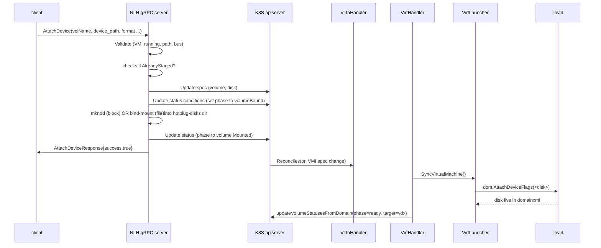
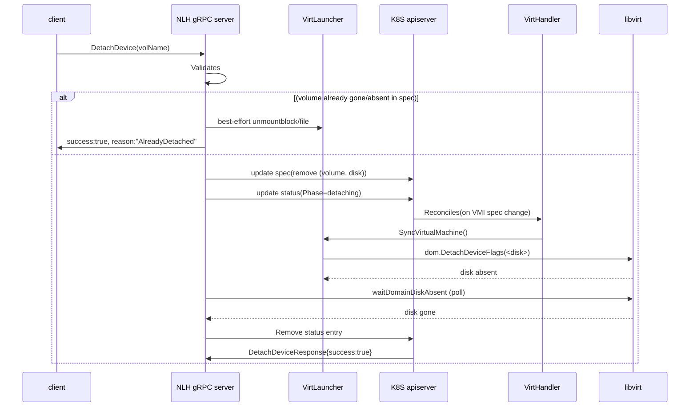

# VEP #293: Extend Hotplug APIs

## VEP Status Metadata

### Target releases

-  This VEP targets alpha for version: v1.10
-  This VEP targets beta for version: TBD
-  This VEP targets GA for version: TBD

### Release Signoff Checklist

Items marked with (R) are required *prior to targeting to a milestone / release*.

- [+] (R) Enhancement issue created, which links to VEP dir in [kubevirt/enhancements] (not the initial VEP PR)
- [] (R) Alpha target version is explicitly mentioned and approved
- [] (R) Beta target version is explicitly mentioned and approved
- [ ] (R) GA target version is explicitly mentioned and approved

## Overview

This VEP proposes a node-local gRPC service inside virt-handler that drives disk attach and detach for a running VirtualMachineInstance. The service splits the existing monolithic hotplug flow into three explicit phases — Delivery, Attach, Detach.

It does not change KubeVirt's existing AddVolume subresource or the HotplugVolume API marker; both remain. The proposal is additive.

## Motivation

KubeVirt hotplug today works but is monolithic and Pod-heavy for PVC-backed volumes. The mechanism works by:

1. **Launching an attachment Pod** on the target node, which mounts the PVC so the volume is available on the host.
2. **Manipulating bind mounts on the host** to expose that volume into the `virt-launcher` Pod's mount namespace, since Kubernetes does not allow mutating a Pod's `volumes` spec after creation.
3. **Hotplugging the disk into the VM** via libvirt/QEMU once the volume is visible inside `virt-launcher`.

While this design successfully leverages standard Kubernetes components and reuses as many Kubernetes apis as possible to limit the burden on kubevirt to maintain custom code, the end-to-end flow is hard-wired inside KubeVirt and exposed through a single API surface. Every step — volume delivery, attachment into the VM, and detachment — is driven by the same built-in controllers, which makes it difficult to customize or replace any individual stage for workloads that have specialized requirements.

This VEP proposes an extension of the hotplug APIs that decomposes the current monolithic flow into discrete, independently replaceable stages.

## Goals

  * **Make volume hotplug extensible** by allowing end users and out-of-tree components to replace individual stages of the hotplug flow with custom implementations, so that various edge cases (e.g., node-local hotplug, specialized delivery mechanisms) can be handled without changes to KubeVirt core.
  * **Decompose the single hotplug API into three distinct APIs** aligned with the three logical stages of the flow: volume delivery, volume attach (hot plug), and volume detach (hot unplug).
  * Provide a node-local gRPC API for attach and detach.
  * Allow Phase-1 volume delivery to be pluggable — raw host paths, attachment pods for PVC/DV, CSI mounts, hostPath, future implementations.

## Non Goals
* Replacing the AddVolume subresource. It continues to serve callers that want one-shot delivery+attach.
* Implementing PVC / DataVolume Phase-1 delivery in this VEP. That belongs in a follow-on VEP or is upto the user. 
* Modifying libvirt attach/detach semantics. We rely entirely on the existing converter + syncDisks path.
* Live migration of node-local volumes.
* Replacing the current hot plug solution using pods.

## Definition of Users

* **Cluster Administrators / Debug Tooling:** Attach a one-off block device or file to a running VM for diagnostics, data recovery, or ad-hoc operational tasks without restarting the guest.
* **CSI Driver Sidecars:** After completing `NodeStageVolume`, wire the already-staged path directly into a running VM via the node-local API, avoiding a round-trip through `virt-controller` and an attachment Pod.
  * **On-Node DaemonSets:** Expose a host device or file as a disk on a co-located VMI — for example, to surface node-local hardware, host-managed state, or operator-provided artifacts to the VM.

## User Stories

* As a KubeVirt developer or storage integrator, I want a low-latency hotplug path that bypasses the attachment-Pod lifecycle, so that attaching and detaching disks on a running VM completes quickly and does not generate apiserver/etcd write load proportional to the number of hotplug operations.
* As a cluster administrator, I want CSI sidecars or on-node DaemonSets that already have a staged volume on the node to bind that staged path into a running VM through a node-local API, so that node-local components can integrate with VM storage without a round-trip through `virt-controller` or an attachment Pod.
* As an operator debugging a running VM, I want to expose a host device or file to the VM as a disk directly, without creating an attachment Pod or provisioning a PVC, so that I can collect diagnostics, inject a rescue image, or surface a one-off device without apiserver side effects or guest restarts.
* As a vendor delivering vendor-specific block devices to nodes via my own on-node controller, I want to attach the device to a running VMI as a libvirt disk without forcing the device through a PVC

# Repos

[KubeVirt](https://github.com/kubevirt/kubevirt)

# Design

## High-level Approach

Volume hotplug today is a single, KubeVirt-managed pipeline exposed through one API. Conceptually, however, it breaks down into three independent steps:

1. **Volume delivery** — making the underlying storage available on the target node (today, by launching an attachment Pod that binds the PVC and exposes it on the host).
2. **Volume attach (hot plug)** — surfacing the delivered volume inside the running `virt-launcher` Pod and hotplugging the corresponding disk into the VM via libvirt/QEMU.
3. **Volume detach (hot unplug)** — reversing the above: detaching the disk from the VM, removing it from the `virt-launcher` Pod, and tearing down any delivery resources.

This VEP splits KubeVirt's single hotplug API into three separate APIs — one per stage — so that each stage can evolve independently and can be driven (or replaced) by an out-of-tree controller. For example, a node-local hotplug implementation can substitute a lightweight delivery step that skips the attachment Pod altogether, while reusing the standard attach and detach paths.

### Phase Pipeline

The end-to-end flow is modeled as a three-phase pipeline. Phase 1 (Delivery) is pluggable and may run off-node or on-node; Phases 2 and 3 (Attach / Detach) are the node-local surface introduced by this VEP and run inside `virt-handler`:

```text
+-------------------------+     +-------------------------+     +-------------------------+
| Phase 1: Volume Delivery|     | Phase 2: Volume Attach  |     | Phase 3: Volume Detach  |
| (pluggable)             | --> |                         | --> |                         |
| off-node OR on-node     |     |                         |     |                         |
|                         |     | AttachDevice RPC        |     | DetachDevice RPC        |
| Produces:               |     |  - mknod or bind-mount  |     |  - patch spec           |
|  - absolute host path   |     |    into virt-launcher   |     |    (remove device)      |
|  - block | file format  |     |  - patch spec           |     |  - wait libvirt detach  |
|                         |     |    (NodeLocalDevice)    |     |  - cleanup, conditional |
|                         |     |  - patch status         |     |    on delivery source   |
| Examples:               |     |    (HotplugVolMounted)  |     |                         |
|  - raw (admin-staged)   |     |                         |     |                         |
|  - attachment Pod       |     | virt-handler reconcile  |     | virt-handler reconcile  |
|  - CSI                  |     | runs syncDisks -->      |     | runs syncDisks -->      |
|  - DataVolume           |     | libvirt AttachDevice    |     | libvirt DetachDevice    |
|  - hostPath / local PV  |     |                         |     |                         |
+-------------------------+     +-------------------------+     +-------------------------+
```

#### Phase 1 — Volume Delivery 

Delivery is the only phase that can run either off-node (controllers, attachment Pods, CSI provisioners) or on-node (DaemonSets, sidecars), and it is intentionally pluggable. Its only contract with the rest of the pipeline is an output tuple consumed by Phase 2:

* **Absolute host path** — where the backing storage is visible on the target node.
* **Format** — `block` or `file`, so Phase 2 knows whether to `mknod` or bind-mount.

Reference implementations include raw admin-staged paths, the existing attachment-Pod flow (preserved for PVC/DataVolume-backed hotplug), CSI-staged paths, and `hostPath` / local PVs.

#### Phase 2 — Attach 

Phase 2 is the node-local surface added by this VEP. A caller invokes `AttachDevice` on `virt-handler`'s gRPC server with the Phase-1 output. `virt-handler` then:

1. Records intent — adds the volume to `spec.volumes`, the disk to `spec.domain.devices.disks`, and creates the `status.volumeStatus[i]` entry with the `Bound` condition set `True, reason: VolumeBound` via `buildAttachIntentPatch`.
2. Creates the device inside the target `virt-launcher` Pod — `mknod` for block, bind-mount for file — so the disk is visible from the VM's viewpoint.
3. Flips the `MountedToPod` condition to `True, reason: MountedToPod` via `buildAttachMountedPatch` and returns success on the RPC. The eventual `phase: Ready` transition happens asynchronously when libvirt reports the disk live, via the existing reconcile (see [Status Conditions](#status-conditions) below).

The existing `virt-handler` reconcile loop picks up the spec change and drives the libvirt `AttachDevice` call via the unchanged `syncDisks` converter path — no libvirt semantics are altered.

#### Phase 3 — Detach 

Phase 3 mirrors Phase 2. A caller invokes `DetachDevice`, and `virt-handler`:

1. Marks the entry as `phase: Detaching, reason: VolumeDetaching` and removes the volume / disk from the VMI spec in the same patch (`applyDetachPatch`). The `VolumeStatus` entry remains visible during the detach so observers can tell it is in progress.
2. Waits for libvirt to complete the detach (again via the existing `syncDisks` path, which issues `DetachDevice` to libvirt).
3. Cleans up the node-side artifacts (bind mounts, device nodes) and — conditional on the delivery source's declared lifecycle owner — optionally tears down Phase-1 resources, then removes the `VolumeStatus` entry.

### Status Conditions

The existing `VolumeStatus` shape (`phase`, `reason`, `message`, `target`) is **not** changed. `phase: Ready, reason: VolumeReady, target: vd<x>` continues to be written by the existing `updateVolumeStatusesFromDomain` reconcile when libvirt reports the disk live, exactly as it does today for attachment-pod volumes. On the way out, the `DetachDevice` RPC writes `phase: Detaching, reason: VolumeDetaching` so observers can distinguish a volume that is being unplugged from one that is still live:

```yaml
volumeStatus:
- name: scratch
  phase: Ready
  reason: VolumeReady
  message: "Successfully attach hotplugged volume scratch to VM"
  target: vdb
  hotplugVolume: {}
```

To track the node-local stages — the work the `AttachDevice` RPC does before libvirt is involved — a `conditions []VolumeCondition` field is added to `VolumeStatus`. Two condition types are defined; both are written by the RPC, neither replaces or duplicates `phase`:

| Condition type | Set `True` by | When | `reason` | Notes |
|---|---|---|---|---|
| `Bound` | `AttachDevice` RPC, before staging (`buildAttachIntentPatch`) | Validation passed; volume + disk added to spec; about to `mknod` / bind-mount | `VolumeBound` | Intent recorded so a crash here does not lose the request — recovery resumes from the existing entry. |
| `MountedToPod` | `AttachDevice` RPC, after staging (`buildAttachMountedPatch`) | `mknod` or bind-mount into `virt-launcher` succeeded; libvirt attach not yet started | `MountedToPod` | The RPC returns `success: true` at this point; libvirt attach proceeds asynchronously, after which `phase` flips to `Ready` via the existing reconcile. |

The full lifecycle (existing `phase` plus the new `Bound` / `MountedToPod` conditions) progresses through the following steps:

1. **`AttachDevice` RPC accepted** → `buildAttachIntentPatch` creates the entry with `Bound = True, reason: VolumeBound, message: "host path validated; bind-mount pending"`.
2. **Staging completes** (`MountFile` / `MountBlock` succeeds) → `buildAttachMountedPatch` sets `MountedToPod = True, reason: MountedToPod, message: "device exposed under launcher hotplug-disks dir"`. The RPC returns `success: true` here.
3. **Libvirt attach completes asynchronously** — `virt-handler` reconcile → `SyncVirtualMachine` → `virt-launcher` → `syncDisks` → `libvirt.AttachDeviceFlags` succeeds.
4. **Existing reconcile flips `phase`** — `updateVolumeStatusesFromDomain` sees `Target != ""` in the domain XML and writes `phase: Ready, reason: VolumeReady, target: vd<x>` (unchanged code path).
5. **`DetachDevice` RPC accepted** → `applyDetachPatch` removes the volume from `spec.volumes` and the disk from `spec.domain.devices.disks`, and updates the `VolumeStatus` entry to `phase: Detaching, reason: VolumeDetaching, message: "detach in progress; awaiting libvirt"` (the entry stays visible during the detach).
6. **Libvirt detach completes asynchronously** — same reconcile chain calls `libvirt.DetachDeviceFlags`. The domain informer no longer reports the disk and `Service.waitDomainDiskAbsent` unblocks.
7. **Host-side staging removed and entry deleted** — `UnmountFile` / `UnmountBlock` tears down the bind-mount or device node and the cgroup allow rule, and the `VolumeStatus` entry is removed from `vmi.Status.VolumeStatus`.

## Volume Delivery

Before a disk can be attached to a running VM, the storage backing it has to be present on the node — visible either as a block device or as a file at some path. This VEP does not define how that storage gets there. The user picks one of two approaches, depending on where the storage lives:

* **Use a controller that provisions the volume for you.** If the storage does not already exist on the node — for example, a PVC that needs to be created, or a remote volume that needs to be attached and mounted — the user runs a controller to create the volume and make it available on the node. This can be a standard CSI driver, or a custom controller that does the same job. Once the volume is visible on the node at a known path, the controller calls `AttachDevice` to hand it off to the VM.

* **Use a volume that is already on the node.** If the storage is already there — a host directory, a loopback file, a local disk, a vendor-managed device — no provisioning is needed. It can be given to the VM directly via `AttachDevice`.

Both approaches use the same attach path once the volume is delivered. The choice is about where the storage comes from; this VEP does not prefer one over the other.

## API Examples

New `VolumeSource`

```go
// staging/src/kubevirt.io/api/core/v1/schema.go
type VolumeSource struct {
    // ... existing fields ...
    NodeLocalDevice *NodeLocalDeviceSource `json:"nodeLocalDevice,omitempty"`
}
type NodeLocalDeviceSource struct {
    Format NodeLocalDeviceFormat `json:"format"`           // "block" | "file"
    Path   string                `json:"path,omitempty"`   // host path
}
```
The volume source captures only what the converter needs to build a libvirt disk source. It is set by the gRPC service — users do not author it directly.

gRPC Service

```go
service NodeLocalHotplug {
  rpc AttachDevice(AttachDeviceRequest) returns (AttachDeviceResponse) {}
  rpc DetachDevice(DetachDeviceRequest) returns (DetachDeviceResponse) {}
}

message Device {
  // Absolute host path to the device or file to attach.
  string device_path = 1;
  DeviceFormat format = 2;   // DEVICE_FORMAT_BLOCK | DEVICE_FORMAT_FILE
  TargetBus target_bus = 3;  // TARGET_BUS_VIRTIO (default) | TARGET_BUS_SCSI | TARGET_BUS_SATA
  string serial = 4;         // optional
}

message AttachDeviceRequest {
  string namespace = 1;
  string name = 2;
  string vmi_uid = 3; // optional fence
  string volume_name = 4;
  Device device = 5;
  bool readonly = 6; // optional
}

message DetachDeviceRequest {
  string namespace   = 1;
  string name        = 2;
  string vmi_uid     = 3;   // optional fence
  string volume_name = 4;
}

message AttachDeviceResponse {
  // True when validation, staging, and the spec/status patch all
  // succeeded. The libvirt attach happens asynchronously after this
  // returns; clients watch the `Attached` condition for completion.
  bool   success = 1;
  // Set when the volume was already staged with matching parameters
  // and the call was a no-op. e.g. "AlreadyStaged".
  string reason = 2;
}

message DetachDeviceResponse {
  bool   success = 1;
  string reason = 2;
}
```

Unix-domain socket at /var/lib/kubelet/plugins/node-local-hotplug/grpc.sock, mode 0600, owner root. Exposed as a hostPath volume on the virt-handler DaemonSet so that other privileged on-node components (CSI drivers, vendor agents) can dial it from their own DaemonSets via the standard kubelet plugins directory pattern.

## Attach flow

1. The on-node component / caller has placed the device at `<host_path>` (Phase 1 delivery, out of scope for this VEP).
2. Caller dials `/var/lib/kubelet/plugins/node-local-hotplug/grpc.sock` and invokes `AttachDevice`.
3. **Node-local hotplug service:**
   1. **Validates** — VMI is `Running`, not being deleted, not migrating; `device_path` is absolute; `format` and `target_bus` are valid.
   2. **Idempotency check** — if a volume with the same `volume_name` already exists in `spec.volumes` with matching `device_path` and `format`, the service short-circuits and returns `success=true, reason="AlreadyStaged"` without re-staging.
   3. **Records intent** — applies `buildAttachIntentPatch` to add the volume to `spec.volumes`, the disk to `spec.domain.devices.disks`, and create the `status.volumeStatus[i]` entry with the `Bound` condition set `True, reason: VolumeBound`.
   4. **Stages the device** into the launcher Pod's `hotplug-disks` directory:
      * **Block:** `safepath.MknodAtNoFollow` with the host's `(major, minor)` and a `cgroup.devices` allow rule (`rwm`). Read-only is enforced via libvirt's `<readonly/>` element, not at the cgroup level.
      * **File:** `virtchroot.MountChroot` bind-mount, `ro` if requested.
   5. **Marks as mounted** — applies `buildAttachMountedPatch` to flip the `MountedToPod` condition to `True, reason: MountedToPod`.
   6. **Returns `success=true`**. The RPC does **not** wait for libvirt `AttachDevice` to complete — callers watch `volumeStatus.phase` for the transition to `Ready` (see [Status Conditions](#status-conditions)).

   On any failure in (i)–(v) the service returns an RPC error and rolls back any staging and patches it has applied; partial state is never left behind.
4. **Libvirt-level attach happens asynchronously.** The existing `VirtualMachineController` observes the spec change and calls `SyncVirtualMachine` on the launcher, which builds the new domain via the converter and calls `dom.AttachDeviceFlags`.
5. The resulting `<disk>` element is identical to what an attachment-pod-backed hotplug volume produces. The existing `updateVolumeStatusesFromDomain` reconcile then sees `Target != ""` in the domain XML and writes `phase: Ready, reason: VolumeReady, target: vd<x>` — exactly as it does today for attachment-pod volumes; this VEP does not modify that path.



## Detach flow

1. Caller invokes `DetachDevice`.
2. Validates the request.
3. **Idempotency check** — if the volume is already gone from spec, the service best-effort unmounts both block and file paths and returns `success: true, reason: "AlreadyDetached"`.
4. Otherwise the service applies `applyDetachPatch`: a single JSONPatch that removes the volume from `spec.volumes`, the matching disk from `spec.domain.devices.disks`, and updates the `VolumeStatus` entry to `phase: Detaching, reason: VolumeDetaching`. The status entry stays visible so observers can see the detach is in progress.
5. The RPC returns `success: true`. The service polls the domain informer; after the domain confirms the disk is gone, it unmounts the host-side staging (cgroup deny + unlink for block; umount + unlink for file) and removes the `VolumeStatus` entry.


## On virt-handler restart

On startup, virt-handler sweeps `nodeLocalDevice` volumes on local Running VMIs and resumes from persisted spec/status (see [Status Conditions](#status-conditions)):

| State at crash | Action |
|---|---|
| `Bound`, not `MountedToPod` | Re-stage; set `MountedToPod` |
| `MountedToPod`, not `Ready` | Verify staging; reconcile finishes libvirt attach |
| `Ready` | No-op |
| `Detaching` | Reconcile finishes libvirt detach; unmount and remove status |
| Orphan staging / stale status | Best-effort cleanup |

**`virt-launcher` restart is not in alpha scope.** Alpha crash recovery covers `virt-handler` restart only. If the `virt-launcher` Pod is recreated, hotplug-disks staging inside the Pod is lost; re-establishing or tearing down node-local volumes afterward is left to the caller via `AttachDevice` / `DetachDevice` gRPC calls.

## Validation

Every `AttachDevice` and `DetachDevice` call is validated against this list before any side effect (staging, patching, etc.) takes place. Failures map to standard gRPC status codes so callers can react programmatically.

## Security & Authorization

The gRPC socket is privileged: a successful `AttachDevice` lets the caller bind any host path it can name into a running VMI's mount namespace. The threat model and mitigations are:

**Trust boundary.** The socket lives at `/var/lib/kubelet/plugins/node-local-hotplug/grpc.sock`, mode `0600`, owner root. Only processes that share the host PID namespace and run as UID 0 (or are otherwise granted access to that file) can dial it. This is the same boundary the kubelet plugin model already assumes for CSI drivers and device plugins.

# API examples
```yaml
spec:
  domain:
    devices:
      disks:
        ...
        - name: dummy-disk
          serial: "abc-123"
          disk:
            bus: virtio
  volumes:
    ...
    - name: dummy-disk
      nodeLocalDevice:
        format: block
        path: /dev/loopn1
status:
  volumeStatus:
    ...
    - name: dummy-disk
      phase: Ready
      reason: VolumeReady
      message: "Successfully attach hotplugged volume dummy-disk to VM"
      hotplugVolume: {}
      target: vdb
```

gRPC attach device

```json
AttachDevice {
  namespace: "default"
  name:      "test-vm"
  vmi_uid:   "1d3b…"      # optional UID fence
  volume_name: "dummy-disk"
  device {
    device_path: "/dev/loopn1"
    format:      DEVICE_FORMAT_BLOCK
    target_bus:  TARGET_BUS_VIRTIO
    serial:      "abc-123"
  }
  readonly: false
}
AttachDeviceResponse {
  success: true
}
```

gRPC detach device

```json
DetachDevice {
  namespace: "default"
  name:      "test-vm"
  volume_name: "dummy-disk"
}
DetachDeviceResponse {
  success: true
}
```

## Alternatives

The "Future Work" section above discusses alternatives for **Phase-1 delivery**. The following alternatives were considered for the **Phase-2 / Phase-3 surface** that this VEP actually introduces.

### Alternative A — Drive libvirt directly from the gRPC service, skipping `syncDisks`

The service could call `dom.AttachDeviceFlags` itself rather than patching the spec and letting the existing reconcile drive libvirt.

* **Pros:** One fewer hop; lower attach latency.
* **Cons:** Two writers to libvirt's domain XML on the same node (the new path and the existing reconcile) is an invitation for races. The whole "non-goal: do not modify libvirt attach/detach semantics" stance in this VEP rests on having exactly one writer.
* **Conclusion:** Rejected. The spec → reconcile → libvirt path stays as the only writer; this VEP only adds a new way to *produce* the spec change.

### Alternative B — A new CRD reconciled by virt-handler (no gRPC)

Instead of a node-local gRPC service, define a `NodeLocalDiskRequest` CR. virt-handler watches CRs targeting its node and drives the same staging/patching it would over gRPC.

* **Pros:** No new socket; reuses Kubernetes RBAC for authn/authz; auditable through the standard apiserver audit log; survives virt-handler restarts trivially because state is in etcd.
* **Cons:** Re-introduces the apiserver/etcd write pressure that this VEP exists to remove (every attach/detach is at least one CR create + several updates + a delete, plus all the watchers that re-deliver). Adds a CRD whose only readers and writers are on a single node. Adds latency proportional to apiserver round-trip and watch propagation; the gRPC path is sub-millisecond. Defeats the on-node-agent integration story (CSI sidecars would need RBAC to write the CR and to wait for status, instead of a single local socket dial).
* **Conclusion:** Rejected. The whole point of this VEP is to remove the apiserver from the hot path; routing every node-local hotplug through a CR brings that pressure right back.

### Alternative C — Extend the existing `AddVolume` subresource with a `nodeLocalDevice` source

Keep the single API, expand the volume-source enum on `AddVolume`/`RemoveVolume` to include `NodeLocalDevice`. virt-controller branches on the source type and either spawns the attachment Pod (existing PVC/DV path) or skips Phase-1 entirely and signals virt-handler.

* **Pros:** No new API surface; existing `virtctl addvolume` can be taught one new flag; client tooling is unchanged.
* **Cons:** Subresource handlers run in the apiserver request path and are not on-node; they cannot directly observe host paths, validate `(major, minor)`, or perform `mknod`. The handler would still need to delegate to virt-handler — either via a watch (rebuilding the CRD pattern from Alternative A) or via an out-of-band signaling mechanism. Worse, this couples node-local hotplug to the in-cluster `virt-controller` reconcile loop, so on-node CSI sidecars cannot complete an attach without an apiserver round-trip and a `virt-controller` reconcile cycle. That is exactly the latency profile the motivation section identifies as the problem.
* **Conclusion:** Rejected. The subresource is the wrong layer: it lives in the wrong process and forces a round-trip through `virt-controller` for an operation that is purely on-node.

## Update/Rollback Compatibility

This VEP introduces:

1. A new `VolumeSource` field, `NodeLocalDevice`.
3. A new gRPC service exposed by virt-handler.
4. A new feature gate, `NodeLocalHotplug`.

**Upgrade.**

Feature gate off by default; enabling starts gRPC server and permits webhook path.

**Rollback.**

* Rolling KubeVirt back to a release that does not understand `NodeLocalDevice` while a VMI has a node-local volume attached has the following effect: the older virt-handler does not recognize the volume source and treats the disk as inert. Detach all node-local volumes before downgrade; older virt-handler ignores NodeLocalDevice in spec but libvirt may still hold disk until VMI restart.

**API compatibility.**

* `NodeLocalDeviceSource` and `VolumeCondition` are added behind the alpha gate and follow the standard alpha → beta promotion process: new fields go in as `+optional`, no existing field is renamed or removed, and the JSON tags are stable from alpha onward.

## Functional Testing Approach

* Unit tests
* Integration tests (in-tree, no real cluster)
* End-to-end tests

## Graduation Requirements

### Alpha

* [ ] `NodeLocalHotplug` feature gate added, **disabled by default**.
* [ ] `NodeLocalDeviceSource` Optional added on `VolumeSource` (see [API Examples](#api-examples)) under the alpha gate; validation rejects direct user mutations to `nodeLocalDevice` — the field is settable only by the virt-handler ServiceAccount via the gRPC service.
* [ ] gRPC service `kubevirt.io.nodelocalhotplug.v1alpha1` exposed by virt-handler on `/var/lib/kubelet/plugins/node-local-hotplug/grpc.sock` (mode `0600`, owner root); `AttachDevice` and `DetachDevice` implemented per [Attach flow](#attach-flow) and [Detach flow](#detach-flow).
* [ ] Crash-recovery sweep on virt-handler startup per [On virt-handler restart](#on-virt-handler-restart) — re-stage `Bound`-but-not-`MountedToPod` entries, finish in-flight detaches, clean up orphans. `virt-launcher` restart recovery is deferred past alpha.
* [ ] Basic observability: per-RPC metrics (attach / detach counts, error counts, latency), Kubernetes Events on the VMI for accept / reject decisions, and structured logs carrying `vmi.uid`, `volume_name`, and caller identity.
* [ ] Unit + integration test coverage from [Functional Testing Approach](#functional-testing-approach).

### Beta

* [ ] End-to-end test coverage
* [ ] Performance results published showing the apiserver-write and latency improvements.
* [ ] User-facing documentation
