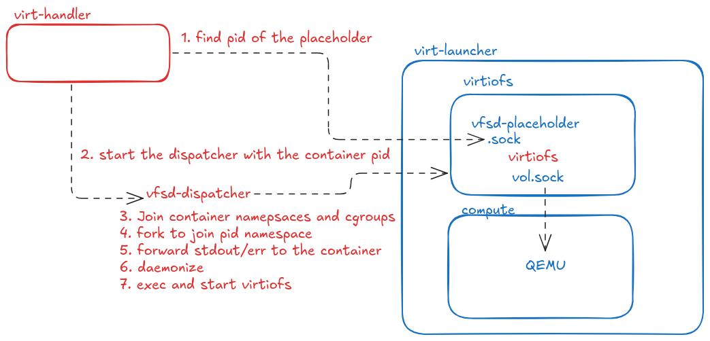

# VEP #53: Moving virtiofsd to infrastructure for robust live migration

## Release Signoff Checklist

Items marked with (R) are required *prior to targeting to a milestone / release*.

- [X] (R) Enhancement issue created, which links to VEP dir in [kubevirt/enhancements] (not the initial VEP PR)
- [ ] (R) Target version is explicitly mentioned and approved
- [ ] (R) Graduation criteria filled

## Overview

This VEP proposes a fundamental change to how the `virtiofsd` process is managed
within KubeVirt. Currently, `virtiofsd` runs as an unprivileged process inside a
dedicated virtiofs container. This setup limits its ability to utilize file
handles for sharing Persistent Volume Claims (PVCs) with Virtual Machines (VMs)
and hinders a robust live migration. The proposed solution is to move `virtiofsd`
as part of the infrastructure. The virtiofs container will remain **rootless**,
running a dummy process, while the `virt-handler` will launch the `virtiofsd`
binary and ensure it joins the virtiofs container's namespaces and cgroup.

## Motivation

The current architecture for Virtiofs in KubeVirt involves running the virtiofsd
daemon within a dedicated, unprivileged container. While this approach offers a
strong security boundary by isolating virtiofsd from the host, it introduces
significant functional limitations:
* **File Handle support:** Running `virtiofsd` in an unprivileged container
restricts its ability to track guest files using file handles. This capability
is crucial for efficient and robust file sharing, especially when dealing with
PVCs that might have a large number of files. Without proper file handle
support, `virtiofsd` must rely on file descriptors which are a limited resource.

* **Live Migration challenges**: The inability to properly manage file handles
directly impacts the safety and reliability of live migration for VMs utilizing
Virtiofs for PVCs sharing that might be concurrently accessed. During a live
migration, the `virtiofsd` instance needs to hand over its internal state to the
target destination. Restrictions on file handles make this hand-off prone to
issues, potentially leading to data inconsistencies or migration failures.

By moving `virtiofsd` to be managed by `virt-handler` and allowing it to join
the container's namespaces and cgroups, we aim to overcome these limitations,
enabling `virtiofsd` file handle functionality while keeping a strong
security.

## Goals

* Enable `virtiofsd` to utilize file handles, facilitating robust PVC sharing
with VMs.
* Facilitate safe and reliable live migration for VMs that leverage Virtiofs
for PVC sharing.
* Maintain the rootless execution model for the virtiofs container,
preserving its security benefits.

## Non Goals

* Using this method to share `configMaps`, `secrets`, `donwardAPIs` or
`serviceAccounts`; the current implementation of a `virtiofsd` process
 within a dedicated, unprivileged container will continue serving these volumes.

* Cross cluster live migration and/or storage migration. it is beyond the scope
of virtiofsd to migrate the contents of the files. In addition, when using file
handles, both the source and target are required to have access to the same file
system, since the files are accessed using their inode number.

## Definition of Users

* VM Owners
* Cluster Admins

## User Stories

* As a KubeVirt user, I want to use Virtiofs for sharing PVCs with my VMs
without encountering issues related to file descriptor limitations, like
reaching the open files limit.
* As a KubeVirt user, I want to be able to live migrate VMs that use Virtiofs
reliably and safely, ensuring data consistency during migration events.
* As a KubeVirt administrator, I want to be able to provide robust live
migration without allowing privileged containers.

## Repos

[KubeVirt](https://github.com/kubevirt/kubevirt)

## Design

The management of the `virtiofsd` process will be integrated into the KubeVirt
infrastructure. The virtiofs container will remain rootless, starting a dummy
process as PID 1.

The `virt-handler` will launch the `virtiofsd` binary inside the virtiofs
container's namespaces and cgroups, thereby operating within the same system
views and resource limitations defined for that container. Furthermore, the
virtiofs container's dummy PID 1 process will be designed to ensure that the
container's lifetime is bound to that of virtiofsd; if virtiofsd terminates,
the dummy process will exit, leading to the container's termination.

The following figure explains how virtiofsd is launched step-by-step:

## API Examples

No changes to the KubeVirt API are required. This is an internal implementation
detail that changes how `virtiofsd` is managed, not how it is exposed to the
user via the API.

## Alternatives

<!--
Outline any alternative designs that have been considered)
-->

* **Run virtiofsd as a privileged container:** This would involve running a
privileged virtiofs container, granting specific Linux capabilities
(e.g., `CAP_DAC_READ_SEARCH`) to the virtiofs container's security context.

Disadvantage: While seemingly simpler, this is generally considered a security
risk. Also, in the future it is expected that it will not be possible to run
privileged containers outside the kubevirt namespace. So, this is a non-starter
for KubeVirt's future security model.

* **Using a delegated privileged monitor:** A new privileged component as part
of Kubevirt infrastructure. Since it is stateless, no data needs to be migrated.
Uses [seccomp notify](https://brauner.io/2020/07/23/seccomp-notify.html) to
intercept `name_to_handle_at(2)` and `open_by_handle_at(2)`.
The privileged monitor, runs these syscalls on behalf of virtiofsd,
returning an HMAC-signed file handle.

Disadvantage: This is an elegant solution that requires minimal changes to
Kubevirt infrastructure. However, the current kernel's implementation of the
seccomp notify does not support reconnection, making recovery impossible after
a Kubevirt upgrade or if the monitor dies for any other reason.

## Scalability

No impact on the scalability. We keep the current design of a single container
for each volume.

## Update/Rollback Compatibility

No impact on the update/rollback compatibility.

## Functional Testing Approach

Besides reusing the virtiofsd's functional tests, both unit and functional
tests are added to test the 'injection' of virtiofsd into the container.

## Implementation Phases

This feature can be implemented in a single phase.

## Feature lifecycle Phases

<!--
How and when will the feature progress through the Alpha, Beta and GA lifecycle phases

Refer to https://github.com/kubevirt/community/blob/main/design-proposals/feature-lifecycle.md#releases for more details
-->

Given that virtiofsd functionality has been available in Kubevirt for years,
and the scope of these changes only affects how virtiofsd runs, we could squash
the alpha and beta versions into a single phase.

### Alpha

v1.7

### Beta

v1.8

### GA

v1.9
